SDL2游戏开发教程：[SDL2 游戏开发最小知识栈 - 没事造轮子](https://meishizaolunzi.com/sdl2-you-xi-kai-fa-zui-xiao-zhi-shi-zhan/)  
项目环境配置： [SDL2+2048小游戏开发-环境配置 | Mind City](https://invisiphantom.github.io/Skill/SDL2+2048%E5%B0%8F%E6%B8%B8%E6%88%8F%E5%BC%80%E5%8F%91-%E7%8E%AF%E5%A2%83%E9%85%8D%E7%BD%AE/)  
项目代码详解：[SDL2+2048小游戏开发-代码详解 | Mind City](https://invisiphantom.github.io/Skill/SDL2+2048%E5%B0%8F%E6%B8%B8%E6%88%8F%E5%BC%80%E5%8F%91-%E4%BB%A3%E7%A0%81%E8%AF%A6%E8%A7%A3/)  
项目源代码：[Invisiphantom/Game-2048](https://github.com/Invisiphantom/Game-2048)   
  
- 相关项目：[Invisiphantom/Game-Tetris](https://github.com/Invisiphantom/Game-Tetris)  

------

### 环境配置  
使用Visual Studio 2022创建空项目`2048-Table`  
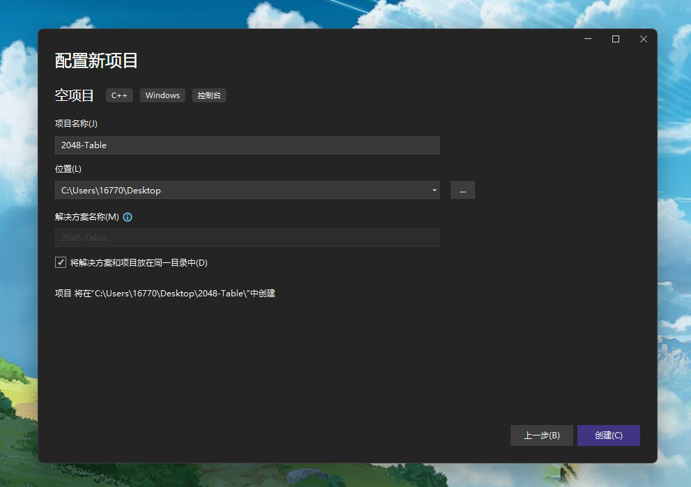

在项目文件夹中创建`Dependency`、`header`、`img`和`font`文件夹  
`Dependency`用来存放SDL2的头文件和依赖库  
`header`用来存放之后代码中的 .h 头文件  
`img`用来存放游戏贴图  
`font`用来存放游戏字体库  
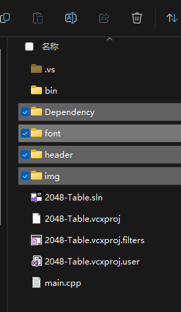  

从Github下载SDL2依赖库  
[Releases · libsdl-org/SDL](https://github.com/libsdl-org/SDL/releases)  
[Releases · libsdl-org/SDL_image](https://github.com/libsdl-org/SDL_image/releases)  
[Releases · libsdl-org/SDL_ttf](https://github.com/libsdl-org/SDL_ttf/releases)  
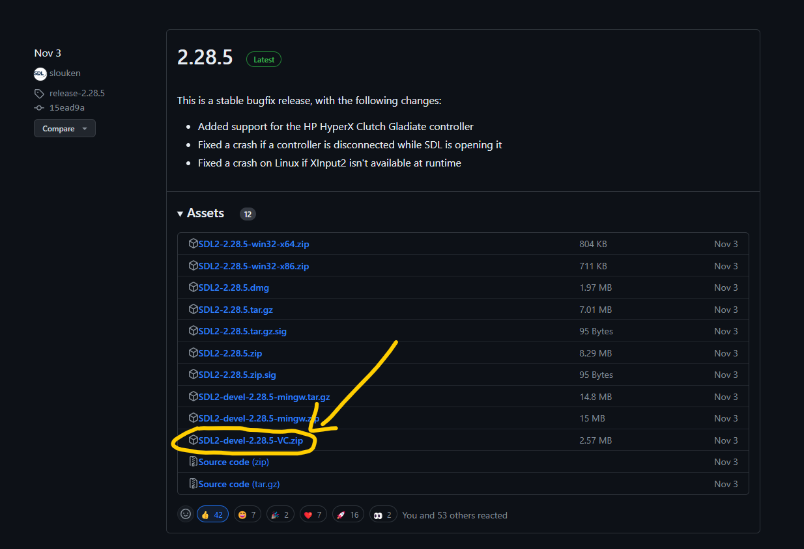  

解压之前下载好的SDL2依赖库，并将其拷贝至`Dependency`文件夹  
然后重命名文件夹，去掉文件夹末尾的版本号  
最终`Dependency`文件夹结构如下  
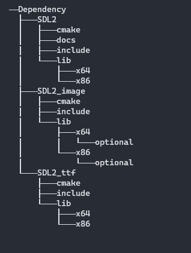

新建`main.cpp`文件  
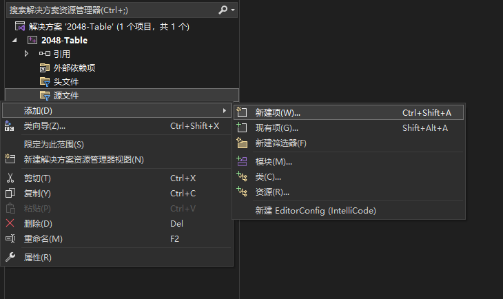

打开项目的属性配置界面  
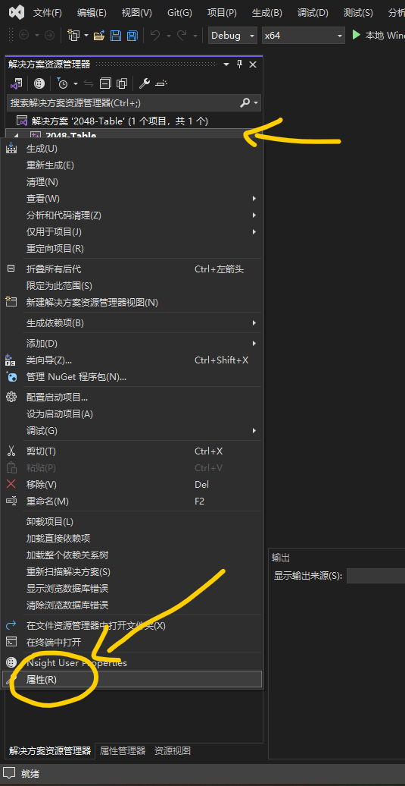

切换到所有配置，这样可以同时配置Debug和Release选项  
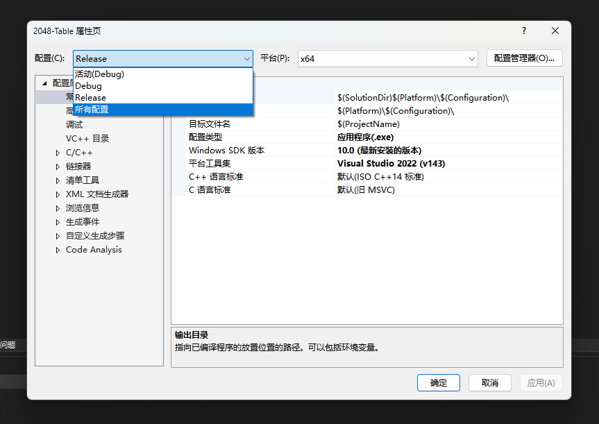

将输出目录更改为`$(SolutionDir)bin\$(Platform)\$(Configuration)\`  
中间目录更改为`$(SolutionDir)bin\tmp\$(Platform)\$(Configuration)\`  
将C++语言标准设置为`ISO C++20 标准(/std:c++20)`  
  
 这样VS生成的.exe文件和中间文件，就会分别被输出到`2048-Table\bin\x64\`和`2048-Table\bin\tmp\x64\`文件夹里面  
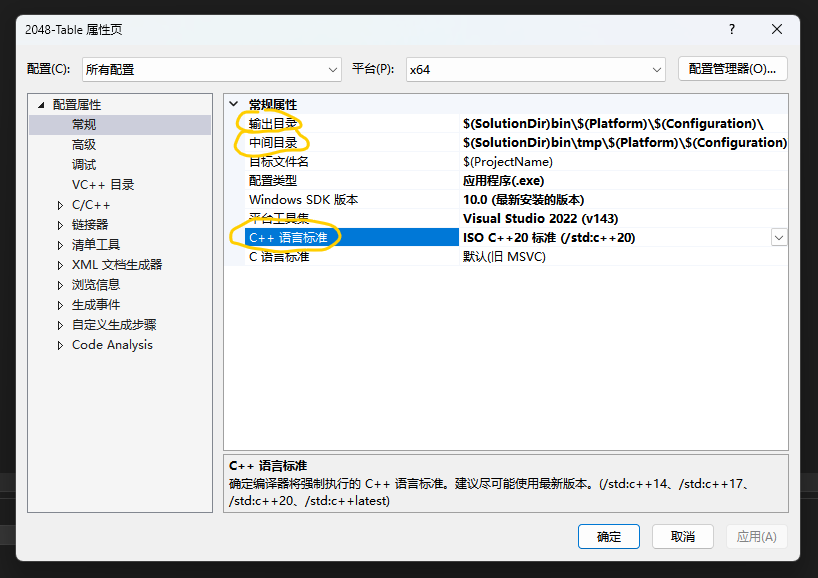  
  
C/C++ -> 附加包含目录，增加头文件`#include`时候的查找路径  
```
$(SolutionDir)header;$(SolutionDir)Dependency\SDL2\include;$(SolutionDir)Dependency\SDL2_image\include;$(SolutionDir)Dependency\SDL2_ttf\include;
```
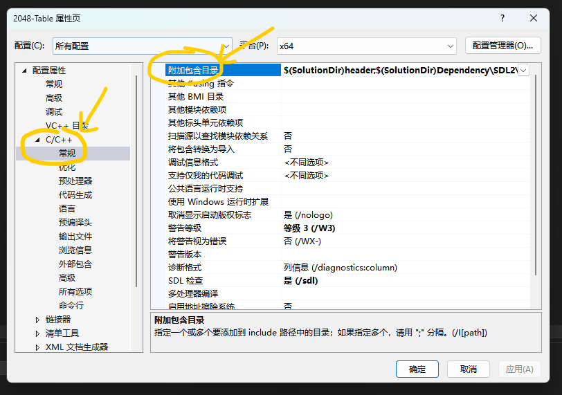  

链接器 -> 附加库目录  
```
$(SolutionDir)Dependency\SDL2\lib\x64;$(SolutionDir)Dependency\SDL2_image\lib\x64;$(SolutionDir)Dependency\SDL2_ttf\lib\x64;%(AdditionalLibraryDirectories);
```
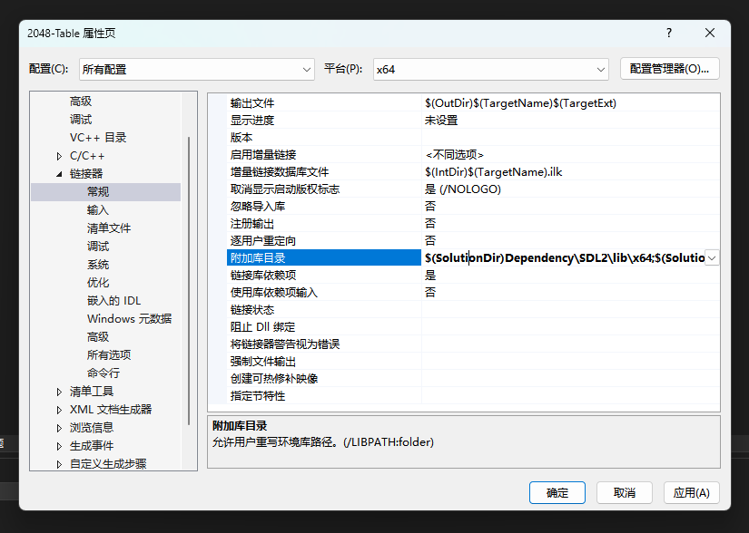  
链接器 -> 输入 -> 附加依赖项  
```
SDL2_ttf.lib;SDL2_image.lib;SDL2main.lib;SDL2.lib;winmm.lib;version.lib;Imm32.lib;Setupapi.lib;libcmt.lib;libucrtd.lib;$(CoreLibraryDependencies);%(AdditionalDependencies)  
```

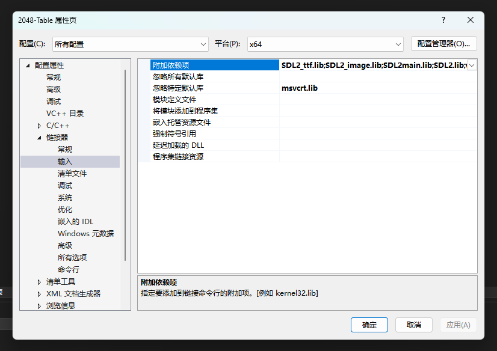  
  
链接器 -> 系统 -> 子系统 `窗口/SUBSYSTEM:WINDOWS`  
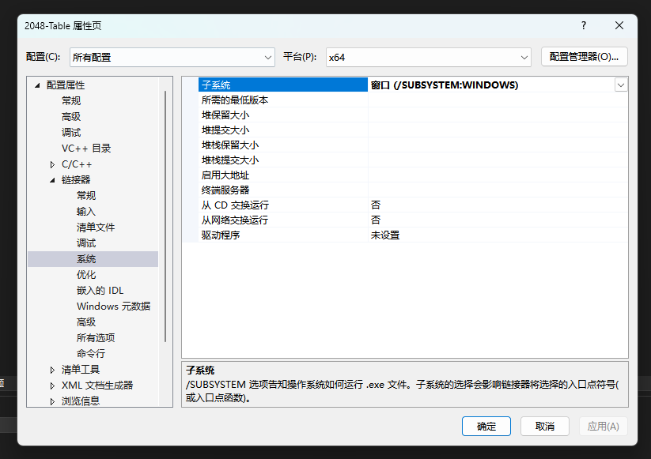  
  
拷贝测试代码`main.cpp`  
```cpp
// main.cpp
#include <Windows.h>

#include "SDL.h"
#include "SDL_image.h"
#include "SDL_ttf.h"

INT WINAPI WinMain(HINSTANCE hInstance, HINSTANCE hPrevInstance, PSTR lpCmdLine, INT nCmdShow) {
    SDL_Init(SDL_INIT_VIDEO | SDL_INIT_TIMER | SDL_INIT_EVENTS);
    IMG_Init(IMG_INIT_PNG);
    TTF_Init();

    SDL_Window *pWin = SDL_CreateWindow("Game", SDL_WINDOWPOS_CENTERED, SDL_WINDOWPOS_CENTERED, 800, 600, 0);
    SDL_Renderer *pRenderer = SDL_CreateRenderer(pWin, -1, SDL_RENDERER_ACCELERATED | SDL_RENDERER_PRESENTVSYNC);

    int quit = 0;
    SDL_Event evt;

    while (!quit) {
        if (SDL_PollEvent(&evt)) {
            if (evt.type == SDL_QUIT) {
                quit = 1;
            }
        } else {
            // 设置背景色为蓝色
            SDL_SetRenderDrawColor(pRenderer, 130, 175, 255, 255);
            SDL_RenderClear(pRenderer);  // 清屏

            SDL_RenderPresent(pRenderer);  // 显示
        }

        // 限制最高帧率，防止CPU占用过高
        Sleep(10);
    }

    SDL_DestroyRenderer(pRenderer);
    SDL_DestroyWindow(pWin);
    TTF_Quit();
    IMG_Quit();
    SDL_Quit();
    return 0;
}
```
  
此时尝试编译执行代码，会报错表示找不到SDL2的动态链接库  
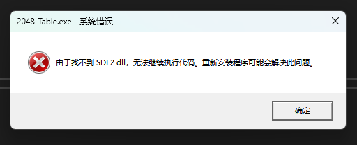  
  
配置生成后事件(需要逐行拷贝)  
```
copy $(SolutionDir)Dependency\SDL2\lib\x64\SDL2.dll $(SolutionDir)bin\$(Platform)\$(Configuration)\
```
```
copy $(SolutionDir)Dependency\SDL2_image\lib\x64\SDL2_image.dll $(SolutionDir)bin\$(Platform)\$(Configuration)\
```
```
copy $(SolutionDir)Dependency\SDL2_ttf\lib\x64\SDL2_ttf.dll $(SolutionDir)bin\$(Platform)\$(Configuration)\
```
```
xcopy $(SolutionDir)img $(SolutionDir)bin\$(Platform)\$(Configuration)\img /e /i /y
```
```
xcopy $(SolutionDir)font $(SolutionDir)bin\$(Platform)\$(Configuration)\font /e /i /y
```
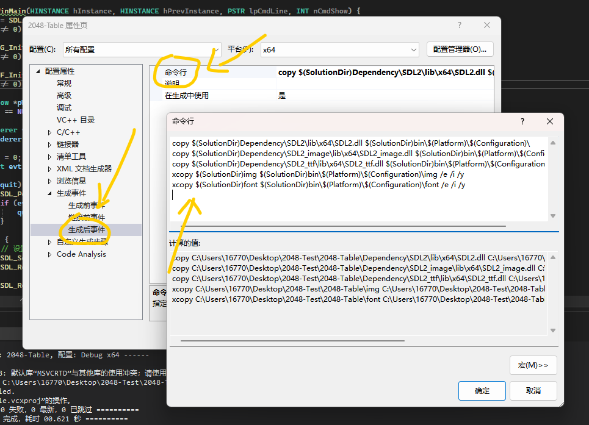  
  
此时再次尝试编译执行代码，就可以看到渲染成蓝色的窗口了  
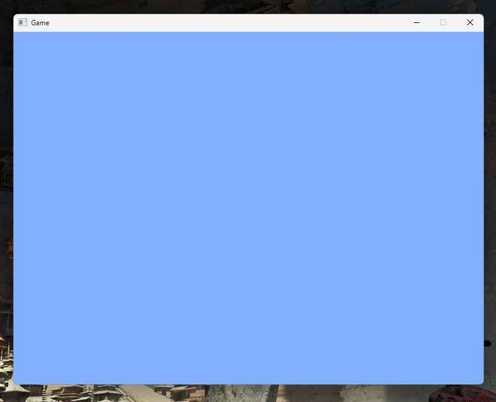  
  
最后右键文件夹选择`通过Code打开`，就可以愉快地在VSCode中编辑代码了！  
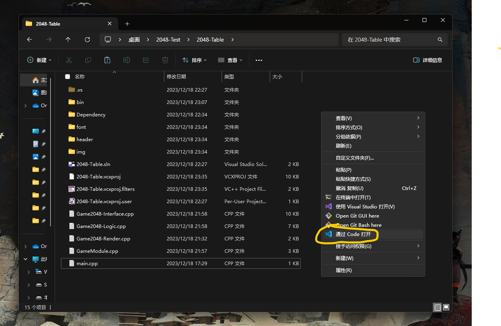  
  