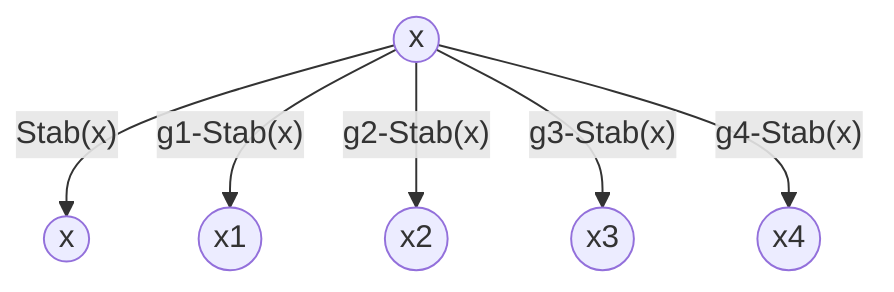

## 半群

半群的定义(Semigroup)
若运算封闭,满足结合律,则称$[S,*]$是一个半群
1. 运算封闭: $\forall a,b\in S, a*b\in S$
2. 结合律: $\forall a,b,c\in S, (a*b)*c=a*(b*c)$

递归地定义$x_1x_2\cdots x_n=(x_1x_2\cdots x_{n-1})(x_n)$
其中规定$x^n=\underbrace{x\cdots x}_{n\text{个}}(n\ge1)$

半群满足广义结合律, 可以任意添加括号
$\forall n,m\in \mathbb{N^+},x_1\cdots x_n\cdot y_1\cdots y_m=(x_1\cdots x_n)(y_1\cdots y_m)$
通过对m进行归纳来证明:
当m=1时, 由定义知$x_1\cdots x_ny_1=(x_1\cdots x_n)(y_1)$
现假设当m=k时结论成立, 则当m=k+1时
$x_1\cdots x_n\cdot y_1\cdots y_k\cdot y_{k+1} \\
=(x_1\cdots x_n\cdot y_1\cdots y_k)\cdot y_{k+1} \\
=[(x_1\cdots x_n)(y_1\cdots y_k)]\cdot y_{k+1}  \\
=(x_1\cdots x_n)[(y_1\cdots y_k)\cdot (y_{k+1})] \\
=(x_1\cdots x_n)(y_1\cdots y_k\cdot y_{k+1})$  

## 幺半群

幺半群的定义(Monoid)
若运算封闭,满足结合律,存在单位元, 则称$[S,*]$是一个幺半群
1. 运算封闭: $\forall a,b\in S, a*b\in S$
2. 结合律: $\forall a,b,c\in S, (a*b)*c=a*(b*c)$
3. 单位元: $\exists e\in S, \forall a\in S, a*e=e*a=a$

单位元唯一: $e_1=e_1e_2=e_2$
零指数: $x^0=e$
 

子幺半群的定义(Submonoid)
已知幺半群$[S,*]$, 且$T\subseteq S$,
若运算封闭,单位元保持, 则称$[T,*]$是一个子幺半群
1. 运算封闭: $\forall a,b\in T, a*b\in T$
2. 单位元: $e_S\in T$

 

生成子幺半群的定义一(Generated Submonoid)
已知幺半群$[S,*]$, 及其子集A
则由A生成的子幺半群为$\langle A\rangle=\bigcap\{T|A\subseteq T\land T是子幺半群\}$
1. 运算封闭: $\forall a,b\in \langle A\rangle\implies a,b\in\forall T_i\implies a*b\in\forall T_i\implies a*b\in \langle A\rangle$
2. 结合律: $\forall a,b,c\in \langle A\rangle\implies a,b,c\in\forall T_i\implies (a*b)*c=a*(b*c)$
3. 单位元: $e_S\in\forall T_i\implies e_S\in\langle A\rangle$

生成子幺半群的定义二(Generated Submonoid)
已知幺半群$[S,*]$, 及其子集A
则由A生成的子幺半群为$\langle A\rangle=\{x_1^{m_1}x_2^{m_2}\cdots x_k^{m_k}|x_i\in A,m_i\in\mathbb{N},k\in\mathbb{N^+}\}$
1. 运算封闭: $\forall a,b\in \langle A\rangle\implies ab=x_1^{m_1}x_2^{m_2}\cdots x_s^{m_s}y_1^{n_1}y_2^{n_2}\cdots y_t^{n_t}\in \langle A\rangle$
2. 结合律: $\forall a,b,c\in \langle A\rangle\implies (ab)c=a(bc)$
3. 单位元: $e=x^0\in \langle A\rangle$

 

$\langle A\rangle_1=\bigcap\{H|A\subseteq H\land H是子幺半群\}$
$\langle A\rangle_2=\{x_1^{m_1}x_2^{m_2}\cdots x_k^{m_k}|x_i\in A,m_i\in\mathbb{Z},k\in\mathbb{N^+}\}$
现欲证明上述两种定义等价:
$\langle A\rangle_1\subseteq\langle A\rangle_2$: 因为$\langle A\rangle_2$是包含A的子幺半群, 所以$\langle A\rangle_1\subseteq\langle A\rangle_2$
$\langle A\rangle_2\subseteq\langle A\rangle_1$: 由运算封闭性可知, 对于任意包含A的子幺半群H
都有 $x_1^{m_1}x_2^{m_2}\cdots x_k^{m_k}\in H\implies \langle A\rangle_2\subseteq\langle A\rangle_1$

 

幺半群同态的定义(Monoid Homomorphism)
已知幺半群$[S,\cdot]$到幺半群$[T,*]$的映射$f:S\to T$
若保持运算, 且保持单位元, 则称其为幺半群同态
1. 运算保持: $\forall a,b\in S, f(a\cdot b)=f(a)*f(b)$
2. 单位元保持: $f(e_S)=e_T$

幺半群同构的定义(Monoid Isomorphism)
将满足双射的幺半群同态$f:S\to T$, 称为幺半群同构
1. 运算保持: $\forall a,b\in S, f(a\cdot b)=f(a)*f(b)$
2. 单位元保持: $f(e_S)=e_T$
3. 满足双射: $S \leftrightarrow T,f(a_S)=a_T,f^{-1}(a_T)=a_S$

## 群

群的定义(Group)
若运算封闭,满足结合律,存在单位元,且每个元素都有逆元, 则称$[G,*]$是一个群
1. 运算封闭: $\forall a,b\in G, a*b\in G$
2. 结合律: $\forall a,b,c\in G, (a*b)*c=a*(b*c)$
3. 单位元: $\exists e\in G, \forall a\in G, a*e=e*a=a$
4. 逆元: $\forall a\in G, \exists a^{-1}\in G, a*a^{-1}=a^{-1}*a=e$

逆元唯一: $a_1^{-1}=a_1^{-1}e=a_1^{-1}(aa_2^{-1})=(a_1^{-1}a)a_2^{-1}=ea_2^{-1}=a_2^{-1}$
多元取逆: $(a\cdot b)^{-1}=b^{-1}\cdot a^{-1}$
负指数: $x^{-n}=(x^{-1})^n=\underbrace{x^{-1}\cdot x^{-1}\cdots x^{-1}}_n$

 

已知幺半群$[S,*]$, 则其所有可逆元素(单位)构成的子集$G=U(S)$是群
1. 运算封闭: $\forall a,b\in G\implies \exists a^{-1},b^{-1}\in S\implies b^{-1}*a^{-1}=(a*b)^{-1}\in S\implies a*b\in G$
2. 结合律: $\forall a,b,c\in G\implies a,b,c\in S\implies (a*b)*c=a*(b*c)$
3. 单位元: $\exists e^{-1}=e\in S\implies e\in G$
4. 逆元: $\forall a\in G\implies a^{-1}\in G$

 

群的阶数(Order of Group)
群的元素个数称为群的阶数, 记为$|G|$

有限群的定义(Finite Group)
若群的元素个数有限,则称该群是有限群, 其阶数为$|G|=n$

无限群的定义(Infinite Group)
若群的元素个数无限,则称该群是无限群, 其阶数为$|G|=\infty$

 

二面体群的定义(Dihedral Group)
正n边形的所有对称操作, 及其复合运算所构成的群, 称为n阶二面体群, 
记为$[D_n,\circ]=\{I, \sigma, \sigma^2, \cdots, \sigma^{n-1}, \tau, \tau\sigma, \tau\sigma^2, \cdots, \tau\sigma^{n-1}\}$
其中$I$是恒等变换, $\sigma$是顺时针旋转(中心对称), $\tau$是绕轴$(A_1,O)$的镜面翻转(轴对称)
因为$\tau\sigma\tau=\sigma^{-1}$, 故可记为$D_n=\langle\sigma,\tau|\sigma^n=\tau^2=I,\tau\sigma\tau=\sigma^{-1}\rangle$

 

n阶一般线性群的定义(General Linear Group)
由n*n可逆实矩阵构成的乘法群,称为实数上的n阶一般线性群,记为$[GL(n,\mathbb{R}),\cdot]$
$GL(n,\mathbb{R})=\{A|A\in M(n,\mathbb{R})\land \det(A)\neq0\}$

n阶特殊线性群的定义(Special Linear Group)
由n*n行列式为1的实矩阵构成的乘法群,称为实数上的n阶特殊线性群,记为$[SL(n,\mathbb{R}),\cdot]$
$SL(n,\mathbb{R})=\{A|A\in M(n,\mathbb{R})\land \det(A)=1\}$

 

n阶正交群的定义(Orthogonal Group)
由n*n行列式为$\pm1$的正交实矩阵构成的乘法群,称为实数上的n阶正交群,记为$[O(n),\cdot]$

n阶特殊正交群的定义(Special Orthogonal Group)
由n*n行列式为$+1$的正交实矩阵构成的乘法群,称为实数上的n阶特殊正交群,记为$[SO(n),\cdot]$

 

全变换群和变换群的定义
将**非空集合**$\Omega$到自身的所有双射, 记为$\Omega$的全变换群$S_\Omega$
全变换群$S_\Omega$的子群, 称为$\Omega$的一个变换群
1. 运算封闭: 双射经过复合运算后还是双射
2. 结合律: 映射的复合运算满足结合律
3. 单位元: 恒等映射
4. 逆元: 双射存在逆映射

n阶对称群和n阶置换群的定义
将**有限集合**$\Omega$到自身的所有双射(置换), 记为n阶对称群$S_n$, 且$|S_n|=n!$
n阶对称群$S_n$的子群, 称为$\Omega$的一个n阶置换群
1. 运算封闭: 双射经过复合运算后还是双射
2. 结合律: 映射的复合运算满足结合律
3. 单位元: 恒等映射
4. 逆元: 双射存在逆映射

## 子群, 生成子群

子群的定义(Subgroup)
已知群$[G,*]$, 及其子集$H\subseteq G$
若运算封闭,单位元保持,逆元保持, 则称$[H,*]$是一个子群,记为$H<G$
1. 运算封闭: $\forall a,b\in H, a*b\in H$
2. 单位元: $e_S\in H$
3. 逆元: $\forall a\in H, a^{-1}\in H$

$1,2,3\iff (H\neq\emptyset)\land(\forall a,b\in H,a*b^{-1}\in H)$

 

生成子群的定义一(Generated Group of Set)
<包含S的最小子群>
已知群$[G,*]$, 及其子集$H\subseteq G$
由S生成的子群为$\langle S\rangle=\bigcap\{H|S\subseteq H\land H是子群\}$
1. 运算封闭: $\forall a,b\in \langle S\rangle\implies a,b\in\forall H_i\implies a*b\in\forall H_i\implies a*b\in \langle S\rangle$
2. 结合律: $\forall a,b,c\in \langle S\rangle\implies a,b,c\in\forall H_i\implies (a*b)*c=a*(b*c)$
3. 单位元: $e_S\in\forall H_i\implies e_S\in\langle S\rangle$
4. 逆元: $\forall a\in \langle S\rangle\implies a^{-1}\in\forall H_i\implies a^{-1}\in\langle S\rangle$

生成子群的定义二(Generated Group of Set)
已知群$[G,*]$, 及其子集$H\subseteq G$
由S生成的子群为$\langle S\rangle=\{x_1^{m_1}x_2^{m_2}\cdots x_k^{m_k}|x_i\in S,m_i\in\mathbb{Z},k\in\mathbb{N^+}\}$
1. 包含子集: $\forall x\in S\implies x=x^1\in \langle S\rangle$
2. 运算封闭: $\forall a,b\in \langle S\rangle\implies ab=x_1^{m_1}x_2^{m_2}\cdots x_s^{m_s}y_1^{n_1}y_2^{n_2}\cdots y_t^{n_t}\in \langle S\rangle$
3. 结合律: $\forall a,b,c\in \langle S\rangle\implies (ab)c=a(bc)$
4. 单位元: $e=x^0\in \langle S\rangle$
5. 逆元: $\forall a\in \langle S\rangle\implies a^{-1}=x_k^{-m_k}\cdots x_2^{-m_2}x_1^{-m_1}\in \langle S\rangle$

 

$\langle S\rangle_1=\bigcap\{H|S\subseteq H\land H是子群\}$
$\langle S\rangle_2=\{x_1^{m_1}x_2^{m_2}\cdots x_k^{m_k}|x_i\in S,m_i\in\mathbb{Z},k\in\mathbb{N^+}\}$
现欲证明上述两种定义等价:
$\langle S\rangle_1\subseteq\langle S\rangle_2$: 因为$\langle S\rangle_2$是包含S的子群, 所以$\langle S\rangle_1\subseteq\langle S\rangle_2$
$\langle S\rangle_2\subseteq\langle S\rangle_1$: 由运算封闭可知, 对于任意包含S的子群H
都有 $x_1^{m_1}x_2^{m_2}\cdots x_k^{m_k}\in H\implies \langle S\rangle_2\subseteq\langle S\rangle_1$

## 陪集, 商集, Lagrange定理

左陪集的定义(Left Coset)
已知群G及其子群H, 元素$a\in G$
则$aH=\{ah|h\in H\}$称为a关于H的左陪集
1. 等大: $\forall a\in G\implies|H|=|aH|$
    $存在双射f:H\to aH:f(h)=ah:f^{-1}(ah)=h$
2. 无交: $\forall a,b\in G\implies (aH=bH)\lor (aH\cap bH=\emptyset)$
    $aH\cap bH\neq\emptyset\implies \exists ah_1=bh_2\implies a=bh_2h_1^{-1}, b=ah_1h_2^{-1}$
    $\forall ah\in aH,ah=(bh_2h_1^{-1})h=b(h_2h_1^{-1}h)\in bH\implies aH\subseteq bH$
    $\forall bh\in bH,bh=(ah_1h_2^{-1})h=a(h_1h_2^{-1}h)\in aH\implies bH\subseteq aH$
3. 全集: $G=\bigcup aH$

$xH=H\iff x\in H$
$\implies$: $x=xe\in xH=H$
$\impliedby$: $x\in H\implies xH\subseteq H\land|xH|=|H|\implies xH=H$

$x\sim y:= xH=yH\iff y^{-1}xH=H\iff y^{-1}x\in H$
1. 自反性: $x^{-1}x=e\in H$
2. 对称性: $x^{-1}y\in H\implies y^{-1}x=(x^{-1}y)^{-1}\in H$
3. 传递性: $x^{-1}y\in H,y^{-1}z\in H\implies (x^{-1}y)(y^{-1}z)=x^{-1}z\in H$

商集的定义(Quotient Set)
群G关于子群H的商集为$G/H=\{aH|a\in G\}$
将划分块数称为H在G中的指数(index), 记为$[G:H]=|G/H|=|\{aH|a\in G\}|$

Lagrange定理(Lagrange's Theorem)
<群的大小=划分块数$\times$每个划分块的大小>
已知群G及其子群H, 则$|G|=[G:H]\times|H|$

 

群G被群H细分, 群H又被群K细分, 则群G被群K细细分
已知$K<H<G$,则$[G:K]=[G:H]\times[H:K]$
$G/H=\{g_1H,g_2H,\cdots,g_mH\}$
$H/K=\{h_1K,h_2K,\cdots,h_nK\}$
则$G/K=\left\{\begin{aligned}
      (g_1H)\implies\quad &g_1h_1K &g_1h_2K \quad&\cdots &g_1h_nK \\
      (g_2H)\implies\quad &g_2h_1K &g_2h_2K \quad&\cdots &g_2h_nK \\
      &&&\cdots \\
      (g_mH)\implies\quad &g_mh_1K &g_mh_2K \quad&\cdots &g_mh_nK
\end{aligned}\right\}$
证明: 
1. 首先证明满射 $\bigcup g_ih_jK=G/K$
$H<G\implies \forall a\in G,\exists g_i\in G,a\in g_iH\implies\exists h\in H,a=g_ih$
$K<H\implies \forall h\in H,\exists h_j\in H,h\in h_jK\implies\exists k\in K,h=h_jk$
$\implies \forall aK\in G/K,\exists h\in H,k\in K,aK=g_ihK=g_ih_jkK=g_ih_jK$

1. 然后证明单射 $g_ih_jK=g_ah_bK\implies (g_i\sim g_a)\land(h_j\sim h_b)$:
$g_ih_jK=g_ah_bK\implies g_ih_jKH=g_ah_bKH\implies g_iH=g_aH\implies g_i\sim g_a$
故$g_ih_jK=g_ah_bK\land(g_i=g_a)\implies h_jK=h_bK\implies h_j=h_b$, 得证

## 群同态

群同态的定义(Group Homomorphism)
已知群$[S,\cdot]$到群$[T,*]$的映射$f:S\to T$
若映射保持运算, 则称该映射为群同态
1. 运算保持: $\forall a,b\in S, f(a\cdot b)=f(a)*f(b)$

$\rightarrow$单位元保持: $f(e_S)=e_T$
$e_S=e_S\cdot e_S\implies f(e_S)=f(e_S\cdot e_S)=f(e_S)f(e_S)$
$\implies f(e_S)f(e_S)^{-1}=f(e_S)f(e_S)f(e_S)^{-1}\implies e_T=f(e_S)$

$\rightarrow$逆元保持: $f(a^{-1})=f(a)^{-1}$
$f(a)*f(a^{-1})=f(a\cdot a^{-1})=f(e_S)=e_T$

 

满同态和单同态的定义(Epimorphism and Monomorphism)
已知群同态$f:[S,\cdot]\to[T,*]$
如果$f$是满射, 则称$f$是满同态(Epimorphism)
如果$f$是单射, 则称$f$是单同态(Monomorphism)

$f$是满同态, 当且仅当$im(f)=T$
$f$是单同态, 当且仅当$\ker(f)=\{e_S\}$
证明: $f$是单同态 $\iff$ $[\forall a,b\in S,f(a)=f(b)\implies a=b]$
$\iff$ $[\forall a,b\in S,f(ab^{-1})=e_T\implies ab^{-1}=e_S]$
$\iff$ $[\forall x\in S,f(x)=e_T\implies x=e_S]$
$\iff$ $\ker(f)=\{e_S\}$

### 同余关系

同余关系的定义(Congruence Relation)
<能够保持运算良定义的等价关系>
将群G上保持运算良定义的等价关系, 称为同余关系
1. 自反性: $\forall a\in G, a\equiv a$
2. 对称性: $\forall a,b\in G, a\equiv b\implies b\equiv a$
3. 传递性: $\forall a,b,c\in G, a\equiv b\land b\equiv c\implies a\equiv c$
4. 运算良定义: $a\equiv a'\land b\equiv b'\implies a*b\equiv a'*b'$

同余关系的划分群$G/\equiv=\{\bar{a},\bar{b},\cdots\}$, 其运算为 $\bar a\cdot\bar b=\overline{ab}$
1. 运算良定义: $\bar a=\bar {a'}\land\bar b=\bar {b'}\implies a\equiv a'\land b\equiv b'\implies ab\equiv a'b'\implies \overline{ab}=\overline{a'b'}$
2. 运算封闭: $ab\in G\implies\bar a\cdot\bar b=\overline{ab}\in G/\equiv$
3. 结合律: $(\bar a\cdot\bar b)\cdot\bar c=\overline{abc}=\bar a\cdot(\bar b\cdot\bar c)$
4. 单位元: $\bar a\cdot\bar e=\bar a=\bar e\cdot\bar a$
5. 逆元: $\bar a\cdot\overline{a^{-1}}=\bar e\implies(\bar a)^{-1}=\overline{a^{-1}}$

### 正规子群

正规子群的定义(Normal Subgroup)
<使得左右陪集相等的子群>
1. 运算封闭: $\forall a,b\in N, a*b\in N$
2. 单位元: $e\in N$
3. 逆元: $\forall n\in N, n^{-1}\in N$
4. 正规: $\forall g\in G,gN=Ng$

$4\iff \forall g\in G,\forall n\in N,gng^{-1}\in N$
$\forall g\in G,gN=Ng
\iff\begin{cases}
      gN\subseteq Ng \\
      Ng\subseteq gN
\end{cases}
\iff\begin{cases}
      gNg^{-1}\subseteq N \\
      g^{-1}Na\subseteq N
\end{cases}
\iff \forall g\in G,n\in N,gng^{-1}\in N$

### 同余关系<->正规子群

同余关系$a\equiv b$$\iff$正规子群$\bar1$
<所有同余关系都唯一对应于某个正规子群>
$\implies$: 已知同余关系$a\equiv b\quad\langle a^{-1}b\equiv e\rangle$, 欲证明同余类 $\bar1$ 是正规子群
1. 运算封闭: $\forall a,b\in \bar1\implies a\equiv e\land b\equiv e\implies ab\equiv e\implies ab\in \bar1$
2. 单位元: $e\equiv e\implies e\in\bar 1$
3. 逆元: $\forall a\in\bar1,a^{-1}a=e\land e\equiv a\implies a^{-1}a\equiv a\implies a^{-1}\equiv e$
4. 正规: 首先证明 $a\in\bar g\iff a\in g\bar1$
    $\implies: a\in\bar g\implies\overline{g^{-1}a}=\bar g^{-1}\bar a=\bar g^{-1}\bar g=\bar1\implies g^{-1}a\in\bar1\implies a\in g\bar1$
    $\impliedby: a\in g\bar1\implies a=gh\land e\equiv h^{-1}\implies a\equiv g\implies a\in\bar g$
    所以有 $\bar g=g\bar1\land\bar g=\bar1g\implies g\bar1=\bar1g$

$\impliedby$: 已知正规子群$N$, 欲证明$a\equiv b:a^{-1}b\in N$是同余关系
1. 自反性: $a^{-1}a=1\in N$
2. 对称性: $a^{-1}b\in N\implies b^{-1}a=(a^{-1}b)^{-1}\in N$
3. 传递性: $a^{-1}b\in N,b^{-1}c\in N\implies (a^{-1}b)(b^{-1}c)=a^{-1}c\in N$
4. 运算良定义: 已知 $a\equiv a'\land b\equiv b'\iff aN=a'N\land bN=b'N$
    $Nb'=bN\implies b^{-1}Nb'=N\land a^{-1}a\in N\implies b^{-1}a^{-1}a'b'\in N\implies ab\equiv a'b'$

### 群同态的核与像

群同态的核与像的定义(Kernel and Image of Group Homomorphism)
已知群同态$f:[S,\cdot]\to[T,*]$
称f的核为 $\ker(f)=\{a\in S|f(a)=e_T\}\subseteq S$
称f的像为 $im(f)=\{f(a)|a\in S\}\subseteq T$

核是S的正规子群: 运算封闭,单位元,逆元,正规
1. 运算封闭: $\forall a,b\in \ker(f),f(a\cdot b)=f(a)*f(b)=e_T\implies a\cdot b\in \ker(f)$
2. 单位元: $f(e_S)=e_T\implies e_S\in \ker(f)$
3. 逆元: $\forall a\in \ker(f),f(a^{-1})=f(a)^{-1}=e_T\implies a^{-1}\in \ker(f)$
4. 正规: $\forall g\in G,n\in\ker(f),f(gng^{-1})=f(g)f(n)f(g^{-1})=f(g)e_Tf(g)^{-1}=e_T$

像是T的子群: 运算封闭,单位元,逆元
1. 运算封闭: $f(a)*f(b)=f(a\cdot b)\in im(f)$
2. 单位元: $e_T=f(e_S)\in im(f)$
3. 逆元: $f(a)^{-1}=f(a^{-1})\in im(f)$

### 商群

商群的定义(Quotient Group)
<正规子群 使得商集 能够成为商群>
已知正规子群$N\lhd G$, 商群$[G/N,\circ]$, 其上运算$aH\circ bH=(ab)H$
1. 运算良定义: $正规子群\leftrightarrow同余关系$
2. 封闭性: $aN\circ bN=(ab)N\in G/N$
3. 结合律: $(aN\circ bN)\circ cN=(abc)N=aN\circ(bN\circ cN)$
4. 单位元: $aN\circ eN=aN=eN\circ aN$
5. 逆元: $aN\circ a^{-1}N=eN=a^{-1}N\circ aN\implies (aN)^{-1}=a^{-1}N$

最粗整的商群是$G/G=\{G\}$
最细分的商群是$G/\{e\}=\{ \{g_1\},\{g_2\},\cdots,\{g_{|G|}\} \}$

### 群同态基本定理

群同态基本定理(Fundamental Theorem of Homomorphism)
<群同态的像群 同构于 核的商群>
$[a\to f(a)\iff a\to a\cdot\ker(f)]\implies f(a)\leftrightarrow a\cdot\ker(f)\implies im(f)\cong G/\ker(f)$

定义从商群到像群的映射$F:G/\ker(f)\to im(f):F(aN)=f(a)$, 简记$N=\ker(f)$
1. 映射良定义: $a_1N=a_2N\implies a_1^{-1}a_2\in N$
    $\implies f(a_1^{-1}a_2)=f(a_1)^{-1}f(a_2)=e'\implies f(a_1)=f(a_2)$
2. 映射群同态: $F(aN\circ bN)=F(abN)=f(ab)=f(a)f(b)=F(aN)\cdot F(bN)$
3. 映射满射: $\forall a'\in im(f),\exists a\in G,f(a)=a'\implies \exists aN,F(aN)=f(a)=a'$
4. 映射单射: $f(a)=f(b)\implies f(b^{-1}a)=e'\implies b^{-1}a\in N\implies aN=bN$

综上所述, $F:G/\ker(f)\to im(f)$是群同构, 故$im(f)\cong G/\ker(f)$

#### 群同构第一定理

引理: 已知$H<G,N\lhd G\implies HN<G$
$子群定义1,2,3\iff (H\neq\emptyset)\land(\forall a,b\in H,a*b^{-1}\in H)$
证明: $\forall h_1n_1,h_2n_2\in HN, (h_1n_1)(h_2n_2)^{-1}=h_1n_1n_2^{-1}h_2^{-1}$
$=h_1(h_2^{-1}h_2)(n_1n_2^{-1})h_2^{-1}=(h_1h_2^{-1})[h_2(n_1n_2^{-1})h_2^{-1}]\in HN$

群同构第一定理(First Isomorphism Theorem)
<元素h 映射到 陪集hN>
$h\to hN$ $\iff$ $H/(H\cap N)\cong HN/N=H/N$
已知$H<G,N\lhd G$, 则$H\to HN/N:f(h)=hN$是群同态, 且$\ker(f)=H\cap N$

映射同态: $f(h_1h_2)=h_1h_2N=h_1N\circ h_2N=f(h_1)\circ f(h_2)$
且$\ker(f)=\{h\in H|f(h)=N\iff h\in N\land h\in H\}=H\cap N$
由群同态基本定理知, $H/(H\cap N)\cong im(f)=HN/N$

#### 群同构第二定理

群同构第二定理(Second Isomorphism Theorem)
<正规子群K的商群 映射到 正规子群H的商群>
$[gK\to gH$ $\iff$ $\frac{(G/K)}{(H/K)}\cong G/H]$
已知$K\lhd G,H\lhd G,K\subseteq H$, 
则$G/K\to G/H:f(gK)=gH$是群同态, 且$\ker(f)=H/K$

映射同态: $f(g_1N\circ g_2N)=f(g_1g_2N)=g_1g_2H=g_1H\cdot g_2H=f(g_1N)\cdot f(g_2N)$
且$\ker(f)=\{gK\in G/K|f(gK)=H\iff g\in H\}=H/K$
由群同态基本定理可知, $\frac{(G/K)}{(H/K)}\cong G/H$

## 欧拉函数

可逆同余乘法群的定义
<元素可逆$\iff$与n互素>
定义一: $\mathbb{Z_n}^*=\{k+n\mathbb{Z}\in\mathbb{Z_n}|\exists m\in\mathbb{Z_n},km\equiv 1\pmod n\}$
定义二: $\mathbb{Z_n}^*=\{k+n\mathbb{Z}\in\mathbb{Z_n}|\gcd(k,n)=1\}$
两种定义等价: $\exists m\in\mathbb{Z_n},km\equiv 1\pmod n\iff \exists q\in\mathbb{Z},km=nq+1$
$\iff km+n(-q)=1\iff\gcd(k,n)=1$

任意整数: $[\mathbb{Z_n}^*,\cdot]=[\{1\le k<n|\gcd(n,k)=1\},\cdot]$
对于素数: $[\mathbb{Z_p}^*,\cdot]=[\{1,2,\cdots,p-1\},\cdot]$
| $[\mathbb{Z_{12}}^*.\cdot]$ |  $1$  |  $5$  |  $7$  | $11$  |
| :-------: | :---: | :---: | :---: | :---: |
|             $1$             |  $1$  |  $5$  |  $7$  | $11$  |
|             $5$             |  $5$  |  $1$  | $11$  |  $7$  |
|             $7$             |  $7$  | $11$  |  $1$  |  $5$  |
|            $11$             | $11$  |  $7$  |  $5$  |  $1$  |

------

欧拉函数的定义(Euler's Function)
$\varphi(n)$: 小于等于n的正整数中, 与n互质的个数
|   +   |   1   |   2   |   3   |   4   |   5   |   6   |   7   |   8   |   9   |  10   |
| :---: | :---: | :---: | :---: | :---: | :---: | :---: | :---: | :---: | :---: | :---: |
|  0x   |   1   |   1   |   2   |   2   |   4   |   2   |   6   |   4   |   6   |   4   |
|  10x  |  10   |   4   |  12   |   6   |   8   |   8   |  16   |   6   |  18   |   8   |
|  20x  |  12   |  10   |  22   |   8   |  20   |  12   |  18   |  12   |  28   |   8   |
|  30x  |  30   |  16   |  20   |  16   |  24   |  12   |  36   |  18   |  24   |  16   |

命题1: $\varphi(m)=|\mathbb{Z_m^*}|$
命题2: 若$p$是素数, 则$\varphi(p)=p-1$
命题3: 若$p$是素数, 则$\varphi(p^r)=p^r-p^{r-1}=p^{r-1}(p-1)$
命题4: $m=m_1m_2\land\gcd(m_1,m_2)=1\implies[\mathbb{Z_{m}},*]\cong[\mathbb{Z_{m_1}}\times\mathbb{Z_{m_2}},*]\implies\varphi(m)=\varphi(m_1)\varphi(m_2)$
幺半群同构 $f:[\mathbb{Z_{m}},*]\to[\mathbb{Z_{m_1}}\times\mathbb{Z_{m_2}},*]:f(x)=(x_{\text{mod}\,m_1},x_{\text{mod}\,m_2})$

欧拉定理(Euler's Theorem)
$\gcd(a,n)=1\implies a^{\varphi(n)}\equiv 1\pmod n$
证明: $\gcd(a,n)=1\implies a\in\mathbb{Z_n}^*$
所以 $a^{|Z_n^*|}=a^{\varphi(n)}=e_n\implies a^{\varphi(n)}\equiv 1\pmod n$

## 轮换, 置换的奇偶性, 交错群

r-轮换的定义(r-Cycle)
已知有限集合N, 如果n元置换$\sigma$将$(i_1\to i_2)\land (i_2\to i_3)\land \cdots\land (i_r\to i_1)$
则称$\sigma$是一个r-轮换, 记作$\sigma=(i_1\ i_2\ \cdots\ i_r)$, 其中$\sigma^r=I\implies|\sigma|=r$

如果两个轮换无相同元素, 则称其为不相交的(disjoint)
不相交的轮换对于复合乘法运算是可交换的
特别地, 将 2-轮换 称为 对换(transposition)
轮换的逆 $(x_1,x_2,\cdots,x_r)^{-1}=(x_r,x_{r-1},\cdots,x_2,x_1)$

 

<百囚犯问题>
任何置换都可唯一分解为 若干不相交轮换的乘积 
$\forall f\in S_n,f\neq e\implies f=\sigma_1\sigma_2\cdots\sigma_t,\forall\sigma_i\cap\forall\sigma_j=\emptyset$
其中置换的阶为 $|f|=\text{lcm}(|\sigma_1|,|\sigma_2|,\cdots,|\sigma_t|)$

首先证明存在性:
如果$f=e$, 那么$f=(1)$
如果$f\neq e$, 那么存在$f(i_1)\neq i_1$
构造映射链$i_1\to\cdots\to i_k\to\cdots\to i_r\to i_k$
直到出现第一个与之前发生重复的元素$i_k$
假如$i_k\neq i_1$, 那么就会导致$i_k$被映射两次, 与置换的定义矛盾
所以$i_k=i_1$, 于是得到r-轮换$\sigma=(i_1\ i_2\ \cdots\ i_r)$
在$N\setminus\{i_1, i_2, \cdots, i_r\}$中继续重复有限次上述步骤
即可得到轮换分解式$f=\sigma_1\sigma_2\cdots\sigma_t,\forall \sigma_i\cap \forall \sigma_j=\emptyset$

然后证明唯一性:
假设存在两个不同的轮换分解式, 
$(f=\sigma_1\sigma_2\cdots\sigma_t) \land (f=\tau_1\tau_2\cdots\tau_s)$
任取值发生变化的元素$f(a)\neq a$, 则其会在某个循环圈中
即 $\exists \sigma_i,\tau_j,\sigma_i(a)=\tau_j(a)=f(a)\implies\forall m\in\mathbb{N},\sigma_i^m(a)=\tau_j^m(a)$
故两个循环圈相同$\sigma_i=\tau_j$, 重复上述步骤即有 $\forall i\in\{1, 2, \cdots, t\},\sigma_i=\tau_i$

 

任何置换都可以分解为一些对换的乘积 <分解不唯一>
$(x_1,x_2,x_3,\cdots,x_{r-1},x_r)=(x_1,x_r)(x_1,x_{r-1})\cdots(x_1,x_2)$
用归纳法证明: 当r=2时, $(x_1,x_2)=(x_1,x_2)$
假设当r-1时等式成立, 即$(x_1,x_2,x_3,\cdots,x_{r-1})=(x_1,x_{r-1})(x_1,x_{r-2})\cdots(x_1,x_2)$
则当r时, 有$(x_1,x_2,x_3,\cdots,x_{r-1},x_r)=(x_1,x_r)(x_1,\cdots,x_{r-1})=(x_1,x_r)(x_1,x_{r-1})(x_1,x_{r-2})\cdots(x_1,x_2)$

 

置换的奇偶性的定义(Parity of Permutation)
已知n元置换$f\in S_n$, 及其轮换分解$f=\sigma_1\sigma_2\cdots\sigma_t$
由上述可知, r-轮换可分解为r-1个对换的乘积
故可定义$f$的对换数为 $N(f)=\sum^t(|\sigma_i|-1)$

若$N(f)$为偶数, 则称其为偶置换 $sgn(f)=1$
若$N(f)$为奇数, 则称其为奇置换 $sgn(f)=-1$
所有n元偶置换组成的群称为n元交错群, 记为$A_n$, 其中$|A_n|=n!/2$
1. 对换是奇置换
2. 3-轮换是偶置换
3. 奇置换与奇置换的乘积是偶置换
4. 偶置换与偶置换的乘积是偶置换
5. 奇置换与偶置换的乘积是奇置换
6. 奇置换的任意对换分解式中对换个数是奇数
7. 偶置换的任意对换分解式中对换个数是偶数

------

命题1: $S_n=\langle(1,2),(1,3),\cdots,(1,n)\rangle$
证明: $(i_1,i_2,\cdots,i_k)=(1,i_1)(1,i_2)\cdots(1,i_k)(1,i_1)$

命题2: $A_n=\langle(1,2,3),(1,2,4),\cdots,(1,2,n)\rangle$
证明: 偶置换的分解对换数为偶数
并且满足 $(1,i)(1,j)=(1,2,i)^2(1,2,j)$

## 循环群

循环群的定义(Cyclic Group)
已知$[G,\cdot]$是一个群, 且$G=\langle x\rangle=\{x^n|n\in\mathbb{Z}\}$
即G仅由单个元素生成, 则称G是一个循环群, 称x是G的一个生成元
将元素的阶记为由其生成的循环群的阶, 即$o(a)=|a|=|\langle a\rangle|$
如果$|a|$是有限的, 那么$|a|$也是使得$a^r=1$的最小正整数

已知有限群G, 则$\forall a\in G,a^{|G|}=e$
证明: 由Lagrange定理知, 因为$\langle a\rangle$是G的子群, 所以$|\langle a\rangle|$整除$|G|$
因此 $a^{|G|}=a^{k|\langle a\rangle|}=a^{k|a|}=e^k=e$, 得证

素数阶群$\implies$循环群
证明: 已知$|G|=p$是素数, 则$|a|\mid p\implies|a|=1\lor|a|=p$
$\forall a\in G,a\neq e\implies |a|=p\implies G=\langle a\rangle$

已知在群G中, 元素x的阶为$|x|=n$, 则 $|x^m|=\frac{n}{\gcd(n,m)},1\le m<n$
证明: 要得到使得$(x^m)^k=x^{mk}=e$成立的最小正整数k, 
则$mk$要为m和n的最小公倍数, 即$mk=lcm(m,n)\implies k=\frac{lcm(m,n)}{m}=\frac{n}{\gcd(m,n)}$

已知生成元a, 则$a^k$也是n阶循环群的生成元, 当且仅当k与n互素
$G=\langle a^k\rangle\iff|a^k|=\frac{n}{\gcd(k,n)}=n\iff\gcd(k,n)=1$

 

任意无限循环群同构于$[\mathbb{Z},+]$
证明: 已知无限循环群$G=\langle x\rangle$, 构造群同构$f:[\mathbb{Z},+]\to G:f(n)=x^n$
1. 运算保持: $f(n+m)=x^{n+m}=x^nx^m=f(n)f(m)$
2. 单射: $f(n)=f(m)\implies x^{n-m}=e\implies n-m=0\implies n=m$
3. 满射: $f(\mathbb{Z})=\{x^n|n\in\mathbb{Z}\}=G$

任意n阶有限循环群同构于$[\mathbb{Z_n},+]$
证明: 已知n阶有限循环群$G=\langle x\rangle$, 构造群同构$f:[\mathbb{Z_n},+]\to G:f(k)=x^k$
1. 运算保持: $f(k+r)=x^{k+r}=x^kx^r=f(k)f(r)$
2. 单射: $f(k)=f(r)\implies x^{k-r}=e\implies n\mid(k-r)\implies k=r\pmod n$
3. 满射: $f(\mathbb{Z_n})=\{e,x,x^2,\cdots,x^{n-1}\}=G$

$[\mathbb{Z_n},+]$的自同构群为$[\mathbb{Z^*_n},\cdot]$
证明: 构造映射$\phi_m:k\mapsto km$, 易验证其为群同态
若要使其为群同构, 由满射可知需要$km=1\implies m\in\mathbb{Z^*_n}$
此时满射成立: $\forall r\in\mathbb{Z_n},\phi_m(r\cdot km)=r$
因此 $\phi_m是自同构\iff m\in\mathbb{Z^*_n}$

 

有限循环群的性质:
<类似于正整数的唯一分解定理>
1. 循环群G的每个子群也都是循环群
2. 对于n的每个正因子s, 都存在唯一的s阶子循环群$\langle a^{n/s}\rangle$
3. 所有这些正因子阶子群, 构成群G的全部子群
    特别地当n是素数时, 群G有且仅有两个子群$\{e\},G$

(1)循环群G的每个子群也都是循环群
证明: 已知G的非平凡子群$H=\{e,a^{k},a^{k_2},\cdots,a^{k_h}\}, 其中a^k指数最小$
对于$\forall a^m\in H$, 都有带余除法$m=kq+r,0\le r<k$
如果$a^m$不能被$a^k$整除, 那么$a^{r}=a^{m-kq}\in H\land 0<r<k$
这与$a^k$是H中的最小非零元素相矛盾, 故H中所有元素都能被$a^k$整除, 即$G=\langle a^k\rangle$

(2)对于每个正因子s, 都存在唯一的s阶子循环群$\langle a^{n/s}\rangle$
首先证明存在性: $s|n\implies\exists d\in\mathbb{N^+},sd=n$
$|a^d|=\frac{n}{\gcd(n,d)}=s\implies\langle a^d\rangle$是s阶子群

然后证明唯一性: 任取s阶子群H, 现欲证明H由$a^d$生成
由1知循环群的子群H也是循环群, 不妨设其生成元为$a^k$
则$s=|a^k|=\frac{n}{\gcd(n,k)}=\frac{n}{d}\implies d=\gcd(n,k)$
1. $d=\gcd(n,k)\implies d\mid k\implies a^k\in\langle a^d\rangle\implies\langle a^k\rangle\subseteq \langle a^d\rangle$
2. $d=\gcd(n,k)\implies\exists x,y\in\mathbb{Z},d=nx+ky$
    $\implies a^d=a^{nx+ky}=a^{ky}\in \langle a^k\rangle\implies\langle a^d\rangle\subseteq \langle a^k\rangle$

(3)所有正因子阶子群, 构成群G的全部子群
由Lagrange定理可知, 每个子群的阶都是一个正因子
故所有的正因子阶子群, 就构成了群G的所有子群

### 探究: 有限交换群$\overset{?}{\implies}$循环群

交换群的定义(Commutative Group)
将满足交换律的群, 称为交换群或阿贝尔群
所有的循环群都是交换群: $ab=x^{m+n}=x^{n+m}=ba$
1. 运算封闭: $\forall a,b\in G, a*b\in G$
2. 结合律: $\forall a,b,c\in G, (a*b)*c=a*(b*c)$
3. 单位元: $\exists e\in G, \forall a\in G, a*e=e*a=a$
4. 逆元: $\forall a\in G, \exists a^{-1}\in G, a*a^{-1}=a^{-1}*a=e$
5. 交换律: $\forall a,b\in G,a*b=b*a$

引理1: 已知群G中的元素a,b, 其中$|a|=m,|b|=n$
则$ab=ba\land\gcd(m,n)=1\implies|ab|=mn$
证明: 不妨设$|ab|=s$, 现欲证明$s=mn\iff s|mn\land mn|s$
1. $ab=ba\implies (ab)^{mn}=(a^m)^n\cdot(b^n)^m=e\implies s|mn$
2. $a^{sn}=a^{sn}\cdot b^{sn}=(ab)^{sn}=e\implies m|sn\land\gcd(m,n)=1\implies m|s$
    $b^{sm}=a^{sm}\cdot b^{sm}=(ab)^{sm}=e\implies n|sm\land\gcd(m,n)=1\implies n|s$
    $m|s\land n|s\land \gcd(m,n)=1\implies mn|s$

------

引理2: 已知有限交换群G, 则所有元素的阶 都能被 最大阶元素整除
<证明思路>: 已知最大阶元素为$|g|=n$, 假设群G中存在元素$|h|=m\land m\nmid n$
那么可以构造更大阶的元素, 其阶为$\text{lcm}(n,m)>n=|g|$, 由此得出矛盾
<用反证法证明>: 假设群G中存在元素h, 使得$|h|=m\nmid n$
则有临界素数分解$n=xp^i,m=yp^j$, 其中$0\leq i<j$
由于$|g^{p^i}|=\frac{n}{\gcd(n,p^i)}=x$, $|h^y|=\frac{m}{\gcd(m,y)}=p^j$
由引理1可知 $\gcd(x,p^j)=1\implies|g^{p^i}h^j|=xp^j>xp^i=n$, 

------

命题1: 有限交换群$\overset{\#\{x^m=e\}\leq m}{\implies}$循环群
证明: 已知最大阶元素为$|g|=n$, 由引理2知 $\forall a\in G,a^n=e$
因此满足 $|G|\leq\#\{x^n=e\}\leq n\implies|G|=n\implies G=\langle g\rangle$

------

推论1: 域的乘法子群$\implies$循环群
证明: 因为域上多项式$x^m=e$至多含有$m$个根
并且域上乘法可交换, 故由命题1知 域的非零乘法群是循环群
又因为循环群的子群还是循环群, 所以域的乘法子群$\implies$循环群

## 群的直积

群的直积(Direct Product of Groups)
已知$[S,\cdot_s],[T,\cdot_t]$是两个群
构造S和T的直积,记为$[S\times T,*]$也是群
有运算为$(a_S,a_T)*(b_S,b_T)=(a_S\cdot_s b_S,a_T\cdot_t b_T)$
1. 运算封闭: $a_S\cdot_s b_S\in S,a_T\cdot_t b_T\in T\implies (a_S\cdot_s b_S,a_T\cdot_t b_T)\in S\times T$
2. 结合律: 逐坐标有结合律,故整体也有结合律
3. 单位元: $(e_S,e_T)\in S\times T$
4. 逆元: $(a_S,a_T)^{-1}=(a_S^{-1},a_T^{-1})\in S\times T$

族群的直积(Direct Product of Family of Groups)
已知$\{[G_i,\cdot_i], i\in I\}$是一族群
构造$G_i$的直积,记为$[\prod_{i\in I}G_i,*]$也是群
$(a_i)_{i\in I} * (b_i)_{i\in I}=(a_i\ \cdot_i\ b_i)_{i\in I}=(a_1b_1, a_2b_2, \cdots, a_nb_n)$

 

因为素数阶群 都是p阶循环群$[\mathbb{Z_p},+]$
(因为$|G|$是素数, 所以$|a|=1\lor|a|=|G|$)
所以 2阶群恰有一个同构类, 3阶群恰有一个同构类$\cdots$

现欲探究4阶群都有哪些同构类
由Lagrange定理可知, 4阶群的子群的阶只能是1,2,4
所以4阶群中非单位元的阶只可能是2, 4
1. 群G存在4阶元, 则$G=\langle a\rangle\implies G\cong[\mathbb{Z_4},+]$
2. 群G只有2阶元, 即$G=\{e,a,b,c|aa=e,bb=e,cc=e\}$
$ab\neq e,ab\neq a,ab\neq b\implies ab=c$
$ba\neq e,ba\neq a,ba\neq b\implies ba=c$
同理可得, $ac=ca=b, bc=cb=a$
$\implies G\cong[\mathbb{Z_2}\times\mathbb{Z_2},+]=\{(0,0),(0,1),(1,0),(1,1)\}$
将该4阶非循环的交换群 称为Klein四元群

综上所述, 4阶群只有两个同构类: $[\mathbb{Z_4},+]$和$[\mathbb{Z_2}\times\mathbb{Z_2},+]$

 

<引理1> 
已知群G中的元素a,b, 其中$|a|=m,|b|=n$
则$ab=ba\land\gcd(m,n)=1\implies|ab|=mn$
证明: 不妨设$|ab|=s$, 现欲证明$s=mn\iff s|mn\land mn|s$
1. $ab=ba\implies (ab)^{mn}=(a^m)^n\cdot(b^n)^m=e\implies s|mn$
2. $a^{sn}=a^{sn}\cdot b^{sn}=(ab)^{sn}=e\implies m|sn\land\gcd(m,n)=1\implies m|s$
    $b^{sm}=a^{sm}\cdot b^{sm}=(ab)^{sm}=e\implies n|sm\land\gcd(m,n)=1\implies n|s$
    $m|s\land n|s\land \gcd(m,n)=1\implies mn|s$

 

$[\mathbb{Z_m}\times\mathbb{Z_n},+]\cong[\mathbb{Z_{mn}},+]\iff\gcd(m,n)=1$
$\impliedby$: $|(1,0)|=m\land|(0,1)|=n\land\gcd(m,n)=1\implies|(1,1)|=mn$
所以$\mathbb{Z_m}\times\mathbb{Z_n}$是由$(1,1)$生成的mn阶循环群

$\implies$: 欲证明逆否命题 $\gcd(m,n)=d\neq1\implies\mathbb{Z_m}\times\mathbb{Z_n}$不是循环群
$\gcd(m,n)=d\neq1\implies \forall(a,b)\in\mathbb{Z_m}\times\mathbb{Z_n},\underbrace{(a,b)+\cdots+(a,b)}_{lcm(m,n)}=(0,0)$
$\implies|(a,b)|\leq lcm(m,n)=\frac{mn}{d}<mn\implies[\mathbb{Z_m}\times\mathbb{Z_n},+]$不是循环群

------

内直积的定义(Inner Direct Product)
已知群$G$, 及其子群$H,K$
构造映射 $f:H\times K\to G:f(h,k)=hk$
则$H\times K\cong G$ 当且仅当满足条件
1. $G=HK$
2. $H\cap K=\{e\}$
3. $hk=kh,\forall h\in H,k\in K$

证明如下
1. $满射\iff\forall g\in G, g=hk\iff G=HK$
2. $\begin{aligned}单射 &\iff[f(h_1,k_1)=f(h_2,k_2)&\implies h_1=h_2,k_1=k_2]  &\forall h_1,h_2\in H,k_1,k_2\in K \\
                       &\iff[h_1k_1=h_2k_2&\implies h_1=h_2,k_1=k_2]          &\forall h_1,h_2\in H,k_1,k_2\in K \\
                       &\iff[h_1^{-1}h_2=k_1k_2^{-1}&\implies h_1=h_2,k_1=k_2]&\forall h_1,h_2\in H,k_1,k_2\in K \\
                       &\iff H\cap K=\{e\} \end{aligned}$
3. $\begin{aligned}群同态 &\iff[f[(h_1,k_1)(h_2,k_2)]=f(h_1,k_1)f(h_2,k_2)] &\forall h_1,h_2\in H,k_1,k_2\in K \\
                         &\iff[f[(h_1h_2,k_1k_2)]=(h_1k_1)(h_2k_2)] &\forall h_1,h_2\in H,k_1,k_2\in K \\
                         &\iff[(h_1h_2)(k_1k_2)=(h_1k_1)(h_2k_2)] &\forall h_1,h_2\in H,k_1,k_2\in K \\
                         &\iff[h_2k_1=k_1h_2] &\forall h_1,h_2\in H,k_1,k_2\in K \end{aligned}$

------

内直积的定义(Inner Direct Product)
已知群$G$, 及其子群$G_1,G_2,\cdots,G_n$
构造映射 $f:G_1\times G_2\times\cdots\times G_n\to G:f(a_1,a_2,\cdots,a_n)=a_1a_2\cdots a_n$
则$G_1\times G_2\times\cdots\times G_n\cong G$ 当且仅当满足条件
1. $G=G_1G_2\cdots G_n$
2. $G_1G_2\cdots G_{i-1}\cap G_i=\{e\}$ $\iff$ 分解方式唯一
3. $a_ia_j=a_ja_i,\forall a_i\in G_i,a_j\in G_j$ $\iff$ $G_1,\cdots,G_n$都是正规子群

证明如下
1. $满射\iff\forall g\in G, g=a_1a_2\cdots a_n\iff G=G_1G_2\cdots G_n$
2. $\begin{aligned}单射 &\iff[f(a_1,a_2,\cdots,a_n)=f(b_1,b_2,\cdots,b_n)                   &\implies a_1=b_1\land\cdots\land a_n=b_n] \\
                       &\iff[a_1a_2\cdots a_n=b_1b_2\cdots b_n                             &\implies a_1=b_1\land\cdots\land a_n=b_n] \\
                       &\iff[a_nb_n^{-1}=(b_1b_2\cdots b_{n-1})(a_1a_2\cdots a_{n-1})^{-1} &\implies a_1=b_1\land\cdots\land a_n=b_n] \\
                       &\iff[a_1a_2\cdots a_{n-1}=b_1b_2\cdots b_{n-1}                     &\implies a_1=b_1\land\cdots\land a_{n-1}=b_{n-1}]&\land G_1G_2\cdots G_{n-1}\cap G_n=\{e\} \\
                       &\iff\cdots \\
                       &\iff G_1G_2\cdots G_{i-1}\cap G_i=\{e\} \end{aligned}$
3. $\begin{aligned}群同态 &\iff[f[(a_1,a_2,\cdots,a_n)(b_1,b_2,\cdots,b_n)]=f(a_1,a_2,\cdots,a_n)f(b_1,b_2,\cdots,b_n)] \\
                         &\iff[(a_1b_1)(a_2b_2)\cdots(a_nb_n)=(a_1\cdots a_n)(b_1\cdots b_n)] \\
                         &\iff a_ia_j=a_ja_i,\forall a_i\in G_i,a_j\in G_j \quad\langle\implies:f[(a_1,a_2,e,\cdots,e)(b_1,b_2,e,\cdots,e)]\rangle\end{aligned}$

条件2: $G_1G_2\cdots G_{i-1}\cap G_i=\{e\}$ $\implies$ 分解方式唯一
假设有两种表示法$x=a_1\cdots a_n=b_1\cdots b_n$, 其中$a_i,b_i\in G_i$
$a_nb_n^{-1}=(b_1\cdots b_{n-1})(a_1\cdots a_{n-1})^{-1}\in G_{n}\cap(G_1\cdots G_{n-1})=\{e\}\implies a_n=b_n$
$a_{n-1}b_{n-1}^{-1}=(b_1\cdots b_{n-2})(a_1\cdots a_{n-2})^{-1}\in G_{n-1}\cap(G_1\cdots G_{n-2})=\{e\}\implies a_{n-1}=b_{n-1}$
综上所述, 最终有 $\forall a_i,b_i\in G_i,a_i=b_i$

条件2: 分解方式唯一 $\implies$ $G_1G_2\cdots G_{i-1}\cap G_i=\{e\}$
对于任意$a_i=a_1\cdots a_{i-1}\in G_1\cdots G_{i-1}\cap G_i$
由于分解方式唯一, 所以$G_1\cdots G_{i-1}\cap G_i=\{e\}$

条件3: $a_ia_j=a_ja_i,\forall a_i\in G_i,a_j\in G_j$ $\implies$ $G_1,\cdots,G_n$都是正规子群
$\forall g\in G,x_i\in G_i,gx_ig^{-1}=(a_1\cdots a_n)x_i(a_1\cdots a_n)^{-1}$
$=(a_ix_ia_i^{-1})(a_1\cdots a_n)(a_1^{-1}\cdots a_n^{-1})=a_ix_ia_i^{-1}\in G_i$

条件3: $G_1,\cdots,G_n$都是正规子群 $\implies$ $a_ia_j=a_ja_i,\forall a_i\in G_i,a_j\in G_j$
$G_i,G_j是正规子群\implies\begin{cases}
    a_ia_ja_i^{-1}a_j^{-1}&=(a_ia_ja_i^{-1})\cdot a_j^{-1}&\in G_j \\
    a_ia_ja_i^{-1}a_j^{-1}&=a_i\cdot(a_ja_i^{-1}a_j^{-1}) &\in G_i
\end{cases}$
$\implies a_ia_ja_i^{-1}a_j^{-1}\in G_i\cap G_j=\{e\}\implies a_ia_j=a_ja_i$

## 单群, 换位子群, 可解群

导群的定义(Derived Group)
将换位子记为$[x,y]=xyx^{-1}y^{-1}$
将所有换位子的生成子群称为导群$G'=\langle [x,y]\rangle$
递归定义k阶导群为$G^{(k)}=(G^{(k-1)})'$

命题1: 导群是正规子群, 即$G'\lhd G$
证明: $gzg^{-1}=(gzg^{-1})(zz^{-1})=(gzg^{-1}z^{-1})(z)\in G'$

命题2: $G$为交换群$\iff G'=\{e\}$

命题3: $G/N$为交换群$\iff G'\subseteq N$
证明: $\forall x,y\in G,xN\circ yN=yN\circ xN$
$\iff \forall x,y\in G,xyx^{-1}y^{-1}\in N\iff G'\subseteq N$

------

示例1: 求交错群$A_4$的换位子群
已知$A_4$的一个正规子群$V=\{e,(12)(34),(13)(24),(14)(23)\}$
由于$|A_4/V|=3$是素数, 所以$A_4/V$是交换群, 故$A_4'\subseteq V$

由于$(123)[(12)(34)](123)^{-1}=(23)(14)$, 所以$\langle(12)(34)\rangle$不是正规子群
同理可知, $\langle(13)(24)\rangle$和$\langle(14)(23)\rangle$也不是正规子群
又因为$A_4$不是交换群, 所以$A_4'\neq\{e\}$, 故只有$A_4'=V$
其中V是Klein四元群, 即4阶非循环交换群, 因此$V'=\{e\}$

------

可解群的定义一(Solvable Group)
如果存在导群$G^{(k)}=\{e\}$, 则称群G为可解群

可解群的定义二(Composition Series)
已知正规群列$G=G_0\rhd G_1\rhd\cdots\rhd G_r=\{e\}$
如果商因子$G_0/G_1,\cdots,G_{r-1}/G_r$都是交换群, 则称群G为可解群

------

命题1: 上述两种可解群的定义等价
$\implies$: 因为导群是正规子群, 并且存在$G^{(k)}=\{e\}$
所以 $G\rhd G'\rhd G^{(2)}\rhd\cdots\rhd G^{(k)}=\{e\}$
其中 $G^{(i)}={G^{(i-1)}}'\implies G^{(i-1)}/G^{(i)}$是交换群

$\impliedby$: 用归纳法证明
$G_0/G_1是交换群\iff (G_0)'\subseteq G_1\implies G^{(1)}\subseteq G_1$
$G_1/G_2是交换群\iff (G_1)'\subseteq G_2\implies G^{(2)}=(G^{(1)})'\subseteq(G_1)'\subseteq G_2$
$G_2/G_3是交换群\iff (G_2)'\subseteq G_3\implies G^{(3)}=(G^{(2)})'\subseteq(G_2)'\subseteq G_3$
因此 $G^{(k)}\subseteq(G_1)^{(k-1)}\subseteq(G_2)^{(k-2)}\cdots\subseteq(G_{k-1})^{(1)}\subseteq G_k=\{e\}$

------

命题2: 可解群的子群$\implies$可解群
证明: 因为$H\subseteq G\implies H'\subseteq G'$
所以 $H^{(k)}\subseteq G^{(k)}=\{e\}\implies H^{(k)}=\{e\}$

------

命题3: 可解群的同态像$\implies$可解群
证明: 首先证明$\sigma(G')=\sigma(G)'$
1. $\sigma(G')\subseteq\sigma(G)'$: $\sigma(xyx^{-1}y^{-1})=\sigma(x)\sigma(y)\sigma(x)^{-1}\sigma(y)^{-1}=[\sigma(x),\sigma(y)]\in \sigma(G)'$
2. $\sigma(G)'\subseteq\sigma(G')$: $[\sigma(x),\sigma(y)]=\sigma([x,y])\in \sigma(G')$

同态像导群$\sigma(G)^{(k)}=\sigma(G^{(1)})^{(k-1)}=\cdots=\sigma(G^{(k)})=\sigma(\{e\})=\{\bar e\}$

------

命题4: $G/N$和$N$是可解群$\implies G$也是可解群
证明: $G/N是可解群\implies(G/N)^{(k)}=\{N\}$
构造群同态 $\pi:G\to G/N:g\to gN$
由命题3知 $\pi(G^{(k)})=\pi(G)^{(k)}=(G/N)^{(k)}=\{N\}$
$\implies\forall a\in G^{(k)},\pi(a)=N\implies a\in N\implies G^{(k)}\subseteq N$
$N$是可解群$\implies N^{(l)}=\{e\}\implies G^{(k)(l)}\subseteq N^{(l)}=\{e\}$

------

单群的定义(Simple Group)
如果正规子群只有平凡的$\{e\},G$, 则称群G为单群

命题1: 有限可交换单群$\implies$素数阶循环群
证明: 交换单群$\implies$子群只有$\{e\},G\implies\forall a\neq e,\langle a\rangle=G$
因此群G是循环群, 并且其阶只能为素数(子群平凡)

命题2: 不可交换单群$\implies$不可解群
证明: 群G不可交换$\implies$交换子群$G'\neq\{e\}$
因为群G是单群, 所以$G'\lhd G\implies G'=G$

------

示例1: 当$n\geq5$时, $A_n$是单群

证明: 因为$A_n=\langle(1,2,3),(1,2,4),\cdots,(1,2,n)\rangle$
现欲证明 $K\lhd A_n\land K\neq\{e\}\implies K=A_n$
只需证明 $K\lhd A_n\land K\neq\{e\}\implies\forall(i,j,k)\in K$

$\gamma=\begin{pmatrix}
    1 & 2 & 3 & 4 & 5 & \cdots \\
    i & j & k & l & m & \cdots
\end{pmatrix}$
由于$n\geq5$, 故可选其为偶置换(否则交换l与m)
$K\lhd A_n\implies\gamma^{-1}(1,2,3)\gamma=(i,j,k)\in K$
只需证明 $K\lhd A_n\land K\neq\{e\}\implies\exists(i,j,k)\in K$

取$\lambda\in K\land\lambda\neq I_n$ 并且满足不动点最多
如果$\lambda$就是3-轮换, 那么条件成立
如果$\lambda$不是3-轮换, 那么将其分解为轮换乘积

构造$\beta=(3,4,5)\implies\tau=\beta^{-1}\lambda\beta\in K\implies\sigma=\tau\lambda\in K$
那么满足 $\lambda$的不动点集$\subseteq\sigma$的不动点集

(1)分解存在非对换, 即$\lambda=(1,2,3,\cdots)\cdots$
1. $(2)\sigma=(2)\beta^{-1}\lambda\beta\lambda^{-1}=(3)\beta\lambda^{-1}=(4)\lambda^{-1}\neq2\implies\sigma\neq I_n$
2. $(1)\sigma=(1)\beta^{-1}\lambda\beta\lambda^{-1}=1\implies\sigma$的不动点更多, 得出矛盾

(2)分解只存在对换, 即$\lambda=(1,2)(3,4)\cdots$
1. $(4)\sigma=(4)\beta^{-1}\lambda\beta\lambda^{-1}=(3)\lambda\beta\lambda^{-1}=(4)\beta\lambda^{-1}=(5)\lambda^{-1}\neq4\implies\sigma\neq I_n$
2. $(1)\sigma=(1)\beta^{-1}\lambda\beta\lambda^{-1}=1\implies\sigma$的不动点更多, 得出矛盾

------

示例2: 当$n\geq5$时, $S_n$是不可解群
证明: 因为当$n\geq5$时, $A_n$是不可交换单群$\implies$不可解群
又因为可解群的子群还是可解群, 所以当$n\geq5$时, $S_n$是不可解群

------

有限单群分类定理
1. 素数阶循环群
2. $n\geq5$的交错群$A_n$
3. Lie型单群
4. 26种散在单群

------

合成群列的定义(Composition Series)
已知正规群列$G=G_0\rhd G_1\rhd\cdots\rhd G_r=\{e\}$
如果商因子$G_0/G_1,\cdots,G_{r-1}/G_r$都是单群, 则称其为合成群列

------

命题1: 每个有限群都有合成群列
证明: 对于任意正规群列, 如果存在非单群的商因子$G_i/G_{i+1}$
那么可进行延长 $G_i/G_{i+1}\rhd H/G_{i+1}\implies G_i\rhd H\rhd G_{i+1}$

------

命题2: 有限可解群$\iff$存在商因子为素数阶循环群 的合成群列
$\impliedby$: 素数阶循环群是有限交换群$\implies$有限可解群
$\implies$: 可解群存在 $G=G_0\rhd G_1\rhd\cdots\rhd G_r=\{e\}$
其中商因子$G_0/G_1,\cdots,G_{r-1}/G_r$都是交换群
由命题1知, 可将该正规群列延长为合成群列
并且使得商因子为有限交换单群$\implies$素数阶循环群

------

Jordan-Holder定理
有限群G的任意两个合成群列的长度相同, 并且商因子互相同构
$\begin{cases}
    G=G_0\rhd G_1\rhd G_2\rhd\cdots\rhd G_r=\{e\} &\quad\thicksim(1) \\
    G=H_0\rhd H_1\rhd H_2\rhd\cdots\rhd H_s=\{e\} &\quad\thicksim(2) \\
\end{cases}$

不妨设$r\geq s$, 现对长度r进行归纳证明:
当r=1时, 由于G是单群, 所以只有一个合成群列$G\rhd\{e\}$
假设当r-1时定理成立, 现欲证明长度为r时定理也成立
1. 若$G_1=H_1$, 则去掉第一项后, 由归纳假设可知成立
2. 若$G_1\neq H_1$, 由于$G/G_1$和$G/H_1$都是单群
    因此 $\begin{cases}
        G/G_1的正规子群只有G/G_1和G_1/G_1\implies 群G包含G_1的正规子群只有G,G_1 \\
        G/H_1的正规子群只有G/H_1和H_1/H_1\implies 群G包含H_1的正规子群只有G,H_1 \\
    \end{cases}$
    所以 $G_1\lhd G\land H_1\lhd G\implies G_1H_1\lhd G\implies G_1H_1=G$
    &nbsp;
    令 $G_1\cap H_1=N_2$, 则由群同构第一定理可知
    $\begin{cases}
        N_2\lhd G_1, &G_1/N_2\cong G/H_1 \\
        N_2\lhd H_1, &H_1/N_2\cong G/G_1 \\
    \end{cases}$
    &nbsp;
    任取$N_2$的一个合成群列$N_2\rhd N_3\rhd\cdots\rhd N_t=\{e\}$, 构造
    $\begin{cases}
        G=G_0\rhd G_1\rhd\ N_2\rhd N_3\rhd\cdots\rhd N_t=\{e\} &\quad\thicksim(3) \\
        G=H_0\rhd H_1\rhd\ N_2\rhd N_3\rhd\cdots\rhd N_t=\{e\} &\quad\thicksim(4) \\
    \end{cases}$
    &nbsp;
    由情况1可知 (1)式的长度=(3)式的长度, 即$r=t$
    (1)式的因子群组: $G/G_1,G_1/G_2,\ G_2/G_3,\cdots,G_{r-1}/G_r$
    (3)式的因子群组: $G/G_1,G_1/N_2,\ N_2/N_3,\cdots,N_{r-1}/N_r$
    由归纳假设可知, 上述因子群组互相对应同构
    &nbsp;
    由情况1可知 (2)式的长度=(4)式的长度, 即$s=t=r$
    (2)式的因子群组: $G/H_1,H_1/H_2,\ H_2/H_3,\cdots,H_{r-1}/H_r$
    (4)式的因子群组: $G/H_1,H_1/N_2,\ N_2/N_3,\cdots,N_{r-1}/N_r$
    由归纳假设可知, 上述因子群组互相对应同构
    &nbsp;
    又因为$G_1/N_2\cong G/H_1\land H_1/N_2\cong G/G_1$
    所以 (3)式和(4)式 的因子群组互相对应同构
    综上所述 $(1)\cong(3)\cong(4)\cong(2)$, 得证

## 群作用, 自同构群, 轨道-稳定子定理

群作用的定义(Group Action)
已知群$G$和集合$\Omega$, 则群作用为映射$\sigma:G\times \Omega\to \Omega:(a,x)\to a\circ x$满足:
1. 兼容性: $\forall a,b\in G,x\in\Omega,(ab)\circ x=a\circ(b\circ x)$
2. 单位元: $\forall x\in\Omega,e\circ x=x$

$\begin{aligned}\psi(a):\Omega&\to\Omega \\
    x&\mapsto a\circ x\end{aligned}$ $\begin{aligned}\psi:G&\to S_{\Omega} \\
    a&\mapsto\psi(a)\end{aligned}$
命题1: 对于任意$a\in G$, 都对应一个$\Omega$到自身的映射$\psi(a)$
并且$\psi$是群$G$到集合$\Omega$的对称群的一个群同态
1. 运算封闭: $\forall x\in\Omega,\psi(ab)x=(ab)\circ x=a\circ(b\circ x)=[\psi(a)\psi(b)]x$
    $\implies\psi(ab)=\psi(a)\psi(b)$
2. 像是双射: $\psi(a)\psi(a^{-1})=\psi(aa^{-1})=\psi(e)=I_\Omega$

群作用的核为$\ker(\psi)=\{a\in G|\forall x\in\Omega,a\circ x=x\}$
如果$\ker(\psi)=\{e\}$, 则称该群作用是忠实的

命题2: 已知群G到非空集合$\Omega$的对称群$S_\Omega$有群同态$\psi$
令$a\circ x:=\psi(a)x$, 则群G在集合$\Omega$上有群作用$(a,x)\mapsto a\circ x$
1. 兼容性: $\forall a,b\in G,x\in\Omega,(ab)\circ x=\psi(ab)x=\psi(a)\psi(b)x=a\circ(b\circ x)$
2. 单位元: $\forall x\in\Omega,e\circ x=\psi(e)x=I_\Omega x=x$

------

示例1: 群G在集合G上的左平移 $G\times G\to G:(a,x)\mapsto ax$
1. 兼容性: $\forall a,b\in G,x\in G,(ab)x=a(bx)$
2. 单位元: $\forall x\in G,ex=x$
3. 忠实的: $\forall x\in G,ax=x\implies a=e\implies\ker=\{e\}$

示例2: 群G在左商集$(G/H)_l$上的左平移 $G\times(G/H)_l\to(G/H)_l:(a,xH)\mapsto axH$
1. 良定义: $xH=yH\implies y^{-1}x\in H\implies (ay)^{-1}(ax)\in H\implies(ax)H=(ay)H$
2. 兼容性: $\forall a,b\in G,xH\in (G/H)_l,(ab)xH=a(bxH)$
3. 单位元: $\forall xH\in (G/H)_l,exH=xH$

示例3: 群G在集合G上的共轭作用 $G\times G\to G:(a,x)\mapsto axa^{-1}$
将共轭作用的核称为群G的中心, 记为$Z(G)=\{a\in G|\forall x\in G,axa^{-1}=x\}$
1. 兼容性: $\forall a,b\in G,x\in G,(ab)\circ x=(ab)x(ab)^{-1}=a(bxb^{-1})a^{-1}=a\circ(b\circ x)$
2. 单位元: $\forall x\in G,e\circ x=exe^{-1}=x$

------

自同构群的定义(Automorphism Group)
将群G到自身的**群同构**称为自同构$\sigma:G\leftrightarrow G$, 自同构群记为$Aut(G)$

内自同构群的定义(Inner Automorphism Group)
将群G到自身的**共轭映射**称为内自同构$\sigma_a:\sigma_a(x)=axa^{-1}$, 内自同构群记为$Inn(G)$

$Inn(G)\lhd Aut(G)$
正规性: $(\tau\sigma_a\tau^{-1})\circ x=\tau\circ\sigma_a(\tau^{-1}x)=\tau\circ a(\tau^{-1}x)a^{-1}$
$=\tau(a)\cdot\tau\tau^{-1}x\cdot\tau(a^{-1})=\tau(a)\cdot x\cdot\tau(a)^{-1}=\sigma_{\tau(a)}(x)\in Inn(G)$

------

轨道的定义(Orbit)
元素x所在的轨道为$Orb(x)=\{g\circ x|\forall g\in G\}$

稳定子群的定义(Stabilizer)
元素x的稳定子群为$Stab(x)=\{g\in G|g\circ x=x\}$
1. 运算封闭: $(g_1g_2)\circ x=g_1\circ(g_2\circ x)=x$
2. 单位元: $e\circ x=x\implies e\in Stab(x)$
3. 逆元: $g\circ x=x\implies x=g^{-1}\circ x$

命题1: 相同轨道上的点, 稳定子群互相共轭
证明: 已知$y=a\circ x$, 那么满足
$\begin{aligned}
    h\in Stab(y) &\iff h\circ y=y \iff h\circ(a\circ x)=a\circ x \\
    &\iff(a^{-1}ha)\circ x=x \iff(a^{-1}ha)\in Stab(x) \\
\end{aligned}$

------

轨道-稳定子定理(Orbit-Stabilizer Theorem)
$|Orb(x)|=[G:Stab(x)]=\frac{|G|}{|Stab(x)|}\implies|G|=|Stab(x)|\cdot|Orb(x)|$

证明: 构造映射$f:Orb(x)\to G/Stab(x):f(g\circ x)=g\cdot Stab(x)$
1. 良定义: $a\circ x=b\circ x\implies (b^{-1}\circ a)\circ x=x$
    $\implies b^{-1}\circ a\in Stab(x)\implies a\cdot Stab(x)=b\cdot Stab(x)$
2. 单射: $a\cdot Stab(x)=b\cdot Stab(x)\implies b^{-1}a\in Stab(x)$
    $\implies(b^{-1}a)\circ x=x\implies a\circ x=b\circ x$
3. 满射: $\forall g\cdot Stab(x)\in G/Stab(x),f(g\circ x)=gStab(x)$

------

共轭类的定义(Conjugacy Class)
共轭作用下的轨道称为共轭类, 即$Orb(x)=\{axa^{-1}|\forall a\in G\}$
群G的类方程为$|G|=|Z(G)|+\sum[Orb(x_i)]$, 非中心共轭类代表元$x_i\notin Z(G)$

中心化子的定义(Centralizer)
共轭作用下的稳定子群称为中心化子, 即$C_G(x)=\{g\in G|gx=xg\}$
因此共轭类大小 $|Orb(x)|=[G:C_G(x)]$

------

示例1: 求4阶二面体群$D_4$的所有共轭类
$D_4=\{I,\sigma,\sigma^2,\sigma^3,\tau,\tau\sigma,\tau\sigma^2,\tau\sigma^3\}$

首先求中心$Z(D_4)$, 因为$\tau\sigma^2\tau^{-1}=\sigma^2\implies\sigma^2\in Z(D_4)$
又因为$\tau\sigma\tau^{-1}\neq\sigma\implies\sigma,\tau\notin Z(D_4)\implies Z(D_4)=\{I,\sigma^2\}$

对于$\sigma$的共轭类, 因为$C_{D_4}(\sigma)=\langle\sigma\rangle\implies|Orb(\sigma)|=[D_4:C_{D_4}(\sigma)]=2$
所以 $\tau\sigma\tau^{-1}=\sigma^3\implies Orb(\sigma)=\{\sigma,\sigma^3\}$

对于$\tau$的共轭类, 因为$C_{D_4}(\tau)=\{I,\tau,\sigma^2,\tau\sigma^2\}\implies|Orb(\tau)|=[D_4:C_{D_4}(\tau)]=2$
所以 $\sigma\tau\sigma^{-1}=\tau\sigma^2\implies Orb(\tau)=\{\tau,\tau\sigma^2\}$

对于$\tau\sigma$的共轭类, 因为$C_{D_4}(\tau\sigma)=\{I,\tau\sigma,\sigma^2,\tau\sigma^3\}\implies|Orb(\tau\sigma)|=[D_4:C_{D_4}(\tau\sigma)]=2$
所以 $\sigma\tau\sigma^{-1}=\tau\sigma^3\implies Orb(\tau\sigma)=\{\tau\sigma,\tau\sigma^3\}$

综上所述, $D_4$共有5个共轭类: $\{I\},\{\sigma^2\},\{\sigma,\sigma^3\},\{\tau,\tau\sigma^2\},\{\tau\sigma,\tau\sigma^3\}$

------

不动点集的定义(Fixed Point Set)
元素g的不动点集为$Fix(g)=\{x\in X|g\circ x=x\}$
群G的不动点集为$Fix(G)=\{x\in X|\forall g\in G,g\circ x=x\}$

伯恩赛德引理(Burnside's Lemma)
不动对数: $\sum_{g\in G}|Fix(g)|=|\{(g,x)|g\circ x=x\}|=\sum_{x\in X}|Stab(x)|$

$\begin{aligned}
    \sum_{x\in X}|Stab(x)| & =\sum_{x\in X}\frac{|G|}{|Orb(x)|} \\
        & =\sum_{\forall Orb(x)}\quad \sum_{x\in Orb(x)}\frac{|G|}{|Orb(x)|} \\
        & =\sum_{\forall Orb(x)}|G| \\
        & =r\cdot|G| 
\end{aligned}$
$\implies 轨道数r=\frac{1}{|G|}\sum_{x\in X}|Stab(x)|=\frac{1}{|G|}\sum_{g\in G}|Fix(g)|$

------

已知p-群G, 则 $|Fix(G)|\equiv |X|\pmod p$
证明: $|X|=\sum|Orb(x_i)|=|Fix(G)|+\sum|Orb(x_j)|$
所以 $p\mid|Orb(x_j)|\implies|Fix(G)|\equiv |X|\pmod p$

推论1: 已知p-群G, 则有非平凡的中心
$Z(G)\equiv|G|\equiv0\pmod p\implies p\mid|Z(G)|\implies Z(G)\neq\{e\}$

推论2: 所有$p^2$阶群, 或者同构于$[\mathbb{Z_{p^2}},+]$, 或者同构于$[\mathbb{Z_p}\times\mathbb{Z_p},+]$
若群G含有$p^2$阶元, 则是循环群
若群G不含有$p^2$阶元, 则全是$p$阶元
由推论1可知, $Z(G)\neq\{e\}\implies\exists a\in Z(G)$
取$b\neq\langle a\rangle$, 则$\langle a\rangle和\langle b\rangle$是p阶循环群, 且$\langle a\rangle\cap\langle b\rangle=e$
由于$|\langle a\rangle\langle b\rangle|=\frac{|\langle a\rangle|\cdot|\langle b\rangle|}{|\langle a\rangle\cap\langle b\rangle|}=p^2\implies G=|\langle a\rangle\langle b\rangle|$
又因为$a\in Z(G)\implies\langle a\rangle与\langle b\rangle可交换\implies G\cong[\mathbb{Z_p}\times\mathbb{Z_p},+]$

## Sylow定理

引理1: $n=p^ln_0\land \gcd(p,n_0)=1\implies\forall k\le l,C_n^{p^k}=p^{l-k}\_$

证明: 已知$C_n^{p^k}=\frac{n}{p^k}\times\frac{(n-1)\cdots(n-j)\cdots(n-p^k+1)}{(p^k-1)\cdots(p^k-j)\cdots 1}$
对于$1\le j\le p^k-1$, 将其分解为$j=p^tj_0\land \gcd(p,j_0)=1$

$\begin{cases}
  n-j  &=p^ln_0-p^tj_0&=p^t(p^{l-t}n_0-j_0)\\
  p^k-j&=p^k-p^tj_0   &=p^t(p^{k-t}-j_0)
\end{cases}$
所以右侧$(n-j)$与$(p^k-j)$含有p的方幂相同, 都为$p^t$

------

<Sylow第一定理>
已知群G的阶为$n=p^ln_0\land \gcd(p,n_0)=1$
则$\forall k\le l$, 群G都有对应的$p^k$阶子群
特别地, 将$p^l$阶子群称为Sylow p-子群

证明: 构造X为群G所有$p^k$阶子集组成的集族
即 $X=\{S|S\subseteq G\land |S|=p^k\}$
现欲证明$Stab(S_i)$就是群G的一个$p^k$阶子群

构造群作用$g\circ S_i=\{gs_1,\cdots,gs_{p^k}\}$
故存在集族X的G-轨道划分完全代表系$S_1,S_2,\cdots,S_r$
因此 $|X|=|Orb(S_1)|+\cdots+|Orb(S_r)|$

由引理可知, $|X|=C_n^{p^k}=p^{l-k}\_$
故至少有一条轨道 $|Orb(S_i)|=p^{\le l-k}\_$
$\implies|Stab(S_i)|=\frac{|G|}{|Orb(S_i)|}=p^{\ge k}\_$

$Stab(S_i)\cdot S_i=S_i\implies Stab(S_i)\cdot s\subseteq S_i,s\in S_i$
因为右陪集与子群具有相同阶, 所以$|Stab(S_i)|=|Stab(S_i)s|\le|S_i|=p^k$
综上所述, $|Stab(S_i)|=p^{\ge k}\_\land|Stab(S_i)|\le p^k\implies|Stab(S_i)|=p^k$

------

<Sylow第二定理>
已知群G的阶为$n=p^ln_0\land \gcd(p,n_0)=1$
则对于任意的$p^k$阶子群H, $p^t$阶子群P
都有$k\leq t\implies\exists a\in G,H\subseteq aPa^{-1}$
特别地, 任意两个$p^l$阶Sylow子群互相共轭

证明: $\exists a\in G,H\subseteq aPa^{-1}$
$\iff\exists a\in G,a^{-1}Ha\subseteq P$
$\iff\exists a\in G,\forall h\in H,a^{-1}ha\in P$
$\iff\exists a\in G,\forall h\in H,a^{-1}ha\cdot P=P$
$\iff\exists a\in G,\forall h\in H,haP=aP$
$\iff\exists a\in G,aP是陪集左平移上的不动点$
故只需证明 H在$(G/P)_l$上的左平移的 不动点集非空
因为H是$p^k$阶群, 所以$|Fix(H)|\equiv|(G/P)_l|=\frac{p^ln_0}{p^t}=n_0>0\pmod p$

------

<推论>
Sylow-p子群是正规子群, 当且仅当Sylow-p子群唯一
$\impliedby$: 由于Sylow-p子群互相共轭且唯一, 所以$\forall g\in G, gPg^{-1}=P$
$\implies$: 由于正规子群的共轭还是自身, 所以Sylow-p子群唯一

------

正规化子的定义(Normalizer)
子群在共轭作用下的稳定子群称为正规化子, 即$N_G(H)=\{g\in G|gH=Hg\}$
$H\lhd N_G(H)$: $\forall h\in H,g\in N_G(H),ghg^{-1}\in H$

 

<Sylow第三定理>
已知群G的阶为$n=p^ln_0\land \gcd(p,n_0)=1$
则群G的Sylow-p子群个数$r\equiv 1\pmod p$, 并且$r|n_0$

证明: 构造所有Sylow-p子群组成的集族$\Omega=\{P_1,P_2,\cdots,P_r\}$
考虑$P_1$在$\Omega$上的共轭作用, 将其不动点集记为$\Omega_0$
$Q\in\Omega_0\iff\forall a\in P_1,aQa^{-1}=Q\iff\forall a\in P_1,a\in N_G(Q)\iff P_1\subseteq N_G(Q)$

由于$P_1\subseteq N_G(Q)\land Q\subseteq N_G(Q)$, 所以$P_1,Q$也是$N_G(Q)$的Sylow-p子群
$Q\lhd N_G(Q)\implies P_1=Q\implies\Omega_0=\{P_1\}\implies|\Omega|\equiv |\Omega_0|=1\pmod p$

由Sylow第二定理可知, $\Omega$为$P_1$在共轭作用下的轨道
所以 $|\Omega|=[G:N_G(P_1)]\implies r|p^ln_0\land\gcd(r,p)=1\implies r|n_0$

------

示例1: 不存在阶为12的单群
证明: 已知$12=2^2\cdot 3$, 则群G的Sylow-2子群个数$r\equiv 1\pmod 2\land r|3\implies r=1,3$
1. 当$r=1$时, 则Sylow-2子群唯一, 为非平凡正规子群
2. 当$r=3$时, 则Sylow-2子群有3个, 即$\Omega=\{P_1,P_2,P_3\}$
    由群G在$\Omega$上的共轭作用, 引出群G到对称群$S_3$的一个同态$\phi$, 故$G/\ker(\phi)\cong im(\phi)$
    由于$im(\phi)<S_3$, 因此$|im(\phi)|\leq6\implies|\ker(\phi)|=\frac{|G|}{|im(\phi)|}\geq2$
    假如$|\ker(\phi)|=12$, 则$\forall g\in G,gP_1g^{-1}=P_1$, 与$r=3$矛盾
    因此$2\leq|\ker(\phi)|<12$, 即$\ker(\phi)$是群G的非平凡正规子群

 

示例2: 已知奇素数p, 探究2p阶群的结构
证明: 群G阶为2p, 故有p阶子群P和2阶子群H
由于素数阶群一定是循环群, 所以$P=\langle a\rangle,H=\langle b\rangle$
$[G:P]=2\implies (G/P)=\{P,\bar P\}\implies\forall g\in G,gP=Pg$
$2\nmid p\implies H\nleq P\implies b\notin P\implies\bar P=bP$
1. 当$|ab|=2p$时, 群G是2p阶循环群
2. 当$|ab|=2$时, $abab=e\implies bab=a^{-1}$
    $\implies G=\langle a,b|a^p=b^2=e,bab=a^{-1}\rangle$是二面体群
3. 当$|ab|=p$时, 由于$P=\langle a\rangle\lhd G$
    $\implies P=\langle a\rangle=\langle a\rangle*(ab)^p=\langle a\rangle*b=\bar P$, 得出矛盾

综上所述, 2p阶群要么是循环群$\mathbb{Z_{2p}}$, 要么是二面体群$D_p$

## 自由群, 生成元, 关系

自由群的定义(Free Group)
如果满足$\forall x_i\in X,x_1^{m_1}x_2^{m_2}\cdots x_t^{m_t}\neq e,m_i\in\mathbb{Z}\setminus\{0\}$, 
那么称X是群G的一个自由生成元集, 称群G为自由群

已知占位符集X, 将序列$x_1x_2\cdots x_k$称为X上的一个字
将所有字组成的集合记为$\widetilde{X}$, 空字$\wedge$是$\widetilde{X}$的单位元

构建逆集$X'$, 满足$|X|=|X'|\land X\cap X'=\varnothing$
令全集为$X^*=X\cup X'$, 其上所有的字为$\widetilde{X^*}$

------

字相邻的定义(Adjacent)
如果$w_1=uxx'v$, 并且$w_2=uv$, 那么称$w_1,w_2$相邻

字可约的定义(Reduce)
如果形式为$w=w_1xx'w_2$, 那么称$w$是可约的

字等价的定义(Equivalence)
如果满足$w_1=v_1\quad v_i相邻v_{i+1}\quad v_t=w_2$
则称$w_1,w_2$等价, 记为$w_1\sim w_2$

构建由X生成的自由群$F(X)=\widetilde{X^*}/\sim$, 其上运算$\bar w_1\cdot\bar w_2=\overline{w_1w_2}$
1. 运算良定义: $\bar w_1=\bar u_1,\bar w_2=\bar u_2\implies w_1\sim u_1,w_2\sim u_2$
    $\implies x_1\to\cdots\to x_l\land y_1\to\cdots\to y_s$
    $\implies (x_1y_1\to\cdots\to x_ly_1)\to(x_ly_2\to\cdots\to x_1y_2)\to\cdots\to x_ly_s$
    $\implies\overline{w_1w_2}=\overline{u_1u_2}$
2. 运算封闭: $\forall\bar u_1,\bar u_2\in F(X),\overline{u_1u_2}\in F(X)$
3. 结合律: $\forall\bar u_1,\bar u_2,\bar u_3\in F(X),(\bar u_1\cdot\bar u_2)\cdot\bar u_3=\overline{u_1u_2u_3}=\bar u_1\cdot(\bar u_2\cdot\bar u_3)$
4. 单位元: $\bar w\bar\wedge=\bar\wedge\bar w=\bar w$
5. 逆元: $\overline{z_1z_2\cdots z_t}^{-1}=\overline{z_t'\cdots z_2'z_1'}$
6. 自由: $\forall\bar x_1,\cdots,\bar x_t\in\widetilde X/\sim,\quad \bar x_1^{m_1}\cdots\bar x_t^{m_t}=\overline{x_1^{m_1}\cdots x_t^{m_t}}\neq\bar\wedge$

------

$\widetilde{X^*}$中的每个字都等价于唯一的不可约字

存在性: 对字长进行数学归纳
当n=0时, 空字是不可约字
若小于n时成立, 现欲证明长度为n时也成立
若v可约, 则v等价于长度为n-2的短字
由归纳假设可知, 该短字等价于唯一的不可约字

唯一性: 将$\widetilde{X^*}$中所有不可约字组成的集合记为$\Omega$
左乘映射$\sigma_z(w)=\begin{cases}
    z_2z_3\cdots z_l & 当z=z_1' \\
    zz_1z_2\cdots z_l & 当z\neq z_1' \\
\end{cases}$
1. 满射: 如果$z\neq y_1$, 那么$\sigma_z(z'y_1y_2\cdots y_t)=y_1y_2\cdots y_t$
    如果$z=y_1$, 那么$\sigma_z(y_2\cdots y_t)=zy_2\cdots y_t=y_1y_2\cdots y_t$
2. 单射: 已知$\sigma_z(w)=\sigma_z(u)$, 现欲证明$w=u$
   1. 如果$z=x_1'\land z=y_1'$, 那么$x_2x_3\cdots x_l=y_2y_3\cdots y_l\implies w=u$
   2. 如果$z\neq x_1'\land z\neq y_1'$, 那么$zx_1x_2\cdots x_l=zy_1y_2\cdots y_l\implies w=u$
   3. 如果$z=x_1'\land z\neq y_1'$, 那么$x_2x_3\cdots x_l=zy_1y_2\cdots y_l$
        $\implies x_1x_2x_3\cdots x_l=z'x_2x_3\cdots x_l=z'zy_1y_2\cdots y_l$
        左不可约, 右可约, 得出矛盾
   4. 如果$z\neq x_1'\land z=y_1'$, 那么$zx_1x_2\cdots x_l=y_2\cdots y_l$
        $\implies z'zx_1x_2x_3\cdots x_l=z'y_2\cdots y_l=y_1y_2\cdots y_l$
        左可约, 右不可约, 得出矛盾

如果v既等价于x, 又等价于y
那么$\sigma_x=\sigma_v=\sigma_y\implies\sigma_x(\wedge)=\sigma_y(\wedge)\implies x=y$

------

对于任意映射$f:X\to G$
都可唯一扩充为群同态$\phi:F(X)\to G:\phi(\bar x)=f(x)$

存在性: 扩充定义域至逆集 $f(x')=f(x)^{-1}$
构造映射$\phi:F(X)\to G,\phi(\bar w)=f(z_1)\cdots f(z_l),z_i\in X^*$
不妨令$z_l'=y_1,\cdots,z_{k+1}'=y_{l-k}$, 那么可约 $wu\to z_1z_2\cdots z_ky_{l-k+1}\cdots y_s$
$\begin{cases}
    \phi(\bar w\bar u)      &=\phi(\overline{z_1\cdots z_ky_{l-k+1}\cdots y_s})=f(z_1)\cdots f(z_k)f(y_{l-k+1})\cdots f(y_s) \\
    \phi(\bar w)\phi(\bar u)&=f(z_1)\cdots f(z_l)f(y_1)\cdots f(y_s)=f(z_1)\cdots f(z_k)f(y_{l-k+1})\cdots f(y_s)
\end{cases}$
$\implies\phi(\bar w\bar u)=\phi(\bar w)\phi(\bar u)\implies\phi是群同态$

唯一性: 假设还有群同态$\psi:F(X)\to G:\psi(\bar x)=f(x)$
那么 $\forall\bar v\in F(X),\psi(\bar v)=\phi(\bar v)\implies\psi=\phi$

------

<任意群=自由群+约束关系>
任意群G都是自由群的同态像
即存在群同态$\phi$, 使得$F(X)/\ker(\phi)\cong G$

用构造法证明: 已知群G的一个生成元集Y, 构造对应的占位符集X
定义映射$f:X\to G:f(x):=\tau(x)$
将其扩充为群同态$\phi:F(X)\to G:\phi(\bar x)=f(x)$
因为Y是群G的生成元集, 所以$\phi$是满同态, 故$F(X)/\ker(\phi)\cong G$

若$\ker(\phi)=\langle\bar w_1,\cdots,\bar w_t\rangle$
那么称$\{\phi(\bar w_i)=e\}$是一组基本生成关系
故可将群记为$G=\langle g_1,\cdots,g_n|\phi(\bar w_i)=e\rangle$
例如: 二面体群$D_n=\langle\sigma,\tau|\sigma^n=\tau^2=I,\tau\sigma\tau=\sigma^{-1}\rangle$
