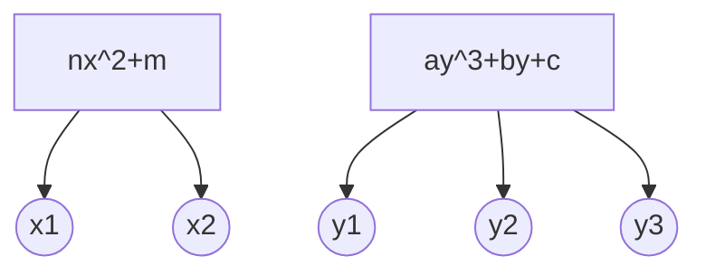

## 多项式环

多项式的定义(Polynomial)
将多项式记为$A=\sum a_ix^i=a_0+a_2x^2+\cdots+a_nx^n$
其中称$a_n\neq0$为最高项系数, 次数$\deg(A)=n$

多项式环的定义(Polynomial Ring)
已知交换环$R$, 将多项式环记为$R[x]$
多项式加法: $A+B=\sum (a_i+b_i)x^i$
多项式乘法: $A\cdot B=\sum (\sum\limits_{i+j=k}a_ib_j)x^k$
1. 加法封闭: $A+B=\sum a_ix^i+\sum b_ix^i=\sum (a_i+b_i)x^i\in R[x]$
2. 加法结合律: $(A+B)+C=A+(B+C)$
3. 加法单位元: $A+0=A$
4. 加法逆元: $A+(-A)=\sum a_ix^i+\sum (-a_i)x^i=\sum (a_i-a_i)x^i=\sum 0x^i$
5. 加法交换律: $A+B=\sum (a_i+b_i)x^i=\sum (b_i+a_i)x^i=B+A$
6. 乘法封闭: $A\cdot B=\sum(\sum_{i+j=k}a_ib_j)x^k\in R[x]$
7. 乘法结合律: $(A\cdot B)\cdot C=\sum(\sum_{i+j+k=m}a_ib_jc_k)x^m=A\cdot(B\cdot C)$
8. 乘法单位元: $A\cdot 1=A$
9. 乘法交换律: $A\cdot B=\sum(\sum_{i+j=m}a_ib_j)x^m=\sum(\sum_{i+j=m}b_ja_i)x^m=B\cdot A$
10. 乘法对加法的分配律: $A\cdot(B+C)=\sum a_ix^i\cdot(\sum b_ix^i+\sum c_ix^i)=\sum a_ix^i\cdot\sum (b_i+c_i)x^i$
    $=\sum(\sum_{i+j=m}a_i(b_j+c_j))x^m=\sum(\sum_{i+j=m}a_ib_j+\sum_{i+j=m}a_ic_j)x^m$
    $=\sum(\sum_{i+j=m}a_ib_j)x^m+\sum(\sum_{i+j=m}a_ic_j)x^m=A\cdot B+A\cdot C$

## 唯一分解整环的多项式

本原多项式(Primitive Polynomial)
已知唯一分解整环R, 以及$f(x)=a_0+a_1x+\cdots+a_nx^n\in R[x]$
如果$\gcd(a_0,a_1,\cdots,a_n)\sim1$, 则称$f(x)$是本原多项式
$R[x]$的可逆元即为 零次本原多项式$f(x)=u\sim1$

------

引理1: 已知唯一分解整环R, 且$f(x)\in R[x]\setminus\{0\}$
那么存在唯一分解$f(x)=d\cdot f_1(x)$, 其中$f_1(x)$是本原多项式

存在性: 取$d=\gcd(a_0,a_1,\cdots,a_n)$即可
唯一性: 假设存在$f(x)=m\cdot f_2(x)=m\cdot(b_0+\cdots+b_nx^n)$
那么$d=(a_0,\cdots,a_n)=(mb_0,\cdots,mb_n)\sim m\implies d=um$
$\implies um\cdot f_1(x)=mf_2(x)\implies f_1(x)\sim f_2(x)$

------

高斯引理(Gauss' Lemma)
已知唯一分解整环R, 则本原多项式的乘积, 还是本原多项式
证明: 对于任意素元p, 存在最低项系数$a_r,b_s$, 使得$(p\nmid a_r) \land (p\nmid b_s)\implies p\nmid a_rb_s$
考虑 $\sum\limits_{r+s}a_ib_j=a_0b_{r+s}+\cdots+a_{r-1}b_{s+1}+a_rb_s+a_{r+1}b_{s-1}+\cdots+a_{r+s}b_0$
因为 $(p\mid a_0,\cdots,a_{r-1})\land (p\mid b_0,\cdots,b_{s-1})\implies p\mid(\sum\limits_{r+s}a_ib_j-a_rb_s)$
所以 $p\nmid a_rb_s\land p\mid(\sum\limits_{r+s}a_ib_j-a_rb_s)\implies p\nmid\sum\limits_{r+s}a_ib_j$

------

引理3: 已知唯一分解整环R, 及其分式域F
则本原多项式在$R[x]$上相伴$\iff$在$F[x]$上相伴
$\implies$: $\exists u\in R^*,g(x)=u\cdot h(x)\implies\exists\frac{u}{1}\in F,g(x)=\frac{u}{1}\cdot h(x)$
$\impliedby$: $\exists\frac{a}{b}\in F,g(x)=\frac{a}{b}\cdot h(x)\implies b\cdot g(x)=a\cdot h(x)$
由引理1可知, 本原多项式的分解唯一, 所以$g(x)\sim h(x)$

------

引理4: 已知唯一分解整环R, 及其分式域F, 且$f(x)\in F[x]\setminus\{0\}$
那么存在唯一分解$f(x)=\frac{d}{m}\cdot g(x)$, 其中$g(x)$是$R[x]$上的本原多项式

存在性: 取$m=lcm(b_0,b_1,\cdots,b_n)\land d=\gcd(\frac{a_0m}{b_0},\frac{a_1m}{b_1},\cdots,\frac{a_nm}{b_n})$

唯一性: 假设存在$f(x)=\frac{d_1}{m_1}\cdot g_1(x)$, 那么$g(x)=\frac{md_1}{dm_1}\cdot g_1(x)\implies g(x)\overset{F[x]}\sim g_1(x)$
由引理3可知, 本原多项式 $g(x)\overset{F[x]}\sim g_1(x)\implies g(x)\overset{R[x]}\sim g_1(x)$

------

引理5: 已知唯一分解整环R, 及其分式域F
本原多项式$g(x)\in R[x]$, 且$\deg(g)>0$
则其在$F[x]$上可约 $\iff$ 能分解为非零次本原多项式的乘积

$\impliedby$: 能够分解$\implies$在$R[x]$上可约$\implies$在$F[x]$上可约
$\implies$: 存在分解$g(x)=g_1(x)\cdot g_2(x)$, 其中$g_i(x)\in F[x]\land\deg(g_i)>0$
由引理4可知 $g_i(x)=a_i\cdot h_i(x)$, 其中$h_i(x)\in R[x]$是本原多项式
由引理3可知 $g(x)=a_1a_2\cdot h_1(x)h_2(x)\implies g(x)\sim h_1(x)h_2(x)$

------

引理6: 已知唯一分解整环R, 及其分式域F
本原多项式$g(x)\in R[x]$, 且$\deg(g)>0$
则其在$F[x]$上不可约 $\iff$ 在$R[x]$上不可约

$\impliedby$: 已知在$R[x]$上不可约, 假如在$F[x]$上可约
那么由引理5可知, 能分解为非零次本原多项式的乘积, 得出矛盾
$\implies$: 已知在$F[x]$上不可约, 假如在$R[x]$上可约
那么存在分解 $g(x)=h(x)\cdot p(x)$
因为本原多项式系数互素, 拆分不出零次多项式
所以 $\deg(h)>0\land\deg(p)>0\implies$在$F[x]$上可约, 得出矛盾

------

$R$是唯一分解整环$\implies R[x]$是唯一分解整环

存在性: 已知不可逆多项式 $f(x)\in R[x]$
若$\deg(f)=0$, 那么$f(x)=a\notin R^*$, 可唯一分解
若$\deg(f)>0$, 那么由引理1知 $f(x)=d\cdot g(x)$
$R$是唯一分解整环$\implies d=p_1\cdots p_m$
$F[x]$是唯一分解整环$\implies g(x)=q_1(x)\cdots q_n(x)$
由引理6可知 $q_i(x)$在$F[x]$上不可约$\iff$在$R[x]$上也不可约
$\implies f(x)=p_1\cdots p_m\cdot q_1(x)\cdots q_n(x)$

唯一性: 假设存在$f(x)=\~p_1\cdots\~p_r\cdot\~q_1(x)\cdots\~q_t(x)$
由引理1可知 $p_1\cdots p_m\sim\~p_1\cdots\~p_r\land q_1(x)\cdots q_n(x)\sim\~q_1(x)\cdots\~q_t(x)$
$R$是唯一分解整环$\implies p_i\sim\~p_i$
$F[x]$是唯一分解整环$\implies q_i(x)\overset{F[x]}\sim\~q_i(x)\implies q_i(x)\overset{R[x]}\sim\~q_i(x)$

------

Eisenstein判别法(Eisenstein's Criterion)
已知唯一分解整环R, 及其分式域F
则多项式$f(x)=a_nx^n+\cdots+a_1x+a_0\in R[x]$
在$F[x]$中不可约, 如果存在$p\in R$使得
1. $p|a_i,\ i=1,\cdots,n-1$
2. $p\nmid a_n\land p^2\nmid a_0$

反证法: 假如$f(x)$在$F[x]$中可约
那么由引理5可知 $f(x)=(b_lx^l+\cdots+b_0)(c_rx^r+\cdots+c_0)$
$\begin{cases}
p|a_0\land a_0=b_0c_0 &\implies p|b_0\lor p|c_0 \\
p\nmid a_n\land a_n=b_lc_r &\implies p\nmid b_l\land p\nmid c_r \\
\end{cases}$
不妨设$p|b_0$, 那么存在$k\leq m\implies p|b_0,\cdots,p|b_{k-1},p\nmid b_k$
因为 $a_k=b_0c_k+\cdots+b_{k-1}c_1+b_kc_0\land p|a_k\implies p|b_kc_0$
所以 $p|b_kc_0\land p\nmid b_k\implies p|c_0\implies p^2|b_0c_0=a_0$ 得出矛盾

## 有限域的构造

多项式的带余除法(Polynomial Division)
已知域F, 如果$B\neq0$, 那么存在唯一的$q,r\in F[x]$
使得$A=Bq+r$, 并且$\deg(r)<\deg(B)$

首先证明存在性: 
如果$\deg(A)<\deg(B)$, 那么$q=0,r=A$
如果$\deg(A)\ge\deg(B)$, 那么对$d=n-m$进行归纳

当$d=0$时, 取$q=a_m\cdot b_m^{-1}$
使得$r_m=A_m-B_mq=0\implies\deg(r)<m$

假设小于d时成立, 现欲证明等于d时也成立
取$\.q=a_nb_m^{-1}x^d$, 则$\.r_n=A_n-B_m\.q=0\implies\deg(\.r)<n$
由归纳假设可知, 存在带余除法$\.r=Bq+r$, 并且$\deg(r)<\deg(B)$
故$A=B\.q+\.r=B\.q+(Bq+r)=B(\.q+q)+r$

然后证明唯一性: 假如$A=Bq+r=Bq'+r'$, 即$B(q-q')=(r'-r)$
那么 $\deg(r'-r)<\deg(B)\implies q-q'=0\implies r'-r=0$

------

已知不可约多项式 $m(x)=a_0+a_1x+\cdots+a_nx^n\in F_q[x]$
那么$F_q[x]/\langle m(x)\rangle$是域, 且含有$q^n$个元素 (所有余数)

并且每个元素可唯一表示成 $c_0+c_1u+\cdots+c_{n-1}u^{n-1}$
其中$u=x+\langle m(x)\rangle$, 满足$a_0+a_1u+\cdots+a_nu^n=\bar0$

首先证明存在性: 因为$F[x]$是欧几里得整环
所以 $\langle m(x)\rangle$是极大理想$\implies F_q[x]/\langle m(x)\rangle$是域

带余除法$f(x)=m(x)\cdot q(x)+r(x)$, 其中$\deg(r)<\deg(m)$
因此不妨设$r(x)=c_0+c_1x+\cdots+c_{n-1}x^{n-1}$, 且记$I=\langle m(x)\rangle$
$\begin{aligned}
    f(x)+I&=m(x)\cdot q(x)+r(x)+I=r(x)+I \\
          &=c_0+c_1x+\cdots+c_{n-1}x^{n-1}+I \\
          &=[c_0+I]\oplus[c_1+I][x+I]\oplus\cdots\oplus[c_{n-1}+I][x+I]^{n-1}
\end{aligned}$
简记$c_i=c_i+I,u=x+I$, 那么$f(x)+I=c_0+c_1u+\cdots+c_{n-1}u^{n-1}$

然后证明唯一性: 如果 $c_0+\cdots+c_{n-1}u^{n-1}=d_0+\cdots+d_{n-1}u^{n-1}$
$\implies 0=(c_0-d_0)+(c_1-d_1)u+\cdots+(c_{n-1}-d_{n-1})u^{n-1}$
$\implies 0=[(c_0-d_0)+(c_1-d_1)x+\cdots+(c_{n-1}-d_{n-1})x^{n-1}]+I$
$\implies (c_0-d_0)+(c_1-d_1)x+\cdots+(c_{n-1}-d_{n-1})x^{n-1}\in\langle m(x)\rangle$
因为$m(x)$是n次不可约多项式, 所以$c_i-d_i=0\implies c_i=d_i$

故域$F_q[x]/\langle m(x)\rangle$含有$q^n$个元素
并且 $a_0+a_1u+\cdots+a_nu^n$
$=a_0+a_1x+\cdots+a_nx^n+\langle m(x)\rangle$
$=m(x)+\langle m(x)\rangle=\bar0$

------

示例1: 构造含4个元素的域
解: 已经知道$\mathbb{Z_2}$是含2个元素的域
因此只需在$\mathbb{Z_2}[x]$中取一个2次不可约多项式
即$F_4=\mathbb{Z_2[x]}/\langle x^2+x+\bar1\rangle=\{0,1,u,u+1\}$

示例2: $\mathbb{R[x]}/\langle x^2+1\rangle\cong\mathbb{C}$
解: 令$u=x+\langle x^2+1\rangle$, 则$\mathbb{R[x]}/\langle x^2+1\rangle=\{x+yu\mid x,y\in\mathbb{R}\}$
构造环同构 $\sigma:\mathbb{R[x]}/\langle x^2+1\rangle\to\mathbb{C}:x+yu\mapsto x+yi$
因此由环同态基本定理知 $\mathbb{R[x]}/\langle x^2+1\rangle\cong\mathbb{C}$

------

扩张生成子环的定义一(Extension Generated Subring)
由交换环$R$添加$\~a$扩张生成的子环 $R[\~a]=\bigcap\{S<\~R\mid R\cup\{\~a\}\subseteq S\}$

扩张生成子环的定义二(Extension Generated Subring)
由交换环$R$添加$\~a$扩张生成的子环 $R[\~a]=\{a_0+a_1\~a+\cdots+a_n\~a^n|a_i\in R\}$

$R[\~a]_1=\bigcap\{S<\~R\mid R\cup\{\~a\}\subseteq S\}$
$R[\~a]_2=\{a_0+a_1\~a+\cdots+a_n\~a^n|a_i\in R\}$
现欲证明上述两种定义等价:
$R[\~a]_1\subseteq R[\~a]_2$: 因为$R[\~a]_2$是包含$R\cup\{\~a\}$的子环, 所以$R[\~a]_1\subseteq R[\~a]_2$
$R[\~a]_2\subseteq R[\~a]_1$: 由运算封闭性可知, 对于任意包含$R\cup\{\~a\}$的子环S
都有$a_0+a_1\~a+\cdots+a_n\~a^n\in S\implies R[\~a]_2\subseteq R[\~a]_1$

------

已知域$F$与扩充整环$\~R$, 其中$\~a\in\~R$
代入同态: $\sigma_{\~a}:F[x]\to F[\~a]$
$f(x)=\sum a_ix^i\mapsto\sum a_i\~a^i=f(\~a)$

由环同态基本定理知 $F[x]/\ker(\sigma_{\~a})\cong F[\~a]$
其中 $\ker(\sigma_{\~a})=\{f(x)\mid f(\~a)=0\}$

1. 当$\ker(\sigma_{\~a})=\langle0\rangle$时, $F[\~a]\cong F[x]/\langle 0\rangle=F[x]$
    此时称$\~a$是F上的超越元, 且$F[\~a]$不是域
2. 当$\ker(\sigma_{\~a})=\langle m(x)\rangle$时, $F[\~a]\cong F[x]/\langle m(x)\rangle$
    此时称$\~a$是F上的代数元, 将次数最低的$m(x)$称为$\~a$的极小多项式
    因为$\~R$是整环, 所以$m_1(\~a)m_2(\~a)=0\implies m_1(\~a)=0\lor m_2(\~a)=0$
    因此极小多项式不可约, 故$F[\~a]$是域

------

每个不可约多项式, 都是其根的极小多项式
同个不可约多项式的根, 对域扩张的作用等价
即存在域同构$\sigma:F[x]/\langle m(x)\rangle\leftrightarrow F[\~a]$

证明: 已知$f(a)=0$, 且代数数a的极小多项式为$m(x)$
那么$f(x)$能够被$m(x)$整除, 又因为$f(x)$不可约, 所以$f(x)=m(x)$

------

