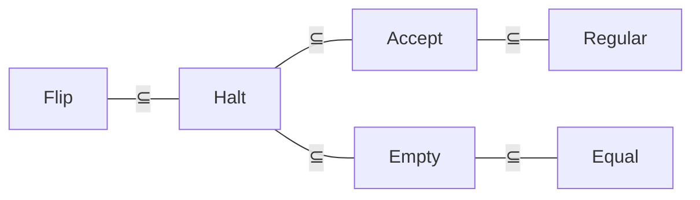
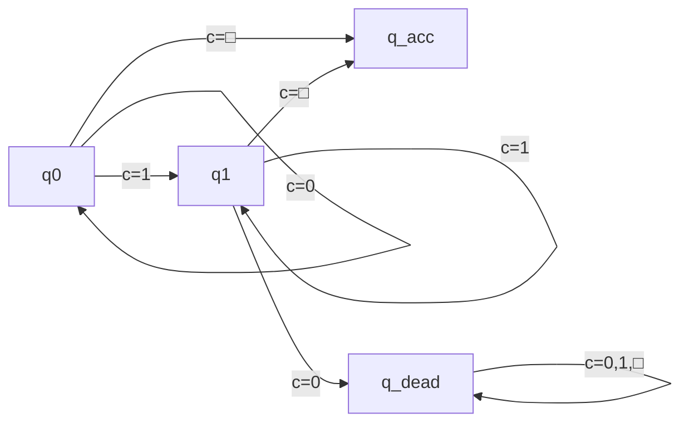
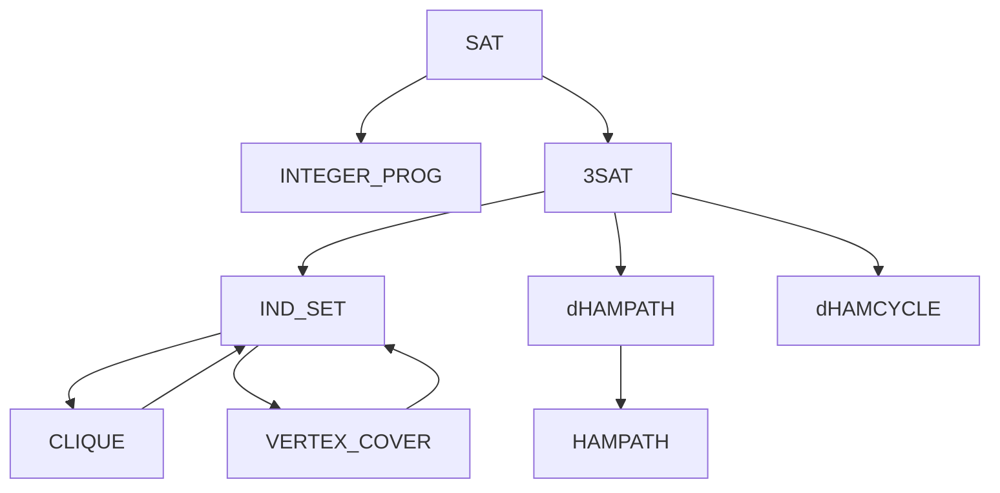
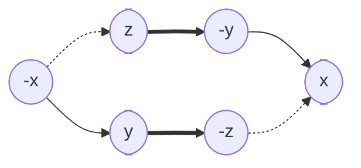

## 图灵机运行时间

图灵机运行时间的定义
<最弱模型来模拟最强模型 只导致时间按平方增长>
已知算法函数$f:\{0,1\}^*\to\{0,1\}$和时间函数$T:\mathbb{N}\to\mathbb{N}$
如果图灵机M最多只需$T(|x|)$步就能确定$f(x)$, 则称M在$T(n)$时间内计算$f$

----

限定字母表后的时间增量(01 Alphabet)
已知算法函数$f:\{0,1\}^*\to\{0,1\}$
如果字母表$\Gamma$上的图灵计算时间为$T(n)$
那么存在字母表$\{0,1\}$上的图灵机, 计算时间为$3\log|\Gamma|T(n)$

证明: 将$\Gamma$中的每个符号用$\log|\Gamma|$位进行编码
1. 让每个带头右移$\log|\Gamma|$进行读值, 存储到状态编码中
2. 依照M的转移函数进行状态跳转
3. 让每个带头左移$\log|\Gamma|$进行写值
4. 让每个带头按需移动$\log|\Gamma|$

----

限定单带后的时间增量(Single Tape)
已知算法函数$f:\{0,1\}^*\to\{0,1\}$
如果k带图灵机的计算时间为$T(n)$
那么存在单带图灵机, 计算时间为$kT^2(n)$

证明: 构造模拟带, 其为k条纸带的交替拼接, ^用于标记读写头
将第一条带编码为位置$1,k+1,2k+1,3k+1,4k+1,\cdots$
将第二条带编码为位置$2,k+2,2k+2,3k+2,4k+2,\cdots$
k带转移函数: $\delta:Q\times\Gamma^k\to Q\times\Gamma^k\times\{L,R,S\}^k$
|        |                  |                  |                  |          |
| ------ | ---------------- | ---------------- | ---------------- | -------- |
| 纸带a  | $a_1$            | $a_2$            | $a_3$            | $\cdots$ |
| 纸带b  | $b_1$            | $b_2$            | $b_3$            | $\cdots$ |
| 纸带c  | $c_1$            | $c_2$            | $c_3$            | $\cdots$ |
| 模拟带 | $a_1b_1\hat c_1$ | $a_2\hat b_2c_2$ | $\hat a_3b_3c_3$ | $\cdots$ |

1. 从左到右扫描模拟带, 读取并记录所有带^的字符
2. 根据k带的转移函数, 来决定下一次每个带的状态
3. 从右到左扫描模拟带, 更新所有带^的字符

(1)阶段耗时: 纸带长度$kT(n)$
(3)阶段耗时: 纸带长度$kT(n)$, 更新标记$k*k$
三阶段共耗时$O[kT(n)]+O[kT(n)+k^2]=O(kT(n))$
执行$T(n)$回合, 总计时间为 $O(kT(n))\times O(T(n))=O(kT^2(n))$

----

限定单向后的时间增量(Single Direction)
已知算法函数$f:\{0,1\}^*\to\{0,1\}$
如果双向图灵机的计算时间为$T(n)$
那么存在单向图灵机, 计算时间为$2T(n)$

证明: 构造模拟带, 其为双向纸带的正负交替拼接
|          |          |       |       |       |       |       |          |
| -------- | :------: | :---: | :---: | :---: | :---: | :---: | :------: |
| 双向纸带 | $\cdots$ | $-2$  | $-1$  |  $0$  |  $1$  |  $2$  | $\cdots$ |
| 模拟带   |   $0$    | $-1$  |  $1$  | $-2$  |  $2$  | $-3$  | $\cdots$ |

对于模拟带, 状态更新时需要左移或右移两位
故总计时间为$O(2T(n))$

----

内存图灵机的定义(Random Access Turing Machine)
<$M=(Q,\Sigma,\Gamma,q_0,q_{accept},q_{reject},Q_{access},\delta,Mem)$>
纸带字母表: 添加读写操作符$R,W\in\Gamma$
转移函数: $\delta:Q\times\Gamma^k\to Q\times\Gamma^k\times\{L,R,S\}^k$
有访存状态集$Q_{access}\subseteq Q$, 如果处于$q\in Q_{access}$则执行
1. 若当前内存带为$011R$, 则从内存$Mem[110_{2}]$处读取数据到地址带
2. 若当前内存带为$011W\sigma$, 则向内存$Mem[110_{2}]$处写入数据$\sigma$

|                |     |     |     |     |                   |     |          |          |
| -------------- | --- | --- | --- | --- | ----------------- | --- | -------- | -------- |
| 索引           | 0   | 1   | 2   | 3   | 4                 | 5   | 6        | $\cdots$ |
| 内存带         |     |     |     |     |                   |     | $\sigma$ | $\cdots$ |
| 地址带(读操作) | 0   | 1   | 1   | R   | $\sigma^\swarrow$ |     |          |          |
| 地址带(写操作) | 0   | 1   | 1   | W   | $\sigma^\nearrow$ |     |          |          |

----

限定无内存后的时间增量(None Memory)
已知算法函数$f:\{0,1\}^*\to\{0,1\}$
如果内存图灵机的计算时间为$T(n)$
那么存在多带图灵机, 计算时间为$T^3(n)$
特别地, 若地址长度为$O(1)$, 那么时间缩短为$T^2(n)$

证明: 对于多带图灵机, 构造内存模拟带来放访存操作对$(i,R[i])$
当内存图灵机处于访存操作$q\in Q_{access}$时, 执行以下操作
1. 扫描内存模拟带, 寻找具有匹配地址的访存操作对
2. 若不存在匹配地址的操纵对, 则新增操作对$(i,R[i])$
3. 相应地对该访存操作对进行读写

操作对的个数$\leq T(n)$
操作对的长度$\leq T(n)$
故模拟内存带的长度$\leq T^2(n)$
所以步骤(1)需要耗时$O(T^2(n))$
执行$T(n)$回合, 总计时间为$O(T^3(n))$

## 通用图灵机

通用图灵机的定义(Universal Turing Machine)
<能模拟图灵机运行过程的图灵机>
已知图灵机编码a和输入字符串x, 通用图灵机$U(a,x)=M_a(x)$, 

高效通用图灵机(Efficient Universal Turing Machine)
<能够快速模拟任意多带图灵机的执行过程>
如果$M_a$的计算时间为$T(n)$,
那么存在高效$U(a,x)$, 计算时间为$T\log T$

------

首先证明宽松形式$O(T^2)$:
构造五条纸带: 输入带 主工作带 模型工作带 状态工作带 输出带
1. 输入带: 图灵机编码a 输入字符串x
2. 主工作带: 用k元组模拟M的k条工作带
    当M的k个带头分别独立移动时, 主工作带采用"带头不动带子动",
    把每层都按相应方向进行整层移动
3. 模型工作带: 存放M的所有转移函数规则
4. 状态工作带: 存放M的对应当前状态

读写纸带元组: $O(1)$
查找转移函数: $O(|a|)$
移动整层纸带: $O(T)$
执行T回合的总时间: $O(T^2)$

------

然后将其优化为高效形式$O(T\log T)$:
为避免每次都移动整层, 引入缓冲符号$\boxtimes$
|          |       |       |       |       |
| -------- | ----- | ----- | ----- | ----- |
| 右侧区间 | $R_0$ | $R_1$ | $R_2$ | $R_3$ |
| 左侧区间 | $L_0$ | $L_1$ | $L_2$ | $L_3$ |
| 区间宽度 | $2^1$ | $2^2$ | $2^3$ | $2^4$ |

约束条件:
1. 每个区间要么全满(无缓冲), 要么半满(半缓冲), 要么全空(全缓冲)
2. 区间$R_i$与$L_i$互补, 即要么$R_i$满$L_i$空, 要么$R_i$空$L_i$满, 要么都是半满
3. 0号位的数据永远不会是缓冲符号$\boxtimes$

当该层进行左移操作时:
1. 将0号位移动到草稿带
2. 向右扫描, 直到遇见非空区间$R_i$
3. 将$R_i$的一半数据移动到$0,R_0,\cdots,R_{i-1}$
    使得这些空区间成为半满($1+2^0+2^1+\cdots+2^{i-1}=2^i$)
4. 由约束条件可知, 当前$L_{i-1},\cdots,L_0$为全满, $L_i$为半满或全空
    故可将$\{L_{i-1},\cdots,L_0\}$中的数据依次左移到$\{L_i,\cdots,L_1\}$
    最后再将0号位从草稿带移动到 刚刚空出来的$L_0$

考虑最坏情况: 某次左移遇见$R_i$, 使得$R_0-R_{i-1}$成为半满
如果带子此后一直左移, 要移动$2^0+\cdots+2^{i-1}=2^i-1$次将半满全清空后
再进行一次左移才能再次遇见$R_i$, 故两次遇见$R_i$的移动至少间隔$2^i$次

由于带子至多移动T次, 那么对区间$R_i$的移动不超过$\frac{T}{2^i}$次
每次移动区间$R_i$需要耗时$O(2^i)$(右侧-草稿带-右侧 左侧-草稿带-左侧)
最多有$\log T$个区间, 故总时间为$O[\sum_i^{\log T}\frac{T}{2^i}O(2^i)]=O(T\log T)$

## 多项式复杂性类

DTIME记号的定义(Decidable Time Complexity Class)
称语言$L\in D_{time}(T)$, 当且仅当存在判定器计算时间为$T(n)$

非确定性图灵机的定义(Non-deterministic Turing Machine)
有两个转移函数$\delta_0,\delta_1$和特殊状态$q_{accept}$
每个步骤中都可任意选用两个转移函数之一(类似于穷举$\{0,1\}^*$)
如果**存在某个**转移函数的选用序列, 最终进入状态$q_{accept}$, 则接受输入

NDTIME记号的定义(Non-deterministic Time Complexity Class)
称语言$L\in ND_{time}(T)$, 当且仅当存在非确定性判定器计算时间为$O(T)$

高效通用非确定性图灵机(Efficient Universal ND-Turing Machine)
<能够快速模拟任意多带非确定性图灵机的执行过程>
如果非确定性$N_a$的计算时间为$T(n)$,
那么存在高效$UN(a,x)$, 计算时间为$T$

构造六条纸带: 输入带 主工作带 猜测转移带 模型工作带 状态工作带 输出带
1. 输入带: 图灵机编码a 输入字符串x
2. 主工作带: 用k元组模拟M的k条工作带
    当M的k个带头分别独立移动时, 主工作带采用"带头不动带子动",
    把每层都按相应方向进行整层移动
3. 猜测转移带: 用于存放每次猜测的转移函数
4. 模型工作带: 存放M的所有转移函数规则
5. 状态工作带: 存放M的对应当前状态

首先不移动带子, 为每线程的猜测转移带给予赋值-$O(T)$
然后在每个线程, 依次为每条纸带检查该猜测转移是否有效-$O(kT)$

------

P类问题的定义
能在多项式时间内求解, 即$P=\bigcup D_{time}(n^c)$

NP类问题的定义一
<能在多项式时间内验证, 但总能在指数时间内通过穷举求解>
已知语言$L\subseteq\{0,1\}^*$, 称L属于NP类问题
如果存在多项式时间图灵机M(称作验证器):
$\forall x\in \{0,1\}^*,x\in L\iff\exists u\in\{0,1\}^{n^c},M(x,u)=1$
其中将u称为关于x的证明, 例如SAT问题中的u是使范式为真的一种赋值方式

NP类问题的定义二
<能通过NDTM在多项式时间内 通过穷举转移函数求解>
$NP=\bigcup ND_{time}(n^c)$

NP问题的两种定义是等价的
$\impliedby$: 已知语言L可被多项式时间NDTM判定
那么存在转移函数的选择序列u, 使得x进入状态$q_{accept}$
那么可构造验证器TM, 在多项式时间内沿着u来验证$M(x,u)=1$
$\implies$: 已知语言L有多项式验证器为$M(x,u)$, 现欲构造多项式NDTM
对于所有转移函数的选用序列 $u\in\{0,1\}^*$ (其中选择$\delta_0$输出0,选择$\delta_1$则输出1)
运行多项式验证器M, 如果$M(x,u)=1$, 则将此时所处状态标记为$q_{accept}$

## 多项式时间归约

多对一归约的定义(Many-One Reduction|Karp Reduction)
已知语言$A,B\subseteq\{0,1\}^*$, 称$A\leq_m B$
存在多项式停机函数$f$, 使得$\forall x\in\{0,1\}^*,x\in A\iff f(x)\in B$
<也就是说, 语言A的字符串, 都可经过多项式时间转换后被B判定>
<说明B的判定能力要比A更强, 也说明语言B对应的问题更难>

图灵归约的定义(Turing Reduction|Cook Reduction)
已知语言$A,B\subseteq\{0,1\}^*$, 称$A\leq_T B$
能够使用语言B的判定器作为子程序(Oracle), 来构造语言A的判定器

已知归约关系$A\leq B$, 那么
1. 如果B是可判定的, 那么A也是可判定的
2. 如果A是不可判定的, 那么B也是不可判定的

$L\in\text{NP-Hard}\iff\forall K\in\text{NP}, K\leq_p L$
$L\in\text{NP-Complete}=\text{NP}\cap\text{NP-Hard}$

------

莱斯定理(Rice's theorem)
<图灵可识别语言的所有非平凡属性都是不可判定的>
对于任意属性P, 如果存在图灵机$M_1$和$M_2$, 
使得$L(M_1)\in P\land L(M_2)\notin P$, 那么属性P是不可判定的

用反证法证明: 已知满足属性P的图灵机$G_p\in P$
假设属性$P$可判定, 那么存在判定器$A(M)=\begin{cases}接受&M\in P\\拒绝&M\notin P\end{cases}$

用$G_p$和$A$来构造停机判定器$\text{Halt}(M,w)$
1. 首先构造通用模拟器$T_{M,w}(x)$:
   1. 模拟$M(w)$的全部运行过程
   2. 模拟$G_p(x)$并输出相同结果
2. 然后将构造好的$T_{M,w}$作为输入, 
    让属性P的判定器来判定$A(T_{M,w})$, 并输出相同结果

如果$M(w)$不能停机, 那么$T_{M,w}$也不能停机 ==><拒绝>
如果$M(w)$能够停机, 那么$T_{M,w}\in P$ ==><接受>
因此满足图灵归约$\text{Halt}\leq_T \text{P}$, 故属性P是不可判定的

------

1. 反对角线: $L_{flip}=\{M|M不接受位串\langle M\rangle)\}\\
    D_{flip}(M)=\begin{cases}拒绝 & 如果M接受位串\langle M\rangle \\
    接受 & 如果M死循环或拒绝位串\langle M\rangle\end{cases}$
2. 图灵停机: $L_{halt}=\{(M,w)|M(w)停机\}\\
    D_{halt}(M,w)=\begin{cases}接受 & 如果M(w)停机 \\
    拒绝 & 如果M(w)死循环\end{cases}$
3. 图灵接受: $L_{accept}=\{(M,w)|M(w)接受\}\\
    D_{accept}(M,w)=\begin{cases}接受 & 如果M(w)接受 \\
    拒绝 & 如果M(w)死循环或拒绝\end{cases}$
4. 图灵空集: $L_{empty}=\{M|L(M)=\emptyset\} \\
    D_{empty}(M)=\begin{cases}接受 & 如果L(M)=\emptyset \\
    拒绝 & 如果L(M)\neq\emptyset\end{cases}$
5. 图灵正则: $L_{regular}=\{M|L(M)是正则语言\} \\
    D_{regular}(M)=\begin{cases}接受 & 如果L(M)是正则语言 \\
    拒绝 & 如果L(M)不是正则语言\end{cases}$
6. 图灵相等: $L_{equal}=\{(M,N)|L(M)=L(N)\} \\
    D_{equal}(M,N)=\begin{cases}接受 & 如果L(M)=L(N) \\
    拒绝 & 如果L(M)\neq L(N)\end{cases}$

------

$L_{flip}\leq_T L_{halt}$
<用$D_{halt}$构造出$D_{flip}$>
$D_{flip}(M)=\begin{cases}
    接受 & 如果D_{halt}(M,\langle M\rangle)拒绝, 即陷入死循环 \\
        & 如果D_{halt}(M,\langle M\rangle)接受, 即能够停机并模拟 \\
    接受 & \quad 模拟结果为拒绝 \\
    拒绝 & \quad 模拟结果为接受 \\
\end{cases}$

------

$L_{halt}\leq_T L_{accept}$
<用$D_{accept}$构造出$D_{halt}$>
如果M停机就接受的$N_M(w)=\begin{cases}
    接受  & 如果模拟M(w)接受或拒绝 \\
    死循环 & 如果模拟M(w)时发生死循环 \\
\end{cases}$
$D_{halt}(M,w)=D_{accept}(N_M,w)$

------

$L_{halt}\leq_T L_{empty}$
<用$D_{empty}$构造出$D_{halt}$>
如果M停机就总接受的$N_{M,w}(x)=\begin{cases}
    总是接受 & 如果模拟M(w)接受或拒绝 \\
    死循环 & 如果模拟M(w)时发生死循环 \\
\end{cases}$
$D_{halt}(M,w)=\lnot D_{empty}(N_{M,w})$

------

$L_{accept}\leq_T L_{regular}$
<用$D_{regular}$构造出$D_{accept}$>
$N_{M,w}(x)=\begin{cases}
    接受  & 如果x=\{0^n1^n\} \\
    接受     & \quad如果x\neq\{0^n1^n\}且M(w)接受 \\
    拒绝     & \quad如果x\neq\{0^n1^n\}且M(w)拒绝 \\
    死循环   & \quad如果x\neq\{0^n1^n\}且M(w)死循环 \\
\end{cases}$
$\implies N_{M,w}(x).L=\begin{cases}
    (0^*1^*)^*\in R     & 如果模拟M(w)接受 \\
    \{0^n1^n\}\notin R  & 如果模拟M(w)拒绝或死循环 \\
\end{cases}$
$D_{accept}(M,w)=D_{regular}(N_{M,w})$

------

$L_{empty}\leq_T L_{equal}$
<用$D_{equal}$构造出$D_{empty}$>
$D_{empty}(M)=D_{equal}(M,\emptyset)$

------

波斯特对应问题(Post Correspondence Problem)
示例$K=\{[\frac{a}{ab}],[\frac{b}{ca}],[\frac{ca}{a}],[\frac{abc}{c}]\}$, 有匹配$[\frac{a}{ab}][\frac{b}{ca}][\frac{ca}{a}][\frac{a}{ab}][\frac{abc}{c}]=[\frac{abcaaabc}{abcaaabc}]$
已知牌组$K=\{[\frac{x_1}{y_1}],\cdots,[\frac{x_k}{y_k}]\}$, 如果有$x_{i1}x_{i2}\cdots x_{im}=y_{i1}y_{i2}\cdots y_{in}$, 则称P存在匹配
PCP匹配问题$L_{PCP}=\{P存在匹配\}$
MPCP匹配问题$L_{MPCP}=\{P存在匹配\land匹配的首牌固定为[\frac{x_1}{y_1}]\}$
$L_{halt}\leq L_{MPCP}\leq L_{PCP}$

首先证明$L_{MPCP}\leq_m L_{PCP}$
<构造多项式停机函数, 使得$K_m\in MPCP\iff f(K_m)\in PCP$>
$K=\{[\frac{x_1}{y_1}],\cdots,[\frac{x_k}{y_k}]\}\to f(K)=\{[\frac{x_0'}{y_0'}],[\frac{x_1'}{y_1'}],\cdots,[\frac{x_k'}{y_k'}],[\frac{\$}{\#\$}]\}$
1. $x_i$中每个字母的后方添加#
2. $y_i$中每个字母的前方添加#
3.  其中对于 $[\frac{x_0'}{y_0'}]=[\frac{\#x_1'}{y_1'}]$, 使得其必为首牌

| 牌组     | 0                        | 1                      | 2                         | 3                   | 4                   |
| -------- | ------------------------ | ---------------------- | ------------------------- | ------------------- | ------------------- |
| $K_m$    |                          | $[\frac{ab}{a}]$       | $[\frac{c}{abc}]$         | $[\frac{a}{b}]$     |                     |
| $f(K_m)$ | $[\frac{\#a\#b\#}{\#a}]$ | $[\frac{a\#b\#}{\#a}]$ | $[\frac{c\#}{\#a\#b\#c}]$ | $[\frac{a\#}{\#b}]$ | $[\frac{\$}{\#\$}]$ |

| 匹配     |                          |                     |                        |                           |                     |                                                |
| -------- | ------------------------ | ------------------- | ---------------------- | ------------------------- | ------------------- | ---------------------------------------------- |
| $K_m$    | $[\frac{ab}{a}]$         | $[\frac{a}{b}]$     | $[\frac{ab}{a}]$       | $[\frac{c}{abc}]$         |                     | $\to[\frac{abaabc}{abaabc}]$                   |
| $f(K_m)$ | $[\frac{\#a\#b\#}{\#a}]$ | $[\frac{a\#}{\#b}]$ | $[\frac{a\#b\#}{\#a}]$ | $[\frac{c\#}{\#a\#b\#c}]$ | $[\frac{\$}{\#\$}]$ | $\to[\frac{\#a\#b\#cabaabc}{\#a\#b\#cabaabc}]$ |

然后证明$L_{halt}\leq_m L_{MPCP}$
<用$D_{MPCP}$作为神谕构造出$D_{halt}$>
示例: 已知语言$L=\{0^i1^j|i,j\in\mathbb{N}\}$
构造图灵机$M=(Q,\Sigma,\Gamma,q_0,q_{acc},\delta)$
1. 字母表: $\Sigma=\{0,1\}$
2. 纸带字母表: $\Gamma=\{0,1,\sqcup\}$
3. 状态集: $Q=\{q_0,q_1,q_{dead},q_{acc}\}$
4. 转移函数表: 

|            | 0                | 1                | $\sqcup$              |
| ---------- | ---------------- | ---------------- | --------------------- |
| $q_0$      | $(q_0,0,R)$      | $(q_1,1,R)$      | $(q_{acc},1,N)$       |
| $q_1$      | $(q_{dead},0,R)$ | $(q_1,1,R)$      | $(q_{acc},1,N)$       |
| $q_{dead}$ | $(q_{dead},0,R)$ | $(q_{dead},1,R)$ | $(q_{dead},\sqcup,R)$ |

若当前输入字符串$w=0011$, 则可将$M(w)$转换为MPCP骨牌
1. 首位骨牌: $[\frac{\#}{\#\#q_00011\#}]$
2. 恒等骨牌: $[\frac{0}{0}],[\frac{1}{1}],[\frac{\sqcup}{\sqcup}],[\frac{\#}{\#}],[\frac{\#}{\sqcup\#}]$
3. 右转移骨牌: $q_0\to[\frac{q_00}{0q_0}],[\frac{q_01}{1q_1}],[\frac{q_0\sqcup}{1q_{acc}}]$
    $q_1\to[\frac{q_10}{0q_{dead}}],[\frac{q_11}{1q_1}],[\frac{q_1\sqcup}{1q_{acc}}]$
    $q_{dead}\to[\frac{q_{dead}0}{0q_{dead}}],[\frac{q_{dead}1}{1q_{dead}}],[\frac{q_{dead}\sqcup}{\sqcup q_{dead}}]$
4. 左转移骨牌: 例如$\delta(q_1,0)=(q_2,1,L)\to[\frac{0q_00}{q_101}],[\frac{1q_00}{q_111}],[\frac{\sqcup q_00}{q_1\sqcup0}]$
    <要添加左侧所有可能出现的字母>
5. 消元骨牌: $[\frac{q_{acc}0}{q_{acc}}],[\frac{q_{acc}1}{q_{acc}}],[\frac{q_{acc}\sqcup}{q_{acc}}]\to吸收右侧$
    $[\frac{0q_{acc}}{q_{acc}}],[\frac{1q_{acc}}{q_{acc}}],[\frac{\sqcup q_{acc}}{q_{acc}}]\to吸收左侧$
6. 结束骨牌: $[\frac{\#q_{acc}\#\#}{\#}]$

再将该牌组输入骨牌神谕机运行:
$\begin{aligned}
\left[\frac{\#}{\#\#q_00011\#}\right] &+ \left[\frac{\#}{\#}\right] \left[\frac{q_00}{0q_0}\right] \left[\frac{0}{0}\right] \left[\frac{1}{1}\right] \left[\frac{1}{1}\right] \left[\frac{\#}{\#}\right] \Rightarrow\\
\left[\frac{\#}{\#\#0q_00011\#}\right]&+ \left[\frac{\#}{\#}\right] \left[\frac{0}{0}\right] \left[\frac{q_00}{0q_0}\right] \left[\frac{1}{1}\right] \left[\frac{1}{1}\right] \left[\frac{\#}{\#}\right] \Rightarrow\\ 
\left[\frac{\#}{\#\#00q_011\#}\right] &+ \left[\frac{\#}{\#}\right] \left[\frac{0}{0}\right] \left[\frac{0}{0}\right] \left[\frac{q_01}{1q_1}\right] \left[\frac{1}{1}\right] \left[\frac{\#}{\#}\right] \Rightarrow\\
\left[\frac{\#}{\#\#001q_11\#}\right] &+ \left[\frac{\#}{\#}\right] \left[\frac{0}{0}\right] \left[\frac{0}{0}\right] \left[\frac{1}{1}\right] \left[\frac{q_11}{1q_1}\right] \left[\frac{\#}{\#}\right] \Rightarrow\\
\left[\frac{\#}{\#\#0011q_1\#}\right]&+ \left[\frac{\#}{\#}\right] \left[\frac{0}{0}\right] \left[\frac{0}{0}\right] \left[\frac{1}{1}\right] \left[\frac{1}{1}\right] \left[\frac{q_1\#}{q_{acc}1\#}\right]\Rightarrow
\left[\frac{\#}{\#\#00011q_{acc}1\#}\right]
\end{aligned}$

$\begin{aligned}
\left[\frac{\#}{\#\#0011q_{acc}1\#}\right]&+ \left[\frac{\#}{\#}\right] \left[\frac{0}{0}\right] \left[\frac{0}{0}\right] \left[\frac{1}{1}\right] \left[\frac{1}{1}\right] \left[\frac{q_{acc}1}{q_{acc}}\right] \left[\frac{\#}{\#}\right] \Rightarrow\\
\left[\frac{\#}{\#\#0011q_{acc}\#}\right] &+ \left[\frac{\#}{\#}\right] \left[\frac{0}{0}\right] \left[\frac{0}{0}\right] \left[\frac{1}{1}\right] \left[\frac{1q_{acc}}{q_{acc}}\right] \left[\frac{\#}{\#}\right] \Rightarrow\\
\left[\frac{\#}{\#\#001q_{acc}\#}\right]  &+ \left[\frac{\#}{\#}\right] \left[\frac{0}{0}\right] \left[\frac{0}{0}\right] \left[\frac{1q_{acc}}{q_{acc}}\right] \left[\frac{\#}{\#}\right] \Rightarrow\\
\left[\frac{\#}{\#\#00q_{acc}\#}\right]   &+ \left[\frac{\#}{\#}\right] \left[\frac{0}{0}\right] \left[\frac{0q_{acc}}{q_{acc}}\right]\left[\frac{\#}{\#}\right] \Rightarrow\\
\left[\frac{\#}{\#\#0q_{acc}\#}\right]    &+ \left[\frac{\#}{\#}\right] \left[\frac{0q_{acc}}{q_{acc}}\right] \Rightarrow\\
\left[\frac{\#}{\#\#q_{acc}\#}\right]     &+ \left[\frac{\#q_{acc}\#\#}{\#}\right]\Rightarrow[] \end{aligned}$

## 哥德尔不完备定理

Gödel's Incompleteness Theorems
所有包含Peano公理的自洽系统, 都包含不可判定的命题
1. 非空: $0\in \mathbb{N}$
2. 后继: $\forall n\in \mathbb{N}, n^+\in \mathbb{N}$
3. 后继非零: $\forall n\in \mathbb{N}, n^+\neq 0$
4. 后继不重复: $\forall n, m\in \mathbb{N}, n^+=m^+\implies n=m$
5. 数学归纳法: $P(0) \land (\forall n\in \mathbb{N}, P(n)\implies P(n^+))\implies \forall n\in \mathbb{N}, P(n)$
6. 逻辑运算: $\land,\lor,\lnot,\implies,\iff,\forall,\exists$

用反证法证明: 假设存在包含Peano公理的自洽系统S, 能够判定所有命题
那么可以构造停机问题的判定器$D_{halt}(M,w)=$
1. 构造对应公式$\phi_{M,w}\iff M(w)停机$
2. 逐步枚举所有可能的证明, 因为S是自洽的, 所以必然能够找到证明
    那么可以在有限时间内判定$D_{halt}(M,w)$, 得出矛盾

丢番图方程的定义(Diophantine Equation)
有限个不定元的整系数多项式
$3x^2-2xy-y^2z-7=0$有解$(x,y,z)=(1,2,-2)$

希尔伯特第十问题(Hilbert's Tenth Problem)
$L_{dio}=\{P(x_1,\cdots,x_n)|P(x_1,\cdots,x_n)=0有整数解\}$
$L_{halt}\leq_m L_{dio}$: 构造对应等式$P_{M,w}(x_1,\cdots,x_n)=0\iff M(w)停机$

------

## 布尔可满足性问题(SAT)

布尔公式可满足的定义(Satisfiable)
已知布尔公式$\phi(u_1,\cdots,u_n)$
如果存在赋值$z=(z_1,\cdots,z_n)$使得$\phi(z)=1$, 
则称$\phi$为可满足的, 否则称$\phi$为不可满足的

合取范式的定义(CNF, Conjunctive Normal Form)
<形如$(x_{11}\lor\cdots\lor x_{1t_1})\land\cdots\land(x_{n1}\lor\cdots\lor x_{nt_n})\land\cdots$>
其中将$(\bigvee_j x_{ij})$称为子句(clause), $x_{ij}$称为文字(literal)
如果子句最多包含k个文字, 则称为k-CNF, 将其中可满足的称为k-SAT
$x=y\iff (x\lor\lnot y)\land(\lnot x\lor y)$
$x\to y\iff (\lnot x\lor y)$

任意布尔函数$f:\{0,1\}^n\to\{0,1\}$, 都存在对应n-CNF公式, 长度为$n2^n$
证明: 任意$v\in\{0,1\}^n$, 都存在长度为n的或子句$C_v(x)=0\iff x=v$
例如 $1101_2\iff(\lnot x_1\lor\lnot x_2\lor x_3\lor\lnot x_4)$
如果已知$f(x)=0\iff x\in\{v_1,\cdots,v_k\},k\leq 2^n$
那么可构造$\phi=C_{v_1}\land C_{v_2}\land\cdots\land C_{k}$, 且长度至多为$n2^n$

------

库克-勒维定理(Cook-Levin Theorem)
已知$L\in\text{NP-Complete}=\text{NP}\cap\text{NP-Hard}$
1. $\text{SAT}\in\text{NP-Complete}$
2. $\text{3-SAT}\in\text{NP-Complete}$

首先证明$\text{SAT}\in\text{NP}$:
对于任意可满足的布尔表达式, 若给出一个可满足的赋值, 
那么可以在多项式时间内将该赋值代入表达式进行验证

然后证明$\text{SAT}\in\text{NP-Hard}\iff\forall L\in \text{NP},L\leq_m \text{SAT}$:
思路: $\text{NDTM}(x)\overset{O(n^c)}{\to}\phi_{M,x}\overset{\text{SAT判定}}{\to}Yes/No$
已知判定语言L的非确定性图灵机$M_L$
现欲找到多项式映射$f:L\to\text{SAT}:f(x)=\phi_x$
<$存在接受格局\{Z_1,\cdots,Z_k\}\iff代入布尔表达式得到\phi_x(Z)=1$>

------

|         |              |         |         |
| ------- | ------------ | ------- | ------- |
| 步数k   | $T$          | 格数i   | $T$     |
| 符号数c | $\|\Sigma\|$ | 状态数q | $\|Q\|$ |

| 格局变量    | 描述                   | 数量                    |
| ----------- | ---------------------- | ----------------------- |
| $T_{i,c,k}$ | 第k步时第i格是字符c    | $T\times\Sigma\times T$ |
| $H_{i,k}$   | 第k步时读写头指向第i格 | $T\times T$             |
| $Q_{q,k}$   | 第k步时状态为q         | $\|Q\|\times T$         |

| 约束表达式                                                                                                                             |                          |                         |
| -------------------------------------------------------------------------------------------------------------------------------------- | ------------------------ | ----------------------- |
| $T_{i,x_i,k=0},\forall i\in\{1,\cdots,n\}\\T_{i,\sqcup,k=0},\forall i\in\{n+1,\cdots,T\}$                                              | 初始输入x                | $O(T)$                  |
| $Q_{q_0,k=0}$                                                                                                                          | 初始状态$q_0$            | $O(1)$                  |
| $H_{1,k=0}$                                                                                                                            | 初始读写头               | $O(1)$                  |
| $T_{i,\exists c,k}\lor\neg(T_{i,c,k}\land T_{i,c',k+1})$                                                                               | 每时每格有且仅有一个元素 | $O(T^2)\|\Sigma\|^2$    |
| $Q_{\exists q,k}\lor\neg(Q_{q,k}\land Q_{q',k})$                                                                                       | 每时有且仅有一个状态     | $O(T)\|Q\|^2$           |
| $H_{\exists i,k}\lor\neg(H_{i,k}\land H_{i',k})$                                                                                       | 每时有且仅有一个读写头   | $O(T)\|T\|^2$           |
| $T_{i,c,k}\lor T_{i,c',k+1}\to H_{i,k}$                                                                                                | 每时每格被写处有读写头   | $O(T^2)\|\Sigma\|^2$    |
| $(H_{i,k}\land Q_{q,k}\land T_{i,c,k})\\\to\bigvee\limits_{(q',c',d)\in\delta(q,a)}(H_{i+d,k+1}\land Q_{q',k+1}\land T_{i,c',k+1})$ | 每时每格非确定性转移函数 | $O(T^2)\|Q\|\|\Sigma\|$ |
| $\bigvee\limits_{0\le k\le T}\bigvee\limits_{h\in\text{Halt} }Q_{h,k}$                                                                 | 在多项式时间内停机       | $O(T)\|Q\|$             |

定义$\phi_x$为上述表达式的合取
如表格所示, $\phi_x$的长度最多为$O(T^3)$, 故$f$是多项式时间映射
现欲证明当前构造的映射满足$x\in L\iff M(x)=1\iff f(x)\in\text{SAT}$
$\implies$: 若NDTM判定x, 那么说明存在某个可能的格局序列$Z=(z_1,\cdots,z_k)$使其接受并停机
用该格局序列Z给变量赋值$Y=(T_{i,c,k},H_{i,k},Q_{q,k})$, 即可得到$\phi_x(Y)=1$, 说明$\phi_x$可满足
$\impliedby$: 若$\phi_x$可满足, 那么说明存在某个可能的变量赋值方式$Y=(T_{i,c,k},H_{i,k},Q_{q,k})$使其为真
构造格局$Z=(z_1,\cdots,z_k)$并模拟, 即可得到$M(Z)=1$, 说明$x$可被NDTM判定

### [将任意SAT归约到3SAT](https://opendsa-server.cs.vt.edu/ODSA/Books/Everything/html/SAT_to_threeSAT.html)

给定任意SAT布尔公式$C_1\land C_2\land\cdots\land C_n$
那么它的或子句只会有以下四种情况:
1. 恰好包含3个文字: $(x_1+\bar x_2+x_3)$
2. 包含1个文字: $(x_1)$
3. 包含2个文字: $(x_1+\bar x_2)$
4. 包含多于3个文字: $(x_1+\bar x_2+x_3+\cdots+x_k),k>3$

#### 包含1个文字

$C=(x_1)$
$Z=(x_1+Y_1+Y_2)*(x_1+\bar Y_1+Y_2)*(x_1+Y_1+\bar Y_2)*(x_1+\bar Y_1+\bar Y_2)$

#### 包含2个文字

$C=(x_1+x_2)$
$Z=(x_1+x_2+Y_1)*(x_1+x_2+\bar Y_1)$

#### 包含多于3个文字

$C=(x_1+x_2+\cdots+x_k)$
$Z=(x_1+x_2+Y_1)*(\bar Y_1+x_3+Y_2)*(\bar Y_2+x_4+Y_3)\cdots(\bar Y_{k-3}+x_{k-1}+x_k)$
要保持相抵链的成立, 每个子句中至少要有三个文字, 故最小只能归约到3-SAT
1. 当C恒为假时, 对于Z有$Y_1*\bar Y_1$相抵, $Y_2*\bar Y_2$相抵, $\cdots Y_{k-3}*\bar Y_{k-3}$相抵
    恰好使得Z也为假, 满足条件
2. 当C可为真时, 不妨设是$x_3=1$, 那么Z就会出现相抵链的破缺
    使得$Y_1=1$能取到, Z也为真, 满足条件

### 2-SAT属于P类

已知$\phi\in\text{2-CNF}$, 变元数为n
构造有向图$G=(V,E)$
则$\phi\in\text{2-CNF}$是不可满足的, 当且仅当
同时存在有向路径$(x\Rrightarrow\lnot x)$和$(\lnot x\Rrightarrow x)$
<可使用BFS或DFS在多项式时间内求解>
1. 顶点$V=\{x_1,\lnot x_1,\cdots,x_n,\lnot x_n\}$
2. 有向边$E=\{(a\lor b)\iff(\lnot a\to b)\mid(\lnot b\to a)\}$

示例: $\phi=(x\lor y)\land(x\lor z)\land(\lnot y\lor\lnot z),解\{100\}$

而对于3-SAT问题, 存在以下蕴含表达式
$(a\lor b\lor c)\iff(\lnot a\to b\lor c)\mid(\lnot b\to a\lor c)\mid(\lnot c\to a\lor b)$
由于蕴含右侧存在不确定性, 因此可以直观地认为$\text{3-SAT}\in\text{NP}$

------

$\text{SAT}\leq_p\text{INTEGER\_PROG}
=\begin{cases}
    a_{1,1}x_1+\cdots+a_{1,n}x_n\geq b_1 \\
    a_{2,1}x_1+\cdots+a_{2,n}x_n\geq b_2 \\
    \cdots \\
    a_{m,1}x_1+\cdots+a_{m,n}x_n\geq b_m \\
\end{cases}$
证明: 将$\phi\in\text{SAT}$中的每个或子句转换为一个不等式
其中将$(x_i)\curvearrowright (y_i)\land(\lnot x_i)\curvearrowright(1-y_i)$, 右侧为$\geq1$
例如$(x_1\lor\lnot x_2\lor\lnot x_3)\Rrightarrow y_1+(1-y_2)+(1-y_3)\geq1$

------

$\text{3-SAT}\leq_p\text{IND\_SET}=\{图G存在大小为k的独立集\}$
证明: 对于每个或子句$(x_1\lor x_2\lor x_3)$, 构造7-完全图
例如$(\lnot u_2\lor\lnot u_5\lor u_7)\implies V=\{(a,b,c)\neq(1,1,0)\}$
同时如果两个7-完全图中出现顶点部分赋值不一致, 则将其连接
例如$\langle u_2=0,u_3=0,u_6=0\rangle-\langle u_2=1,u_5=0,u_7=0\rangle$
$\phi_m\in\text{3-SAT}可满足\iff G\in\text{IND\_SET}含有独立集大小m$

因此大小为m的独立集保证:
1. 每个或子句有且仅有一种赋值
2. 任意两个或子句的赋值不会冲突

------

$\text{IND\_SET}=_p\text{CLIQUE}=\{图G存在大小为k的完全图\}$
证明: $G=\langle V,E\rangle存在大小为k的独立集\iff\bar G=\langle V,\bar E\rangle存在大小为k的完全图$

------

I是图G的独立集，当且仅当C=V-I是图G的覆盖集
证明：$\implies$:对于图G中的任意边e，因为独立集I不可能同时包含e的两个端点，
所以对于任意边e，都至少有一个端点位于V-I中，所以V-I是图G的覆盖集
$\impliedby$:对于图G中的任意边e，至少有一个端点位于覆盖集C中，
所以对于任意边e，两个端点不可能都在V-C中，所以V-C中的任意两个顶点都不会相邻

$\text{IND\_SET}=_p\text{VERTEX\_COVER}=\{图G存在大小为k的点覆盖集\}$
证明: $I是图G的独立集\iff C=V-I是图G的覆盖集$
$\therefore G=\langle V,E\rangle存在大小为k的独立集\iff G=\langle V,E\rangle存在大小为|V|-k的覆盖集$

------

$\text{3-SAT}\leq_p\text{dHAM\_PATH}=\{图G存在有向哈密顿路径\}$
$\text{3-SAT}\leq_p\text{dHAM\_CYCLE}=\{图G存在有向哈密顿回路\}$
已知有k个或子句的$\phi\in\text{3-SAT}$, 其上有n个变元$\{x_1,\cdots,x_n\}$
对于每行有$3m+3个顶点$, 如果从左向右, 则记$x_i=1$, 如果从右向左, 则记$x_i=0$
同时相邻行的首位和末位相连, 且上行到下行的连接是单向的
对于每个或子句, 添加新结点$C_j$, 
如果$x_i\in C_j$, 则添加向右边$(v_{i,3j}\to C_j\to v_{i,3j+1})$
如果$\lnot x_i\in C_j$, 则添加向左边$(v_{i,3j}\leftarrow C_j\leftarrow v_{i,3j+1})$

------

$\text{dHAM\_PATH}\leq_p\text{HAM\_PATH}=\{无向图G存在哈密顿路径\}$
证明: 对于有向图G中的每个顶点$v$, 在G'创建$红色的v_{in},蓝色的v,绿色的v_{out}$
对于有向图G中的每条边$(u,v)$, 在G'创建$(u_{out},v_{in})$

