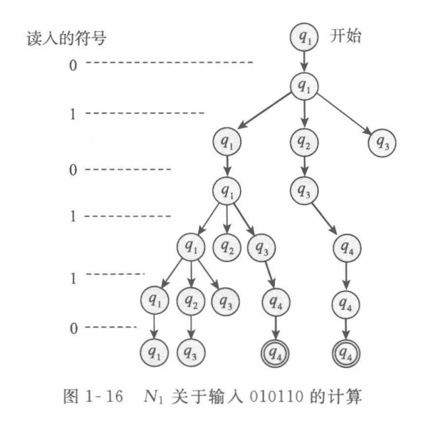
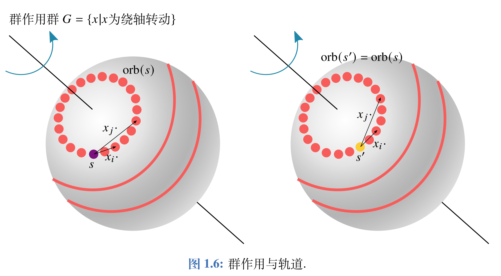

半群的定义(Semigroup)
若运算封闭,满足结合律,则称$[S,*]$是一个半群
1. 运算封闭: $\forall a,b\in S, a*b\in S$
2. 结合律: $\forall a,b,c\in S, (a*b)*c=a*(b*c)$

递归地定义$x_1x_2\cdots x_n=(x_1x_2\cdots x_{n-1})x_n$
其中有$x^0=e, x^n=\underbrace{x\cdots x}_{n\text{个}}(n\ge1)$

定理
半群满足广义结合律,即 $x_1\cdots x_n\cdot y_1\cdots y_m=(x_1\cdots x_n)(y_1\cdots y_m)$
对m进行归纳证明:当m=1时,有$x_1\cdots x_ny_1=(x_1\cdots x_n)(y_1)$,成立
现假设当n=k时,结论成立,则当n=k+1时,有
$
x_1\cdots x_n\cdot y_1\cdots y_k\cdot y_{k+1} \\
=(x_1\cdots x_n\cdot y_1\cdots y_k)\cdot y_{k+1} \\
=(x_1\cdots x_n)(y_1\cdots y_k)\cdot y_{k+1}  \\
=(x_1\cdots x_n)(y_1\cdots y_k\cdot y_{k+1})
$  
得证,所以可以任意添加括号

   

幺半群的定义(Monoid)
若运算封闭,满足结合律,存在单位元,则称$[S,*]$是一个幺半群
1. 运算封闭: $\forall a,b\in S, a*b\in S$
2. 结合律: $\forall a,b,c\in S, (a*b)*c=a*(b*c)$
3. 单位元: $\exists e\in S, \forall a\in S, a*e=e*a=a$

单位元唯一: $e_1=e_1e_2=e_2$

 

子幺半群的定义(Submonoid)
已知$[S,*]$是一个幺半群且$T\subseteq S$,
若运算封闭,单位元保持,则称$[T,*]$是一个子幺半群
1. 运算封闭: $\forall a,b\in T, a*b\in T$
2. 单位元: $e_S\in T$

$\implies$结合律: $\forall a,b,c\in T\implies a,b,c\in S\implies (a*b)*c=a*(b*c)$

 

生成子幺半群的定义(Generated Submonoid)
已知$[S,*]$是一个幺半群且$A\subseteq S$,
将所有包含A的子幺半群的交集,称为A生成的子幺半群,记为$\lang A\rang$
$\lang A\rang=\bigcap\{T|A\subseteq T\land T是子幺半群\}$$\implies$
1. 运算封闭: $\forall a,b\in \lang A\rang\implies a,b\in\forall T_i\implies a*b\in\forall T_i\implies a*b\in \lang A\rang$
2. 结合律: $\forall a,b,c\in \lang A\rang\implies a,b,c\in\forall T_i\implies (a*b)*c=a*(b*c)$
3. 单位元: $e_S\in\forall T_i\implies e_S\in\lang A\rang$

故$\lang A\rang$是包含了A的最小子幺半群

 

幺半群同态的定义(Monoid Homomorphism)
已知$[S,\cdot],[T,*]$是两个幺半群,有映射$f:S\to T$
若运算保持,单位元保持,则称f是一个幺半群同态
1. 正向运算保持: $\forall a,b\in S, f(a\cdot b)=f(a)*f(b)$
2. 正向单位元保持: $f(e_S)=e_T$

 

幺半群同构的定义(Monoid Isomorphism)
已知$[S,\cdot],[T,*]$是两个幺半群,有映射$f:S\to T$
若运算保持,单位元保持,且f是双射,则称f是一个幺半群同态
1. 正向运算保持: $\forall a,b\in S, f(a\cdot b)=f(a)*f(b)$
2. 正向单位元保持: $f(e_S)=e_T$
3. 满足双射: $S \leftrightarrow T,f(a_S)=a_T,f^{-1}(a_T)=a_S$

$\implies$反向运算保持: $\forall a_T,b_T\in T, f^{-1}(a_T*b_T)=f^{-1}(a_T)\cdot f^{-1}(b_T)$
$\forall a_T,b_T\in T,\exist a_S=f^{-1}(a_T),\exist b_S=f^{-1}(b_T)\\
\therefore f(a_S\cdot b_S)=f(a_S)*f(b_S)\\
\therefore a_S\cdot b_S=f^{-1}(f(a_S)*f(b_S))=f^{-1}(a_T*b_T)\\
\therefore f^{-1}(a_T*b_T)=a_S\cdot b_S=f^{-1}(a_T)\cdot f^{-1}(b_T)\ \Box$
$\implies$反向单位元保持: $f^{-1}(e_T)=e_S$

   

群的定义(Group)
若运算封闭,满足结合律,存在单位元,且每个元素都有逆元,则称$[S,*]$是一个群
1. 运算封闭: $\forall a,b\in S, a*b\in S$
2. 结合律: $\forall a,b,c\in S, (a*b)*c=a*(b*c)$
3. 单位元: $\exists e\in S, \forall a\in S, a*e=e*a=a$
4. 逆元: $\forall a\in S, \exists a^{-1}\in S, a*a^{-1}=a^{-1}*a=e$

逆元唯一: $a_1^{-1}=a_1^{-1}e=a_1^{-1}(aa_2^{-1})=(a_1^{-1}a)a_2^{-1}=ea_2^{-1}=a_2^{-1}$
多元取逆: $(a\cdot b)^{-1}=b^{-1}\cdot a^{-1}$

 

已知$[S,*]$是一个幺半群
令G是其所有可逆元素构成的子集,则$[G,*]$是一个群
1. 运算封闭: $\forall a,b\in G\implies a^{-1},b^{-1}\in S\implies b^{-1}*a^{-1}=(a*b)^{-1}\in S\implies a*b\in G$
2. 结合律: $\forall a,b,c\in G\implies a,b,c\in S\implies (a*b)*c=a*(b*c)$
3. 单位元: $e^{-1}=e\implies e\in G$
4. 逆元: $\forall a\in G\implies a^{-1}\in G$

 

n阶一般线性群的定义(General Linear Group)
由n*n可逆实矩阵构成的乘法群,称为实数上的n阶一般线性群,记为$[GL(n,\mathbb{R}),\cdot]$
$GL(n,\mathbb{R})=\{A|A\in M(n,\mathbb{R})\land \det(A)\neq0\}$

n阶特殊线性群的定义(Special Linear Group)
由n*n行列式为1的实矩阵构成的乘法群,称为实数上的n阶特殊线性群,记为$[SL(n,\mathbb{R}),\cdot]$
$SL(n,\mathbb{R})=\{A|A\in M(n,\mathbb{R})\land \det(A)=1\}$

 

子群的定义(Subgroup)
已知$[S,*]$是一个群且$T\subseteq S$,
若运算封闭,单位元保持,逆运算保持,则称$[T,*]$是一个子群,记为T<S
1. 单位元: $e_S\in T$
2. 运算封闭: $\forall a,b\in T, a*b\in T$
3. 逆元: $\forall a\in T, a^{-1}\in T$

$2,3\iff \forall a,b\in H,a*b^{-1}\in H$
$\implies$结合律: $\forall a,b,c\in T\implies a,b,c\in S\implies (a*b)*c=a*(b*c)$

 

群同态的定义(Group Homomorphism)
已知$[S,\cdot],[T,*]$是两个群,有映射$f:S\to T$
若运算保持,则称f是一个群同态
1. 正向运算保持: $\forall a,b\in S, f(a\cdot b)=f(a)*f(b)$

$\implies$ 正向单位元保持: $f(e_S)=e_T$
$e_S=e_S\cdot e_S\implies f(e_S)=f(e_S\cdot e_S)=f(e_S)*f(e_S)\implies e_T=f(e_S)*f^{-1}(e_T)=[f(e_S)*f(e_S)]*f^{-1}(e_T)=f(e_S)$
$\implies$ 逆元保持: $\forall a\in S, f(a^{-1})=f(a)^{-1}$
$e_T=f(e_S)=f(a*a^{-1})=f(a)*f(a^{-1})$
$e_T=f(e_S)=f(a^{-1}*a)=f(a^{-1})*f(a)$

 

代数结构.png)
群同态的核与像的定义(Kernel and Image of Group Homomorphism)
已知群同态$f:[S,\cdot]\to[T,*]$,
$\ker(f)=\{a\in S|f(a)=e_T\}\subseteq S$ 称为f的核
$im(f)=\{f(a)|a\in S\}\subseteq T$ 称为f的像(值域)
核是定义域的子群:
1. 单位元: $f(e_S)=e_T\implies e_S\in \ker(f)$
2. $\forall x,y\in\ker(f),f(xy^{-1})=f(x)*f(y^{-1})=f(x)*f(y)^{-1}=e_Te_T^{-1}=e_T$

像是培域的子群:
1. 单位元: $e_T=f(e_S)\in im(f)$
2. $\forall a_T=f(a),b_T=f(b)\in im(f),ab^{-1}\in S\implies a_T*b_T^{-1}=f(a)*f(b)^{-1}=f(ab^{-1})\in im(f)$

 

满同态和单同态的定义(Surjective Homomorphism and Injective Homomorphism)
已知群同态$f:[S,\cdot]\to[T,*]$,
如果f是满射,则称f是满同态
如果f是单射,则称f是单同态

定理
f是单同态,当且仅当$\ker(f)=\{e_S\}$
$\implies$: 因为单射,所以$f(x)=e_T\implies x=e_S\implies\ker(f)=\{e_S\}$
$\impliedby$: $\forall a,b\in G,f(a)=f(b)\implies f(a)f(b)^{-1}=f(b)f(b)^{-1}=e_T\implies f(ab^{-1})=e_T$
因为$\ker(f)=\{e_S\}$,所以$f(ab^{-1})=e_T\implies ab^{-1}=e_S\implies a=b$,得证

 

群同构的定义(Group Isomorphism)
已知$[S,\cdot],[T,*]$是两个群,有映射$f:S\to T$
若运算保持,且f是双射,则称f是一个群同构

 

群的直积(Direct Product of Groups)
已知$[S,\cdot_S],[T,\cdot_T]$是两个群
构造S和T的直积,记为$[S\times T,*]$
$(a_S,a_T)*(b_S,b_T)=(a_S\cdot_S b_S,a_T\cdot_T b_T)$
1. 运算封闭: $a_S\cdot_S b_S\in S,a_T\cdot_T b_T\in T\implies (a_S\cdot_S b_S,a_T\cdot_T b_T)\in S\times T$
2. 结合律: 逐坐标有结合律,故整体也有结合律
3. 单位元: $(e_S,e_T)\in S\times T$
4. 逆元: $(a_S,a_T)^{-1}=(a_S^{-1},a_T^{-1})\in S\times T$

族群的直积(Direct Product of Family of Groups)
已知$[G_i,\cdot_i]$是一族群,其中$i\in I$
构造$G_i$的直积,记为$[\prod_{i\in I}G_i,*]$
$(x_i)_{i\in I} * (y_i)_{i\in I}=(x_i\ \cdot_i\ y_i)_{i\in I}$

 

族群直积的投影(Projection of Direct Product of Family of Groups)
$p_j((x_i)_{i\in I})=x_j:[\prod_{i\in I}G_i,*]\to [G_j,\cdot_j]$

   

有限群的定义(Finite Group)
若群的元素个数有限,则称该群是有限群

元素的阶的定义(Order of Element)
使得$a^n=e$成立的最小正整数n,称为a的阶,记为$|a|$
若这样的n不存在,则$|a|=\infty$

定理
若$[G,\cdot]$是有限群,则$\forall a\in G,|a|<\infty$
证明: 对于$a^1,a^2,\cdots,a^{|G|}$,
若$\forall a^i\neq a^j$,则$G=\{a^1,a^2,\cdots,a^{|G|}\}\implies \exists a^k=e$
否则存在$i>j,a^i=a^j\implies a^{i-j}=e$,得证

 

定义$\forall n\in\mathbb{N^+},x^{-n}=(x^{-1})^n$

已知$[G,\cdot]$是一个群,且$x\in G$
则$f:[\mathbb{Z},+]\to [G,\cdot]:f(n)=x^n$是一个群同态
证明: $f(n+m)=x^{n+m}=x^n\cdot x^m=f(n)\cdot f(m)$

 

元素x的生成群的定义(Generated Group of Element)
已知$[G,\cdot]$是一个群,且$x\in G$
则$\lang x\rang=\{x^n|n\in\mathbb{Z}\}$称作元素x的生成群
证明: 因为$f(n)=x^n$是一个群同态,所以$f$的像$\lang x\rang$也是群

 

子集S的生成群的定义(Generated Group of Set)
已知$[G,\cdot]$是一个群,且$S\subseteq G$
将所有包含S的子群的交集,称为子集S的生成群,记为$\lang S\rang$
$\lang S\rang=\bigcap\{H|S\subseteq H\land H是子群\}$$\implies$
1. 运算封闭: $\forall a,b\in \lang S\rang\implies a,b\in\forall H_i\implies a*b\in\forall H_i\implies a*b\in \lang S\rang$
2. 结合律: $\forall a,b,c\in \lang S\rang\implies a,b,c\in\forall H_i\implies (a*b)*c=a*(b*c)$
3. 单位元: $e_S\in\forall H_i\implies e_S\in\lang S\rang$
4. 逆元: $\forall a\in \lang S\rang\implies a^{-1}\in\forall H_i\implies a^{-1}\in\lang S\rang$

故$\lang S\rang$是包含了S的最小子群

 

循环群的定义(Cyclic Group)
已知$[G,\cdot]$是一个群,且$\exists x\in G,\lang x\rang=G$
则称G是一个循环群,称x是G的一个生成元

定理
已知$[G,\cdot]$是一个群,则 $\lang x\rang=\lang\{x\}\rang$
证明: 因为$\lang x\rang$是包含了$\{x\}$的子群,所以$\lang x\rang\supseteq\lang\{x\}\rang$
又因为对于任何子群H,$H\supseteq\{x\}\implies \forall n\in\mathbb{N^+}, x^n\in H,(x^n)^{-1}=x^{-n}\in H,x^0=e\in H$
所以有 $\lang x\rang\subseteq\lang\{x\}\rang$,故$\lang x\rang=\lang\{x\}\rang$

 

已知$[G,\cdot]$是有限循环群,且$|x|=n$,则$G=\{e,x,x^2,\cdots,x^{n-1}\}$,阶数为n
证明: $\forall x^m,m=qn+r,x^m=x^{qn+r}=x^{qn}x^r=e^qx^r=x^r,r\in[0,n-1]$
$\forall i>j\in[0,n-1],x^i=x^j\implies x^{i-j}=e\implies i-j=0\implies i=j$

$C_4$循环群的乘法表
| $[C_4,\cdot]$ |  $e$  |  $x$  | $x^2$ | $x^3$ |
| :-----------: | :---: | :---: | :---: | :---: |
|      $e$      |  $e$  |  $x$  | $x^2$ | $x^3$ |
|      $x$      |  $x$  | $x^2$ | $x^3$ |  $e$  |
|     $x^2$     | $x^2$ | $x^3$ |  $e$  |  $x$  |
|     $x^3$     | $x^3$ |  $e$  |  $x$  | $x^2$ |

 

定理
所有的n阶循环群,互相同构
证明: 已知$S=\lang x\rang,T=\lang y\rang$是n阶循环群,
则存在同构映射$f:S\leftrightarrow T:f(x^m)=y^m,f^{-1}(y^m)=x^m$

 

已知$[G,\cdot]$是无限循环群,则$G=\{e\}\cup\{x,x^2,\cdots\}\cup\{x^{-1},x^{-2},\cdots\}$
即$\forall i,j\in\mathbb{Z},x^i\neq x^j$,且G只有两个生成元 $x,x^{-1}$
证明: $\forall i,j\in\mathbb{Z},x^i=x^j\implies x^{i-j}=e\implies i-j=0\implies i=j$
如果$x^n$可以生成G,则$\forall i\in\mathbb{Z},x^i=(x^n)^{i/n}\implies n|i\implies n=\pm1$

 

定理
所有的无限循环群,互相同构
证明: 已知$S=\lang x\rang,T=\lang y\rang$是无限循环群,
则存在同构映射$f:S\leftrightarrow T:f(x^m)=y^m,f^{-1}(y^m)=x^m$

 

已知$G=\lang x\rang$是n阶循环群群,则 $|x^m|=\frac{n}{\gcd(n,m)},1\le m\le (n-1)$
证明: 要得到使得$(x^m)^k=x^{mk}=e$成立的最小正整数k,则mk要为m和n的最小公倍数
$mk=lcm(m,n)\implies k=\frac{lcm(m,n)}{m}=\frac{mn}{\gcd(m,n)m}=\frac{n}{\gcd(m,n)}$

   

群的阶数的定义(Order of Group)
群的元素个数称为群的阶数,记为$|G|$
若是无限群,则$|G|=\infty$

 

左陪集的定义(Left Coset)
也就是划分块的定义
已知G是一个群,H是G的一个子群,且$a\in G$
则$aH=\{ah|h\in H\}$称为a在H中的左陪集

定理
每个划分块等大
陪集映射$f:H\to aH$是双射,且$|H|=|aH|$
证明: $ax=ay\iff a^{-1}ax=a^{-1}ay\iff x=y$

每个划分块互不相交
$\forall a,b\in G\implies (aH=bH)\lor (aH\cap bH=\varnothing)$
证明: $aH\cap bH\neq\varnothing\implies \exists ah_1=bh_2\implies a=bh_2h_1^{-1}, b=ah_1h_2^{-1}$
$\forall ah\in aH,ah=(bh_2h_1^{-1})h=b(h_2h_1^{-1}h)\in bH\implies aH\subseteq bH$
$\forall bh\in bH,bh=(ah_1h_2^{-1})h=a(h_1h_2^{-1}h)\in aH\implies bH\subseteq aH$
$(aH\subseteq bH)\land (bH\subseteq aH)\implies aH=bH$

群由这些划分块所组成
$G=\bigcup_{a\in G}aH$
证明: $\forall g\in G,\exists e\in H,g=ge\in gH\implies G\subseteq\bigcup_{a\in G}aH$
$\forall ah\in aH\implies ah\in G\implies aH\subseteq G\implies \bigcup_{a\in G}aH\subseteq G$
$(G\subseteq\bigcup_{a\in G}aH)\land (\bigcup_{a\in G}aH\subseteq G)\implies G=\bigcup_{a\in G}aH$

 

代数结构-1.png)
商集的定义(Quotient Set)
也就是划分块集的定义
已知G是一个群,H是G的一个子群
则$G/H=\{aH|a\in G\}$称为G关于H的商集
划分块数称为H在G中的指数,记为$[G:H]$

 

Lagrange定理(Lagrange's Theorem)
群的大小=划分块数$\times$每个划分块的大小
已知G是一个群,H是G的一个子群
则$|G|=[G:H]\cdot|H|$

 

定理
$xH=H\iff x\in H$
$\implies$: $(x\in xH)\land(xH=H)\implies x\in H$
$\impliedby$: $x\in H\implies xH=\{xh|h\in H\}\subseteq H$
$x\in H\implies x^{-1}\in H\implies x^{-1}H\subseteq H\implies H\subseteq xH$
$(xH\subseteq H)\land(H\subseteq xH)\implies xH=H$

推论
划分块内部的等价关系--同陪集关系$x\doteq y\iff y^{-1}x\in H$
$xH=yH\iff y^{-1}xH=H\iff y^{-1}x\in H$

证明 同陪集关系 是 等价关系
1. 自反: $x^{-1}x=e\in H$
2. 对称: $x^{-1}y\in H\implies (x^{-1}y)^{-1}=y^{-1}x\in H$
3. 传递: $x^{-1}y\in H,y^{-1}z\in H\implies (x^{-1}y)(y^{-1}z)=x^{-1}z\in H$

 

定理
群G被群H细分,群H又被群K细分,则群G被群K细细分
已知$K<H<G$,则$[G:K]=[G:H]\cdot[H:K]$
$G/H=\{g_1H,g_2H,\cdots,g_mH\}, \forall g_iH\cap g_jH=\varnothing$
$H/K=\{h_1K,h_2K,\cdots,h_nK\}, \forall h_iK\cap h_jK=\varnothing$
$G/K=\left\{\begin{array}{l}
      g_1h_1K,g_1h_2K,\cdots,g_1h_nK, \\
      g_2h_1K,g_2h_2K,\cdots,g_2h_nK, \\
      \cdots \\
      g_mh_1K,g_mh_2K,\cdots,g_mh_nK
\end{array}\right\}$
证明: 
1. 欲证明$\bigcup g_ih_jK=G/K$:
由于G被H划分,所以$\forall g\in G,\exists g_i\in G,g\in g_iH$
又由于H被K划分,所以$\forall h\in H,\exists h_j\in H,h\in h_jK$
所以$\forall aG\in G/K,aG=g_ihK=g_ih_jkK$
因为$xH=H\iff x\in H$
所以$g_ih_jkK=g_ih_jK$,得证

2. 欲证明$g_ih_jK=g_ah_bK\implies (g_i=g_a)\land(h_j=h_b)$:
$g_ih_jK=g_ah_bK\implies g_ih_jKH=g_ah_bKH$
因为$k_j,h_b,K\in H$,并且有$xH=H\iff x\in H$
所以$g_ih_jKH=g_ah_bKH\implies g_iH=g_aH\implies g_i=g_a$
故$g_ih_jK=g_ah_bK\implies h_jK=h_bK\implies h_j=h_b$,得证

   

群G上有子群H
子群及其左陪集,构成 等大的 划分块集$G/H=\{H,g_2H,\cdots,g_hH\}$
其中划分块数(指数)记为$[G:H]$
这些划分块集,对应的等价关系是 同陪集关系$x\doteq y\iff xy^{-1}\in H$
满足 自反,对称,传递

如果要想让 划分块集 变成 划分块群
即 定义 划分块集 上面的 运算
那么就要求 子群 是 正规子群

群 到 划分块群 的 映射 是群同构
每个群同构 都可以视为 从 群 到 划分块群 的映射

   

正规子群的定义(Normal Subgroup)
让划分块集 能够进行运算成为 划分块群
$(N<G)\land(\forall a\in G,aN=Na)\implies N\lhd G$

正规子群 所细分出的 划分块集上的 运算
$N\lhd G,\forall a,b\in G,(aN)\cdot(bN)=(ab)N$是良定义的
证明: 由于陪集的表达式不唯一,所以需要证明 对于相同陪集的 任意表达式 都成立
假设有$aN=a'N,bN=b'N$, 则要证明$abN=a'b'N\iff (ab)^{-1}(a'b')N=N\iff (ab)^{-1}(a'b')\in N\iff b^{-1}a^{-1}a'b'\in N\iff b^{-1}a^{-1}a'b'\in b^{-1}Nb=N\iff a^{-1}a'\in N\iff aN=a'N$,得证

商群的定义(Quotient Group)
也就是划分块群的定义
商群$[G/N,\cdot]$,单位元是$eN$,逆元是$(aN)^{-1}=a^{-1}N$
运算是$(aN)\cdot(bN)=(ab)N$
1. 封闭性: $aN,bN\in G/N\implies (ab)N\in G/N$
2. 结合律: $(aN\cdot bN)\cdot cN=(ab)N\cdot cN=(abc)N=aN\cdot(b\cdot c)N=aN\cdot(bN\cdot cN)$
3. 单位元: $aN\cdot eN=aN=eN\cdot aN$
4. 逆元: $(aN)^{-1}=a^{-1}N\implies aN\cdot a^{-1}N=eN=a^{-1}N\cdot aN$

最粗整的商群是$G/G=\{G\}$
最细分的商群是$G/\{e\}=\{ \{g_1\},\{g_2\},\cdots,\{g_{|G|}\} \}$

 

正规子群判别的等价条件
$N\lhd G\iff \forall a\in G,\forall n\in N,ana^{-1}\in N$
$N\lhd G\iff aN=Na \iff \left\{\begin{aligned}
      aN\subseteq Na \\
      Na\subseteq aN
\end{aligned}\right. \iff \left\{\begin{aligned}
      aNa^{-1}\subseteq N \\
      a^{-1}Na\subseteq N
\end{aligned}\right. \iff \forall n\in N,\left\{\begin{aligned}
      ana^{-1}\in N \\
      a^{-1}na\in N
\end{aligned}\right.\land(a\in G\implies a^{-1}\in G) \iff \forall a\in G,n\in N,ana^{-1}\in N$

 

 

群同构第一定理(First Isomorphism Theorem)
每个群同态 都可以视为 群->划分块群 的映射
即$a\to f(a)\iff a\to a\cdot\ker(f)\implies f(a)\cong a\cdot\ker(f)$
对于群同态$f:G\to G'$,有$\ker(f)\lhd G$和$G/\ker(f)\cong im(f)$

先证明$\ker(f)\lhd G$: $\forall a\in G,n\in\ker(f),f(ana^{-1})=f(a)f(n)f(a^{-1})=f(a)e'f(a)^{-1}=e'\implies ana^{-1}\in\ker(f)\implies \ker(f)\lhd G$

定义映射$\hat{f}:G/\ker(f)\to im(f):\hat{f}(aN)=f(a)$, 其中$N=\ker(f)$
1. 映射良定义: $aN=bN\implies b^{-1}a\in N\implies f(b^{-1}a)=e'\implies f(b)^{-1}f(a)=e'\implies f(a)=f(b)$
2. 映射同态: $\hat{f}(aN\cdot bN)=\hat{f}(abN)=f(ab)=f(a)f(b)=\hat{f}(aN)\cdot\hat{f}(bN)$
3. 映射满射: $\forall a'\in im(f),\exists a\in G,f(a)=a'\implies \hat{f}(aN)=f(a)=a'$
4. 映射单射: $\hat{f}(aN)=\hat{f}(bN)\implies f(a)=f(b)\implies f(b^{-1}a)=e'\implies b^{-1}a\in N\implies aN=bN$

综上所述, $\hat{f}:G/\ker(f)\to im(f)$是一个群同构

 

引理
已知$N\lhd G,H<G$, 则$HN$还是G的子群
1. 单位元: $e\in H,e\in N\implies e\cdot e=e\in HN$
2. 运算封闭: $\forall h_1n_1,h_2n_2\in HN,\exists h_1n_1h_2n_2$
因为N是正规子群,所以$Nh_2=h_2N\implies \exists n_1'\in N,n_1h_2=h_2n_1'$
所以$h_1(n_1h_2)n_2=h_1(h_2n_1')n_2=(h_1h_2)(n_1'n_2)\in HN$
3. 逆元: $\forall hn\in HN,(hn)^{-1}=n^{-1}h^{-1}\in NH=HN$

群同构第二定理(Second Isomorphism Theorem)
已知$N\lhd G,H<G$, 则$f(h)=hN$是群同态, 且$\ker(f)=H\cap N$
也就是说$\left\{\begin{aligned}
      HN &< G \\
      H\cap N&\lhd H \\
      N&\lhd HN
\end{aligned}\right.,H/(H\cap N)\cong HN/N$

先证明$HN<G$: 由引理可知,得证

再证明$H\cap N\lhd H$: $\forall h\in H,x\in H\cap N\implies hxh^{-1}\in H\land hxh^{-1}\in N\implies hxh^{-1}\in H\cap N\implies H\cap N\lhd H$

接着证明$N\lhd HN$: $\forall hn\in HN,\hat{n}\in N\implies hn\hat{n}(hn)^{-1}=hn\hat{n}n^{-1}h^{-1}\in hNh^{-1}=N\implies N\lhd HN$

定义映射$f:H\to HN/N:f(h)=hN$
映射同态: $f(h_1h_2)=h_1h_2N=h_1Nh_2N=f(h_1)f(h_2)$
且$\ker(f)=\{h\in H|f(h)=hN=N\iff h\in N\land h\in H\}=H\cap N$
由群同构第一定理知, $H/(H\cap N)\cong im(f)=H/N=HN/N$

 

群同构第三定理(Third Isomorphism Theorem)
已知$M\lhd G,N\lhd G,M<N$, 则$f(gM)=gN$是群同态, 且$\ker(f)=N/M$
这里如果令$M=\{e\},g\to h$, 就变成了第二定理
也就是说,$N/M\lhd G/M$, 且$\frac{(G/M)}{(N/M)}\cong G/N$
证明方法与第二定理类似

   

置换群的定义(Permutation Group)
所有从 S到自身的双射 构成的群,称为S上的置换群,记为$[Perm(S),\circ]$
$Perm(S)=\{f:S\leftrightarrow S\}$
1. 运算封闭: 双射经过复合运算后还是双射
2. 结合律: 映射的复合运算满足结合律
3. 单位元: 恒等映射
4. 逆元: 双射存在逆映射

定义左乘运算$\phi_a(y)=ay:G\to G$,可知$\phi_a\in Perm(G)$,证明:
1. 单射: $\phi_a(x_1)=\phi_a(x_2)\implies ax_1=ax_2\implies x_1=x_2$
2. 满射: $\forall y\in G,\exists x=a^{-1}y\implies \phi_a(x)=a(a^{-1}y)=y$

定义从 元素 到 左乘运算 的映射$\phi:G\to Perm(G):\phi(a)=\phi_a$是群同态:
正向运算保持: $(\phi_x\circ\phi_y)(a)=\phi_x(\phi_y(a))=x\cdot(y\cdot a)=(x\cdot y)\cdot a=\phi_{x\cdot y}(a)$
$\implies \phi_x\circ\phi_y=\phi_{x\cdot y}\implies \phi(x)\circ\phi(y)=\phi(x\cdot y)$

  

群作用的定义(Group Action)
既是 元素到映射的 群同态, 同时这个映射又是双射
每个 $g\in G$ 都对应一种 双射操作, 即$S\overset{g\in G}{\leftrightarrow}S$
已知群G,集合S,如果$\phi:G\to Perm(S)$是一个群同态,则称$\phi$是G在S上的群作用

实例
共轭作用的定义(Conjugation Action)
$\phi:G\to Perm(G):\phi_x(y)=xyx^{-1}$是一个群作用
1. 群同态: $(\phi_x\circ\phi_y)(a)=\phi_x(\phi_y(a))=x(yay^{-1})x^{-1}=(xy)a(xy)^{-1}=\phi_{xy}(a)\implies \phi_{xy}=\phi_x\circ\phi_y$
2. 双射: $(\phi_x\circ\phi_{x^{-1}})(a)=x(x^{-1}ax)x^{-1}=e\cdot a\cdot e=a$
$(\phi_{x^{-1}}\circ\phi_x)(a)=x^{-1}(xax^{-1})x=(x^{-1}x)a(x^{-1}x)=e\cdot a\cdot e=a$
$\implies (\phi_x)^{-1}=\phi_{x^{-1}}$

共轭映射不仅仅是双射, 而且还是群同构
$\phi_a(xy)=axya^{-1}=(axa^{-1})(aya^{-1})=\phi_a(x)\phi_a(y)$

 

群作用 的等价条件
将$\phi_x(a)$记为$x\cdot a$, 则有
1. 群同态: $x\cdot(y\cdot a)=(x\cdot y)\cdot a$
2. 双射: $e\cdot a=a$

证明: 
1. 群同态: $(\phi_x\circ\phi_y)(a)=\phi_x(\phi_y(a))=x\cdot(y\cdot a)=(x\cdot y)\cdot a=\phi_{x\cdot y}(a)\implies \phi_{x\cdot y}=\phi_x\circ\phi_y$
2. 双射: $(\phi_x\circ\phi_{x^{-1}})(a)=x\cdot(x^{-1}\cdot a)=(x\cdot x^{-1})\cdot a=e\cdot a=a$
$(\phi_x^{-1}\circ\phi_x)(a)=x^{-1}\cdot(x\cdot a)=(x^{-1}\cdot x)\cdot a=e\cdot a=a$
$\implies (\phi_x)^{-1}=\phi_{x^{-1}}$

 

 

轨道和稳定子的定义(Orbit and Stabilizer)
已知群作用$\phi:G\to Perm(S)$,则
s的轨道: $Orb(s)=\{x\cdot s|x\in G\}$
s的稳定子: $Stab(s)=\{x\in G|x\cdot s=s\}$

轨道要么相等,要么不相交
$Orb(a)\cap Orb(b)=s\implies \exists x,y\in G,s=xa=yb\implies (a=x^{-1}yb)\land (b=y^{-1}xa)\implies Orb(a)=Orb(b)$

稳定子是G的子群,即$Stab(s)<G$
1. 单位元 $e\cdot s=s$
2. 运算封闭 $x,y\in Stab(s)\implies (xy)\cdot s=x\cdot(y\cdot s)=x\cdot s=s$
3. 逆元 $x\cdot s=s\implies s=(x^{-1})\cdot s\implies x^{-1}\in Stab(s)$

$xs=ys\iff s=x^{-1}ys\iff x^{-1}y\in Stab(s)$

轨道-稳定子定理(Orbit-Stabilizer Theorem)
存在双射$f:G/Stab(s)\leftrightarrow Orb(s):f(xStab(s))=x\cdot s$
且$|G|=|Stab(s)|\cdot|Orb(s)|$

   

带余除法的定义(Division Algorithm)
已知$m\in\mathbb{Z},n\in\mathbb{N^+}$,则$\exists q,r\in\mathbb{Z},0\le r<n, m=qn+r$
如果$r=0$,则称n能整除m,记为$n|m$

$\forall n\in\mathbb{Z}, [n\mathbb{Z},+]\lhd[\mathbb{Z},+]$
1. 单位元 0
2. 运算封闭 $na,nb\in n\mathbb{Z}\implies na+nb=n(a+b)\in n\mathbb{Z}$
3. 逆元 $na\in n\mathbb{Z}\implies n(-a)\in n\mathbb{Z}$
4. 正规 满足加法交换律

同余的定义(Congruence Modulo)
$a\%n=b\%n\iff a\equiv b\pmod{n}$

同余类的定义(Congruence Class)
$\forall n\in\mathbb{N^+},\mathbb{Z_n}=\mathbb{Z}/n\mathbb{Z}=\{0+n\mathbb{Z},1+n\mathbb{Z},\cdots,(n-1)+n\mathbb{Z}\}$
$\mathbb{Z_n}$中的陪集称为模n的同余类

所有n阶循环群,同构于$\mathbb{Z_n}$
证明: $\mathbb{Z_n}=\lang 1+n\mathbb{Z}\rang$

  

$[\mathbb{Z_n},\cdot]$是幺半群
1. 封闭性: $a+n\mathbb{Z},b+n\mathbb{Z}\in\mathbb{Z_n}\implies (a+n\mathbb{Z})\cdot(b+n\mathbb{Z})=(ab)+n\mathbb{Z}\in\mathbb{Z_n}$
2. 结合律 满足乘法结合律
3. 单位元 $(1+n\mathbb{Z})(a+n\mathbb{Z})=(a+n\mathbb{Z})(1+n\mathbb{Z})=a+n\mathbb{Z}$

可逆同余乘法群的定义(Multiplicative Group of Congruence)
$\mathbb{Z_n}^*$定义为$[\mathbb{Z_n},\cdot]$中所有可逆元素构成的群
$\mathbb{Z_n}^*=\{k+n\mathbb{Z}|(0\le k<n)\land(\exists m\in\mathbb{Z_n},km\equiv 1\pmod n)\}$

欧拉函数的定义(Euler's Function)
$\varphi(n)$是 小于等于n的正整数中, 与n互质的数的个数
$\varphi(n)=Card\{x|(1\le x\le n)\land\gcd(x,n)=1\}$

|   +   |   1   |   2   |   3   |   4   |   5   |   6   |   7   |   8   |   9   |  10   |
| :---: | :---: | :---: | :---: | :---: | :---: | :---: | :---: | :---: | :---: | :---: |
|  0x   |   1   |   1   |   2   |   2   |   4   |   2   |   6   |   4   |   6   |   4   |
|  10x  |  10   |   4   |  12   |   6   |   8   |   8   |  16   |   6   |  18   |   8   |

定理
$\mathbb{Z_n}^*$由那些与n互质的余数构成
$\mathbb{Z_n}^*=\{k+n\mathbb{Z}|(0\le k<n)\land(\gcd(k,n)=1)\}$
则$|\mathbb{Z_n}^*|=\varphi(n)$
只需证明: $\exists m\in\mathbb{Z_n},km\equiv 1\pmod n$ $\iff$ $\gcd(k,n)=1$
$\exists m\in\mathbb{Z_n},km\equiv 1\pmod n$
$\iff \exists m\in\mathbb{Z_n},\exists q\in\mathbb{Z},km=nq+1\iff km+(-n)q=1$
由Bézout等式可知, $\iff\gcd(k,n)=1$, 得证

$[\mathbb{Z_n}^*,\cdot]=[\{1\le k<n|\gcd(k,n)=1\},\cdot]$
$[\mathbb{Z_p}^*,\cdot]=[\{1,2,\cdots,p-1\},\cdot]$

| $[\mathbb{Z_{12}}^*.\cdot]$ |  $1$  |  $5$  |  $7$  | $11$  |
| :-------------------------: | :---: | :---: | :---: | :---: |
|             $1$             |  $1$  |  $5$  |  $7$  | $11$  |
|             $5$             |  $5$  |  $1$  | $11$  |  $7$  |
|             $7$             |  $7$  | $11$  |  $1$  |  $5$  |
|            $11$             | $11$  |  $7$  |  $5$  |  $1$  |

 

引理
已知有限群G,则$\forall a\in G,a^{|G|}=e$
证明: 由Lagrange定理知, 因为$\lang a\rang$是G的子群, 所以$|\lang a\rang|$整除$|G|$
又因为有$|a|=|\lang a\rang|$, 所以$|a|$整除$|G|$
因此, $a^{|G|}=a^{k|a|}=(a^{|a|})^k=e^k=e$, 得证

费马小定理(Fermat's Little Theorem)
已知p是素数,而$p\nmid a$, 则$a^{p-1}\equiv 1\pmod p$
证明: 如果$a\ge p$,那么就可以写成$a=np+s\iff a^k\equiv s^k\pmod p$
故不失一般性,不妨设$1\le a<p$, 因此$a\in\mathbb{Z_p}^*$
由引理可知,因为$\mathbb{Z_p}^*$是有限群, 所以$a^{|Z_p^*|}=a^{p-1}=e_p\iff a^{p-1}\equiv 1\pmod p$

欧拉定理(Euler's Theorem)
已知$\gcd(a,n)=1$, 则$a^{\varphi(n)}\equiv 1\pmod n$
证明: 不失一般性, 不妨设$1\le a<n$, 因此$a\in\mathbb{Z_n}^*$
由引理可知,因为$\mathbb{Z_n}^*$是有限群, 所以$a^{|Z_n^*|}=a^{\varphi(n)}=e_n\iff a^{\varphi(n)}\equiv 1\pmod n$

威尔逊定理(Wilson's Theorem)
p是一个素数,当且仅当$(p-1)!\equiv -1\pmod p$

证明: 
当n=2时, $(2-1)!\equiv 1\pmod 2$,满足
当n=3时, $(3-1)!\equiv 2\pmod 3$,满足
当n=4时, $(4-1)!\equiv 2\neq3 \pmod 4$,满足
现不妨从$n>4$开始证明:
1. 当n是合数时, 有$(n-1)!\equiv 0\pmod n$
2. 当n是素数时, 有$(n-1)!\equiv -1\pmod n$

首先证明合数的情况:
当n是合数时, 如果可以二分解为$n=ab,2\le a<b\le n-1$,那么$n|(n-1)!$
如果不能二分解, 那么就说明n会是一个素数的平方, 即$n=p^2,(2\le p\le n-1)\land(p\in\mathbb{P})$
因为$n>4$,所以$p>2\implies 2p<p^2=n$,
故$(n-1)!$中有两个因子2p和p,所以$n|(n-1)!$

然后证明素数的情况:
因为此时n是素数,不妨将n记为p
因为$p>4$,所以p是奇素数,$\mathbb{Z_p}^*$中包含p-1(偶数)个元素
因为$a=a^{-1}\iff a^2\equiv 1\pmod p\iff p|(a^2-1)\iff p|(a-1)(a+1)\iff (a=1)\lor (a=p-1)$
所以逆元是自己的元素只有1和p-1,剩下的偶数个元素两两配对相消
因此$(p-1)!=e_p\cdot 1\cdot 2\cdot 3\cdots(p-2)\cdot(p-1)=p-1\equiv -1\pmod p$

|  $n$  | $(n-1)!$  | $(n-1)!\pmod n$ |
| :---: | :-------: | :-------------: |
|   2   |     1     |       1*        |
|   3   |     2     |       2*        |
|   4   |     6     |        2        |
|   5   |    24     |       4*        |
|   6   |    120    |        0        |
|   7   |    720    |       6*        |
|   8   |   5040    |        0        |
|   9   |   40320   |        0        |
|  10   |  362880   |        0        |
|  11   |  3628800  |       10*       |
|  12   | 39916800  |        0        |
|  13   | 479001600 |       12*       |

   

环的定义(Ring)
环$[R,+,\cdot]$满足
1. $[R,+]$是一个阿贝尔群 (加法封闭,结合律,单位元,逆元,交换律)
2. $[R,\cdot]$是一个幺半群 (乘法封闭,结合律,单位元)
3. 左分配律: $a\cdot(b+c)=a\cdot b+a\cdot c$
4. 右分配律: $(a+b)\cdot c=a\cdot c+b\cdot c$

交换环的定义(Commutative Ring)
当R对乘法有交换律时,称R是交换环

零环$[0,+,\cdot]$,当且仅当$0=1$
$\impliedby$: $\forall a\in R,a=a\cdot 1=a\cdot 0=0$

可逆乘法群的定义(Unit Ring)
已知$[R,+,\cdot]$是一个环, 则$[R^*,\cdot]$是由R中所有乘法可逆元素构成的群

除环的定义(Division Ring)
若$R/\{0\}=R^*$,则称R是除环,即所有非零元素都有乘法逆元

域的定义(Field)
可交换的除环,称为域$[F,+,\cdot]$
1. $[F,+]$是一个阿贝尔群 (加法封闭,结合律,单位元,逆元,交换律)
2. $[F/\{0\},\cdot]$是一个阿贝尔群 (乘法封闭,结合律,单位元,逆元,交换律)
3. 乘法对加法有分配律: $a\cdot(b+c)=(b+c)\cdot a=a\cdot b+a\cdot c$

 

子环的定义(Subring)
已知$[R,\cdot]$是一个环且$S\subseteq R$,
若$[S,+]$是$[R,+]$的子群,$[S,\cdot]$是$[R,\cdot]$的子幺半群,
则称$[S,+,\cdot]$是$[R,+,\cdot]$的子环,记为$S<R$
1. 单位元: $0,1\in S$
2. 运算封闭: $\forall a,b\in S,a+b,a\cdot b\in S$
3. 加法逆元: $\forall a\in S,-a\in S$

其中条件1,2可以合并为: $\forall a,b\in S,a-b,a\cdot b\in S$
结合律和乘法分配律可由子环的定义推出

生成子环的定义(Generated Subring)

环的直积的定义(Ring Direct Product)

 

环同态的定义(Ring Homomorphism)
f既是加法的群同态,又是乘法的幺半群同态
1. 乘法单位元: $f(1)=1'$
2. 加法保持: $f(a+b)=f(a)+'f(b)$
3. 乘法保持: $f(a\cdot b)=f(a)\cdot' f(b)$

 

理想的定义(Ideal)
理想一般不会是子环,
因为理想不一定会包含乘法单位元"1"
已知环$[R,+,\cdot]$,而$I\subseteq R$,则

I是R的左理想,当且仅当
1. $[I,+]$是$[R,+]$的子群
2. 零元对乘法的吸收性: $RI=I$

I是R的右理想,当且仅当
1. $[I,+]$是$[R,+]$的子群
2. 零元对乘法的吸收性: $IR=I$

如果I既是左理想,又是右理想,则称I是R的理想,记为$I\lhd R$

 

已知$I\lhd R$,则$I<R$当且仅当$I=R$
$\implies$: $I<R\implies 1\in I\implies RI=IR=R$

 

整数环到同余环的映射$f:\mathbb{Z}\to\mathbb{Z_n}:f(m)=m+n\mathbb{Z}$
则f是环同态,且$\ker(f)=0+n\mathbb{Z}\lhd\mathbb{Z}$
证明环同态:
1. 乘法单位元: $f(1)=1+n\mathbb{Z}=1'$
2. 加法保持: $f(a+b)=(a+b)+n\mathbb{Z}=(a+n\mathbb{Z})+(b+n\mathbb{Z})=f(a)+f(b)$
3. 乘法保持: $f(a\cdot b)=(a\cdot b)+n\mathbb{Z}=(a+n\mathbb{Z})\cdot(b+n\mathbb{Z})=f(a)\cdot f(b)$

证明理想:
1. $[I,+]$是$[R,+]$的子群: 加法单位元,加法封闭,加法逆元
2. 零元对乘法的吸收性: $RI=IR=n\cdot\mathbb{Z}\cdot\mathbb{Z}=n\mathbb{Z}=I$

 

已知环同态$f:R\to R'$,则f的核是R的理想,f的像是R'的子环,即
1. $\ker(f)=\{a\in R|f(a)=0'\}\lhd R$
2. $im(f)=\{f(a)|a\in R\}<R'$

证明$\ker(f)\lhd R$:
1. $[I,+]$是$[R,+]$的子群: 加法单位元,加法封闭,加法逆元
2. 零元对乘法的吸收性: $f(RI)=f(R)f(I)=f(R)0'=0'=0'f(R)=f(I)f(R)=f(IR)\implies (RI=I)\land(IR=I)$

证明$im(f)<R'$:
1. 单位元: $0'=f(0)\in im(f), 1'=f(1)\in im(f)$
2. 加法运算封闭: $a',b'\in im(f)\implies a'=f(a),b'=f(b)\implies a'+b'=f(a)+f(b)=f(a+b)\in im(f)$
3. 乘法运算封闭: $a',b'\in im(f)\implies a'=f(a),b'=f(b)\implies a'\cdot b'=f(a)\cdot f(b)=f(a\cdot b)\in im(f)$
4. 加法逆元: $0'=f(0)=f(a+(-a))=f(a)+f(-a)=a'+f(-a)\implies (-a')=f(-a)\in im(f)$

 

商环的定义(Quotient Ring)
也就是划分块环的定义
已知$I\lhd R$,则商环$R/I=\{a+I|a\in R\}$
商环上的加法和乘法运算:
1. 加法: $(a+I)+(b+I)=(a+b)+I$
2. 乘法: $(a+I)\cdot(b+I)=(a\cdot b)+I$

现欲证明商环$[R/I,+,\cdot]$也是一个环
因为理想对加法构成正规子群,
所以只需证明乘法良定义,乘法幺半群,左右分配律即可
1. 乘法良定义: $a+I=a'+I,b+I=b'+I\implies a-a'\in I,b-b'\in I\implies ab-a'b'=(ab-a'b)+(a'b-a'b')=(a-a')b+a'(b-b')\in IR+RI\subseteq I\implies (ab)+I=(a'b')+I$
2. 乘法幺半群: 乘法单位元,乘法封闭,乘法结合律
3. 左分配律: $(a+I)\cdot((b+I)+(c+I))=(a+I)\cdot((b+c)+I)=a\cdot(b+c)+I=(a\cdot b+a\cdot c)+I=(a\cdot b)+I+(a\cdot c)+I=(a+I)\cdot(b+I)+(a+I)\cdot(c+I)$
4. 右分配律: $((a+I)+(b+I))\cdot(c+I)=(a+b)+I\cdot(c+I)=((a+b)\cdot c)+I=((a\cdot c)+(b\cdot c))+I=(a\cdot c)+I+(b\cdot c)+I=(a+I)\cdot(c+I)+(b+I)\cdot(c+I)$

 

环同构的定义(Ring Isomorphism)
环同态+双射=环同构

环同构第一定理(First Isomorphism Theorem)
每个环同态 都可以视为 环->划分块环 的映射
即$a\to f(a)\iff a\to a+\ker(f)\implies f(a)\cong a+\ker(f)$
已知环同态$f:R\to R'$,则$\ker(f)\lhd R$且$R/\ker(f)\cong im(f)$

只需证明$\hat f:R/\ker(f)\to im(f):\hat f(a+\ker(f))=f(a)$是一个环同构
因为群同构第一定理已经证明过$\hat f$是双射,且对加法是群同态
所以只需证明$\hat f$对乘法是幺半群同态
1. 乘法保持: $\hat f((a+\ker(f))\cdot(b+\ker(f)))=\hat f((ab)+\ker(f))=f(ab)=f(a)f(b)=\hat f(a+\ker(f))\cdot\hat f(b+\ker(f))$
2. 乘法单位元: $\hat f(1+\ker(f))=f(1)=1'$

 

环同构第二定理(Second Isomorphism Theorem)
已知$S<R,I\lhd R$, 则$f(a)=a+I,a\in S$是环同态, 且$\ker(f)=S\cap I$
也就是说$\left\{\begin{aligned}
      S+I &< R \\
      S\cap I&\lhd S \\
      I&\lhd S+I
\end{aligned}\right.,S/(S\cap I)\cong (S+I)/I$

先证明$S+I<R$,即$S+I$是R的 加法子群 和 乘法子幺半群
群同构第二定理中已经证明了$S+I$是R的加法子群,故只需证明乘法
1. 乘法单位元: $1\in S,0\in I\implies 1\in S+I$
2. 乘法封闭: $(S+I)(S+I)=SS+SI+IS+II\subseteq S+I$

再证明$S\cap I\lhd S$,即$S\cap I$是S的 加法子群 且具有 乘法吸收性
群同构第二定理中已经证明了$S\cap I$是S的加法子群,故只需证明乘法吸收性
1. 乘法吸收性: $S(S\cap I)\subseteq SS\cap SI=S\cap I,(S\cap I)S\subseteq SS\cap IS=S\cap I$

接着证明$I\lhd S+I$,即$I$是$S+I$的 加法子群 且具有 乘法吸收性
群同构第二定理中已经证明了$I$是$S+I$的加法子群,故只需证明乘法吸收性
1. 乘法吸收性: $I(S+I)=IS+II=I, (S+I)I=SI+II=I$

最后证明$S/(S\cap I)\cong (S+I)/I$,即$f:S\to (S+I)/I:f(a)=a+I$是环同态
群同构第二定理中已经证明了$\hat f$是满射,对加法是群同态,且$\ker(f)=S\cap I$
故只需证明$f$对乘法是幺半群同态
1. 乘法保持: $f(ab)=ab+I=(a+I)(b+I)=f(a)f(b)$
2. 乘法单位元: $f(1)=1+I$

因此,由环同构第一定理可知, $S/(S\cap I)\cong (S+I)/I$

 

环同构第三定理(Third Isomorphism Theorem)
已知$I\lhd R,J\lhd R,I\subseteq J$, 则$f(a+I)=a+J$是环同态, 且$\ker(f)=J/I$
也就是说,$J/I\lhd R/I$, 且$\frac{(R/I)}{(J/I)}\cong R/J$
证明方法与第二定理类似

   

生成理想的定义(Generated Ideal)
已知环$[R,+,\cdot]$,而$A\subseteq R$,则
由A生成的理想,定义为R中所有包含A的理想的交集
即$(A)=\bigcap \{I\lhd R|A\subseteq I\}$
由A生成的理想还是理想$(A)\lhd R$

主理想的定义(Principal Ideal)
若一个理想是由一个元素生成的,则称为主理想
由a生成的主理想$(a)=(\{a\})$
由$a_1,\cdots,a_n$有限生成的理想$(a_1,\cdots,a_n)=(\{a_1,\cdots,a_n\})$

 

对于交换环有
$(a)=Ra=\{ra|r\in R\}$
$(A)=(a_1,\cdots,a_n)=Ra_1+\cdots+Ra_n=\{a_1r_1+\cdots+a_nr_n|r_1,\cdots,r_n\in R\}$
不妨设$I=Ra_1+\cdots+Ra_n=\{a_1r_1+\cdots+a_nr_n|r_1,\cdots,r_n\in R\}$
则需要证明 I包含A I是理想 I是最小的理想(所有包含A的理想,都会包含I) 

先证明 I包含A:
$0,1\in R\implies \forall a_i=0a_1+\cdots+1a_i+\cdots+0a_n\in I$

再证明 I是理想, 即I是加法子群, 且具有乘法吸收性:
1. 加法单位元: $0=0a_1+\cdots+0a_n\in I$
2. 加法封闭: $(r_1a_1+\cdots+r_na_n)+(s_1a_1+\cdots+s_na_n)=(r_1+s_1)a_1+\cdots+(r_n+s_n)a_n\in I$
3. 加法逆元: $-(r_1a_1+\cdots+r_na_n)=(-r_1)a_1+\cdots+(-r_n)a_n\in I$
4. 乘法吸收性: $R(Ra_1+\cdots+Ra_n)=RRa_1+\cdots+RRa_n=Ra_1+\cdots+Ra_n=I$
$(Ra_1+\cdots+Ra_n)R=(Ra_1)R+\cdots+(Ra_n)R=RRa_1+\cdots+RRa_n=I$

最后证明 I是最小的理想, 即 所有包含A的理想,都会包含I:
不妨设$I'$是一个包含了A的理想, 则$a_i\in I'\implies Ra_i\subseteq I'\implies \sum Ra_i\subseteq I'\implies I\subseteq I'$

 

理想加法的定义(Ideal Sum)
已知$I,J\lhd R$,则$I+J=\{a+b|a\in I,b\in J\}$
且$I+J$也是R的理想,即$I+J\lhd R$
1. 加法子群: 加法单位元,加法封闭,加法逆元
2. 乘法吸收性: $R(I+J)=RI+RJ=I+J,(I+J)R=IR+JR=I+J$

$I+J$是由$I\cup J$生成的理想,即$I+J=(I\cup J)$
需要证明 $I+J$包含$I\cup J$, $I+J$是理想, $I+J$是最小的理想(所有包含$I\cup J$的理想,都会包含$I+J$)
1. $(I+J\supseteq I+\{0\}=I) \land (I+J\supseteq \{0\}+J=J)\implies I+J\supseteq I\cup J$
2. $I+J$是理想已证明
3. 由加法封闭性可知: $I,J\subseteq \hat I\implies I+J\subseteq \hat I$

 

已知交换环$[R,+,\cdot]$
理想乘法的定义(Ideal Product)
$I,J\lhd R$,则$IJ=(\{ab|a\in I,b\in J\})=\{a_1b_1+\cdots+a_nb_n|a_i\in I,b_i\in J\}$
不妨设$K=\{a_1b_1+\cdots+a_nb_n|a_i\in I,b_i\in J\}$
则需要证明 K包含$\{ab\}$ K是理想 K是最小的理想(所有包含$\{ab\}$的理想,都会包含K)
1. K包含$\{ab\}$: $\forall a_i\in I,b_i\in J,a_ib_j\in K$
2. 加法单位元: $0\in I,J\implies 0=00\in K$
3. 加法封闭: $(a_1b_1+\cdots+a_mb_m)+(a'_1b'_1+\cdots+a'_nb'_n)\in K$
4. 加法逆元: $-(a_1b_1+\cdots+a_mb_m)=(-a_1)b_1+\cdots+(-a_m)b_m\in K$
5. 乘法吸收性: $r(a_1b_1+\cdots+a_mb_m)=ra_1b_1+\cdots+ra_mb_m=a_1'b_1+\cdots+a_m'b_m\in K$
6. 最小理想: $a_ib_i\in \hat K\implies \sum a_ib_i\in \hat I\implies K\subseteq \hat K$