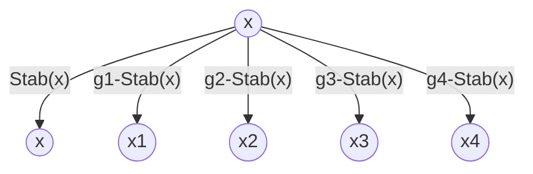

## 半群

半群的定义(Semigroup)
若运算封闭,满足结合律,则称$[S,*]$是一个半群
1. 运算封闭: $\forall a,b\in S, a*b\in S$
2. 结合律: $\forall a,b,c\in S, (a*b)*c=a*(b*c)$

递归地定义$x_1x_2\cdots x_n=(x_1x_2\cdots x_{n-1})(x_n)$
其中规定$x^n=\underbrace{x\cdots x}_{n\text{个}}(n\ge1)$

半群满足广义结合律, 可以任意添加括号
$\forall n,m\in \mathbb{N^+},x_1\cdots x_n\cdot y_1\cdots y_m=(x_1\cdots x_n)(y_1\cdots y_m)$
通过对m进行归纳来证明:
当m=1时, 由定义知$x_1\cdots x_ny_1=(x_1\cdots x_n)(y_1)$
现假设当m=k时结论成立, 则当m=k+1时
$x_1\cdots x_n\cdot y_1\cdots y_k\cdot y_{k+1} \\
=(x_1\cdots x_n\cdot y_1\cdots y_k)\cdot y_{k+1} \\
=[(x_1\cdots x_n)(y_1\cdots y_k)]\cdot y_{k+1}  \\
=(x_1\cdots x_n)[(y_1\cdots y_k)\cdot (y_{k+1})] \\
=(x_1\cdots x_n)(y_1\cdots y_k\cdot y_{k+1})$  

## 幺半群

幺半群的定义(Monoid)
若运算封闭,满足结合律,存在单位元, 则称$[S,*]$是一个幺半群
1. 运算封闭: $\forall a,b\in S, a*b\in S$
2. 结合律: $\forall a,b,c\in S, (a*b)*c=a*(b*c)$
3. 单位元: $\exists e\in S, \forall a\in S, a*e=e*a=a$

单位元唯一: $e_1=e_1e_2=e_2$
零指数: $x^0=e$
 

子幺半群的定义(Submonoid)
已知幺半群$[S,*]$, 且$T\subseteq S$,
若运算封闭,单位元保持, 则称$[T,*]$是一个子幺半群
$\implies结合律: \forall a,b,c\in T\implies a,b,c\in S\implies (a*b)*c=a*(b*c)$
1. 运算封闭: $\forall a,b\in T, a*b\in T$
2. 单位元: $e_S\in T$

 

生成子幺半群的定义一(Generated Submonoid)
<满足幺半性质的闭包>
已知幺半群$[S,*]$, 子集$A\subseteq S$,
将所有包含A的子幺半群的交集, 称为由A生成的子幺半群
记为$\langle A\rangle=\bigcap\{T|A\subseteq T\land T是子幺半群\}$也是幺半群
1. 运算封闭: $\forall a,b\in \langle A\rangle\implies a,b\in\forall T_i\implies a*b\in\forall T_i\implies a*b\in \langle A\rangle$
2. 结合律: $\forall a,b,c\in \langle A\rangle\implies a,b,c\in\forall T_i\implies (a*b)*c=a*(b*c)$
3. 单位元: $e_S\in\forall T_i\implies e_S\in\langle A\rangle$

 

生成子幺半群的定义二(Generated Submonoid)
已知幺半群$[S,*]$, 子集$A\subseteq S$,
将子集A关于运算的闭包, 称为由A生成的子幺半群
记为$\langle A\rangle=\{x_1^{m_1}x_2^{m_2}\cdots x_k^{m_k}|x_i\in A,m_i\in\mathbb{N},k\in\mathbb{N^+}\}$
1. 运算封闭: $\forall a,b\in \langle A\rangle\implies ab=x_1^{m_1}x_2^{m_2}\cdots x_s^{m_s}y_1^{n_1}y_2^{n_2}\cdots y_t^{n_t}\in \langle A\rangle$
2. 结合律: $\forall a,b,c\in \langle A\rangle\implies (ab)c=a(bc)$
3. 单位元: $e=x^0\in \langle A\rangle$

 

$\langle A\rangle_1=\bigcap\{H|A\subseteq H\land H是子幺半群\}$
$\langle A\rangle_2=\{x_1^{m_1}x_2^{m_2}\cdots x_k^{m_k}|x_i\in A,m_i\in\mathbb{Z},k\in\mathbb{N^+}\}$
上述两种定义等价, 即$\langle A\rangle_1=\langle A\rangle_2$, 证明如下:
$\langle A\rangle_1\subseteq\langle A\rangle_2$: 因为$\langle A\rangle_2$是包含A的子幺半群, 所以$\langle A\rangle_1\subseteq\langle A\rangle_2$
$\langle A\rangle_2\subseteq\langle A\rangle_1$: 由运算封闭性可知, 对于任意包含A的子幺半群H
都有 $x_1^{m_1}x_2^{m_2}\cdots x_k^{m_k}\in H\implies \langle A\rangle_2\subseteq\langle A\rangle_1$

 

幺半群同态的定义(Monoid Homomorphism)
已知幺半群$[S,\cdot]$和$[T,*]$, 映射$f:S\to T$
若运算保持,单位元保持, 则称f是一个幺半群同态
1. 运算保持: $\forall a,b\in S, f(a\cdot b)=f(a)*f(b)$
2. 单位元保持: $f(e_S)=e_T$

 

幺半群同构的定义(Monoid Isomorphism)
已知幺半群$[S,\cdot]$和$[T,*]$, 映射$f:S\to T$
若运算保持,单位元保持,且f是双射, 则称f是一个幺半群同构
1. 正向运算保持: $\forall a,b\in S, f(a\cdot b)=f(a)*f(b)$
2. 正向单位元保持: $f(e_S)=e_T$
3. 满足双射: $S \leftrightarrow T,f(a_S)=a_T,f^{-1}(a_T)=a_S$

$1,3\implies2$: 由运算保持可知$f(s)f(1)=f(s)=f(1)f(s),\forall s\in S$
因为f是满射, 所以$\forall t\in T,\exists f(s)=t\implies tf(1)=t=f(1)t\implies f(1)是T的单位元$

幺半群同构是等价关系
1. 自反性: $S\cong S$
2. 对称性: $f:S\to T$是同构, 那么$f^{-1}:T\to S$也是同构
3. 传递性: $f:S\to T,g:T\to U$是同构, 那么$g\circ f:S\to U$也是同构

 

全变换幺半群的定义(Full Transformation Monoid)
将集合S到自身的全部映射, 记为$M(S)$
如果$|S|=n$, 那么$|M(S)|=n^n$

## 群

群的定义(Group)
若运算封闭,满足结合律,存在单位元,且每个元素都有逆元, 则称$[G,*]$是一个群
1. 运算封闭: $\forall a,b\in G, a*b\in G$
2. 结合律: $\forall a,b,c\in G, (a*b)*c=a*(b*c)$
3. 单位元: $\exists e\in G, \forall a\in G, a*e=e*a=a$
4. 逆元: $\forall a\in G, \exists a^{-1}\in G, a*a^{-1}=a^{-1}*a=e$

逆元唯一: $a_1^{-1}=a_1^{-1}e=a_1^{-1}(aa_2^{-1})=(a_1^{-1}a)a_2^{-1}=ea_2^{-1}=a_2^{-1}$
多元取逆: $(a\cdot b)^{-1}=b^{-1}\cdot a^{-1}$
负指数: $x^{-n}=(x^{-1})^n=\underbrace{x^{-1}\cdot x^{-1}\cdots x^{-1}}_n$

 

已知$[S,*]$是一个幺半群
令$G=U(S)$是其所有可逆元素(单位)构成的子集, 则$[G,*]$是一个群
1. 运算封闭: $\forall a,b\in G\implies \exists a^{-1},b^{-1}\in S\implies b^{-1}*a^{-1}=(a*b)^{-1}\in S\implies a*b\in G$
2. 结合律: $\forall a,b,c\in G\implies a,b,c\in S\implies (a*b)*c=a*(b*c)$
3. 单位元: $\exists e^{-1}=e\in S\implies e\in G$
4. 逆元: $\forall a\in G\implies a^{-1}\in G$

 

群的阶数的定义(Order of Group)
群的元素个数称为群的阶数, 记为$|G|$

有限群的定义(Finite Group)
若群的元素个数有限,则称该群是有限群, 其阶数为$|G|=n$

无限群的定义(Infinite Group)
若群的元素个数无限,则称该群是无限群, 其阶数为$|G|=\infty$

 

 

二面体群的定义(Dihedral Group)
正n边形的所有对称操作, 及其复合运算所构成的群, 称为n阶二面体群, 
记为$[D_n,\circ]=\{I, \sigma, \sigma^2, \cdots, \sigma^{n-1}, \tau, \tau\sigma, \tau\sigma^2, \cdots, \tau\sigma^{n-1}\}$
其中$I$是恒等变换, $\sigma$是顺时针旋转(中心对称), $\tau$是绕轴$(A_1,O)$的镜面翻转(轴对称)
因为$\tau\sigma\tau=\sigma^{-1}$, 故可记为$D_n=\langle\sigma,\tau|\sigma^n=\tau^2=I,\tau\sigma\tau=\sigma^{-1}\rangle$

 

n阶一般线性群的定义(General Linear Group)
由n*n可逆实矩阵构成的乘法群,称为实数上的n阶一般线性群,记为$[GL(n,\mathbb{R}),\cdot]$
$GL(n,\mathbb{R})=\{A|A\in M(n,\mathbb{R})\land \det(A)\neq0\}$

n阶特殊线性群的定义(Special Linear Group)
由n*n行列式为1的实矩阵构成的乘法群,称为实数上的n阶特殊线性群,记为$[SL(n,\mathbb{R}),\cdot]$
$SL(n,\mathbb{R})=\{A|A\in M(n,\mathbb{R})\land \det(A)=1\}$

 

n阶正交群的定义(Orthogonal Group)
由n*n行列式为$\pm1$的正交实矩阵构成的乘法群,称为实数上的n阶正交群,记为$[O(n),\cdot]$

n阶特殊正交群的定义(Special Orthogonal Group)
由n*n行列式为$+1$的正交实矩阵构成的乘法群,称为实数上的n阶特殊正交群,记为$[SO(n),\cdot]$

 

对称群和变换群的定义(Symmetric Group & Transformation Group)
将**非空集合S**自身的所有双射, 记为S的对称群$\text{Sym}(S)=U(M(S))$
对称群$\text{Sym}(S)$的子群, 称为S的一个变换群
1. 运算封闭: 双射经过复合运算后还是双射
2. 结合律: 映射的复合运算满足结合律
3. 单位元: 恒等映射
4. 逆元: 双射存在逆映射

 

n阶对称群和n阶置换群的定义(Symmetric Group & Permutation Group)
将**有限集合S**自身的所有双射(置换), 记为n阶对称群$S_n$, 且$|S_n|=n!$
n阶对称群$S_n$的子群, 称为S的一个n阶置换群
1. 运算封闭: 双射经过复合运算后还是双射
2. 结合律: 映射的复合运算满足结合律
3. 单位元: 恒等映射
4. 逆元: 双射存在逆映射

## 子群, 生成子群

子群的定义(Subgroup)
已知群$[G,*]$, 子集$H\subseteq G$,
若运算封闭,单位元保持,逆运算保持, 则称$[H,*]$是一个子群,记为$H<G$
1. 运算封闭: $\forall a,b\in H, a*b\in H$
2. 单位元: $e_S\in H$
3. 逆元: $\forall a\in H, a^{-1}\in H$

$1,2,3\iff (H\neq\emptyset)\land(\forall a,b\in H,a*b^{-1}\in H)$
$\implies$结合律: $\forall a,b,c\in H\implies a,b,c\in G\implies (a*b)*c=a*(b*c)$

 

生成子群的定义一(Generated Group of Set)
<包含S的最小子群>
已知$[G,\cdot]$是一个群, 子集$S\subseteq G$
将所有包含S的子群的交集, 称为子集S的生成子群,
记为$\langle S\rangle=\bigcap\{H|S\subseteq H\land H是子群\}$
1. 运算封闭: $\forall a,b\in \langle S\rangle\implies a,b\in\forall H_i\implies a*b\in\forall H_i\implies a*b\in \langle S\rangle$
2. 结合律: $\forall a,b,c\in \langle S\rangle\implies a,b,c\in\forall H_i\implies (a*b)*c=a*(b*c)$
3. 单位元: $e_S\in\forall H_i\implies e_S\in\langle S\rangle$
4. 逆元: $\forall a\in \langle S\rangle\implies a^{-1}\in\forall H_i\implies a^{-1}\in\langle S\rangle$

 

生成子群的定义二(Generated Group of Set)
已知$[G,\cdot]$是一个群, 子集$S\subseteq G$
将子集S的关于运算的闭包, 称为子集S的生成子群,
记为$\langle S\rangle=\{x_1^{m_1}x_2^{m_2}\cdots x_k^{m_k}|x_i\in S,m_i\in\mathbb{Z},k\in\mathbb{N^+}\}$
1. 包含子集: $\forall x\in S\implies x=x^1\in \langle S\rangle$
2. 运算封闭: $\forall a,b\in \langle S\rangle\implies ab=x_1^{m_1}x_2^{m_2}\cdots x_s^{m_s}y_1^{n_1}y_2^{n_2}\cdots y_t^{n_t}\in \langle S\rangle$
3. 结合律: $\forall a,b,c\in \langle S\rangle\implies (ab)c=a(bc)$
4. 单位元: $e=x^0\in \langle S\rangle$
5. 逆元: $\forall a\in \langle S\rangle\implies a^{-1}=x_k^{-m_k}\cdots x_2^{-m_2}x_1^{-m_1}\in \langle S\rangle$

 

$\langle S\rangle_1=\bigcap\{H|S\subseteq H\land H是子群\}$
$\langle S\rangle_2=\{x_1^{m_1}x_2^{m_2}\cdots x_k^{m_k}|x_i\in S,m_i\in\mathbb{Z},k\in\mathbb{N^+}\}$
上述两种定义等价, 即$\langle S\rangle_1=\langle S\rangle_2$, 证明如下:
$\langle S\rangle_1\subseteq\langle S\rangle_2$: 因为$\langle S\rangle_2$是包含S的子群, 所以$\langle S\rangle_1\subseteq\langle S\rangle_2$
$\langle S\rangle_2\subseteq\langle S\rangle_1$: 由运算封闭可知, 对于任意包含S的子群H
都有 $x_1^{m_1}x_2^{m_2}\cdots x_k^{m_k}\in H\implies \langle S\rangle_2\subseteq\langle S\rangle_1$

## 陪集, 商集, Lagrange定理

左陪集的定义(Left Coset)
<元素a在右平移$H_R$下的轨道>
已知群G, 有子群H, 元素$a\in G$
则$aH=\{ah|h\in H\}$称为a在H中的左陪集
1. 等大: $\forall a\in G\implies|H|=|aH|$
    $存在双射f:H\to aH:f(h)=ah:f^{-1}(ah)=h$
2. 无交: $\forall a,b\in G\implies (aH=bH)\lor (aH\cap bH=\emptyset)$
    $aH\cap bH\neq\emptyset\implies \exists ah_1=bh_2\implies a=bh_2h_1^{-1}, b=ah_1h_2^{-1}$
    $\forall ah\in aH,ah=(bh_2h_1^{-1})h=b(h_2h_1^{-1}h)\in bH\implies aH\subseteq bH$
    $\forall bh\in bH,bh=(ah_1h_2^{-1})h=a(h_1h_2^{-1}h)\in aH\implies bH\subseteq aH$
3. 全集: $G=\bigcup aH$

$xH=H\iff x\in H$
$\implies$: $xe\in xH\implies xe\in H\implies x\in H$
$\impliedby$: $x\in H\implies xH\subseteq H\land|xH|=|H|\implies xH=H$

$x\sim y:= xH=yH\iff y^{-1}xH=H\iff y^{-1}x\in H$
1. 自反性: $x^{-1}x=e\in H$
2. 对称性: $x^{-1}y\in H\implies y^{-1}x=(x^{-1}y)^{-1}\in H$
3. 传递性: $x^{-1}y\in H,y^{-1}z\in H\implies (x^{-1}y)(y^{-1}z)=x^{-1}z\in H$

重陪集的定义(Double Coset)
已知子群H和K, 则关于H和K的重陪集为$HxK=\{hxk|h\in H,k\in K\}$
> 无交: $\forall x,y\in G,HxK\cap HyK=\emptyset\lor HxK=HyK$
    $HxK\cap HyK\neq\emptyset\implies\exists h_1xk_1=h_2yk_2\implies x=h_1^{-1}h_2yk_2k_1^{-1},y=h_2^{-1}h_1xk_1k_2^{-1}$
    $\forall hxk\in HxK,hxk=h(h_1^{-1}h_2yk_2k_1^{-1})k\in HyK\implies HxK\subseteq HyK$
    $\forall hyk\in HyK,hyk=h(h_2^{-1}h_1xk_1k_2^{-1})k\in HxK\implies HyK\subseteq HxK$

商集的定义(Quotient Set)
<也就是划分块集的定义>
已知G是一个群, H是G的一个子群
则$G/H=\{aH|a\in G\}$称为G关于H的商集
将划分块数称为H在G中的指数(index)
记为$[G:H]=|G/H|=|\{aH|a\in G\}|$

Lagrange定理(Lagrange's Theorem)
<群的大小=划分块数$\times$每个划分块的大小>
已知G是一个群, H是G的一个子群, 则$|G|=[G:H]\times|H|$

 

群G被群H细分, 群H又被群K细分, 则群G被群K细细分
已知$K<H<G$,则$[G:K]=[G:H]\times[H:K]$
$G/H=\{g_1H,g_2H,\cdots,g_mH\}$
$H/K=\{h_1K,h_2K,\cdots,h_nK\}$
则$G/K=\left\{\begin{aligned}
      (g_1H)\implies\quad &g_1h_1K &g_1h_2K \quad&\cdots &g_1h_nK \\
      (g_2H)\implies\quad &g_2h_1K &g_2h_2K \quad&\cdots &g_2h_nK \\
      &&&\cdots \\
      (g_mH)\implies\quad &g_mh_1K &g_mh_2K \quad&\cdots &g_mh_nK
\end{aligned}\right\}$
证明: 
1. 首先证明满射 $\bigcup g_ih_jK=G/K$
$H<G\implies \forall a\in G,\exists g_i\in G,a\in g_iH\implies\exists h\in H,a=g_ih$
$K<H\implies \forall h\in H,\exists h_j\in H,h\in h_jK\implies\exists k\in K,h=h_jk$
$\implies \forall aK\in G/K,\exists h\in H,k\in K,aK=g_ihK=g_ih_jkK=g_ih_jK$

1. 然后证明单射 $g_ih_jK=g_ah_bK\implies (g_i\sim g_a)\land(h_j\sim h_b)$:
$g_ih_jK=g_ah_bK\implies g_ih_jKH=g_ah_bKH\implies g_iH=g_aH\implies g_i\sim g_a$
故$g_ih_jK=g_ah_bK\land(g_i=g_a)\implies h_jK=h_bK\implies h_j=h_b$, 得证

## 群同态

群同态的定义(Group Homomorphism)
已知$[S,\cdot],[T,*]$是两个群, 有映射$f:S\to T$
若运算保持, 则称f是一个群同态
1. 运算保持: $\forall a,b\in S, f(a\cdot b)=f(a)*f(b)$

单位元保持: $f(e_S)=e_T$
$e_S=e_S\cdot e_S\implies f(e_S)=f(e_S\cdot e_S)=f(e_S)*f(e_S)$
$\implies e_T=[f(e_S)*f(e_S)]*f(e_S)^{-1}=f(e_S)$

逆元保持: $\forall a\in S, f(a^{-1})=f(a)^{-1}$
$e_T=f(e_S)=f(a*a^{-1})=f(a)*f(a^{-1})$

 

满同态和单同态的定义(Surjective and Injective Homomorphism)
已知群同态$f:[S,\cdot]\to[T,*]$,
如果$f$是满射, 则称$f$是满同态(epimorphism)
如果$f$是单射, 则称$f$是单同态(monomorphism)

$f$是满同态, 当且仅当$im(f)=T$
$f$是单同态, 当且仅当$\ker(f)=\{e_S\}$
证明: $f$是单同态 $\iff$ $[\forall a,b\in S,f(a)=f(b)\implies a=b]$
$\iff$ $[\forall a,b\in S,f(ab^{-1})=e_T\implies ab^{-1}=e_S]$
$\iff$ $[\forall x\in S,f(x)=e_T\implies x=e_S]$
$\iff$ $\ker(f)=\{e_S\}$

### 同余关系

同余关系的定义(Congruence Relation)
<能够保持运算良定义的等价关系>
将群G上保持运算良定义的等价关系, 称为同余关系
1. 自反性: $\forall a\in G, a\equiv a$
2. 对称性: $\forall a,b\in G, a\equiv b\implies b\equiv a$
3. 传递性: $\forall a,b,c\in G, a\equiv b\land b\equiv c\implies a\equiv c$
4. 运算良定义: $a\equiv a'\land b\equiv b'\implies a*b\equiv a'*b'$
    

### 正规子群

正规子群的定义(Normal Subgroup)
<使陪集乘法满足良定义的子群>
1. 运算封闭: $\forall a,b\in N, a*b\in N$
2. 单位元: $e\in N$
3. 逆元: $\forall n\in N, n^{-1}\in N$
4. 正规: $\forall g\in G,gN=Ng$

$4\iff \forall g\in G,\forall n\in N,gng^{-1}\in N$
$\forall g\in G,gN=Ng
\iff\begin{cases}
      gN\subseteq Ng \\
      Ng\subseteq gN
\end{cases}
\iff\begin{cases}
      gNg^{-1}\subseteq N \\
      g^{-1}Na\subseteq N
\end{cases}
\iff \forall g\in G,n\in N,gng^{-1}\in N$

### 同余关系<->正规子群

同余关系$a\equiv b$$\iff$正规子群$\bar e$
$\implies$: 已知同余关系$a\equiv b$, 欲证明$N=\bar e$是正规子群
1. 运算封闭: $\forall a,b\in \bar e\implies a\equiv e\land b\equiv e\implies ab\equiv e\implies ab\in \bar e$
2. 单位元: $e\in\bar e$
3. 逆元: $\forall a\in\bar e,a^{-1}a=e\land e\equiv a\implies a^{-1}a\equiv a\implies a^{-1}\equiv e$
4. 正规: $首先证明a\in\bar g\iff a\in g\bar e$
    $\implies: a\in\bar g\implies a\equiv g\land e\equiv h\implies a\equiv gh\implies a\in g\bar e$
    $\impliedby: a\in g\bar e\implies\exists h\in\bar e,a\equiv gh\land e\equiv h^{-1}\implies a\equiv g$
    $所以有\bar g=g\bar e\land\bar g=\bar eg\implies g\bar e=\bar eg$

$\impliedby$: 已知正规子群$N=\bar e$, 欲证明$a\equiv b:a^{-1}b\in N$是同余关系
1. 自反性: $a^{-1}a=e\in N$
2. 对称性: $a^{-1}b\in N\implies b^{-1}a=(a^{-1}b)^{-1}\in N$
3. 传递性: $a^{-1}b\in N,b^{-1}c\in N\implies (a^{-1}b)(b^{-1}c)=a^{-1}c\in N$
4. 运算良定义: $已知a\equiv a'\land b\equiv b'\iff aN=a'N\land bN=b'N$
    $Nb'=bN\implies b^{-1}Nb'=N\implies b^{-1}a^{-1}a'b'\in N\implies ab\equiv a'b'$

### 群同态的核与像

群同态的核与像的定义(Kernel and Image of Group Homomorphism)
已知群同态$f:[S,\cdot]\to[T,*]$,
称f的核为 $\ker(f)=\{a\in S|f(a)=e_T\}\subseteq S$
称f的像为 $im(f)=\{f(a)|a\in S\}\subseteq T$

核是S的正规子群: 运算封闭,单位元,逆元,正规性
1. 运算封闭: $\forall a,b\in \ker(f),f(a\cdot b)=f(a)*f(b)=e_T\implies a\cdot b\in \ker(f)$
2. 单位元: $f(e_S)=e_T\implies e_S\in \ker(f)$
3. 逆元: $\forall a\in \ker(f),f(a^{-1})=f(a)^{-1}=e_T^{-1}=e_T\implies a^{-1}\in \ker(f)$
4. 正规性: $\forall a\in G,n\in\ker(f),f(ana^{-1})=f(a)f(n)f(a^{-1})=f(a)e'f(a)^{-1}=e'$

像是T的子群: 运算封闭,单位元,逆元
1. 运算封闭: $\forall f(a),f(b)\in im(f)\implies a\cdot b\in S\implies f(a)*f(b)=f(a\cdot b)\in im(f)$
2. 单位元: $e_T=f(e_S)\in im(f)$
3. 逆元: $\forall f(a)\in im(f),\implies a^{-1}\in S\implies f(a)^{-1}=f(a^{-1})\in im(f)$

### 商群

商群的定义(Quotient Group)
<正规子群 使得商集 能够成为商群>
已知$N\lhd G$, 则N的商集, 及其集合乘法运算组成商群$[G/N,\circ]$
1. 运算良定义: $正规子群\leftrightarrow同余关系$
1. 封闭性: $\forall aN,bN\in G/N,aN\circ bN=(ab)N\in G/N$
2. 结合律: $(aN\circ bN)\circ cN=(ab)N\circ cN=(abc)N=aN\circ(b\cdot c)N=aN\circ(bN\circ cN)$
3. 单位元: $aN\circ eN=aN=eN\circ aN$
4. 逆元: $aN\circ a^{-1}N=eN=a^{-1}N\circ aN\implies (aN)^{-1}=a^{-1}N\in G/N$

最粗整的商群是$G/G=\{G\}$
最细分的商群是$G/\{e\}=\{ \{g_1\},\{g_2\},\cdots,\{g_{|G|}\} \}$

### 群同态基本定理

群同态基本定理(Fundamental Theorem of Homomorphism)
<群同态的像群 同构于 核的商群>
$[a\to f(a)\iff a\to a\cdot\ker(f)]\implies f(a)\leftrightarrow a\cdot\ker(f)\implies im(f)\cong G/\ker(f)$

定义从商群到像群的映射$F:G/\ker(f)\to im(f):F(aN)=f(a)$, 简记$N=\ker(f)$
1. 映射良定义: $a_1N=a_2N\implies a_1^{-1}a_2\in N$
    $\implies f(a_1^{-1}a_2)=f(a_1)^{-1}f(a_2)=e'\implies f(a_1)=f(a_2)$
2. 映射群同态: $F(aN\circ bN)=F(abN)=f(ab)=f(a)f(b)=F(aN)\cdot F(bN)$
3. 映射满射: $\forall a'\in im(f),\exists a\in G,f(a)=a'\implies \exists aN,F(aN)=f(a)=a'$
4. 映射单射: $f(a)=f(b)\implies f(b^{-1}a)=e'\implies b^{-1}a\in N\implies aN=bN$

综上所述, $F:G/\ker(f)\to im(f)$是群同构, 故$im(f)\cong G/\ker(f)$

#### 群同构第一定理

已知$H<G,N\lhd G\implies HN<G$
$子群定义1,2,3\iff (H\neq\emptyset)\land(\forall a,b\in H,a*b^{-1}\in H)$
证明: $\forall h_1n_1,h_2n_2\in HN, (h_1n_1)(h_2n_2)^{-1}=h_1n_1n_2^{-1}h_2^{-1}$
$=h_1(h_2^{-1}h_2)(n_1n_2^{-1})h_2^{-1}=(h_1h_2^{-1})[h_2(n_1n_2^{-1})h_2^{-1}]\in HN$

群同构第一定理(First Isomorphism Theorem)
<元素h 映射到 陪集hN>
$h\to hN$ $\iff$ $H/(H\cap N)\cong HN/N=H/N$
已知$H<G,N\lhd G$, 则$H\to HN/N:f(h)=hN$是群同态, 且$\ker(f)=H\cap N$

映射同态: $f(h_1h_2)=h_1h_2N=h_1N\circ h_2N=f(h_1)\circ f(h_2)$
且$\ker(f)=\{h\in H|f(h)=N\iff h\in N\land h\in H\}=H\cap N$
由群同态基本定理知, $H/(H\cap N)\cong im(f)=HN/N$

#### 群同构第二定理

群同构第二定理(Second Isomorphism Theorem)
<正规子群K的商群 映射到 正规子群H的商群>
$gK\to gH$ $\iff$ $\frac{(G/K)}{(H/K)}\cong G/H$
已知$K\lhd G,H\lhd G,K\subseteq H$, 
则$G/K\to G/H:f(gK)=gH$是群同态, 且$\ker(f)=H/K$

映射同态: $f(g_1N\circ g_2N)=f(g_1g_2N)=g_1g_2H=g_1H\cdot g_2H=f(g_1N)\cdot f(g_2N)$
且$\ker(f)=\{gK\in G/K|f(gK)=H\iff g\in H\}=H/K$
由群同态基本定理可知, $G/K\to G/H$是群同态, 且$\frac{(G/K)}{(H/K)}\cong G/H$

 

## 循环群

循环群的定义(Cyclic Group)
已知$[G,\cdot]$是一个群, 且$G=\langle x\rangle=\{x^n|n\in\mathbb{Z}\}$
即G仅由单个元素生成, 则称G是一个循环群, 称x是G的一个生成元
将元素的阶记为由其生成的循环群的阶, 即$o(a)=|a|=|\langle a\rangle|$
如果$|a|$是有限的, 那么$|a|$也是使得$a^r=1$的最小正整数

已知有限群G, 则$\forall a\in G,a^{|G|}=e$
证明: 由Lagrange定理知, 因为$\langle a\rangle$是G的子群, 所以$|\langle a\rangle|$整除$|G|$
因此 $a^{|G|}=a^{k|\langle a\rangle|}=a^{k|a|}=e^k=e$, 得证

素数阶群$\implies$循环群
证明: 已知$|G|=p$是素数, 则$|a|\mid p\implies|a|=1\lor|a|=p$
$\forall a\in G,a\neq e\implies |a|=p\implies G=\langle a\rangle$

已知在群G中, 元素x的阶为$|x|=n$, 则 $|x^m|=\frac{n}{\gcd(n,m)},1\le m<n$
证明: 要得到使得$(x^m)^k=x^{mk}=e$成立的最小正整数k, 
则$mk$要为m和n的最小公倍数, 即$mk=lcm(m,n)\implies k=\frac{lcm(m,n)}{m}=\frac{n}{\gcd(m,n)}$

推论: $a^k$是n阶循环群的生成元, 当且仅当k与n互素
$\gcd(k,n)=1\iff|a^k|=\frac{n}{\gcd(k,n)}=n\iff G=\langle x^k\rangle$

 

任意无限循环群同构于$[\mathbb{Z},+]$
证明: 已知无限循环群$G=\langle x\rangle$, 构造群同构$f:\mathbb{Z}\to G:f(n)=x^n$
1. 运算保持: $f(n+m)=x^{n+m}=x^nx^m=f(n)f(m)$
2. 单射: $f(n)=f(m)\implies x^{n-m}=e\implies n-m=0\implies n=m$
3. 满射: $f(\mathbb{Z})=\{x^n|n\in\mathbb{Z}\}=G$

任意n阶有限循环群同构于$[\mathbb{Z_n},+]$
证明: 已知n阶有限循环群$G=\langle x\rangle$, 构造群同构$f:\mathbb{Z_n}\to G:f(k)=x^k$
1. 运算保持: $f(k+m)=x^{k+m}=x^kx^m=f(k)f(m)$
2. 单射: $f(k)=f(m)\implies x^{k-m}=e\implies n\mid(k-m)\implies k=m\pmod n$
3. 满射: $f(\mathbb{Z_n})=\{e,x,x^2,\cdots,x^{n-1}\}=G$

 

有限循环群的性质:
<类似于正整数的唯一分解定理>
1. 循环群G的每个子群也都是循环群
2. 对于n的每个正因子s, 都存在唯一的s阶子循环群$\langle a^{n/s}\rangle$
3. 所有这些正因子阶子群, 构成群G的全部子群
    特别地当n是素数时, 群G有且仅有两个子群$\{e\},G$

(1)循环群G的每个子群也都是循环群
证明: 已知G的非平凡子群$H=\{e,a^{k},a^{k_2},\cdots,a^{k_h}\}, 其中a^k最小$
对于$\forall a^m\in H$, 都有带余除法$m=kq+r,0\le r<k$
如果$a^m$不能被$a^k$整除, 那么$a^{r}=a^{m-kq}\in H\land 0<r<k$
这与$a^k$是H中的最小非零元素相矛盾, 故H中所有元素都能被$a^k$整除, 即$G=\langle a^k\rangle$

(2)对于每个正因子s, 都存在唯一的s阶子循环群$\langle a^{n/s}\rangle$
首先证明存在性: $\forall s|n\implies\exists d\in\mathbb{N^+},sd=n$
$|a^d|=\frac{n}{\gcd(n,d)}=s\implies\langle a^d\rangle$是s阶子群
然后证明唯一性: 任取s阶子群H, 现欲证明H由$a^d$生成
由1知循环群的子群H也是循环群, 不妨设其生成元为$a^k$
则$s=|a^k|=\frac{n}{\gcd(n,k)}=\frac{n}{d}\implies d=\gcd(n,k)$
1. $d=\gcd(n,k)\implies d\mid k\implies a^k\in\langle a^d\rangle\implies\langle a^k\rangle\subseteq \langle a^d\rangle$
2. $d=\gcd(n,k)\implies\exists x,y\in\mathbb{Z},d=nx+ky$
    $\implies a^d=a^{nx+ky}=a^{ky}\in \langle a^k\rangle\implies\langle a^d\rangle\subseteq \langle a^k\rangle$

(3)所有正因子阶子群, 构成群G的全部子群
由Lagrange定理可知, 每个子群的阶都是一个正因子
故所有的正因子阶子群, 就构成了群G的所有子群

### 探究: 有限交换群$\overset{?}{\implies}$循环群

交换群的定义(Commutative Group)
将满足交换律的群, 称为交换群或阿贝尔群
所有的循环群都是交换群: $ab=x^{m+n}=x^{n+m}=ba$
1. 运算封闭: $\forall a,b\in G, a*b\in G$
2. 结合律: $\forall a,b,c\in G, (a*b)*c=a*(b*c)$
3. 单位元: $\exists e\in G, \forall a\in G, a*e=e*a=a$
4. 逆元: $\forall a\in G, \exists a^{-1}\in G, a*a^{-1}=a^{-1}*a=e$
5. 交换律: $\forall a,b\in G,a*b=b*a$

群的指数的定义(Exponent of Group)
将群G中元素的阶的最小公倍数称为群的指数, 记为$\text{exp}(G)$

<引理1> 
已知群G中的元素a,b, 其中$|a|=m,|b|=n$
则$ab=ba\land\gcd(m,n)=1\implies|ab|=mn$
证明: 不妨设$|ab|=s$, 现欲证明$s=mn\iff s|mn\land mn|s$
1. $ab=ba\implies (ab)^{mn}=(a^m)^n\cdot(b^n)^m=e\implies s|mn$
2. $a^{sn}=a^{sn}\cdot b^{sn}=(ab)^{sn}=e\implies m|sn\land\gcd(m,n)=1\implies m|s$
    $b^{sm}=a^{sm}\cdot b^{sm}=(ab)^{sm}=e\implies n|sm\land\gcd(m,n)=1\implies n|s$
    $m|s\land n|s\land \gcd(m,n)=1\implies mn|s$

<引理2>
已知有限交换群G, 则群G中元素的最大阶即为$\text{exp}(G)$
<证明思路>: 已知最大阶元素为$|g|=n$, 假设群G中存在元素$|h|=m\land h^n\neq e$
那么可以构造更大阶的元素, 其阶为$\text{lcm}(n,m)>n=|g|$, 由此得出矛盾
<用反证法证明>: 假设群G中存在元素h, 使得$|h|=m\nmid n$
则有临界素数分解$n=xp^i,m=yp^j$, 其中$i<j\leq0$
由于$|g^{p^i}|=\frac{n}{\gcd(n,p^i)}=x$, $|h^y|=\frac{m}{\gcd(m,y)}=p^j$
由引理1可知 $\gcd(x,p^j)=1\implies|g^{p^i}h^j|=xp^j>xp^i=n$, 

 

<有限交换群$\overset{\text{exp}(G)=|G|}{\implies}$循环群>
已知有限交换群G, 则群G是循环群 当且仅当$\text{exp}(G)=|G|$
$\implies$: $G=\langle x\rangle\implies\forall x^k\in G,(x^k)^n=e\implies\text{exp}(G)=n=|G|$
$\impliedby$: 由引理2可知, 有限交换群中存在最大阶元素, 使得$|g|=\text{exp}(G)=|G|\implies G=\langle g\rangle$

## 群与数论

欧拉函数的定义(Euler's Function)
$\varphi(n)$: 小于等于n的正整数中, 与n互质数的个数
即 $\varphi(n)=Card\{x|(1\le x\le n)\land\gcd(x,n)=1\}$
|   +   |   1   |   2   |   3   |   4   |   5   |   6   |   7   |   8   |   9   |  10   |
| :---: | :---: | :---: | :---: | :---: | :---: | :---: | :---: | :---: | :---: | :---: |
|  0x   |   1   |   1   |   2   |   2   |   4   |   2   |   6   |   4   |   6   |   4   |
|  10x  |  10   |   4   |  12   |   6   |   8   |   8   |  16   |   6   |  18   |   8   |

可逆同余乘法群的定义
<元素可逆$\iff$与n互素>
定义一: $\mathbb{Z_n}^*=\{k+n\mathbb{Z}\in\mathbb{Z_n}|\exists m\in\mathbb{Z_n},km\equiv 1\pmod n\}$
定义二: $\mathbb{Z_n}^*=\{k+n\mathbb{Z}\in\mathbb{Z_n}|\gcd(n,k)=1\}\implies|\mathbb{Z_n}^*|=\varphi(n)$
两种定义等价: $\exists m\in\mathbb{Z_n},km\equiv 1\pmod n\iff \exists q\in\mathbb{Z},km=nq+1$
$\iff km+n(-q)=1\iff\gcd(k,n)=1$

任意整数: $[\mathbb{Z_n}^*,\cdot]=[\{1\le k<n|\gcd(n,k)=1\},\cdot]$
对于素数: $[\mathbb{Z_p}^*,\cdot]=[\{1,2,\cdots,p-1\},\cdot]$
| $[\mathbb{Z_{12}}^*.\cdot]$ |  $1$  |  $5$  |  $7$  | $11$  |
| :-------------------------: | :---: | :---: | :---: | :---: |
|             $1$             |  $1$  |  $5$  |  $7$  | $11$  |
|             $5$             |  $5$  |  $1$  | $11$  |  $7$  |
|             $7$             |  $7$  | $11$  |  $1$  |  $5$  |
|            $11$             | $11$  |  $7$  |  $5$  |  $1$  |

欧拉定理(Euler's Theorem)
$\gcd(a,n)=1\implies a^{\varphi(n)}\equiv 1\pmod n$
证明: $\gcd(a,n)=1\implies a\in\mathbb{Z_n}^*$
所以 $a^{|Z_n^*|}=a^{\varphi(n)}=e_n\implies a^{\varphi(n)}\equiv 1\pmod n$

## 轮换, 置换的奇偶性, 交错群

r-轮换的定义(r-Cycle)
已知有限集合N, 如果n元置换$\sigma$将$(i_1\to i_2)\land (i_2\to i_3)\land \cdots\land (i_r\to i_1)$
则称$\sigma$是一个r-轮换, 记作$\sigma=(i_1\ i_2\ \cdots\ i_r)$, 其中$\sigma^r=I\implies|\sigma|=r$

如果两个轮换无相同元素, 则称其为不相交的(disjoint)
不相交的轮换对于复合乘法运算是可交换的
特别地, 将 2-轮换 称为 对换(transposition)
轮换的逆 $(x_1,x_2,\cdots,x_r)^{-1}=(x_r,x_{r-1},\cdots,x_2,x_1)$

 

<百囚犯问题>
任何置换都可唯一分解为 若干不相交轮换的乘积 
$\forall f\in S_n,f\neq e\implies f=\sigma_1\sigma_2\cdots\sigma_t,\forall\sigma_i\cap\forall\sigma_j=\emptyset$
其中置换的阶为 $|f|=\text{lcm}(|\sigma_1|,|\sigma_2|,\cdots,|\sigma_t|)$

首先证明存在性:
如果$f=e$, 那么$f=(1)$
如果$f\neq e$, 那么存在$f(i_1)\neq i_1$
构造映射链$i_1\to\cdots\to i_k\to\cdots\to i_r\to i_k$
直到出现第一个与之前发生重复的元素$i_k$
假如$i_k\neq i_1$, 那么就会导致$i_k$被映射两次, 与置换的定义矛盾
所以$i_k=i_1$, 于是得到r-轮换$\sigma=(i_1\ i_2\ \cdots\ i_r)$
在$N\setminus\{i_1, i_2, \cdots, i_r\}$中继续重复有限次上述步骤
即可得到轮换分解式$f=\sigma_1\sigma_2\cdots\sigma_t,\forall \sigma_i\cap \forall \sigma_j=\emptyset$

然后证明唯一性:
假设存在两个不同的轮换分解式, 
$(f=\sigma_1\sigma_2\cdots\sigma_t) \land (f=\tau_1\tau_2\cdots\tau_s)$
任取值发生变化的元素$f(a)\neq a$, 则其会在某个循环圈中
即 $\exists \sigma_i,\tau_j,\sigma_i(a)=\tau_j(a)=f(a)\implies\forall m\in\mathbb{N},\sigma_i^m(a)=\tau_j^m(a)$
故两个循环圈相同$\sigma_i=\tau_j$, 重复上述步骤即有 $\forall i\in\{1, 2, \cdots, t\},\sigma_i=\tau_i$

 

任何置换都可以表示为一些对换的乘积 <分解不唯一>
$(x_1,x_2,x_3,\cdots,x_{r-1},x_r)=(x_1,x_r)(x_1,x_{r-1})\cdots(x_1,x_2)$
用归纳法证明: 当r=2时, $(x_1,x_2)=(x_1,x_2)$
假设当r-1时等式成立, 即$(x_1,x_2,x_3,\cdots,x_{r-1})=(x_1,x_{r-1})(x_1,x_{r-2})\cdots(x_1,x_2)$
则当r时, 有$(x_1,x_2,x_3,\cdots,x_{r-1},x_r)=(x_1,x_r)(x_1,\cdots,x_{r-1})=(x_1,x_r)(x_1,x_{r-1})(x_1,x_{r-2})\cdots(x_1,x_2)$

 

置换的奇偶性的定义(Parity of Permutation)
已知n元置换$f\in S_n$, 及其轮换分解$f=\sigma_1\sigma_2\cdots\sigma_t$
由上述可知, r-轮换可分解为r-1个对换的乘积
故可定义$f$的对换数为 $N(f)=\sum(|\sigma_i|-1)$

若$N(f)$为偶数, 则称其为偶置换$sgn(f)=1$
若$N(f)$为奇数, 则称其为奇置换$sgn(f)=-1$
所有n元偶置换组成的群称为n元交错群, 记为$A_n$, 其中$|A_n|=n!/2$
1. 对换是奇置换
2. 3-轮换是偶置换
3. 奇置换与奇置换的乘积是偶置换
4. 偶置换与偶置换的乘积是偶置换
5. 奇置换与偶置换的乘积是奇置换
6. 奇置换的对换分解式中对换个数是奇数
7. 偶置换的对换分解式中对换个数是偶数

## 群的直积

群的直积(Direct Product of Groups)
已知$[S,\cdot_s],[T,\cdot_t]$是两个群
构造S和T的直积,记为$[S\times T,*]$也是群
有运算为$(a_S,a_T)*(b_S,b_T)=(a_S\cdot_s b_S,a_T\cdot_t b_T)$
1. 运算封闭: $a_S\cdot_s b_S\in S,a_T\cdot_t b_T\in T\implies (a_S\cdot_s b_S,a_T\cdot_t b_T)\in S\times T$
2. 结合律: 逐坐标有结合律,故整体也有结合律
3. 单位元: $(e_S,e_T)\in S\times T$
4. 逆元: $(a_S,a_T)^{-1}=(a_S^{-1},a_T^{-1})\in S\times T$

族群的直积(Direct Product of Family of Groups)
已知$\{[G_i,\cdot_i], i\in I\}$是一族群
构造$G_i$的直积,记为$[\prod_{i\in I}G_i,*]$也是群
$(a_i)_{i\in I} * (b_i)_{i\in I}=(a_i\ \cdot_i\ b_i)_{i\in I}=(a_1b_1, a_2b_2, \cdots, a_nb_n)$

 

因为素数阶群 都是p阶循环群$[\mathbb{Z_p},+]$
(因为$|G|$是素数, 所以$|a|=1\lor|a|=|G|$)
所以 2阶群恰有一个同构类, 3阶群恰有一个同构类$\cdots$

现欲探究4阶群都有哪些同构类
由Lagrange定理可知, 4阶群的子群的阶只能是1,2,4
所以4阶群中非单位元的阶只可能是2, 4
1. 群G存在4阶元, 则$G=\langle a\rangle\implies G\cong\mathbb{Z_4}$
2. 群G只有2阶元, 即$G=\{e,a,b,c|aa=e,bb=e,cc=e\}$
$ab\neq e,ab\neq a,ab\neq b\implies ab=c$
$ba\neq e,ba\neq a,ba\neq b\implies ba=c$
同理可得, $ac=ca=b, bc=cb=a$
$\implies G\cong\mathbb{Z_2}\times\mathbb{Z_2}=\{(0,0),(0,1),(1,0),(1,1)\}$
将该4阶非循环的交换群 称为Klein四元群

综上所述, 4阶群只有两个同构类: $\mathbb{Z_4}$和$\mathbb{Z_2}\times\mathbb{Z_2}$

  

引理
已知群G中的元素a,b, 其中$|a|=m,|b|=n$
如果$ab=ba$, 且$\gcd(m,n)=1$, 则$|ab|=lcm(m,n)=mn$
证明: 不妨设$|ab|=s$, 则有
$ab=ba\implies (ab)^{mn}=\underbrace{(ab)\cdots (ab)}_{mn}=a^{mn}b^{mn}=(a^m)^n\cdot(b^n)^m=e\implies s|mn$
$e=(ab)^{sn}=a^{sn}\cdot b^{sn}=a^{sn}\implies m|sn\land\gcd(m,n)=1\implies m|s$
$e=(ab)^{sm}=a^{sm}\cdot b^{sm}=b^{sm}\implies n|sm\land\gcd(m,n)=1\implies n|s$
$m|s\land n|s\land \gcd(m,n)=1\implies mn|s$
$s|mn\land mn|s\implies s=mn$

 

$\mathbb{Z_m}\times\mathbb{Z_n}\cong\mathbb{Z_{mn}}\iff\gcd(m,n)=1$
$\impliedby$: 已知$(1,0)$是$\mathbb{Z_m}\times\mathbb{Z_n}$的m阶元, $(0,1)$是$\mathbb{Z_m}\times\mathbb{Z_n}$的n阶元
又因为 $\gcd(m,n)=1\implies|(1,1)|=|(1,0)|\cdot|(0,1)|=mn=|\mathbb{Z_m}\times\mathbb{Z_n}|$
所以$\mathbb{Z_m}\times\mathbb{Z_n}$是由$(1,1)$生成的mn阶循环群

$\implies$: 欲证明逆否命题 $\gcd(m,n)=d\neq1\implies\mathbb{Z_m}\times\mathbb{Z_n}$不是循环群
$\gcd(m,n)=d\neq1\implies \forall(a,b)\in\mathbb{Z_m}\times\mathbb{Z_n},\underbrace{(a,b)+\cdots+(a,b)}_{lcm(m,n)}=(0,0)$
$\implies|(a,b)|\leq lcm(m,n)=\frac{mn}{d}<mn\implies[\mathbb{Z_m}\times\mathbb{Z_n},+]$不是循环群

------

示例: 已知3阶正交群$O_3$, 3阶特殊正交群$SO_3$
则有$SO_3\times\{I,-I\}\cong O_3$, 且同构映射为$f:(A,U)\to AU$
1. 运算保持: $f[(A,U)(B,W)]=f[(AB,UW)]=(AB)(UW)=(AU)(BW)=f(A,U)f(B,W)$
2. 单射: $f(A,U)=f(B,W)\implies AU=BW\implies B^{-1}A=WU^{-1}\in SO_3\cap\{I,-I\}=\{I\}\implies A=B,U=W$
3. 满射: $\forall T\in O_3, \left\{\begin{aligned}
      |T|=1&\implies \exists T\in SO_3,f(T,I)=T \\
      |T|=-1&\implies \exists T(-I)\in SO_3,f(T(-I),-I)=T
\end{aligned}\right.$

已知群$H,K$, 如果满足
1. 单射: $H\cap K=\{e\}$
2. 同态: $hk=kh,\forall h\in H,k\in K$

则有$H\times K\cong HK$
且同构映射为$f:H\times K\to G:(h,k)\to hk$
1. 运算保持: $f[(h_1,k_1)(h_2,k_2)]=f[(h_1h_2,k_1k_2)]=(h_1h_2)(k_1k_2)=(h_1k_1)(h_2k_2)=f(h_1,k_1)f(h_2,k_2)$
2. 单射: $f(h_1,k_1)=f(h_2,k_2)\implies h_1k_1=h_2k_2$
    $\implies h_1^{-1}h_2=k_2k_1^{-1}\in H\cap K=\{e\}\implies h_1=h_2,k_1=k_2$
3. 满射: $\forall g\in G, g=hk\implies f(h,k)=g$

------

内直积的定义一(Internal Direct Product)
已知群G, 及其子群$G_1,\cdots,G_n$
1. $G=G_1\cdots G_n$
2. $G_1\cdots G_n$都是正规子群
3. $G_1G_2\cdots G_{i-1}\cap G_i=\{e\}$

内直积的定义二(Internal Direct Product)
已知群G, 及其子群$G_1,\cdots,G_n$
1. $\forall a_i\in G_i,a_j\in G_j,a_ia_j=a_ja_i$
2. $G=G_1G_2\cdots G_n$, 且每个元素的表示法唯一

$定义一\implies定义二$
(1) $\forall a_i\in G_i,a_j\in G_j,a_ia_j=a_ja_i$
$G_i,G_j是正规子群\implies\begin{cases}
    a_ia_ja_i^{-1}a_j^{-1}&=(a_ia_ja_i^{-1})\cdot a_j^{-1}&\in G_j \\
    a_ia_ja_i^{-1}a_j^{-1}&=a_i\cdot(a_ja_i^{-1}a_j^{-1}) &\in G_i
\end{cases}$
$\implies a_ia_ja_i^{-1}a_j^{-1}\in G_i\cap G_j=\{e\}\implies a_ia_j=a_ja_i$
(2) $G=G_1G_2\cdots G_n$, 且每个元素的表示法唯一
假设有两种表示$x=a_1\cdots a_n=b_1\cdots b_n$, 其中$a_i,b_i\in G_i$
则$a_ib_i^{-1}=(b_1\cdots b_n)(a_1\cdots a_n)^{-1}\in G_i\cap(G_1\cdots G_n)=\{e\}\implies a_i=b_i$

$定义二\implies定义一$
(1) $G=G_1G_2\cdots G_n$
(2) $G_1G_2\cdots G_n$都是正规子群
$\forall x_i\in G_i,g\in G,g=a_1\cdots a_n$
$a_ma_n=a_na_m\implies ax_ia^{-1}=(a_1\cdots a_n)x_i(a_1\cdots a_n)^{-1}$
$=(a_ix_ia_i^{-1})(a_1\cdots a_n)(a_1^{-1}\cdots a_n^{-1})=a_ix_ia_i^{-1}\in G_i$
(3) $G_1G_2\cdots G_{i-1}\cap G_i=\{e\}$
假设存在$a_i=a_1\cdots a_{i-1}\in G_1\cdots G_{i-1}\cap G_i$
由于分解表示法唯一, 所以$G_1\cdots G_{i-1}\cap G_i=\{e\}$

## 单群, 换位子群, 可解群

研究正规子群的性质
由群同构第一定理知, 每个$im(f)$都同构于 $\ker(f)$划分的商群
所以只要掌握了群G的所有正规子群, 那么就把握了群G的所有群同态

单群的定义(Simple Group)
<群论的基本构件>
已知群G, 如果群G的正规子群只有$\{e\},G$, 则称G是单群

已知**交换群G**, 则群G是单群, 当且仅当群G是素数阶群
证明: 因为交换群的所有子群都是正规子群
群G的正规子群只有$\{e\},G$ $\iff$ 群G的子群只有$\{e\},G$
$\iff \forall a\neq e,\langle a\rangle=G$, 故群G是循环群
因为循环群的每个正因子 都存在唯一的s阶子群
所以循环群的正因子只有1和n, 故G是素数阶群

 

换位子的定义(Commutator)
已知$xy=yx\iff xyx^{-1}y^{-1}=e$
故将$xyx^{-1}y^{-1}$称为x与y的换位子, 记为$[x,y]=xyx^{-1}y^{-1}$

换位子群的定义(Commutator Subgroup or Derived Group)
<一个群内可交换的元素越多, 交换子就越少, 交换子群也就越小>
将所有换位子**所生成**的子群 称为群G的换位子群(导群)
记为$[G,G]=\langle xyx^{-1}y^{-1}|x,y\in G\rangle$

换位子群是正规子群: 
1. 运算封闭: $\forall\prod[x,y],\prod[a,b]\in[G,G],\prod[x,y]\cdot\prod[a,b]\in[G,G]$
2. 单位元: $e=eee^{-1}e^{-1}\in[G,G]$
3. 逆元: $[x,y]^{-1}=(xyx^{-1}y^{-1})^{-1}=yxy^{-1}x^{-1}=[y,x]\in[G,G]$
4. 正规: $\forall g\in G,z\in [G,G],gzg^{-1}z^{-1}\in[G,G]$
$\implies gzg^{-1}=(gzg^{-1})(zz^{-1})=(gzg^{-1}z^{-1})(z)\in [G,G]$

$G/N$为交换群$\iff [G,G]\subseteq N$
证明: $\forall x,y\in G,f(x)f(y)=f(y)f(x)$
$\iff \forall x,y\in G,f(xyx^{-1}y^{-1})\in\ker(f)$
$\iff [G,G]\subseteq \ker(f)=N$

------

群的导群列的定义(Derived Groups Series)
将换位子群$G^{(1)}=[G,G]=\langle [x,y]|x,y\in G\rangle$称为群G的一阶导群,
将换位子群的换位子群$G^{(2)}=(G^{(1)})^{(1)}=\langle [x,y]|x,y\in G^{(1)}\rangle$称为G的二阶导群,
以此类推即可得到递降的导群列 $G\rhd G^{(1)}\rhd G^{(2)}\rhd G^{(3)}\rhd\cdots$

可解群的定义(Solvable Group)
<一个多项式的零点可以用四则运算和开方求解当且仅当这个多项式的Galois群是可解群>
已知群G, 如果群G的导群列最终收敛到$\{e\}$, 则称G是可解群
否则, 则称群G是不可解群

群G为交换群, 当且仅当$[G,G]=\{e\}$
<一个群内可交换的元素越多, 交换子就越少, 交换子群也就越小>
$\forall x,y\in G,xy=yx\iff \forall x,y\in G,xyx^{-1}y^{-1}=e\iff [G,G]=\{e\}$

非交换的可解群不是单群
证明: 因为群G是非交换的, 所以$G'\neq\{e\}$
因为群G是可解群, 所以存在导群列$G\rhd G'\rhd\cdots\rhd\{e\}\implies G'\neq G$
故群G有非平凡的正规子群G', 从而群G不是单群

## 群作用, 自同构群, 轨道-稳定子定理

群作用的定义(Group Action)
已知群G和集合X, 则群作用为映射 $G\times X\to X:(a,x)\to a\circ x$满足:
1. 兼容性: $\forall a,b\in G,x\in X,(ab)\circ x=a\circ(b\circ x)$
2. 单位元: $\forall x\in X,e\circ x=x$

群作用对应的同态(Group Action Homomorphism)
已知群作用 $G\times S\to S:(a,x)\to a\circ x$
对应群同态 $T:G\to \text{Sym}(S):a\to T(a)$
核为$\ker(T)=\{a\in G|T(a)=I\}$
如果$\ker(T)=\{e\}$, 则称该群作用是忠实的或有效的

示例1: 群G在自身的左平移$G\times G\to G:(a,x)\to a\circ x=ax$ <忠实的>
1. 兼容性: $\forall a,b\in G,x\in G,(ab)\circ x=(ab)x=a(bx)=a\circ(b\circ x)$
2. 单位元: $\forall x\in G,e\circ x=ex=x$

示例2: 群G在自身的共轭作用$G\times G\to G:(a,x)\to a\circ x=axa^{-1}$
1. 兼容性: $\forall a,b\in G,x\in G,(ab)\circ x=abx(ab)^{-1}=a(bxb^{-1})a^{-1}=a\circ(b\circ x)$
2. 单位元: $\forall x\in G,e\circ x=exe^{-1}=x$

示例3: 群G在陪集空间$G/H$的左平移$G\times G/H\to G/H:(a,xH)\to a\circ xH=axH$

示例4: 群G在幂集$\mathcal{P}(X)$的左平移$G\times\mathcal{P}(X)\to\mathcal{P}(X):(a,A)\to a\circ A=aA$

----

凯莱定理(Cayley's Theorem)
<群内元素本身的内容不重要, 重要的是这些元素关联的运算>
任意群都可以同构于某一集合上的一个变换群
用构造法证明: 对于任意群G, 有左平移$\Phi:G\times G\to G:(a,x)=ax$
故$G\cong im(\Phi)\subseteq S_G\implies$ 群G同构于集合G上的变换群$im(\Phi)$

----

元素的中心化子群的定义(Centralizer)
<共轭作用的不动点集>
已知群G的元素a, 则元素a的中心化子群为$C(a)=\{x\in G|ax=xa\}$
特别地, 将集合A的中心化子群记为$C(A)=\bigcap C(a)$
1. 运算封闭: $\forall x,y\in C(a),(xy)a=xay=a(xy)\implies xy\in C(a)$
2. 单位元: $ea=ae=a\implies e\in C(a)$
3. 逆元: $xa=ax\implies a^{-1}xa=x\implies a^{-1}x=xa^{-1}\implies a^{-1}\in C(a)$

元素x的共轭类的定义(Conjugacy Class)
<正规子群是共轭类的并集>
已知群G, 则将元素x在共轭作用下的轨道称为x的共轭类, 即$\bar x=\{axa^{-1}|\forall a\in G\}$
称群G的类方程为$|G|=|C(G)|+\sum[Orb(x_i)]$, 其中类代表元$x_i\notin C(G)$

 

自同构群的定义(Automorphism Group)
已知群G, 则将群G到自身的一个**群同构**称为群G的自同构$\sigma:G\leftrightarrow G$
将群G的自同构群记为 $Aut(G)=[\{\sigma:G\leftrightarrow G\},\circ]$

内自同构群的定义(Inner Automorphism Group)
已知群G, 则将群G到自身的一个**共轭映射**称为群G的内自同构$\sigma_a:\sigma_a(x)=axa^{-1}$
将群G的内自同构群记为 $Inn(G)=[\{\sigma_a:\sigma_a(x)=axa^{-1}\},\circ]$
1. 运算保持: $\forall x,y\in G,\sigma_a(xy)=a(xy)a^{-1}=(axa^{-1})(aya^{-1})=\sigma_a(x)\sigma_a(y)$
2. 单射: $\sigma_a(x)=\sigma_a(y)\implies axa^{-1}=aya^{-1}\implies x=y$
3. 满射: $\forall x\in G,\exists a^{-1}xa\in G,\sigma_a(a^{-1}xa)=a(a^{-1}xa)a^{-1}=x$

$Inn(G)\lhd Aut(G)$
1. 运算封闭: $\forall \sigma_a,\sigma_b\in Inn(G),\sigma_a\circ\sigma_b(x)=abx(ab)^{-1}$
2. 单位元: $\sigma_e(x)=exe^{-1}=x$
3. 逆元: $\sigma_{a^{-1}}\circ\sigma_a(x)=a^{-1}(axa^{-1})a=x$
4. 正规: $(\tau\cdot\sigma_a\cdot\tau^{-1})\circ x=\tau[\sigma_a(\tau^{-1}x)]=\tau[a(\tau^{-1}x)a^{-1}]$
$=\tau(a)\cdot[\tau\tau^{-1}x]\cdot\tau(a^{-1})=\tau(a)\cdot x\cdot\tau(a)^{-1}=\sigma_{\tau(a)}(x)\in Inn(G)$

 

群G在元素x上的 轨道的定义(Orbit)
<元素x的所有能通过G到达的元素>
已知群G在集合X上有一个群作用,
则对于$x\in X$, 元素x所在的轨道为$Orb(x)=\{g\circ x|\forall g\in G\}$

同轨道关系是等价关系, 所有轨道组成了X的划分块
相同轨道上的点, 它们的稳定子群互相共轭(相同陪集块)
$y\sim x\iff \exists g\in G,y=g\circ x\iff Stab(y)=gStab(x)g^{-1}$
1. 自反性: $\exists e\in G,x=e\circ x\implies x\sim x$
2. 对称性: $y\sim x\iff y=g\circ x\iff g^{-1}\circ y=x\iff x\sim y$
3. 传递性: $y\sim x\land x\sim z\iff y=g_1\circ x\land x=g_2\circ z$
    $\implies y=g_1\circ (g_2\circ z)=(g_1g_2)\circ x\implies y\sim z$

群G在元素x上的 稳定子群的定义(Stabilizer)
<元素x的所有恒等映射群>
已知群G在集合X上有一个群作用,
则对于$x\in X$, 元素x的稳定子群为$Stab(x)=\{g\in G|g\circ x=x\}$
1. 运算封闭: $g_1,g_2\in Stab(x)\implies (g_1g_2)\circ x=g_1\circ(g_2\circ x)=x\implies g_1g_2\in Stab(x)$
2. 单位元: $e\circ x=x$
3. 逆元: $g\circ x=x\implies x=g^{-1}\circ x\implies g^{-1}\in Stab(x)$

 

轨道-稳定子定理(Orbit-Stabilizer Theorem)
$|Orb(x)|=[G:Stab(x)]\land|G:Stab(x)|=\frac{|G|}{|Stab(x)|}\implies|G|=|Stab(x)|\cdot|Orb(x)|$
证明: 构造映射$f:Orb(x)\to G/Stab(x):f(g\circ x)=gStab(x)$, 现欲证明f是双射(非群同构)
1. 良定义: $a\circ x=b\circ x\implies (b^{-1}\circ a)\circ x=x$
    $\implies b^{-1}\circ a\in Stab(x)\implies aStab(x)=bStab(x)$
2. 单射: $aStab(x)=bStab(x)\implies b^{-1}a\in Stab(x)\implies(b^{-1}a)\circ x=x\implies a\circ x=b\circ x$
3. 满射: $\forall gStab(x)\in G/Stab(x),\exists g\circ x\in Orb(x),f(g\circ x)=gStab(x)$

----

在群作用下的不动点集的定义(Fixed Point Set)
<在所有G上都映射自身的元素x>
已知群G在集合X上有一个群作用,
则群G的不动点集为$Fix(G)=\{x\in X|\forall g\in G,g\circ x=x\}$
不动点的轨道为$Orb(x)=\{x\}$, 稳定子群为$Stab(x)=G$
$|X|=\sum|Orb(x_i)|=|Fix(G)|+\sum|Orb(x_j)|$

已知$p^k$阶群, 则$|Fix(G)|\equiv |X|\pmod p$
证明: 因为$|X|=\sum|Orb(x_i)|=|Fix(G)|+\sum|Orb(x_j)|$, 其中$|Orb(x_j)|>1$
又因为$|Orb(x_j)|$是$|G|=p^k$的因子, 所以$|Orb(x_j)|=p^{\geq1}$
故$|X|\equiv |Fix(G)|\pmod p$

 

伯恩赛德引理(Burnside's Lemma)
<轨道数等于不动对数的均值>
(g,x)不动对数: $\sum_{g\in G}|Fix(G)|=|\{(g,x)|g\circ x=x\}|=\sum_{x\in X}|Stab(x)|$
$\sum_{x\in X}|Stab(x)|=\sum_{x\in X}\frac{|G|}{|Orb(x)|}=\sum\limits_{Orb(x)\in X/G}\Sigma_{x\in Orb(x)}\frac{|G|}{|Orb(x)|}=|G|\cdot|X/G|$

## Sylow定理

<引理>
$n=p^ln_0\land \gcd(p,n_0)=1\implies\forall k\le l,C_n^{p^k}=p^{l-k}*$
证明: 已知$C_n^{p^k}=\frac{n}{p^k}\times\frac{(n-1)\cdots(n-j)\cdots(n-p^k+1)}{(p^k-1)\cdots(p^k-j)\cdots 1}$
对于$1\le j\le p^k-1$, 将其分解为$j=p^tj_0\land \gcd(p,j_0)=1$
现欲证明右侧$(n-j)$与$(p^k-j)$含有p的方幂相同, 都为$p^t$
$\because\left\{\begin{array}{lll}
  n-j&=p^ln_0-p^tj_0&=p^t(p^{l-t}n_0-j_0)\\
  p^k-j&=p^k-p^tj_0&=p^t(p^{k-t}-j_0)
\end{array}\right.$

------

Sylow第一定理
已知群G的阶为$n=p^ln_0\land \gcd(p,n_0)=1$
则$\forall k\le l$, 群G都有对应的$p^k$阶子群
特别地, 将$p^l$阶子群称为群G的一个Sylow p-子群

证明: 构造X为群G的所有$p^k$阶子集组成的集族
即 $X=\{S|S\subseteq G\land |S|=p^k\}$
现欲证明$Stab(S_i)$就是群G的一个$p^k$阶子群

已知$|X|=C_n^{p^k}$, 群作用$g\circ S_i=\{gs_1,\cdots,gs_{p^k}\}$
故存在集合X的G-轨道划分完全代表系$S_1,S_2,\cdots,S_r$
因此$|C_n^{p^k}|=|X|=|Orb(S_1)|+\cdots+|Orb(S_r)|$
由引理可知, $|X|=C_n^{p^k}=p^{l-k}*$
故至少有一条轨道满足 $\log_p|Orb(S_i)|\le l-k$
$\implies\exists S_i\in X,|Stab(S_i)|=\frac{|G|}{|Orb(S_i)|}\ge p^k$

$Stab(S_i)S_i=S_i\implies\forall s\in S_i,Stab(S_i)\cdot s\subseteq S_i$
因为右陪集与子群具有相同阶, 故$|Stab(S_i)|=|Stab(S_i)s|\le|S_i|=p^k$
综上所述, $|Stab(S_i)|\ge p^k\land|Stab(S_i)|\le p^k\implies|Stab(S_i)|=p^k$

------

Sylow第二定理
已知素数p, 且群G的阶$n=p^ln_0\land \gcd(p,n_0)=1$
则对于任意的$p^k$阶子群H, $p^l$阶Sylow子群P
都有$a\in G$, 使得$k\leq l\implies H\subseteq aPa^{-1}$
特别地, 任意两个$p^l$阶Sylow子群P互相共轭

证明: $\exists a\in G,H\subseteq aPa^{-1}$
$\iff\exists a\in G,a^{-1}Ha\subseteq P$
$\iff\exists a\in G,\forall h\in H,a^{-1}ha\in P$
$\iff\exists a\in G,\forall h\in H,a^{-1}haP=P$
$\iff\exists a\in G,\forall h\in H,haP=aP$
$\iff\exists a\in G,aP是左平移H的不动点$
已知H是$p^k$阶群, 则$|Fix(H)|\equiv|G/P|=\frac{p^ln_0}{p^l}=n_0>0\pmod p$

------

<推论>
Sylow-p子群是正规子群, 当且仅当Sylow-p子群唯一
$\impliedby$: 由于Sylow-p子群互相共轭且唯一, 所以$\forall g\in G, gPg^{-1}=P$
$\implies$: 由于正规子群的共轭还是自身, 所以Sylow-p子群唯一

------

正规化子的定义(Normalizer)
<集族上共轭作用的稳定子群>
已知群G及其群H, 则子群H的正规化子为$N_G(H)=\{g\in G|gH=Hg\}$
$H\lhd N_G(H)$: $\forall h\in H,g\in N_G(H),ghg^{-1}\in H$
1. 运算封闭: $\forall g_1,g_2\in N_G(H),g_1g_2H=g_1Hg_2=Hg_1g_2$
2. 单位元: $eH=He$
3. 逆元: $gH=Hg\implies Hg^{-1}=g^{-1}H$

Sylow第三定理
已知素数p, 且群G的阶$n=p^ln_0\land \gcd(p,n_0)=1$
则群G的Sylow-p子群个数$r\equiv 1\pmod p$, 并且$r|n_0$

证明: 构造所有Sylow-p子群组成的集族$\Omega=\{P_1,P_2,\cdots,P_r\}$
考虑$P_1$在$\Omega$上的共轭作用$a\in P_1:a\circ P_1=aP_1a^{-1}$, 不动点集$\Omega_0$
$Q\in\Omega_0\iff\forall a\in P_1,aQa^{-1}=Q\iff\forall a\in P_1,a\in N_G(Q)\iff P_1\subseteq N_G(Q)$
由于$P_1,Q$是群G的Sylow-p子群, 所以$P_1,Q$也是$N_G(Q)$的Sylow-p子群
$Q\lhd N_G(Q)\implies P_1=Q\implies\Omega_0=\{P_1\}\implies|\Omega|\equiv |\Omega_0|=1\pmod p$
又因为$\Omega$为共轭作用的轨道, 所以$|\Omega|=[G:N_G(P_1)]\implies r|p^ln_0\land(r,p)=1\implies r|n_0$

------

例题: 不存在阶为12的单群
证明: 已知$12=2^2\cdot 3$, 则群G的Sylow-2子群个数$r\equiv 1\pmod 2\land r|3\implies r=1,3$
1. 当$r=1$时, 则Sylow-2子群唯一, 为正规子群
2. 当$r=3$时, 则Sylow-2子群有3个, 即$\Omega=\{P_1,P_2,P_3\}$
    由群G在$\Omega$上的共轭作用, 引出群G到$S_3$的一个同态$\phi$, 故$G/\ker(\phi)\cong im(\phi)$
    由于$im(\phi)<S_3$, 因此$|im(\phi)|\leq6\implies|\ker(\phi)|=\frac{|G|}{|im(\phi)|}\geq2$
    假如$|\ker(\phi)|=12$, 则$\forall g\in G,gP_1g^{-1}=P_1\implies P_1\lhd G$, 与$r=3$矛盾
    因此$2\leq|\ker(\phi)|<12$, 即$\ker(\phi)$是群G的非平凡正规子群

例题: 已知奇素数p, 决定2p阶群的结构
证明: 群G阶为2p, 故有p阶子群P和2阶子群H
由于素数阶群一定是循环群, 所以$P=\langle a\rangle,H=\langle b\rangle$
$[G:P]=\frac{2p}{p}=2\implies gP\in\{P,\bar P\}\implies P\lhd G$
$2\nmid p\implies H\nleq P\implies b\notin \langle a\rangle$
1. 当$|ab|=2p$时, 群G是2p阶循环群
2. 当$|ab|=2$时, $abab=e\implies bab=a^{-1}$
    $\implies G=\langle a,b|a^p=b^2=e,bab=a^{-1}\rangle$是二面体群
3. 当$|ab|=p$时, 由于$P=\langle a\rangle\lhd G$
    $\implies\langle a\rangle=\langle a\rangle*(ab)^p=\langle a\rangle*ab\cdots ab=b*\langle a\rangle*ab\cdots ab$
    $=\cdots=\langle a\rangle*b^p=\langle a\rangle*b$, 得出矛盾

综上所述, 2p阶群要么是循环群, 要么是二面体群

## 自由群, 生成元, 关系

自由群的定义(Free Group)
<生成元互相独立, 无约束关系>
已知群G的一个生成元集X
$\forall x_1,\cdots,x_t\in X,x_1^{m_1}x_2^{m_2}\cdots x_t^{m_t}\neq e,m_i\in\mathbb{Z}\setminus\{0\}$, 
那么称X是群G的一个自由生成元集, 群G为自由群

已知占位符集合X, 其上字符串$x_1x_2\cdots x_t$称为X上的一个字
将X上所有字组成的集合记为$\widetilde{X}$, 空字$\wedge$是$\widetilde{X}$的单位元

构建与集合X具有双射关系的逆集$X'$, 且$X\cap X'=\varnothing$
令全集为$X^*=X\cup X'$, 其上所有的字为$\widetilde{X^*}$

字相邻的定义(Adjacent)
已知集合$\widetilde{X^*}$的两个字$w_1,w_2$, 如果存在$u,v\in\widetilde{X^*},x\in X^*$, 
使得$w_1=uxx'v,w_2=uv$, 那么称$w_1,w_2$相邻

字可约的定义(Reduce)
如果$w=w_1xx'w_2$, 那么称$w$是可约的, 否则称$w$是不可约的

字等价的定义(Equivalence)
已知集合$\widetilde{X^*}$的两个字$w_1,w_2$
如果存在一串字$v_1,v_2,\cdots,v_t$满足
$w_1=v_1$, $v_j$与$v_{j+1}$相邻, $v_t=w_2$
则称$w_1,w_2$等价, 记为$w_1\sim w_2$
1. 自反性: $w\sim w$
2. 对称性: $w_1\sim w_2\implies w_2\sim w_1$
3. 传递性: $w_1\sim w_2\land w_2\sim w_3\implies w_1\sim w_3$

由X生成的自由群$F(X)=\widetilde{X^*}/\sim$, 其上运算$\bar w_1\cdot\bar w_2=\overline{w_1w_2}$
1. 运算良定义: $\bar w_1=\bar u_1,\bar w_2=\bar u_2\implies w_1\sim u_1,w_2\sim u_2\implies x_1\cdots x_l,y_1\cdots y_s$
    $\implies (x_1y_1,x_2y_1,\cdots,x_ly_1),(x_ly_2,\cdots,x_1y_2),(x_1y_3,\cdots,x_ly_s\implies\overline{w_1w_2}=\overline{u_1u_2}$
2. 运算封闭: $\forall\bar u_1,\bar u_2\in\widetilde{X^*}/\sim,\overline{u_1u_2}\in\widetilde{X^*}/\sim$
3. 结合律: $\forall\bar u_1,\bar u_2,\bar u_3\in\widetilde{X^*}/\sim,(\bar u_1\cdot\bar u_2)\cdot\bar u_3=\overline{u_1u_2u_3}=\bar u_1\cdot(\bar u_2\cdot\bar u_3)$
4. 单位元: $\bar w\bar\wedge=\bar\wedge\bar w=\bar w$
5. 逆元: $\overline{z_1z_2\cdots z_t}\cdot\overline{z_t'\cdots z_2'z_1'}=\bar\wedge$
6. 自由: $\forall\bar x_1,\cdots,\bar x_t\in\bar X,\bar x_1^{m_1}\cdots\bar x_t^{m_t}=\overline{x_1^{m_1}\cdots x_t^{m_t}}\neq\bar\wedge$

------

$\widetilde{X^*}$中的每个字都等价于唯一的不可约字
存在性: 对字的长度n进行数学归纳, 当n=0时, 空字是不可约字
若小于n的情况成立, 当长度为n时, 若v可约, 则v等价于长度为n-2的短字, 而由假设可知该短字等价于唯一的不可约字

唯一性: 将$\widetilde{X^*}$中所有不可约字组成的集合记为$\Omega$
其上有左乘双射$\sigma_z(w)=\begin{cases}
    z_2z_3\cdots z_l & 当z=z_1' \\
    zz_1z_2\cdots z_l & 当z\neq z_1' \\
\end{cases}$
1. 满射: 如果$z\neq y_1$, 那么$\sigma_z(z'y_1y_2\cdots y_t)=y_1y_2\cdots y_t$
    如果$z=y_1$, 那么$\sigma_z(y_2\cdots y_t)=zy_2\cdots y_t=y_1y_2\cdots y_t$
2. 单射: 已知$\sigma_z(w)=\sigma_z(u)$, 现欲证明$w=u$
   1. 如果$z=x_1'\land z=y_1'$, 那么$x_2x_3\cdots x_l=y_2y_3\cdots y_l\implies w=u$
   2. 如果$z\neq x_1'\land z\neq y_1'$, 那么$zx_1x_2\cdots x_l=zy_1y_2\cdots y_l\implies w=u$
   3. 如果$z=x_1'\land z\neq y_1'$, 那么$x_2x_3\cdots x_l=zy_1y_2\cdots y_l$
        $\implies x_1x_2x_3\cdots x_l=z'x_2x_3\cdots x_l=z'zy_1y_2\cdots y_l$, 左不可约右可约, 得出矛盾
   4. 如果$z\neq x_1'\land z=y_1'$, 那么$zx_1x_2\cdots x_l=y_2\cdots y_l$
        $\implies z'zx_1x_2x_3\cdots x_l=z'y_2\cdots y_l=y_1y_2\cdots y_l$, 左不可约右可约, 得出矛盾

$\forall v=v_1\cdots v_t\in\widetilde{X^*}\implies\sigma_v:=\sigma_{v_1}\sigma_{v_2}\cdots\sigma_{v_t}$
若v同时等价于不可约字x和y, 那么$\sigma_x=\sigma_v=\sigma_y\implies\sigma_x(\wedge)=\sigma_y(\wedge)\implies x=y$

------

对于任意映射$f:X\to G$, 都存在唯一群同态$\phi:F(X)\to G:\phi(\bar x)=f(x)$
存在性: 扩充f的定义域 $f(x')=f(x)^{-1}$
构造映射$\phi:F(X)\to G,\phi(\bar w)=f(z_1)\cdots f(z_l),z_i\in X^*,w不可约$
$\phi(\bar w\bar u)=\phi(\overline{wu})=\phi(\overline{z_1\cdots z_ly_1\cdots y_s})$
若$z_l'=y_1,\cdots,z_{k+1}'=y_{l-k}$, 那么得到不可约字$z_1\cdots z_ky_{l-k+1}\cdots y_s$
$\implies\phi(\bar w\bar u)=\phi(\overline{z_1\cdots z_ky_{l-k+1}\cdots y_s})=f(z_1)\cdots f(z_k)f(y_{l-k+1})\cdots f(y_s)$
$\implies\phi(\bar w)\phi(\bar u)=f(z_1)\cdots f(z_l)f(y_1)\cdots f(y_s)=\phi(\bar w)\phi(\bar u)$

唯一性: 若还有群同态$\psi:F(X)\to G:\psi(\bar x)=f(x)$
那么$\bar{x'}=\bar x^{-1}\implies\psi(\bar x')=\psi(\bar x^{-1})=\psi(\bar x)^{-1}=f(x)^{-1}=f(x')$
$\implies\forall z\in X^*,\psi(\bar z)=f(z)=\phi(\bar z)\implies\forall v\in\widetilde{X^*},\psi(\bar v)=\phi(\bar v)\implies\psi=\phi$

------

任意群G都是自由群的同态像, 即$F(x)/\ker(\phi)\cong G$
<任意群=自由群+约束关系>
用构造法证明: 已知群G的一个生成元集Y, 构造有双射$\tau$的占位符集X
定义映射$f:X\to G:\begin{cases}
    f(x):=\tau(x) \\
    f(x'):=\tau(x)^{-1}
\end{cases}$, 及其唯一群同态$\phi:F(X)\to G:\phi(\bar x)=f(x)$
$G=\langle Y\rangle\implies\forall g\in G,g=y_1^{\pm1}\cdots y_l^{\pm1}=\tau(z_1)\cdots\tau(z_l)=\phi(\overline{z_1\cdots z_l})\implies\phi是满同态$
由群同态基本定理可知, $F(X)/\ker(\phi)\cong G$, 其中$\ker(\phi)$包含了生成元之间的所有关系
若$\ker(\phi)=\langle\bar w_1,\cdots,\bar w_t\rangle$, 那么称$\{\phi(\bar w_i)=e\}$是G的一组基本生成关系
故可将群记为$G=\langle g_1,\cdots,g_n|\phi(\bar w_i)=e,i\in[1,t]\rangle$
例如二面体群$D_n=\langle\sigma,\tau|\sigma^n=\tau^2=I,\tau\sigma\tau=\sigma^{-1}\rangle$