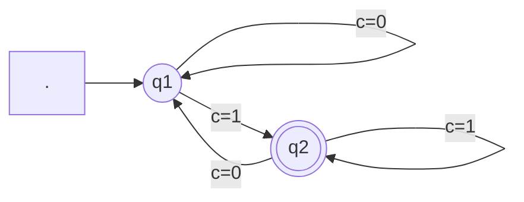
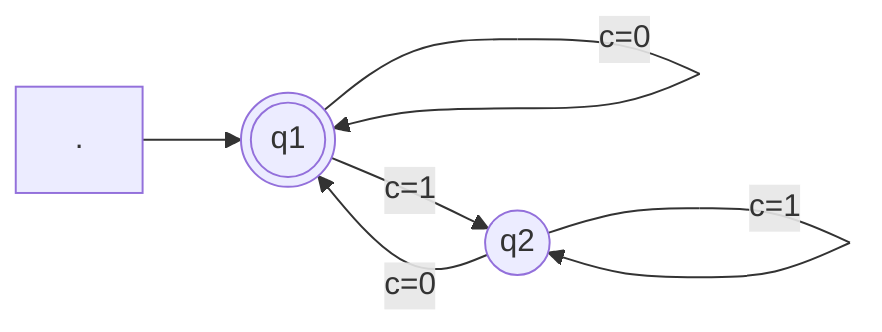
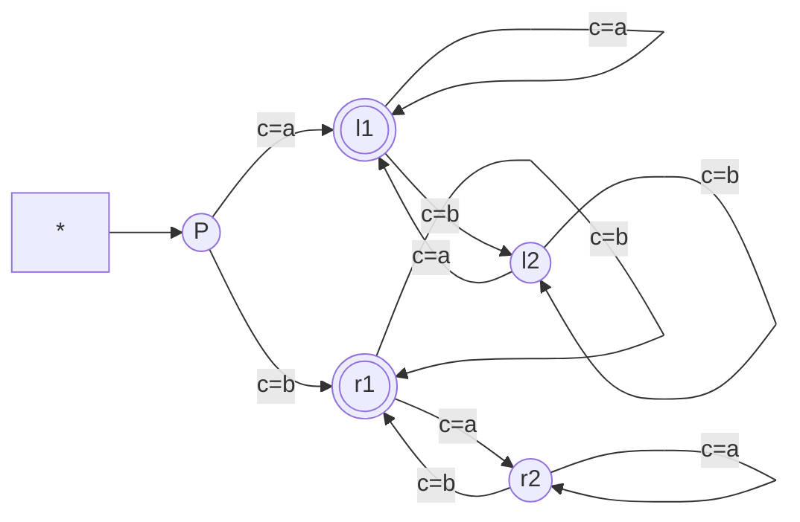

## 有限状态机

确定性有限状态机的定义(Deterministic Finite Automaton)
5元组$M=(Q,\Sigma,q_0,F,\delta)$称为确定性有限状态机, 其中
1. 状态集: 有限集合$Q$
2. 字母表: 有限集合$\Sigma$
3. 初始状态: $q_0\in Q$
4. 接受状态集: $F\subseteq Q$
5. 转移函数: $\delta: Q\times\Sigma\to Q$

示例1: $M_1=(Q=\{q_1,q_2\},\Sigma=\{0,1\},q_1,\{q_2\},\delta)$
如图可知, $L(M_1)=\{w|w.endwith(1)\}$

示例2: $M_2=(Q=\{q_1,q_2\},\Sigma=\{0,1\},q_1,\{q_1\},\delta)$
如图可知, $L(M_2)=\{w|w.startwith(0)\lor w=\epsilon\}$

示例3: $M_3=(Q=\{P,l1,l2,r1,r2\},\Sigma=\{a,b\},P,\{l1,r1\},\delta)$
如图可知: $L(M_3)=\{w|w.startwith(a).endwith(a)\lor w.startwith(b).endwith(b)\}$

------

非确定性有限状态机的定义(Non-deterministic Finite Automaton)
5元组$N=(Q,\Sigma,q_0,F,\delta)$称为非确定性有限状态机, 其中
1. 状态集: 有限集合$Q$
2. 字母表: 有限集合$\Sigma$
3. 初始状态: $q_0\in Q$
4. 接受状态集: $F\subseteq Q$
5. 转移函数: $\delta: Q\times\Sigma\cup\{\epsilon\}\to 2^Q$

示例1: $N_1=(Q=\{q_1,q_2,q_3,q_4\},\Sigma=\{0,1\},q_1,\{q_4\},\delta)$

| $\delta$ | 0           | 1             | ϵ           |
| -------- | ----------- | ------------- | ----------- |
| $q_1$    | $\{q_1\}$   | $\{q_1,q_2\}$ | $\emptyset$ |
| $q_2$    | $\{q_3\}$   | $\emptyset$   | $\{q_3\}$   |
| $q_3$    | $\emptyset$ | $\{q_4\}$     | $\emptyset$ |
| $q_4$    | $\{q_4\}$   | $\{q_4\}$     | $\emptyset$ |

| $\delta$ | 0           | 1                 |
| -------- | ----------- | ----------------- |
| $q_1$    | $\{q_1\}$   | $\{q_1,q_2,q_3\}$ |
| $q_2$    | $\{q_3\}$   | $\emptyset$       |
| $q_3$    | $\emptyset$ | $\{q_4\}$         |
| $q_4$    | $\{q_4\}$   | $\{q_4\}$         |

$\Epsilon(q_2)=\{q_2,q_3\}$

示例2: 已知语言$L_3=\{0^k=\underbrace{0\cdots0}_k,2|k\lor3|k\}$, 则其NFA为

------

DFA $\iff$ NFA
确定性有限状态机 等价于 非确定性有限状态机
$\implies$: 每个DFA都是NFA, 得证
$\impliedby$: 设NFA有k个状态, 则它有$2^k$种状态子集
已知识别语言$A\subseteq\Sigma^*$的NFA为$N=(Q,\Sigma,q_0,F,\delta)$
现欲构造DFA为$M=(Q',\Sigma,q_0',F',\delta')$, 使得$L(M)=A$
定义点集R能够沿$\epsilon$到达的点的集合$\Epsilon(R)=\{q\in Q|\exists r\in R,k\in\mathbb{N},q\in\delta^k(r,\epsilon)\}$
1. 状态集: $Q'=2^Q=\{S|S\subseteq Q\}$
2. 字母表: $\Sigma=\Sigma$
3. 起始状态: $q_0'=\Epsilon(\{q_0\})$
4. 接受状态集: $F'=\{R\in 2^Q|R\cap F\neq\emptyset\}$
5. 转移函数: $\delta'(R,c)=\bigcup_{r\in R}\Epsilon[\delta(r,c)]$

示例:

------

有限状态机所接受的字符串的定义(String of Finite Automaton)
已知有限状态机$M=(Q,\Sigma,q_0,F,\delta)$,
如果M接受字符串$w=(c_1,c_2,\cdots,c_n)\in\Sigma^*$,
那么说明存在状态序列$(q_0,q_1,\cdots,q_n), q_i\in Q$满足
1. 初始状态: $q_0=q_0$
2. 递推过程: $\delta(q_i,c_{i+1})=q_{i+1},i\in\{0,\cdots,n-1\}$
3. 终止状态: $q_n\in F$

有限状态机所接受的语言的定义(Language of Finite Automaton)
已知有限状态机$M=(Q,\Sigma,q_0,F,\delta)$, 
则其接受的语言为$L(M)=\{w\in\Sigma^*|\delta(q_0,w)\in F\}$
如果该机器不接受任何字符串, 那么$L(M)=\emptyset$

## 正则语言

正则语言的定义(Regular Language)
已知字母表$\Sigma$, 其上有语言$A\subseteq\Sigma^*$,
如果存在有限状态机$M$, 使得$L(M)=A$, 则称$A$为正则语言

------

正则语言在并运算下封闭
通过构造NFA证明: 已知正则语言$A_1\leftrightarrow N_1,A_2\leftrightarrow N_2$
其中$N_1=(Q_1,\Sigma,q_1,F_1,\delta_1),N_2=(Q_2,\Sigma,q_2,F_2,\delta_2)$
现欲构造有限状态机N, 使得$A_1\cup A_2\leftrightarrow N=(Q,\Sigma,q_0,F,\delta)$
1. 状态集: $Q=\{q_0\}\cup Q_1\cup Q_2$
2. 字母表: $\Sigma=\Sigma$
3. 起始状态: $q_0$
4. 接受状态集: $F=F_1\cup F_2$
5. 转移函数: $\delta(q,a)
=\left\{\begin{array}{ll}
\emptyset &q=q_0\land c\neq\epsilon\\
\{q_1,q_2\} &q=q_0\land c=\epsilon\\
\delta_1(q,a) &q\in Q_1\\
\delta_2(q,a) &q\in Q_2\\
\end{array}\right.$

------

正则语言在连接运算下封闭
通过构造NFA证明: 已知正则语言$A_1\leftrightarrow N_1,A_2\leftrightarrow N_2$
其中$N_1=(Q_1,\Sigma,q_1,F_1,\delta_1),N_2=(Q_2,\Sigma,q_2,F_2,\delta_2)$
现欲构造有限状态机N, 使得$A_1\circ A_2\leftrightarrow N=(Q,\Sigma,q_0,F,\delta)$
1. 状态集: $Q=Q_1\cup Q_2$
2. 字母表: $\Sigma=\Sigma$
3. 起始状态: $q_0=q_1$
4. 接受状态集: $F=F_2$
5. 转移函数: $\delta(q,a)
=\left\{\begin{array}{ll}
\delta_1(q,a) &q\in Q_1\land q\notin F_1\\
\delta_1(q,a) &q\in F_1\land a\neq\epsilon\\
\delta_1(q,\epsilon)\cup\{q_2\} &q\in F_1\land a=\epsilon\\
\delta_2(q,a) &q\in Q_2\\
\end{array}\right.$

------

正则语言在闭包运算下封闭
通过构造NFA证明: 已知正则语言$A_1\leftrightarrow N_1=(Q_1,\Sigma,q_1,F_1,\delta_1)$
现欲构造有限状态机N, 使得$A_1^*\leftrightarrow N=(Q,\Sigma,q_0,F,\delta)$
1. 状态集: $Q=\{q_0\}\cup Q_1$
2. 字母表: $\Sigma=\Sigma$
3. 起始状态: $q_0$
4. 接受状态集: $F=F_1\cup\{q_0\}$
5. 转移函数: $\delta(q,a)
=\left\{\begin{array}{ll}
\emptyset &q=q_0\land a\neq\epsilon\\
\{q_1\} &q=q_0\land a=\epsilon\\
\delta_1(q,a) &q\in Q_1\land q\notin F_1\\
\delta_1(q,a) &q\in F_1\land a\neq\epsilon\\
\delta_1(q,\epsilon)\cup\{q_1\} &q\in F_1\land a=\epsilon\\
\end{array}\right.$

## 正则表达式

正则表达式的定义(Regular Expression)
已知字母表$\Sigma$, 则$\Sigma$上的正则表达式定义如下
1. $\emptyset\iff L(\emptyset)=\emptyset$
2. $\epsilon\iff L(\epsilon)=\{\epsilon\}$
3. $a\in\Sigma\iff L(a)=\{a\}$
4. $R_1^*\iff L(R_1^*)=L(R_1)^*$
5. $R_1\circ R_2\iff L(R_1\circ R_2)=L(R_1)\circ L(R_2)$
6. $R_1\cup R_2\iff L(R_1\cup R_2)=L(R_1)\cup L(R_2)$
7. 运算优先级: $(*)>(\circ)>(\cup)$

语言是正则语言, 当且仅当可以用正则表达式描述
$\impliedby$: 欲找出每种正则表达式对应的有限状态机
1. $\emptyset\iff L(\emptyset)=\emptyset$: 
2. $\epsilon\iff L(\epsilon)=\{\epsilon\}$: 
3. $a\in\Sigma\iff L(a)=\{a\}$: 
4. $R_1^*,R_1\circ R_2,R_1\cup R_2$: 正则语言运算封闭

$\implies$: 欲将DFA转换为等价的正则表达式(需要GNFA)

------

广义非确定性有限状态机的定义(Generalized Non-deterministic Finite Automaton)
<转移函数为正则表达式的NFA>
5元组$N=(Q,\Sigma,q_{start},q_{accept},\delta)$称为广义非确定性有限状态机, 其中
1. 状态集: 有限集合$Q$
2. 字母表: 有限集合$\Sigma$
3. 起始状态: $q_{start}\in Q$
4. 接受状态: $q_{accept}\in Q$
5. 转移函数: 类似网络流, 且任何状态到自身和其他状态都有箭头
    $\delta: Q\setminus\{q_{accept}\}\times Q\setminus\{q_{start}\}\to\mathcal{R}$,
    其中$\mathcal{R}$是 该状态转移 对应接收的正则表达式
    (已证明正则表达式对应的语言是正则语言)

将DFA转换为对应的GNFA
1. 添加新的起始状态和接受状态
2. 新起始状态$\overset{\epsilon}{\to}$原起始状态
2. 原接受状态集$\overset{\epsilon}{\to}$新接受状态
3. 将多个同向箭头合并为正则表达式的并

GNFA转换为正则表达式: CONVERT(G)
1. 已知G的状态数为k
2. 如果k=2, 直接返回最终的正则表达式
3. 如果k>2, 任取中间状态$q_{rip}\in Q\setminus\{q_{start},q_{accept}\}$
    构造$G'=\text{GNFA}(Q',\Sigma,q_{start},q_{accept},\delta')$, 其中$Q'=Q\setminus\{q_{rip}\}$
    并且对任意$q_i\in Q'\setminus\{q_{accept}\},q_j\in Q'\setminus\{q_{start}\}$
    转移函数更新为$\delta'(q_i,q_j)=R_1R_2^*R_3\cup R_4$, 其中
    $R_1=\delta(q_i,q_{rip}),R_2=\delta(q_{rip},q_{rip}),R_3=\delta(q_{rip},q_j),R_4=\delta(q_i,q_j)$
4. 继续递归计算 CONVERT(G')

## 判定非正则语言

正则语言的泵引理(Pumping Lemma for Regular Languages)
已知正则语言A, 则存在泵长度p (NFA状态数)
使得对于A中任意长度不小于p的字符串$|s|\geq p$
都可以分成三段, 即s=xyz, 且满足
1. 左部限长: $|xy|\le p$
2. 中部吸收: $\forall i\in\mathbb{N}, xy^iz\in A$
3. 中部非空: $|y|>0$

证明: 已知识别A的DFA为$M=(Q,\Sigma,q_1,F,\delta)$, 其状态数为p
取A中长度为n的字符串$s=s_1s_2\cdots s_n$, 其中$n\ge p$
则M处理s时经过的状态序列为$r_1,r_2,\cdots,r_{n+1}$
因为$n\ge p\implies n+1\ge p+1>p$, 
故由鸽笼原理可知 前p+1个状态中会出现重复
将出现重复的左侧状态记为$r_a$, 右侧状态记为$r_b$
即: $r_1(\overset{s_1}{\to}r_2\overset{s_2}{\to}\cdots\overset{s_{a-1}}{\to})r_a(\overset{s_a}{\to}\cdots\overset{s_{b-1}}{\to})r_b(\overset{s_b}{\to}\cdots\overset{s_n}{\to})r_{n+1}$
令$x=s_1\cdots s_{a-1},y=s_a\cdots s_{b-1},z=s_b\cdots s_n$
1. 左部限长: $a<b\le p+1\implies |xy|=b-1\le p$
2. 中部吸收: $r_a\overset{y}{\to}r_b=r_a\implies\forall i\in\mathbb{N}, xy^iz\in A$
3. 中部非空: $a<b\implies a\le b-1\implies y=s_a\cdots s_{b-1}\neq\epsilon\implies|y|>0$