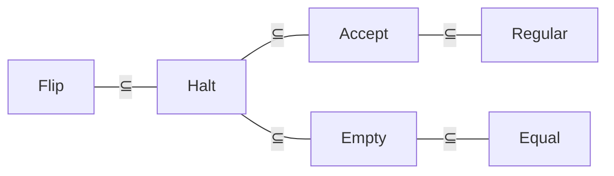

## 图灵机运行时间

图灵机运行时间的定义
<最弱模型来模拟最强模型 只导致时间按平方增长>
已知算法函数$f:\{0,1\}^*\to\{0,1\}$和时间函数$T:\mathbb{N}\to\mathbb{N}$
如果图灵机M最多只需$T(|x|)$步就能确定$f(x)$, 则称M在$T(n)$时间内计算$f$

----

限定字母表后的时间增量(01 Alphabet)
已知算法函数$f:\{0,1\}^*\to\{0,1\}$
如果字母表$\Gamma$上的图灵计算时间为$T(n)$
那么存在字母表$\{0,1\}$上的图灵机, 计算时间为$3\log|\Gamma|T(n)$

证明: 将$\Gamma$中的每个符号用$\log|\Gamma|$位进行编码
1. 让每个带头右移$\log|\Gamma|$进行读值, 存储到状态编码中
2. 依照M的转移函数进行状态跳转
3. 让每个带头左移$\log|\Gamma|$进行写值
4. 让每个带头按需移动$\log|\Gamma|$

----

限定单带后的时间增量(Single Tape)
已知算法函数$f:\{0,1\}^*\to\{0,1\}$
如果k带图灵机的计算时间为$T(n)$
那么存在单带图灵机, 计算时间为$kT^2(n)$

证明: 构造模拟带, 其为k条纸带的交替拼接, ^用于标记读写头
将第一条带编码为位置$1,k+1,2k+1,3k+1,4k+1,\cdots$
将第二条带编码为位置$2,k+2,2k+2,3k+2,4k+2,\cdots$
k带转移函数: $\delta:Q\times\Gamma^k\to Q\times\Gamma^k\times\{L,R,S\}^k$
|        |                  |                  |                  |          |
| ------ | ---------------- | ---------------- | ---------------- | -------- |
| 纸带a  | $a_1$            | $a_2$            | $a_3$            | $\cdots$ |
| 纸带b  | $b_1$            | $b_2$            | $b_3$            | $\cdots$ |
| 纸带c  | $c_1$            | $c_2$            | $c_3$            | $\cdots$ |
| 模拟带 | $a_1b_1\hat c_1$ | $a_2\hat b_2c_2$ | $\hat a_3b_3c_3$ | $\cdots$ |

1. 从左到右扫描模拟带, 读取并记录所有带^的字符
2. 根据k带的转移函数, 来决定下一次每个带的状态
3. 从右到左扫描模拟带, 更新所有带^的字符

(1)阶段耗时: 纸带长度$kT(n)$
(3)阶段耗时: 纸带长度$kT(n)$, 更新标记$k*k$
三阶段共耗时$O[kT(n)]+O[kT(n)+k^2]=O(kT(n))$
执行$T(n)$回合, 总计时间为 $O(kT(n))\times O(T(n))=O(kT^2(n))$

----

限定单向后的时间增量(Single Direction)
已知算法函数$f:\{0,1\}^*\to\{0,1\}$
如果双向图灵机的计算时间为$T(n)$
那么存在单向图灵机, 计算时间为$2T(n)$

证明: 构造模拟带, 其为双向纸带的正负交替拼接
|          |          |       |       |       |       |       |          |
| -------- | :------: | :---: | :---: | :---: | :---: | :---: | :------: |
| 双向纸带 | $\cdots$ | $-2$  | $-1$  |  $0$  |  $1$  |  $2$  | $\cdots$ |
| 模拟带   |   $0$    | $-1$  |  $1$  | $-2$  |  $2$  | $-3$  | $\cdots$ |

对于模拟带, 状态更新时需要左移或右移两位
故总计时间为$O(2T(n))$

----

内存图灵机的定义(Random Access Turing Machine)
<$M=(Q,\Sigma,\Gamma,q_0,q_{accept},q_{reject},Q_{access},\delta,Mem)$>
纸带字母表: 添加读写操作符$R,W\in\Gamma$
转移函数: $\delta:Q\times\Gamma^k\to Q\times\Gamma^k\times\{L,R,S\}^k$
有访存状态集$Q_{access}\subseteq Q$, 如果处于$q\in Q_{access}$则执行
1. 若当前内存带为$011R$, 则从内存$Mem[110_{2}]$处读取数据到地址带
2. 若当前内存带为$011W\sigma$, 则向内存$Mem[110_{2}]$处写入数据$\sigma$

|                |     |     |     |     |                   |     |          |          |
| -------------- | --- | --- | --- | --- | ----------------- | --- | -------- | -------- |
| 索引           | 0   | 1   | 2   | 3   | 4                 | 5   | 6        | $\cdots$ |
| 内存带         |     |     |     |     |                   |     | $\sigma$ | $\cdots$ |
| 地址带(读操作) | 0   | 1   | 1   | R   | $\sigma^\swarrow$ |     |          |          |
| 地址带(写操作) | 0   | 1   | 1   | W   | $\sigma^\nearrow$ |     |          |          |

----

限定无内存后的时间增量(None Memory)
已知算法函数$f:\{0,1\}^*\to\{0,1\}$
如果内存图灵机的计算时间为$T(n)$
那么存在多带图灵机, 计算时间为$T^3(n)$
特别地, 若地址长度为$O(1)$, 那么时间缩短为$T^2(n)$

证明: 对于多带图灵机, 构造内存模拟带来放访存操作对$(i,R[i])$
当内存图灵机处于访存操作$q\in Q_{access}$时, 执行以下操作
1. 扫描内存模拟带, 寻找具有匹配地址的访存操作对
2. 若不存在匹配地址的操纵对, 则新增操作对$(i,R[i])$
3. 相应地对该访存操作对进行读写

操作对的个数$\leq T(n)$
操作对的长度$\leq T(n)$
故模拟内存带的长度$\leq T^2(n)$
所以步骤(1)需要耗时$O(T^2(n))$
执行$T(n)$回合, 总计时间为$O(T^3(n))$

## 通用图灵机

通用图灵机的定义(Universal Turing Machine)
<能模拟图灵机运行过程的图灵机>
已知图灵机编码a和输入字符串x, 通用图灵机$U(a,x)=M_a(x)$, 

高效通用图灵机(Efficient Universal Turing Machine)
<能够快速模拟任意多带图灵机的执行过程>
如果$M_a$的计算时间为$T(n)$,
那么存在高效$U(a,x)$, 计算时间为$T\log T$

------

首先证明宽松形式$O(T^2)$:
构造五条纸带: 输入带 主工作带 模型工作带 状态工作带 输出带
1. 输入带: 图灵机编码a 输入字符串x
2. 主工作带: 用k元组模拟M的k条工作带
    当M的k个带头分别独立移动时, 主工作带采用"带头不动带子动",
    把每层都按相应方向进行整层移动
3. 模型工作带: 存放M的所有转移函数规则
4. 状态工作带: 存放M的对应当前状态

读写纸带元组: $O(1)$
查找转移函数: $O(|a|)$
移动整层纸带: $O(T)$
执行T回合的总时间: $O(T^2)$

------

然后将其优化为高效形式$O(T\log T)$:
为避免每次都移动整层, 引入缓冲符号$\boxtimes$
|          |       |       |       |       |
| -------- | ----- | ----- | ----- | ----- |
| 右侧区间 | $R_0$ | $R_1$ | $R_2$ | $R_3$ |
| 左侧区间 | $L_0$ | $L_1$ | $L_2$ | $L_3$ |
| 区间宽度 | $2^1$ | $2^2$ | $2^3$ | $2^4$ |

约束条件:
1. 每个区间要么全满(无缓冲), 要么半满(半缓冲), 要么全空(全缓冲)
2. 区间$R_i$与$L_i$互补, 即要么$R_i$满$L_i$空, 要么$R_i$空$L_i$满, 要么都是半满
3. 0号位的数据永远不会是缓冲符号$\boxtimes$

当该层进行左移操作时:
1. 将0号位移动到草稿带
2. 向右扫描, 直到遇见非空区间$R_i$
3. 将$R_i$的一半数据移动到$0,R_0,\cdots,R_{i-1}$
    使得这些空区间成为半满($1+2^0+2^1+\cdots+2^{i-1}=2^i$)
4. 由约束条件可知, 当前$L_{i-1},\cdots,L_0$为全满, $L_i$为半满或全空
    故可将$\{L_{i-1},\cdots,L_0\}$中的数据依次左移到$\{L_i,\cdots,L_1\}$
    最后再将0号位从草稿带移动到 刚刚空出来的$L_0$

考虑最坏情况: 某次左移遇见$R_i$, 使得$R_0-R_{i-1}$成为半满
如果带子此后一直左移, 要移动$2^0+\cdots+2^{i-1}=2^i-1$次将半满全清空后
再进行一次左移才能再次遇见$R_i$, 故两次遇见$R_i$的移动至少间隔$2^i$次

由于带子至多移动T次, 那么对区间$R_i$的移动不超过$\frac{T}{2^i}$次
每次移动区间$R_i$需要耗时$O(2^i)$(右侧-草稿带-右侧 左侧-草稿带-左侧)
最多有$\log T$个区间, 故总时间为$O[\sum_i^{\log T}\frac{T}{2^i}O(2^i)]=O(T\log T)$

## 多项式复杂性类

DTIME记号的定义(Decidable Time Complexity Class)
称语言$L\in D_{time}(T)$, 当且仅当存在判定器计算时间为$T(n)$

非确定性图灵机的定义(Non-deterministic Turing Machine)
有两个转移函数$\delta_0,\delta_1$和特殊状态$q_{accept}$
每个步骤中都可任意选用两个转移函数之一(类似于穷举$\{0,1\}^*$)
如果**存在某个**转移函数的选用序列, 最终进入状态$q_{accept}$, 则接受输入

NDTIME记号的定义(Non-deterministic Time Complexity Class)
称语言$L\in ND_{time}(T)$, 当且仅当存在非确定性判定器计算时间为$O(T)$

------

P类问题的定义
能在多项式时间内求解, 即$P=\bigcup D_{time}(n^c)$

NP类问题的定义一
<能在多项式时间内验证, 但总能在指数时间内通过穷举求解>
已知语言$L\subseteq\{0,1\}^*$, 称L属于NP类问题
如果存在多项式时间图灵机M(称作验证器):
$\forall x\in \{0,1\}^*,x\in L\iff\exists u\in\{0,1\}^{n^c},M(x,u)=1$
其中将u称为关于x的证明, 例如SAT问题中的u是使范式为真的一种赋值方式

NP类问题的定义二
<能通过NDTM在多项式时间内 通过穷举转移函数求解>
$NP=\bigcup ND_{time}(n^c)$

NP问题的两种定义是等价的
$\impliedby$: 已知语言L可被多项式时间NDTM判定
那么存在转移函数的选择序列u, 使得x进入状态$q_{accept}$
那么可构造验证器TM, 在多项式时间内沿着u来验证$M(x,u)=1$
$\implies$: 已知语言L有多项式验证器为$M(x,u)$, 现欲构造多项式NDTM
对于所有转移函数的选用序列 $u\in\{0,1\}^*$ (其中选择$\delta_0$输出0,选择$\delta_1$则输出1)
运行多项式验证器M, 如果$M(x,u)=1$, 则将此时所处状态标记为$q_{accept}$

## 多项式时间归约

多对一归约的定义(Many-One Reduction|Karp Reduction)
已知语言$A,B\subseteq\{0,1\}^*$, 称$A\leq_m B$
存在多项式停机函数$f$, 使得$\forall x\in\{0,1\}^*,x\in A\iff f(x)\in B$
<也就是说, 语言A的字符串, 都可经过多项式时间转换后被B判定>
<说明B的判定能力要比A更强, 也说明语言B对应的问题更难>

图灵归约的定义(Turing Reduction|Cook Reduction)
已知语言$A,B\subseteq\{0,1\}^*$, 称$A\leq_T B$
能够使用语言B的判定器作为子程序, 来构造语言A的判定器

已知归约关系$A\leq B$, 那么
1. 如果B是可判定的, 那么A也是可判定的
2. 如果A是不可判定的, 那么B也是不可判定的

------

莱斯定理(Rice's theorem)
<图灵可识别语言的所有非平凡属性都是不可判定的>
对于任意属性P, 如果存在图灵机$M_1$和$M_2$, 
使得$L(M_1)\in P\land L(M_2)\notin P$, 那么属性P是不可判定的

用反证法证明: 已知满足属性P的图灵机$G_p\in P$
假设属性$P$可判定, 那么存在判定器$A(M)=\begin{cases}接受&M\in P\\拒绝&M\notin P\end{cases}$

用$G_p$和$A$来构造停机判定器$\text{Halt}(M,w)$
1. 首先构造通用模拟器$T_{M,w}(x)$:
   1. 模拟$M(w)$的全部运行过程
   2. 模拟$G_p(x)$并输出相同结果
2. 然后将构造好的$T_{M,w}$作为输入, 
    让属性P的判定器来判定$A(T_{M,w})$, 并输出相同结果

如果$M(w)$不能停机, 那么$T_{M,w}$也不能停机 ==><拒绝>
如果$M(w)$能够停机, 那么$T_{M,w}\in P$ ==><接受>
因此满足图灵归约$\text{Halt}\leq_T \text{P}$, 故属性P是不可判定的

------

1. 反对角线: $L_{flip}=\{M|M不接受位串\langle M\rangle)\}\\
    D_{flip}=\begin{cases}拒绝 & 如果M接受位串\langle M\rangle \\
    接受 & 如果M死循环或拒绝位串\langle M\rangle\end{cases}$
2. 图灵停机: $L_{halt}=\{(M,w)|M(w)停机\}\\
    D_{halt}=\begin{cases}接受 & 如果M(w)停机 \\
    拒绝 & 如果M(w)死循环\end{cases}$
3. 图灵接受: $L_{accept}=\{(M,w)|M(w)接受\}$
4. 图灵正则: $L_{regular}=\{M|L(M)是正则语言\}$
5. 图灵空集: $L_{empty}=\{M|L(M)=\emptyset\}$
6. 图灵相等: $L_{equal}=\{(M,N)|L(M)=L(N)\}$

$L_{flip}\leq_T L_{halt}$, 即可用$D_{halt}$构造出$D_{flip}$:
$D_{flip}=\begin{cases}
    接受 & 如果D_{halt}(M,\langle M\rangle)拒绝, 即陷入死循环 \\
        & 如果D_{halt}(M,\langle M\rangle)接受, 即能够停机并模拟 \\
    接受 & \quad 模拟结果为拒绝 \\
    拒绝 & \quad 模拟结果为接受 \\
\end{cases}$

## 布尔可满足性问题(SAT)

布尔公式可满足的定义(Satisfiable)
已知布尔公式$\phi(u_1,\cdots,u_n)$
如果存在赋值$z=(z_1,\cdots,z_n)$使得$\phi(z)=1$, 
则称$\phi$为可满足的, 否则称$\phi$为不可满足的

合取范式的定义(CNF, Conjunctive Normal Form)
<形如$(x_{11}\lor\cdots\lor x_{1t_1})\land\cdots\land(x_{n1}\lor\cdots\lor x_{nt_n})$>
其中将$(\bigvee_j x_{ij})$称为子句(clause), $x_{ij}$称为文字(literal)
如果子句最多包含k个文字, 则称为k-CNF, 将其中可满足的称为k-SAT

任意布尔函数$f:\{0,1\}^n\to\{0,1\}$, 都存在对应n-CNF公式, 长度为$n2^n$
证明: 任意$v\in\{0,1\}^n$, 都存在长度为n的或子句$C_v(x)=0\iff x=v$
例如 $1101_2\iff(\lnot x_1\lor\lnot x_2\lor x_3\lor\lnot x_4)$
如果已知$f(x)=0\iff x\in\{v_1,\cdots,v_k\},k\leq 2^n$
那么可构造$\phi=C_{v_1}\land C_{v_2}\land\cdots\land C_{k}$, 且长度至多为$n2^n$

------

库克-勒维定理(Cook-Levin Theorem)
1. SAT问题是NP-完全问题
2. 3-SAT问题是NP-完全问题

首先证明$\text{SAT}\in \text{NP}$:
对于任意可满足的布尔表达式, 若给出一个可满足的赋值, 
那么可以在多项式时间内将该赋值代入表达式进行验证

然后证明$\forall L\in \text{NP},L\leq_m \text{SAT}$:
已知判定语言L的非确定性图灵机$M_L$
现欲找到多项式停机函数$f:L\to\text{SAT}:f(x)=\phi_x$
满足$M_L(x)=1\iff x\in L\iff\phi_x\in\text{SAT}$
<$存在接受格局序列\{Z_1,\cdots,Z_k\}\iff代入布尔表达式得到\phi_x(Z)=1$>

------

| 格局变量    |                        |
| ----------- | ---------------------- |
| $T_{i,c,k}$ | 第k步时第i格是字符c    |
| $H_{i,k}$   | 第k步时读写头指向第i格 |
| $Q_{q,k}$   | 第k步时状态为q         |

| 约束表达式                                                                                      |                                  |                         |
| ----------------------------------------------------------------------------------------------- | -------------------------------- | ----------------------- |
| $T_{i,x_i,k=0}$                                                                                 | 初始输入x                        | $O(T)$                  |
| $Q_{q_0,k=0}$                                                                                   | 初始状态$q_0$                    | $O(1)$                  |
| $H_{0,k=0}$                                                                                     | 初始读写头                       | $O(1)$                  |
| $T_{i,\exists c,k}\lor\neg(T_{i,c,k}\land T_{i,c',k+1})$                                        | 每时每格有且仅有一个元素         | $O(T^2)\|\Sigma\|^2$    |
| $Q_{\exists q,k}\lor\neg(Q_{q,k}\land Q_{q',k})$                                                | 每时有且仅有一个状态             | $O(T)\|Q\|^2$           |
| $H_{\exists i,k}\lor\neg(H_{i,k}\land H_{i',k})$                                                | 每时有且仅有一个读写头           | $O(T)\|T\|^2$           |
| $T_{i,c,k}\lor T_{i,c',k+1}\to H_{i,k}$                                                         | 每时每格被写处有读写头 | $O(T^2)\|\Sigma\|^2$    |
| $(H_{i,k}\land Q_{q,k}\land T_{i,c,k})\\\to\bigvee\limits_{((q,a),(q',c',d))\in\delta}(H_{i+d,k+1}\land Q_{q',k+1}\land T_{i,c',k+1})$                                                      | 每时每格非确定性转移函数                 | $O(T^2)\|Q\|\|\Sigma\|$ |
| $\bigvee\limits_{0\le k\le T}\bigvee\limits_{h\in\text{Halt} }Q_{h,k}$                          | 在多项式时间内停机               | $O(T)\|Q\|$             |

定义$\phi_x$为上述表达式的合取
如表格所示, $\phi_x$的长度最多为$O(T^3)$, 故$f$是多项式时间映射
现欲证明当前构造的映射满足$x\in L\iff M(x)=1\iff f(x)\in\text{SAT}$
$\implies$: 若NDTM判定x, 那么说明存在某个可能的格局序列$Z=(z_1,\cdots,z_k)$使其接受并停机
用该格局序列Z给变量赋值$Y=(T_{i,c,k},H_{i,k},Q_{q,k})$, 即可得到$\phi_x(Y)=1$, 说明$\phi_x$可满足
$\impliedby$: 若$\phi_x$可满足, 那么说明存在某个可能的变量赋值方式$Y=(T_{i,c,k},H_{i,k},Q_{q,k})$使其为真
构造格局$Z=(z_1,\cdots,z_k)$并模拟, 即可得到$M(Z)=1$, 说明$x$可被NDTM判定

### [将任意SAT归约到3SAT](https://opendsa-server.cs.vt.edu/ODSA/Books/Everything/html/SAT_to_threeSAT.html)

给定任意SAT布尔公式$C_1\land C_2\land\cdots\land C_n$
那么它的或子句只会有以下四种情况:
1. 恰好包含3个文字: $(x_1+\bar x_2+x_3)$
2. 包含1个文字: $(x_1)$
3. 包含2个文字: $(x_1+\bar x_2)$
4. 包含多于3个文字: $(x_1+\bar x_2+x_3+\cdots+x_k),k>3$

#### 包含1个文字

$C=(x_1)$
$Z=(x_1+Y_1+Y_2)*(x_1+\bar Y_1+Y_2)*(x_1+Y_1+\bar Y_2)*(x_1+\bar Y_1+\bar Y_2)$

#### 包含2个文字

$C=(x_1+x_2)$
$Z=(x_1+x_2+Y_1)*(x_1+x_2+\bar Y_1)$

#### 包含多于3个文字

$C=(x_1+x_2+\cdots+x_k)$
$Z=(x_1+x_2+Y_1)*(\bar Y_1+x_3+Y_2)*(\bar Y_2+x_4+Y_3)\cdots(\bar Y_{k-3}+x_{k-1}+x_k)$
要保持相抵链的成立, 每个子句中至少要有三个文字, 故最小只能归约到3-SAT
1. 当C恒为假时, 对于Z有$Y_1*\bar Y_1$相抵, $Y_2*\bar Y_2$相抵, $\cdots Y_{k-3}*\bar Y_{k-3}$相抵
    恰好使得Z也为假, 满足条件
2. 当C可为真时, 不妨设是$x_3=1$, 那么Z就会出现相抵链的破缺
    使得$Y_1=1$能取到, Z也为真, 满足条件