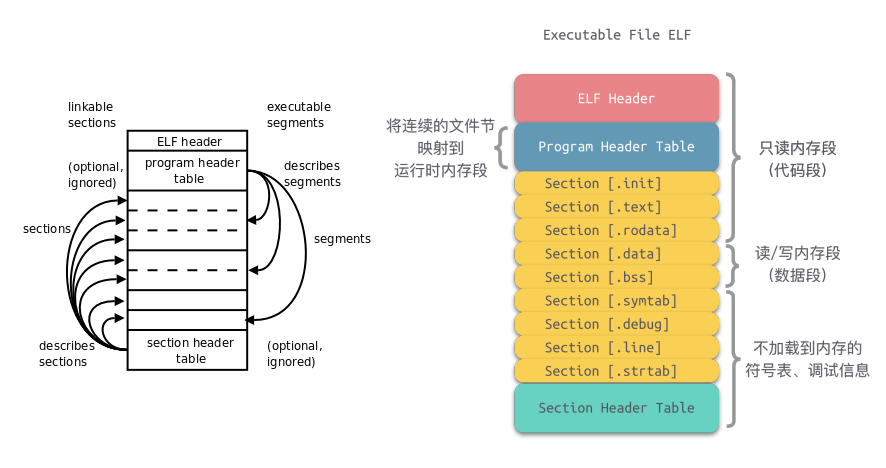
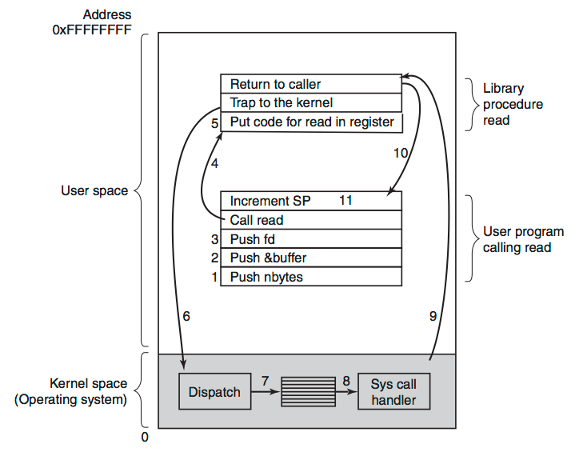
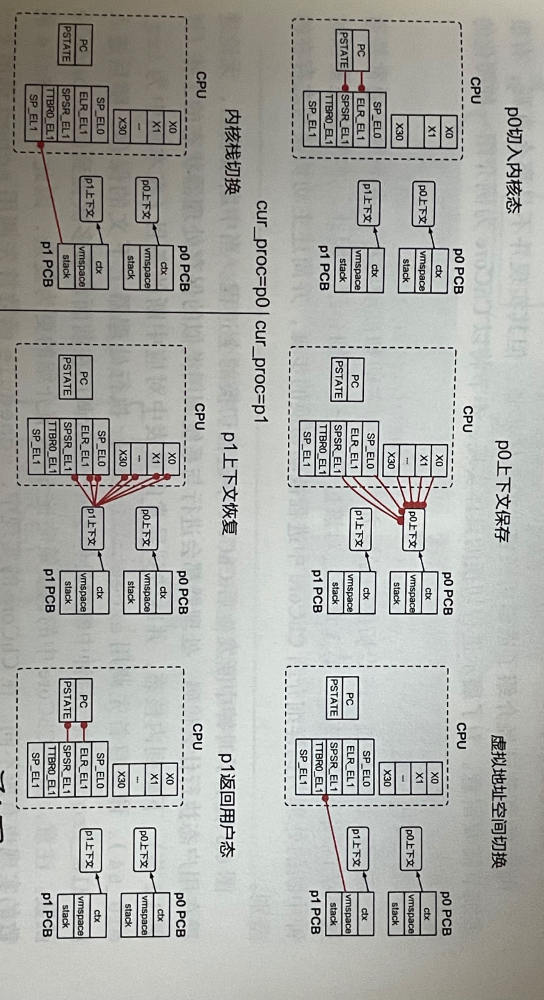
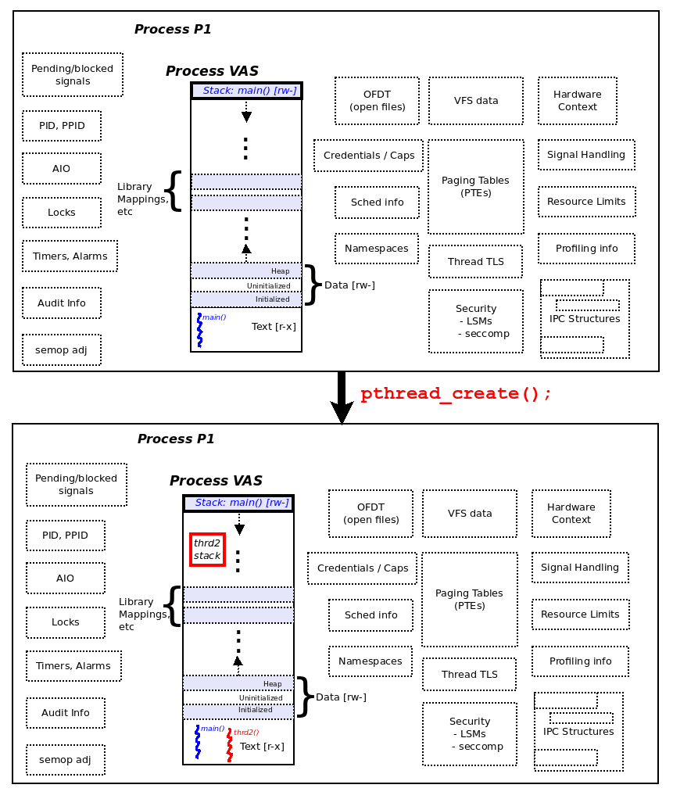
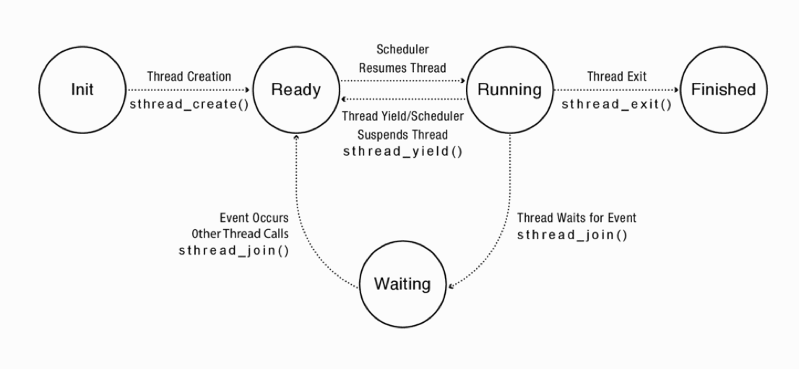

# 操作系统-02. 进程、线程与进程组

# (OS02:  Process, Threads, and Process Group)

**KEYWORDS** CPU Abstraction, Process Life-cycle, Threads, ULTs/KLTs, Kernel-free Thread Mechanism vs Policy

[核心一级，3学时]

>**要点综述**
>
>- 如何为用户程序抽象出一个其运行所需要的完整计算机（处理器的物理核数与虚拟计算机的数量解耦）
>- 如何隔离运行于同一台计算机上的用户程序
>- 进程接口的实现技术
>- 保证程序运行的效率且可控的实现机制
>- 如何在可控的前提下还能最大限度地满足用户程序和管理的多样性需求

>**学习成效**
>
>- 能充分理解处理器抽象的动机和潜在的挑战 [熟悉]
>- 能够权衡能力和灵活性而有针对性地设计机制和策略 [运用]
>- 能够论证操作系统应该提供怎样的进程来创建及控制接口，使之既方便又实用[评估]
>- 能够设计高效、可控地实现CPU虚拟化的机制 [理解]
>- 能够论证设计的合理性和效率 [评估]
>- 掌握并活用策略与机制分离的设计原则 [运用]

---------------------------------
[TOC]

> The program itself is a lifeless thing: it just sits there on the disk, a bunch of instructions (and maybe some static data), waiting to spring into action. **It is the operating system that takes these bytes and gets them running, transforming the program into something useful.**
>
> ​                           —— R. H. Arpaci-Dusseau & A. C. Arpaci-Dusseau[^Arpaci-Dusseau+2015]

从上一讲所学的知识我们可以得知：操作系统（[Operating Systems](https://en.wikipedia.org/wiki/Operating_system)）为它所承载的程序运行提供环境，这包括为程序的执行定义一个基本框架，并提供相关的服务和使用这些服务的接口。

- 操作系统通过虚拟化让计算机更为易用（应用隔离、独占幻像、系统调用封装服务涉及的琐碎细节）
- 操作系统让系统资源也通过虚拟化让计算机资源得以高效利用（保证应用互不干扰的前提下，资源在时空维度上的复用）

> **KEY-POINTS** 遵循思辨的研究方法，我们可以用5W（**W**hat/**W**hy/ho**w**/**W**hen/**W**here）要素作为抓手，探讨
>
> - 程序运行意味着什么？（What）
> - 如何描述程序的运行以及这是如何做到的？ （How）
> - 如何让多个程序感觉自己在独占计算机的处理器而运行？（Why/How）
> - 单粒度的运行实体是合理的设计吗？（When/Where）
>

我们已知操作系统为程序员编程提供了独享整个计算机系统的印象。这个程序设计带来了便利我们来用`process.c`体验一下这种感觉。

```c
/* process.c illustrates the process concept */
#include <unistd.h>
#include <stdio.h>
#include <stdlib.h>

int main(int argc, char *argv[])
{
  if (argc != 2) {
	  fprintf(stderr, "usage: process <string>\n");
	  exit(1);
  }
  char *str = argv[1];

  while (1) {
	  printf("(%d) tells %s\n", (int) getpid(), str);
	  sleep(1);
  }
  return 0;
}
```

酷，确实如此。在操作系统的帮助下，我们独立自主地编写程序，独立地按照`./process A`运行程序，程序按照代码的规定，每隔一秒输出一个带入的值，直到我们用`^C`终止其执行。

一个富于探索精神的人在计算机上按照下面的方式继续运行process.c，得到了以下的输出：

```shell
$ gcc -Wall -o process process.c 
$ ./process A & ./process B & ./process C &               
[1] 31585
[2] 31586
[3] 31587
leon@lark test % (31585) tells A
(31586) tells B
(31587) tells C
(31585) tells A
(31586) tells B
(31587) tells C
(31585) tells A
(31587) tells C
(31586) tells B
(31585) tells A
(31586) tells B
(31587) tells C
(31586) tells B
(31587) tells C
(31585) tells A
(31586) tells B
(31585) tells A
(31587) tells C
...
```

从上面屏幕的显示序列，你发现什么有趣的现象吗？

从这个例子我们至少能够观察到这样的几个现象：

1) 计算机可以执行多个程序（例如上面的3个）
2) 它们尽管来自于同一个程序，但并没有混乱（每个程序都有个编号，每个编号的程序都只输出规定给它的那个字符）
3) 这几个程序是“同时”在跑（因为每个程序隔一段时间就会重复出现，并未完结），类似听说过所谓的”并发执行“
4) 这几个程序的执行顺序和我们规定的不完全一致（规定的顺序是A-B-C）。

所以，从1)我们有了多道程序设计的感觉；从2)我们猜想可能每个实例有一个单独自我的空间；综合1) 、2)我们知道在原来程序的概念之上，需要新的概念来区分运行的程序实例；从第3)条我们可以猜测程序的执行是按走-停-继续走这个模式执行；综合3)和4)，我们又说不清这个走走停停是按照什么套路来完成的。

> **BACKGROUND** 
>
> **[多道程序设计（Multiprogramming）](https://www.wikipedia.org/?title=Multiprogramming)**[^Strachey1959]是让多个程序同时驻留内存而运行。引入多道程序设计技术的目的旨在提高资源，特别是处理器和内存的利用率，改善处理器的吞吐率（参见图2-1），充分发挥计算机系统各部件的并行性。多道程序设计是现代计算机系统的基本程序设计技术。
>
> 
>
> ​                     **图2-1** 处理器利用率与内存中进程数的函数关系[^Tanenbaum+2015]

事实上，多道程序设计的引入，带来诸多益处的同时，也给计算机的管理带来了许多新的挑战。例如，

- 程序的概念已不能完全区分运行的实例，需要新的概念
- 怎么刻画一个程序的运行，让它间歇式运行后再次恢复运行
- 如果两个程序都要运行，应该首先运行哪个
- 怎么记录程序执行到某一时刻的状态，如何保存和恢复现场，使程序得以继续呢
- 需保证两个不同的运行实例不会互相干扰
- 如果两个”同时运行的“实例访问共享变量，可能能影响程序行为的正确性
- 如果两个实例想彼此协作的话，需要得到支持
- 如果两个实例在竞争某个资源，应当保证有序供给而不会导致饥饿
- …...

要妥善处理这些新的问题，看上去在这3个运行的程序之外，需要有一个协调者或者仲裁者，决定什么时候哪个实例先运行，如果出现资源竞争，该怎么协调；如果存在竞态条件的风险，该如何防范。

大家肯定想到了，这个协调者或者仲裁者就是**操作系统**。

从上面process的例子， 我们感受到了多道程序设计。不过，问题来了。 这个环境里活动主体是谁呢，程序吗？那么两个来自同样的程序都在跑怎么区分？看来不行。因此，需要对运行着的主体引入一个新的概念 ——表示正在运行的某个程序，这样我们就可以独立地区分出每个运行主体了。

那么，如何表示一个运行的程序，如何区分同一个程序的多个运行实例，如何让物理上相互竞争资源的运行程序彼此逻辑上隔离？如何让多个运行的程序感觉自己独享一台计算机？这就需要一个抽象的概念——进程。

为有效地执行程序，操作系统对程序及其执行所需要的资源，管理这些程序和调配资源进行了有效的抽象——[进程（Process）](http://en.wikipedia.org/wiki/Process_(computing))[^Vyssotsky+1965]和[线程（Thread）](http://en.wikipedia.org/wiki/Thread_(computing))。前者是对运行着的程序及其相关信息的完整抽象，后者是在进程的基础上对程序执行线索及其状态的细化。可以认为，在现有的系统中，进程是程序运行资源的持有者，线程是执行主体的调度单位。

在进程概念的支持下，本讲重点讨论操作系统系统调用接口的实现过程。相关的参考资料见[^Chen+2023][^Zhang+2022]。

## 2.1 进程的概念

> *A program is a recipe , but the process is the activity to make the dish.* 
>
> ​							—— A.S. Tanenbaum & H. Bos[^Tanenbaum+2015]

[进程（Process）](https://en.wikipedia.org/wiki/Process_(computing))是现代通用操作系统的基本概念，代表运行的程序实例。自此，程序通过操作系统的控制下，由一堆静止的代码和数据，变成了具有生命周期的活动体（图2-2）。


​           **图2-2** 操作系统创建进程并调入程序完成其功能。那么图中的那个问号区域到底是个什么样子呢？

在进程概念的支持下，操作系统就可以通过**时空多重复用物理资源**，让进程需要资源时申请资源，获得资源，释放资源。从而在体验上感觉进程独享一台计算机的各种资源——即独占计算机的幻像。

这种被称为处理器分时的基本技术允许用户运行任意数量的并发进程。分时（Time-Sharing）机制[^Strachey1959]是现代通用操作系统，特别是支持交互式应用的操作系统的基本技术。

 **HINT** 注意，这种感觉没有注重时间因素。如果关注时间，则是一类特殊操作系统——实时操作系统的研究范围。

 **DISCUSSION** 

 1. 忽略时间因素的动机和可能性

```md
为了简化系统设计和资源管理
在许多应用中，处理器的使用效率和资源的最大化是首要目标

- 提高资源利用率：通过时间共享，多个进程可以并发运行，从而更有效地使用 CPU 和内存。
- 降低复杂性：省去实时调度算法的复杂性，使得操作系统更易于实现和维护。

可能性: 大部分应用场景（如文档编辑、网页浏览）不需要严格的时间控制，因此可以在不关注时间的情况下有效运行。
```


 2. 你所了解的应用中，有哪些是不得不依赖时间的呢

```md
- 实时控制系统：如工业自动化、飞机控制系统等，需要在特定时间内完成任务。
- 音视频处理：如视频会议、在线游戏等，需要保证音视频流的实时性，以避免延迟和卡顿。
- 金融交易系统：高频交易等需要在微秒级别内响应，以保证交易的实时性和准确性。
这些应用要求系统能够处理时间敏感的任务，确保在规定时间内完成。
```


 3. 我们现在的模型中，能够支持这些应用吗？如果能，请说明；如果不能，解释被卡在了什么地方

```md
在某些情况下，这种模型可能不足以支持时间敏感的应用：

- 支持的情况：对于一些非极端实时要求的应用，当前的分时机制可以通过优先级调度等技术来保证较好的响应时间。
- 不支持的情况：
    - 调度延迟：如果系统负载过高，调度延迟可能导致无法满足实时要求。
    - 资源竞争：多个实时进程竞争资源时，可能导致一些进程无法在规定时间内完成任务。
    - 缺乏确定性：现有的操作系统通常不提供确定性的调度，这对于实时需求而言是个问题。
```

4. 需要给进程添加那些属性，以便操作系统能够正确地管理它们

```md
- 优先级：用于区分进程的重要性，尤其是实时进程。
- 时间要求：定义进程的最迟完成时间和时间约束。
- 资源需求：包括CPU时间、内存、IO设备等的具体需求。
- 状态信息：进程的当前状态（如运行、就绪、等待等）。
- 调度策略：指示进程的调度策略（如实时、批处理等）。
```

### 2.1.1进程的表示

程序本身自不必说。但运行着的程序需要与（可能出自于相同程序）的其他进程有所区分。因此，首先需要为它分配能体现其运行并区别于其他对象的**唯一**标识——进程描述符PID（Process Identifier）。在进程的整个生命周期中以它指代该程序的活动化身。

除此之外，运行时还需要的资源呢！在多道程序设计的设定下，显然资源需要复用，第一讲提到的隔离的需求必然需要资源在OS的协调和监控下复用，走走停停的进程必须记录上次离开时的机器状态（寄存器组）。这依赖一个重要的机制，即**记录该程序运行的的状态**。概括来说，一个程序的运行状态信息包括：

- 进程的虚拟地址空间（Virtual Address Space, VAS）
- 处理器上下文
  - 寄存器组
- 程序运行的状态和资源
  - 程序调用关系
  - 变量及其取值
  - 持久化存储和I/O的信息

将这些信息保存在为每个进程分配的[进程控制块PCB（Process Control Block）](http://en.wikipedia.org/wiki/Process_control_block)中。由此，仿照C语言中的数据结构定义格式，我们得到PCB的第一个版本：

```C
/* PCB version 1 */
struct PCB {
  unsigned int 	 PID;	/* PID */
  struct vmspace *vmsp; /* 虚拟地址空间 */
  struct context *ctx; 	/* 处理器上下文 */
  void *stack			/* 内核栈 */
}
```

其中最后一项内核栈，是为了当进程切换至内核状态后，操作系统需要维护临时变量所用到的栈结构。根据我们之前了解到的计算机基本知识，每个进程应该具有两个栈：用户栈和内核栈。

 **DISCUSSION**

 4. 在上述PCB的数据结构中，只看到了内核栈指针。用户栈在哪里？何时分配的

```md
用户栈通常并不直接存储在 PCB 中，而是通过虚拟地址空间（Virtual Address Space, VAS）间接管理

用户栈的分配：
用户栈的分配通常在进程创建时进行。操作系统在为新进程分配虚拟地址空间时，会为用户栈预留一块内存区域。
当进程被创建时，操作系统会在其虚拟地址空间中分配一段空间作为用户栈，并更新相应的虚拟地址空间结构。

用户栈的管理：
用户栈的指针（栈顶指针）通常会存储在用户进程的上下文中，而不是直接在 PCB 中。这使得用户栈的管理与用户态程序的执行紧密结合。
每当进程切换到用户态时，用户栈的状态（如栈顶位置）会被保存到上下文中，以便在后续恢复时使用。

切换与恢复：
当进行进程切换时，当前进程的用户栈指针和相关信息会被保存，新的进程的用户栈指针会被加载，以恢复其执行状态。
```

每个进程的虚拟地址空间是该进程的私有空间，从0开始编址，直至最大值（例如32位机器的0xFFFFFFFF）。从布局上看，往往地址从低到高，依次是包含程序指令的正文段（text），接着是（已初始化）全局变量对应的数据段（data）。再往高地址方向走，是用户栈段（stack），接着是堆段（heap）。

> **TPIS** 堆与栈的布局设计体现了计算机工程师的惯用的一个技巧

```md
内存管理的有效利用与空间优化。这种设计通常包括以下几个方面：

1. 内存分配策略
  - 栈（Stack）：用于存储局部变量和函数调用信息，采用后进先出（LIFO）策略。栈的空间通常在进程创建时预分配，随着函数调用的推入和弹出自动管理，避免了显式的内存释放。
  - 堆（Heap）：用于动态分配内存，程序可以在运行时请求任意大小的内存块。堆的管理通常依赖于复杂的分配算法（如首次适应、最佳适应等），允许灵活地使用内存。
2. 空间隔离
堆与栈的布局通常是相对的，堆从低地址向高地址扩展，而栈则从高地址向低地址扩展。
这种设计使得它们在内存中相互隔离，减少了相互干扰的风险。
3. 效率与性能
栈的管理速度比堆快，因为栈不需要复杂的内存管理机制，只有指针的移动。
而堆的灵活性使得它适用于动态数据结构（如链表、树等），尽管可能会产生碎片。
4. 避免内存泄漏
通过栈的自动管理机制，可以有效避免内存泄漏的问题，
因为栈中的内存会在函数返回时自动回收。
而堆则需要程序员手动管理，容易出现内存泄漏。
```

进程的指令处理数据所代表的变量，完成计算过程，栈用于组织程序的过程调用，堆用于程序运行中动态申请和释放的内存空间。

为管理进程，操作系统中的所有进程的PCB维护在进程列表（或称为任务列表）之中。依然以MIT的教学操作系统xv6为例，它使用进程数组组织进程列表ptable。

```c
/* snippet from xv6 to illustrates its design for process list management */  
struct {
    struct spinlock lock;
     struct proc procs[NPROC];
 } ptable;
```

工业级操作系统的进程表就复杂得多。例如，Linux的进程控制块或许是内核最复杂的一个数据结构task_struct，（参见以下openEuler 23.03采用的内核6.1代码片段）。其进程列表则是一个双向链表——任务列表（Task List）中。该列表中的每个节点都是task_struct类型的进程描述符。

```c
/* snippet of include  /usr/src/kernels/6.1.19-7.0.0.17.oe2303.x86_64/include/linux/kernel/sched.h */
 737 struct task_struct {
 738 #ifdef CONFIG_THREAD_INFO_IN_TASK
 739         /*
 740          * For reasons of header soup (see current_thread_info()), this
 741          * must be the first element of task_struct.
 742          */
 743         struct thread_info              thread_info;
 744 #endif
 745         unsigned int                    __state;
 746
 747 #ifdef CONFIG_PREEMPT_RT
 748         /* saved state for "spinlock sleepers" */
 749         unsigned int                    saved_state;
 750 #endif
 751
 752         /*
 753          * This begins the randomizable portion of task_struct. Only
 754          * scheduling-critical items should be added above here.
 755          */
 756         randomized_struct_fields_start
 757
 758         void                            *stack;
 759         refcount_t                      usage;
 760         /* Per task flags (PF_*), defined further below: */
 761         unsigned int                    flags;
 762         unsigned int                    ptrace;
 763
 764 #ifdef CONFIG_SMP
 765         int                             on_cpu;
 766         struct __call_single_node       wake_entry;
 767         unsigned int                    wakee_flips;
 ......
 1511 #ifdef CONFIG_ARCH_HAS_PARANOID_L1D_FLUSH
1512         /*
1513          * If L1D flush is supported on mm context switch
1514          * then we use this callback head to queue kill work
1515          * to kill tasks that are not running on SMT disabled
1516          * cores
1517          */
1518         struct callback_head            l1d_flush_kill;
1519 #endif
1520
1521 #ifdef CONFIG_RV
1522         /*
1523          * Per-task RV monitor. Nowadays fixed in RV_PER_TASK_MONITORS.
1524          * If we find justification for more monitors, we can think
1525          * about adding more or developing a dynamic method. So far,
1526          * none of these are justified.
1527          */
1528         union rv_task_monitor           rv[RV_PER_TASK_MONITORS];
1529 #endif
1530
1531         /*
1532          * New fields for task_struct should be added above here, so that
1533          * they are included in the randomized portion of task_struct.
1534          */
1535         randomized_struct_fields_end
1536
1537         /* CPU-specific state of this task: */
1538         struct thread_struct            thread;
1539
1540         /*
1541          * WARNING: on x86, 'thread_struct' contains a variable-sized
1542          * structure.  It *MUST* be at the end of 'task_struct'.
1543          *
1544          * Do not put anything below here!
1545          */
1546 };
```

类似LINUX这样典型的操作系统中的PCB内容包括：

- 进程标识
  - 标识符
    - 该进程的标识符（PID）
    - 创建此进程的父进程标识符
    - 用户标识符
- 处理器状态信息
  - 用户可见寄存器
  - 控制和状态寄存器
    - 程序计数器：包含要提取的下一条指令的地址
    - 条件代码：最近算术或逻辑运算的结果（例如，符号、零、进位、相等、溢出）
    - 状态信息：包括中断启用/禁用标志、执行模式
  - 堆栈指针
- 进程控制信息
  - 调度和状态信息：当前调度的策略
  - 进程状态：运行、就绪、等待、暂停
  - 优先级：决定在两个就绪的进程中选择谁优先获得执行权限
  - 影响调度的相关信息：进程的等待时间和上次执行的时间
  - 事件：进程是否在等待什么事件的发生
- 其他相关信息
  - 进程间通信的相关信息
  - 内存管理信息
  - 资源所有权和利用信息：由进程控制的资源，例如打开的文件等信息

> **WARNING** 正因为Linux这样的工业级操作系统内核的复杂性，本讲将以简化的教学操作系统介绍进程相关的接口实现

### 2.1.2 进程的状态与变迁

进程是执行中的程序实例，是一个活动主体。因此，一经创建，进程便会持有状态，且根据一些原因发生状态迁移。

 **DISCUSSION** 

 5. 进程生命周期模型的推导

```md
1. 进程状态
进程可以处于以下几种主要状态：

新建（New）：进程刚被创建，正在进行初始化。
就绪（Ready）：进程已准备好执行，但由于资源（如CPU）不可用而暂时无法运行。
运行（Running）：进程正在CPU上执行。
等待（Waiting）：进程因等待某些事件（如I/O操作完成）而暂停执行。
终止（Terminated）：进程执行完毕，资源被释放。

2. 状态迁移
进程在不同状态之间的迁移由以下事件触发：

创建：当操作系统创建新进程时，进程进入新建状态。
调度：当CPU可用且进程处于就绪状态时，调度程序将其选为运行状态。
阻塞：如果运行中的进程请求I/O或其他资源而无法获得，它将进入等待状态。
唤醒：当等待的事件发生时，进程会从等待状态转回就绪状态。
完成：进程执行完毕，进入终止状态。

3. 推导过程
进程生命周期模型的推导过程可以总结为以下步骤：

确定进程状态：定义进程可能的状态。
识别状态转移条件：分析进程在不同状态之间迁移的条件和事件。
构建状态图：将状态和转移条件可视化，以便理解各个状态之间的关系。

4. 模型的意义
理解进程生命周期模型有助于：

优化调度算法：通过分析进程状态转移，可以设计更高效的调度策略。
提高资源管理效率：明确何时分配和释放资源，从而减少资源浪费。
增强系统稳定性：通过监控进程状态，及时处理异常情况，确保系统的正常运行。
```

操作系统中，典型的进程状态模型如图2-3所示。


​                                      **图2-3** 典型的进程状态模型由状态和合法的变迁组成

为了维护进程的状态，我们得到第二版的PCB。

```c
/* PCB version 2, to reflect the state of the process */
struct PCB {
  unsigned int 	 PID;		/* PID */
  struct vmspace *vmsp; 	/* 地址空间 */
  struct context *ctx; 		/* 处理器上下文 */
  void *stack;				/* 内核栈 */
  enum exec_status status;	/* 进程状态 */
}
```

 **DISCUSSION** 

 6. 根据当前的PCB设计，设想操作系统实施多道程序设计的基本思路

```md
1. 进程管理
进程创建与销毁：
当用户请求启动一个新程序时，操作系统会创建一个新的 PCB，并为其分配必要的资源（如内存和I/O设备）。
进程结束时，操作系统会释放资源并销毁 PCB。
2. 状态管理
进程状态跟踪：
PCB 中的 status 字段用于跟踪每个进程的当前状态（如就绪、运行、等待、终止）。
操作系统通过状态信息来决定进程的调度和资源分配。
3. 调度算法
调度策略：
操作系统根据进程的状态和优先级，使用调度算法（如轮转、优先级调度等）选择下一个运行的进程。
在就绪队列中，操作系统会根据进程的优先级和等待时间来选择进程。
4. 上下文切换
切换机制：
当当前进程的时间片用尽或需要等待I/O时，操作系统会进行上下文切换。
操作系统将当前进程的上下文（寄存器、程序计数器等）保存到其 PCB 中，并从就绪队列中选择新的进程，将其上下文加载到CPU中。
5. 资源管理
内存和I/O管理：
PCB 中的 vmsp 字段指向该进程的虚拟地址空间，操作系统负责管理内存的分配和回收。
对于I/O设备，操作系统通过 PCB 记录每个进程所需的资源和其状态，确保资源的有效复用。
6. 进程同步与通信
进程间通信：
多道程序设计中，进程可能需要相互通信。操作系统可以通过信号、消息队列和共享内存等机制实现进程间的同步与通信。
7. 错误处理与异常管理
异常处理机制：
操作系统需要监控各个进程的执行状态，处理异常情况（如死锁、资源耗尽等），并采取适当的措施（如终止进程或恢复状态）。
```

 7. 根据以下的进程状态轨迹，解释两个进程的的生命周期迁移过程。特别关注Process0在时刻3可能进行了什么？时刻7操作系统中的可能会发生什么事件

```md
在时刻3，Process0被阻塞（blocked）可能是由于以下几种原因：

1. I/O 操作
Process0 可能正在等待某个输入/输出操作的完成，例如读取文件、等待网络响应或等待用户输入。
2. 资源争用
Process0 可能请求了一个当前不可用的共享资源（如锁、信号量等），导致其无法继续执行。
3. 等待事件
Process0 可能在等待某个特定事件的发生，例如等待另一个进程的完成或信号。
4. 超时
在某些情况下，Process0 可能由于超时（如网络请求超时）而被迫进入阻塞状态。
5. 条件变量
Process0 可能在使用条件变量进行同步，而条件未满足，因此被阻塞。
```

```md
在时刻7，Process0从阻塞（blocked）状态变为就绪（ready）状态时，操作系统中可能会发生以下事件：

1. I/O 操作完成
如果Process0之前因I/O操作被阻塞，I/O设备完成了请求，操作系统会更新Process0的状态为就绪。
2. 资源释放
如果Process0因等待某个共享资源而被阻塞，该资源现在可用，操作系统将其状态改为就绪。
3. 事件通知
可能有一个信号或事件发生，通知Process0可以继续执行，例如另一个进程发送了一个信号。
4. 条件变量满足
如果Process0在等待条件变量，条件满足后，操作系统会将其状态改为就绪。
5. 调度程序更新
操作系统的调度程序会将Process0加入到就绪队列中，准备在CPU可用时调度它执行。
6. 上下文切换准备
操作系统可能需要准备进行上下文切换，以便在合适的时机将Process0从就绪状态调度到运行状态。
```

 


 8. 如果这些事件发生，会有什么效果

```md
1. 提高资源利用率
Process0从阻塞变为就绪，意味着它可以利用CPU资源，提升整体系统的处理能力。
2. 降低等待时间
通过快速响应I/O完成或资源释放，减少了进程的等待时间，提高了用户体验和应用程序的响应速度。
3. 增加系统并发性
进程状态的变化使得更多进程能够在就绪队列中等待被调度执行，增强了系统的并发能力。
4. 优化调度策略
调度程序收到Process0从阻塞到就绪的状态更新，可以根据进程优先级和其他策略决定何时将其调度到运行状态，从而优化CPU的使用。
5. 上下文切换
操作系统可能需要进行上下文切换，将CPU从当前运行的进程切换到Process0，导致一定的切换开销，但也使得系统更高效地响应多个进程的需求。
6. 增强进程间协作
如果Process0的阻塞是由于等待某个事件或条件，则它的变为就绪可能会推动其他进程的执行，促进进程间的协作和通信。
这些效果共同促进了系统的稳定性、效率和响应能力，为用户提供更流畅的操作体验。
```


值得注意的是，在不同的操作系统中，进程的状态基本上也是五个状态，但命名方式稍有区别。
例如，在MIT的教学操作系统xv6中，进程状态和反演的生命周期图如图2-4所示。

```c
 enum procstate { UNUSED, EMBRYO, SLEEPING, RUNNABLE, RUNNING, ZOMBIE };
```


​                  			               **图2-4** xv6反演的进程生命周期图

由于进程相关的操作，导致了某些事件的发生，操作系统必须对此做出响应。以某个进程因发出I/O而进入阻塞状态为例 ，操作系统往往会选择另一个就绪进程投入运行，其目的是保持处理器繁忙来提高资源利用率。其次，一旦刚才被阻塞的进程I/O完毕，下一个投入运行的进程可能还是现在正在执行的进程，或另一个就绪进程，或刚刚这个由阻塞进入就绪态的进程，这些结果，完全取决于调度策略的决策。

## 2.2 进程相关系统调用的实现

###  2.2.1 进程的创建与执行

看似简单的用户一条命令即可创建进程，但在内部涉及PCB创建、地址空间初始化、可执行文件加载[^Chen+2023]。

```c
/* pseudo code process_create() for process creation */
int process_create(char *path, char *argv[], *char envp[]，...) {
    // 创建一个新的PCB，维护新进程的信息
    struct process *new_proc = alloc_proc();
    // 初始化进程的虚拟地址空间，为进程建立单独的页表，确立页表基地址
    init_vmspace = (new_proc->vmsp);
    new_proc->vmsp->patbl = alloc_page();
    // 内核栈初始化
    init_kern_stack(new_proc->stack);
    // 加载可执行文件并映射到虚拟地址空间
    struct file *file=load_elf(path);
    for (struct seg loadable_seq: file->segs)
        vpspace_map(new_proc->vmsp, loadable_seq)；
    // 创建并映射用户栈
    void *stack = alloc_stack(STACKSIZE);
    vmspace_map(new_proc->vmsp, stack);
    // 建立运行环境，将环境变量置于用户栈
    prepare_env（stack，argv, envp);
    // 初始化上下文
    init_process_ctx(new_proc->ctx);
    // 返回
}  
```

上述伪代码的第10-13行完成Linux常用的可执行文件格式ELF的文件加载工作。大致经历了扫描ELF文件，根据文件的信息指示，把不同的文件内容放到虚拟内存，设置代码段和数据段寄存器等步骤。ELF的节头部表见图2-5。其中的段（Segment）从运行的角度描述ELF文件，而节（Section）则从链接的角度描述ELF文件。内核将这些所有需要加载的程序节加载到进程地址空间的不同部分。包括：

- .init：程序的初始化代码
- .text：程序代码
- .rodata：程序中的只读数据
- .data：程序中初始化的全局变量或C语言的静态变量
- .bss：程序中未初始化的全局变量或C语言的静态变量



​                                                     **图 2-5** ELF结构（左部参考了[晚晨的博客: elf格式分析](https://blog.csdn.net/hhhbbb/article/details/6855004)）

伪代码第14-16行初始化用户栈。这是因为，程序的运行离不开代码、数据和栈结构，前两者已在ELF加载的过程中完成了初始化，唯独用户栈需要额外设置。

伪代码第17-18行则是以C语言变成为例说明了如何实现POSIX规定的main函数所具备的三个参数，即argc、argv、envp的处理。内核将这些变量放到用户栈中。

伪代码第19-20行则是为进程的执行准备上下文环境，其主要任务集中在三个特殊寄存器的设置：

- 程序计数器PC：目的是将ELF中的入口地址（代码段中的_start函数）加载给PC。但此时PC寄存器正在被内核占用，在ARM64的环境下，不得不利用ELR_EL1，让系统从内核态切换到用户态时，由硬件自动将ELR_EL1的内容（程序的入口地址）恢复到PC中；
- PSATAE：初始化PSTATE。与上面同样的原因，需要借助SPSR_EL1过渡一下；
- SP：用户栈栈顶地址可以直接写入SP寄存器。

### 2.2.2 进程的退出

进程运行占用了资源，在进程完成其任务而退出时，系统需要回收资源。假设curr_proc是内核维护的一个变量，指向当前正在运行的进程的PCB，则进程退出将引起进程所持有的虚拟地址空间、处理器上下文、内核栈等资源的销毁和回收，并最后连同销毁该进程的PCB。然后，还需要告知内核选择其他的进程投入运行。

进程销毁的伪代码如process_exit所示。

```c
/* pseudo code process_exit(int status) for process exit */
int process_exit(int status) { 
    // 销毁上下文结构，全局变量curr_proc指向当前执行进程
    dstroy_ctx(curr_proc->ctx);
    // 销毁虚拟地址空间
    destroy_sm(curr_proc->vmsp);
    // 保存进程退出状态
    curr_proc->exit_status = status;
    // 修改进程状态为退出状态
    curr_proc->status = ZOMBIE;
    // 通知内核选择其他进程运行
    schedule();
}
```

从上述代码可以看出，前面的PCB版本需要扩充为以下的第三版，以从上面的代码第10行和第8行反映进程的状态和区分正常退出还是异常退出。

```c
/* PCB version 3, to reflect the exit status */
struct PCB {
  unsigned int 	 PID;		/* PID */
  struct vmspace *vmsp; 	/* 地址空间 */
  struct context *ctx; 		/* 处理器上下文 */
  void *stack;				/* 内核栈 */
  enum exec_status status;	/* 进程状态 */
  int exit_status;			/* 退出状态（正常/异常） */
}
```

 **DISCUSSION**

 9. process_exit()伪代码已将退出进程的所占有资源清扫干净了吗？

```md
1. 打开的文件描述符：如果进程在运行时打开了文件、网络连接或其他资源，process_exit() 中未明确提到这些资源的释放。这可能导致资源泄露。
2. 信号处理器：进程注册的信号处理器可能需要清理，以避免在进程退出后仍被触发。
3. 子进程：如果进程有子进程，可能需要处理这些子进程的状态，以防止它们成为孤儿进程。
4. 内存分配：如果进程在运行时动态分配了内存（如通过 malloc），在销毁上下文和虚拟地址空间时需要确保这些内存也被释放。
```

### 2.2.3 进程等待

很多的应用场景中，进程需要监控其他的进程，等待该进程的执行完成。因此，进程等待的实现是以被监控进程PID为参数扫描进程列表，并根据被监控进程的退出状态决定如何处理其PCB：若被监控进程已正常退出，则将退出状态写入该进程的status字段，并销毁被监控进程的内核栈及PCB；否则，调用schedule()，告知内核重新调度。

```c
/* pseudo code process_waitpid(int id, int *status) for process exit */
void process_waitpid(int id, int *status) {
   while(TRUE) {
      bool not_exist = TRUE;
      // 扫描进程列表，发现被监控进程
      for (struct process *proc： all_processes) {
         if (proc->pid == id) {
            // 标记已找到对应的进程，检查它是否已退出
            not_exist = FALSE;
            if (proc->is_exist) {
               // 记录其退出状态
               *status = proc->exit_status;
               // 销毁其内核栈
               destroy_kern_stack(proc->stack);
               // 回收进程的PCB
               destroy_process(proc)；
               
               return; // 正常返回
            } else {
               // 被监控进程并未退出，则告知内核重新调度
               schedule();
            }
         }
      }
      if (not_exist)
         return;	// pid指定的进程根本不存在
    }
}
```

> **DISCUSSION**
>
> 10. `process_waitpid(int id, int *status)`的实现有什么缺陷？结合下面的第4版PCB阐述你的分析
> 11. 根据你的分析，该如何修改`process_waitpid()`才能正确实现其功能呢？
> 12. 进程等待的调用并非强制的，你能解释操作系统是如何处理孤儿进程而避免无限消耗内存资源的吗？

```c
/* PCB version 4, to reflect the parent-children relationship */
struct PCB {
  unsigned int 	 PID;		/* PID */
  struct vmspace *vmsp; 	/* 地址空间 */
  struct context *ctx; 		/* 处理器上下文 */
  void *stack;				/* 内核栈 */
  enum exec_status status;	/* 进程状态 */
  int exit_status;			/* 退出状态（正常/异常） */
  pcb_list *children;		/* 子进程列表 */
}
```

### 2.2.4 进程睡眠

当程序主动希望在执行过程中等待一段时间再接着运行的情况下，系统调用`process_sleep(int seconds)`将发挥作用。当它判定尚未达到规定的seconds时，则通过`schedule()`告知内核重新调用，否则，继续执行。

```c
/* pseudo code process_sleep(int seconds) for process sleeping */
void process_sleep(int seconds) {
   struct *date start_time = get_time();	
   // 休眠规定的时间seconds
   while (TRUE) {
      struct *date cur_time = get_time();
      if (time_diff(cur_time, start_time)) < seconds 
         schedule();  	// 告知内核选择下一个进程
        else
         return；		// 时间已到，继续进程执行
   }
}
```

可以发现，进程主动睡眠的伪代码实现非常直观。

> **DISCUSSION**
>
> 13. 可以用类似上面伪代码一样的逻辑精准定时吗？
> 14. 如何利用PCB中进程的状态变量`status`简化上面的函数实现？理解为什么图2-4需要为区分那些状态吗？
> 15. 你能利用PCB第4版大致勾勒`schedule`的实现代码吗？
> 16. 解释下述`fork()`的伪代码实现相比`process_create()`的精妙之处。有关`fork()`更多的讨论，请见参考文献[^Chen+2023]第6.3.2小节
>
> ```c
> /* pseudo code fork() to illustrate a real implementation of creating a process */
> int fork() {
>     // 创建一个新的PCB，维护新进程的信息
>     struct process *new_proc = alloc_proc();
>     // 地址空间初始化，确立页表基地址
>     new_proc->vmsp->patbl = alloc_page();
>     copy_vmspace(new_proc->vmsp, curr_proc->vmsp);	// 请特别注意这一句
>     // 内核栈初始化
>     init_kern_stack(new_proc->stack);
>     // 初始化上下文
>     copy_context(new_proc->ctx, curr_proc->ctx);	// 还有这一句
>     // 返回
> }
> ```

## 2.3 处理器虚拟化机制

在有了进程的概念之后，就不难理解操作系统是如何虚拟化处理器的：运行一个进程一段时间，然后运行另一个进程，依此类推。通过这种方式分时复用处理器，实现了处理器虚拟化。

这里，在构建这样的虚拟化机制方面还存在一些挑战。第一，如何实现虚拟化而不给系统增加过多的开销？第二，如何在保持对处理器的控制的同时高效地运行进程？第三，操作系统也是一个程序，它如何才能对所有进程有决定行的控制权？

在保持控制的同时获得高性能是构建操作系统的机制设计的核心挑战。

> **DISCUSSION** 
>
> 17. 请分别在单核和多核的环境中讨论处理器虚拟化挑战：
>
> - 如何在不增加系统开销的情况下实现虚拟化？
> - 如何在保持对CPU的控制的同时有效地运行进程？
>
> 请说说你的理解或解决方案。

> **HINTS**  **机制和策略的分离原则**[^Levin+1975]
>
> 所谓的**机制**（Mechanism）指的是实现所需功能的低级方法或协议，而**策略**（Policy）则是选择实施机制的算法。
>
> 机制决定一项功能有或没有（How），策略决定挑选那个机制最合适（Which）。
>
> 例如，邮局的窗口前有很多人等待服务，该先服务谁？这个问题通常由某个策略（Policy）来回答，例如军人优先，老人优先。不管先服务谁，是不是需要首先有个排队接受服务的基本规则？排队按序服务就是所谓的为机制。
>
> 再如，在中断机制和上下文切换机制的辅助下，操作系统可选择性地根据调度策略或基于历史情况（例如，哪一个程序在最后一分钟运行得更多）、获基于工作负载知识（例如，运行什么类型的程序）或性能度量（例如，系统是否为交互性能或吞吐量进行了优化）决定如何从当前进程切换到下一个进程。
>
> R. Levin等人最早在系统设计上提出了机制与策略分离的原则[^Levin+1975]。一旦区分机制和策略，既让我们达成了目的（依赖机制），又让我们选择不同的策略而获得了充分的灵活性

为了程序的高效运行，应该让它尽可能地获得处理器和其他相关资源。可是，这里有几个潜在的风险。

第一，是如何确保一个程序有效地运行而不做任何我们不希望它做的事情，无论是无意的疏忽还是恶意的破环？第二，如何能保证需要调度时能停止当前进程，而把执行权转交个一个新的进程？

实现这些目标的基本思想，是由硬件和软件共同构成的机制——有限直接执行（Limited Direct Execution）。直接运行而不是通过软件解释运行，以保证用户进程效率，有限的限制，让操作系统可以防止用户程序的恶意运行（模式保障）有机会获得控制权（时钟中断保障）。

### 2.3.1 处理器提供的模式位

让用户程序尽可能地直接运行与处理器上，无疑是最大限度地保证了其运行速度。但是，如果用户进程希望访问某些资源，例如向磁盘发出读写请求或获得更多的内存，是否还能够让它直接在处理器上执行？

如第一讲所述，操作系统不能让进程完全控制系统，而是在进程的请求下代其完成。

一个首要的机制，是利用处理器提供的运行模式位，强行地规定只有操作系统内核才能工作在特权模式（Supervisor Mode，或称内核态Kernel Mode）模式下的内核可以访问任何位置，完成任何操作。 而用户程序只能工作在用户模式（User Mode）下，对敏感资源的访问**必须**经由操作系统的干预而代其完成。 Atlas[^Lavington1978]于1959年开创了让用户程序通过系统调用访问敏感资源的方法，并为现代操作系统所广泛采用。

遵循操作系统的传统习语，称用户程序和操作系统之间的这类交互关系通过硬件提供了自陷（Trap）进入内核和从陷入返回用户模式程序的特殊指令，以及允许操作系统告诉（而非用户程序制定的）硬件系统调用服务程序入口地址表在内存中的位置的指令。如图2-6例示了用户程序希望从磁盘中读取数据不得不通过操作系统的服务（read）的实现过程。



​                                     **图2-6** 系统调用（此例中为read）的处理示意图

硬件在执行自陷命令时时需要确保保存足够的调用者上下文，以便在操作系统发出从Trap返回指令时能够正确返回。例如，在x86上，处理器将把程序计数器、标志和其他一些寄存器压进到每个进程的内核栈中，当执行从自陷返回命令（Return-from-trap）时再将从栈中弹出这些值，并恢复用户模式程序的执行。

我们已知，每个进程都有一个内核栈，在这个堆栈中，寄存器（包括通用寄存器和程序计数器）在转换到内核时被压入，从内核返回出时被弹出恢复。

这种软件和硬件配合的机制共同形成的有限执行协议（图2-7）保护了系统敏感资源不致于被恶意篡改或错误地破坏。


​                                                    **图2-7** 有限直接执行协议

### 2.3.2 时钟中断

设定好好安全保障机制之后，我们来讨论实现进程切换的机制问题。这一讲，仅限于讨论比上下文切换机制更底层的一个使能机制。

在计算机系统中，特别是在单处理器核的系统中，一个核心的控制问题是如何让操作系统重新获得对处理器的控制，以便完成进程切换。

如果进程运行在单核处理器上，这就意味着届时操作系统并没有运行。如果操作系统没有运行，它怎么能做任何事情呢？显然，没有特殊的设计，它确实不能！这带来了一个非常大的问题：如果操作系统不是在处理器上运行的，那么它显然没有办法采取任何行动，包括切换进程，除非当前正在执行的进程出错（被动陷入）或通过系统调用（主动陷入）。

破除这个困境的要点是**时钟中断**[^Boilen+1963]。当计时器触发中断时，当前运行的进程将暂停，操作系统的中断处理程序将接管运行，从而恢复了对处理器的控制，实现了应用程序的有限直接执行机制。这种周期性地短暂让操作系统获得控制权的时钟中断使能机制丰富了图2-7的有限直接运行协议，形成了如图2-8所示的新的有限直接运行协议。


​                              **图2-8** 时钟中断使能的有限直接运行协议

有必要再次重申，时钟中断使操作系统能够让处理器周期性地短暂获得控制。这个硬件特性对于帮助操作系统维护对机器的绝对控制至关重要。

### 2.3.3 上下文切换

时钟中断提供了一种让操作系统内核定期接管控制的能力。为达到处理器乃至计算机虚拟化的目的，我们还需要切换进程，让它们分时运行。因为处理器上下文等进程相关信息保存在内核中，所以进程切换总在内核态完成。底层实现上分为若干个步骤：

1. 原进程进入内核态

2. 保存原进程的处理器上下文

3. 切换进程上下文（切换地址空间和内核栈）

4. 恢复目标进程的处理器上下文

5. 目标进程返回用户态

下面，我们讨论进程上下文切换的实现方法。

> **HINT** 参考文献[^Chen+2023]第180页介绍了两个相关概念：
>
> - **进程上下文**是操作系统提供的软件概念，表示操作系统正以哪个进程的身份运行，即为哪个进程填充页表，处理中断，消耗哪个进程的时间片。进程上下文在内核中常以一个指向当前运行进程PCB的指针形式出现（例如前面的`curr_proc`），PCB的所有内容都属于进程上下文的范畴
> - **处理器上下文**是一个与特定ISA相关的硬件概念，主要指处理器中当前寄存器的状态
>
> 处理器上下文是进程上下文的一部分。

对于ARM64 ISA，其处理器上下文的数据结构（context）包括：

- 所有的通用寄存器（X0-X30）
- 特殊寄存器用户栈寄存器SP_EL0，需要手动保存
- 系统寄存器中的ELR_EL1和SPSR_EL1，这两个寄存器在从用户态切换到内核态是分别保存了PC寄存器和PSTATE寄存器的值

```c
/* This snippet illustrates the processor context of ARM64 */
struct context {
   u64 x0, x1, ..., x30;	// 所有的通用寄存器（X0-X30）
   u64 sp_el0;	 			// 用户栈寄存器SP_EL0
   u64 elr_el1, spsr_el1; 	// 系统寄存器ELR_EL1和SPSR_EL1
}；
```

如前所述，进程切换的触发方式可分为主动和被动两种方式。当进程主动调用`process_exit`、`process_waitpid`、`process_sleep`等系统调用时，会主动调用`schedule()`告知操作系统内核调度下一个进程，这属于主动切换；而被动切换则是那些由操作系统强制触发的进程切换，通常基于硬件中断方式实现。当中断触发时，控制权转移到内核，因此可以借机完成进程切换。利用时钟中断让操作系统重获控制权属于被动切换的例子。

参考文献[^Chen+2023]的图8-7对进程切换的全过程给出了逼真的原理性展示，如图2-9所示。



​                **图 2-9** ARM64进程切换的全过程。红色圆头连线表示每一步的具体赋值[^Chen+2023]

图2-9中，进程的切换步骤是：

1. 进程p0因为系统调用、异常或中断等原因从用户态进入内核态。此时硬件自动将PC和PSTATE寄存器的值保存到ELR_EL1和SPSR_EL1寄存器中；
2. 内核获取p0的处理器上下文结构，并将相关寄存器的依次保存到p0的处理器上下文中；
3. 内核获取p1保存在其PCB的vmsp字段的页表基地址，将它存入到TTBR0_EL1寄存器中。这一步完成了虚拟地址空间的切换。此处需要添加TLB刷新指令，防止后续执行过程中的地址翻译错误；
4. 内核将SP_EL1切换到进程p1私有的内核栈栈顶地址，从而完成了内核栈的切换。自此，内核将不再访问任何与p0相关的数据，此时可以将curr_proc修改为p1的PID，从而完成了进程上下文的切换；
5. 内核从p1的PCB中获取其处理器上下文，并依次恢复到对应的寄存器中；
6. 内核执行`eret`指令返回用户态，此时硬件会自动将ELR-EL1和SPSR_EL1寄存器保存的值回填到PC和PSTATE中。p1得以继续执行。

## 2.4 线程

充分了解了操作系统的进程管理方法之后，我们现在就可以讨论本讲设定的第四个问题“单粒度的运行实体是合理的设计吗？”。答案是，不合理！

> **DISCUSSION** 
>
> 18. 请结合下图[^Billimoria2018]（上图：用fork()派生进程时的footprint；下图：在利用pthread_create()在同一个进程中创建线程后的footprint），分析进程创建、通信、执行线索切换的时间开销、对多核的利用等方面解释上述结论
>
> .png)
>
> 

事实上，让进程身兼资源持有者和调度单位的设计存在着改进的余地。多线程程序设计已广泛应用于当代计算机系统中。

### 2.4.1 线程是独立的调度单位

现代操作系统支持多进程交互，一个进程内可以支持多个并发运行的指令序列（线程）。这时，线程是调度的基本单元，而进程的作用体现为资源的持有者。从下面的介绍中，我们会发现，线程具有与进程类似的管理接口。

线程（[Thread](https://en.wikipedia.org/wiki/Thread_(computing))）就是指代可独立调度的各个指令序列。多线程是通过并发执行而改进应用程序性能常用方法，这是因为：

- 线程创建速度更快
- 线程之间的上下文切换更快
- 线程可以很容易地终止
- 线程之间的通信更快

一个进程内的所有线程共享该进程地址空间等进程相关属性（资源），包括执行程序的代码、程序的全局内存、堆内存和诸如文件描述符和信号这样的操作系统资源，但也维持自己可独立执行的所有必要信息，包括：

- 线程标识符TID
- 一组寄存器值
- 栈
- 调度属性（策略或优先级）
- 信号屏蔽字
- errno 变量
- 线程私有数据等

图2-10例示画了支持多线程的操作系统的进程地址空间排布方案，其中很多的上述线程相关数据被归入线程元数据（Thread Metadata）中。


​              **图2-10** 具有多线程的进程管理数据结构PCB-TCB[^Anderson+2015]以及多线程的地址空间布局

从图2-10可以看出，线程在很多方面与进程的处理相似，但一个根本的不同点在于，对隶属于同一个进程的线程，其间实现切换而形成上下文切换的话，地址空间维持原样不变，故不用替换页表等数据结构，而所有位于栈上的变量、 参数、返回值和其他放在栈上的东西，将被放置在称为线程本地(thread-local)存储的相关线程的栈中。

线程的生命周期如图2-11所示。从结构上看，与进程的生命周期非常吻合，只是触发状态变迁的原因不尽相同。



​                                          **图2-11** 线程的生命周期状态转移图[^Anderson+2015]

线程控制块TCB应该包含以下内容：

```c
/* This snippet defines the TCB structure version 1 */
enum exec_status {NEW, READY, RUNNING, ZOMBIE, TERMINATED};

struct tcb_v1 {
    struct context *ctx;		// 处理器上下文
    struct process *proc;		// 所属进程
    void *stack;				// 内核栈
    int exit_status;			// 退出状态
    enum exec_status status;	// 执行状态
    bool is_detached;			// 分离相关标志
}
```

值得注意的是，引入线程之后，进程承担的任务发生了变化，其PCB的结构也需要调整。此时，线程成为了操作系统执行调度的单位，而进程则专职负责资源管理。因此，与调度执行相关的信息（处理器上下文和执行状态）都从PCB移入到TCB，而像虚拟地址空间这样的资源相关管理信息依然保存在PCB中。因为内核栈和退出状态也与执行相关，所以这部分的信息也从PCB中移入到TCB中维护。此时，有了线程支持后的PCB如下所示：

```c
/* PCB version 5, to reflect the thread-ready situation */
struct PCB {
  unsigned int 	 PID;		/* PID */
  struct vmspace *vmsp; 	/* 地址空间 */
  pcb_list *children;		/* 子进程列表 */
  tcb_list *threads;		/* 包含的线程列表 */
  int thread_cnt;			/* 包含的线程数量 */
}
```

值得指出的是，线程可以创建其它线程，但线程间不存在任何层次结构，所有线程具有同等地位。线程之间允许同步。

> **EXERCISE** 
>
> 再次回顾第一讲中那个多线程的例子，注意观察了线程创建，对共享全局变量的访问，它们之间可能存在的相互干扰等情况。

```cpp
  // a multithread program to illustrate the potential concurrency issues 
  #include <stdio.h>
  #include <assert.h>
  #include <pthread.h>
  
  int count=0;
  
  void *counting(void *arg) {
     for (int x=0; x<10000; ++x)
         count++;
 }
 
 int main(int argc, char *argv[]) {
     pthread_t blacksmith, putin;
     int rc;

     printf("Ready, go!\n");
     rc = pthread_create(&blacksmith, NULL, counting, "Blacksmith");
     assert(rc == 0);
     rc = pthread_create(&putin, NULL, counting, "Putin");
     assert(rc == 0);
     // The main thread waits for the two child threads to finish
     rc = pthread_join(blacksmith, NULL);
     assert(rc == 0);
     rc = pthread_join(putin, NULL);
     assert(rc == 0);
     printf("Hmm, there are totally %d hits!\n", count);

     return 0;
 }
```

因在同一个地址空间上执行，同属一个进程的线程之间的上下文切换比不同进程之间的上下文切换更为有效。事实上，不论是单处理器还是多处理器环境，线程都可以有效地通过并发运行改善应用的吞吐率，通过灵活的调度增进应用程序的灵活性。因此，软件系统应该将应用设计成为多个独立可并发运行的部分。一些典型的适用场景包括：

- 计算或数据处理可以通过多任务并发完成；
- 同一个进程的线程间易于通过共享的地址空间协作，多个计算任务频繁地交换数据；
- 存在长时间的I/O。通过解析出进程的部分功能，让一部分功能因慢速的I/O被阻塞时，其他功能还有可能继续执行；
- 需要响应异步事件；
- 需要对任务按不同优先级处理；
- 工作的并行处理

> **DISCUSSION** 
>
> 19. 为什么操作系统讨论并发总拉扯上线程？

### 2.4.2 线程管理接口的实现

线程的管理接口包括：创建、退出、等待。其接口描述如下：

```c
/* This snippet defines threading interfaces */
// 线程创建
int pthread_create(thread_t *restrict thread, 
                   pthread_attr_t *restrict attr
                   void *(*struct_routine) (void *)，
                   void *restrict arg);
// 线程退出
void pthread_exit(void *retval)；
// 线程等待/合并
int pthread_join(pthread_t thread, void **retval);
// 线程分离
int pthread_detach(pthread_t thread);
```

本小节结合pthread介绍线程管理接口的实现原理。可以对照进程相应接口的实现，理解线程的轻量化效果。

**线程的创建**

由于线程不需要载入新的可执行文件，因此可以用`thread_create()`来实现pthread的接口，同时完成线程的创建和执行准备。

```c
/* pseudo code thread_create() for thread creation */
int thread_create(u64 stack, u64 pc, void *arg) {
    // 创建一个新的TCB，维护新线程的信息
    struct tcb *new_thread = alloc_thread();
    // 内核栈初始化
    init_kern_stack(new_thread->stack);
    // 创建线程的处理器上下文
    new_thread->ctx = create_thread_ctx();
    // 初始化线程的处理器上下文（主要是用户栈和PC）
    init_thread_ctx(new_thread, stack pc);
    // 建立进程与所创立线程的关系
    new_thread->proc = curr_proc;
    add_thread(curr_proc->threads, new_thread);
    // 设置参数
    set_thread(new_thread, arg);
    // 返回
}  
```

**线程的退出**

线程退出，只用销毁其处理器上下文即可。假设变量`curr_thread`指向当前正在运行先传给你的TCB。与进程销毁类似的原因，即为了支持内核监控功能，线程销毁并不立即撤销其TCB，而只是继续将TCB用于保存线程退出时的状态。特别情况下，如果当前线程是其所属进程的最后一个线程，则可以安全地删除其TCB，并且调用`process_exit()`通知内核销毁当前进程。当然，不论是那种情况，线程的退出必然会引起重新调度。

```c
/* pseudo code thread_exit(int status) for thread exit */
int thread_exit(int status) { 
    // 获取当前线程所属的进程
    struct process *curr_proc = curr_thread->proc;
    // 存储线程返回值
    curr_thread->exit_status = status;
    // 销毁处理器上下文
    dstroy_thread_ctx(curr_thread->ctx);
    // 从进程列表中移除当前线程
    remove_thread(curr_proc->threads,curr_thread);
    curr_proc->curr_threadthread_cnt --；		// PAY ATTENTION TO THIS STATEMENT!
    // 如果进程中不再包含任何线程，则销毁TCB和进程
    if （curr_proc->thread_cnt == 0) {
        destory_thread(current_thread);
        proc_exit(curr_proc)；
    }
    // 如果是分离线程（参见下面的讨论），则直接销毁其TCB
    if (thread->is_detached)
       destroy_thread（curr_thread);
    // 通知内核选择其他线程运行
    schedule();
}
```

> **DISCUSSION** 
>
> 20. 讨论上述实现中第11行的陷阱

**线程的等待与分离**

与进程等待功能相似的线程管理接口是合并操作`join`。线程可以调用`thread_join`指定需要监控的线程，等待期退出并捕获被监控线程的返回值。从以下实现代码可以看出，与进程的管理接口`wait`相比，`thread_join`仅仅监控线程的退出事件，当`join`返回之后，两个线程将”合并“为一个。

```c
/* pseudo code thread_join() illustrates the thread join implementation */
void thread_join(struct tcb *thread, int *status) {
   // 等待，直到指定的线程退出
   while (thread->exec_status != ZOMBIE)
       schedule();
   // 获取指定线程的返回值
   *status = thread->status;
   // 销毁指定线程的TCB
   destroy_thread(thread);
}
```

为了快速响应线程的退出，常常提供另一个接口`thread_detach()`，允许分离线程自行回收资源。

```c
/* pseudo code thread_detach(), to support the release of thread resource */
void thread_detach(struct tcb *thread) {
   // 将thread的状态改为分离，等同于线程无需其他线程监控，自行放弃资源
   thread->is_detached = TRUE;
}
```

> **DISCUSSION**
>
> 21. 结合先前介绍的线程的特征——隶属于统一进程中的线程关系不存在父子关系，而是扁平的同级关系“，讨论进程资源回收和线程资源回收上的差异化处理方式
> 22. 在多线程环境下，通过`fork()`派生的一个新进程是继承其所有的线程，还是需要做别的约束？
> 23. 试评价POSIX的规定”`fork()`生成的子进程中只保留一个线程，它是父进程中调用`fork()`的线程拷贝"
> 24. 试评价POSIX的建议“程序员在调用`fork()`拷贝多个i安城的进程之后，应尽快调用`exec()`"

### 2.4.3 内核级线程与用户级线程

上面`thread_exit()`的视线中，可以接受任意类型的参数作为线程的返回值，如果这些返回值存储在内核的TCB中（我们现在的实现方式），势必造成TCB对内核内存占用的大幅度上升。反观POSIX的pthreads，也可以发现它只是用户态的线程库函数，因此，线程的返回值并非都需要保存在内核中，可以放在用户态的某个数据结构中。

所以，在线程实现方式上，可以有用户级线程（User-Level Threads, ULTs）和内核级线程（Kernel-Level Threads, KLTs）[之分](https://www.geeksforgeeks.org/difference-between-user-level-thread-and-kernel-level-thread/)。目前，主流的操作系统，如Windows, Linux, Mac OS X和Solaris都实现了内核级线程。传统意义上，用户级线程易于为应用建立定制的调度器，且用户级线程创建和调度不经由内核干预而更快捷；然而，单单使用用户级线程的场合，进程被阻塞之后，所有其线程都不可执行。

如果同时支持用户级线程和内核级线程，则用户级线程需要执行时，就必须”绑定“到某个内核级线程上去。用户级线程到内核级线程的[映射方式](https://en.wikipedia.org/wiki/Thread_(computing))可以分为以下几种，

- 多对一（Many-to-One）
- 一对一（One-to-One）
- 多对多（Many-to-Many）

尽管多对多的映射模式看上去最为全面，但由于其复杂性，目前逐步被一对一的模式所取代。更为详细的讨论，可参见Solaris的发展历程。

> **BACKGROUND** 多对一模型和多对多模型涉及的初衷都是针对资源受限场景提出的，以便在占用较少的内核资源的情况下创建大量的线程，此外，希望通过用户及线程管理无需内核介入这一特点获得较低的时延。但是，随着计算机资源的日益丰富和pthread的普及，多对多和多对一的模型的管理复杂性和这种设计的合理性问题逐渐凸显出来，多对多和多对一的绑定模型组件被更加简洁的一对一的模型所取代。但是，峰回路转，多对多/多对一模型又伴随着[纤程（Fiber）](https://en.wikipedia.org/wiki/Fiber_(computer_science))和[协程（Corountine）](https://en.wikipedia.org/wiki/Coroutine)的流行而焕发了新的活力。

需要强调，隶属同一个进程的线程在进程内产生了并发。由于同属一个进程的线程共享该进程的所有资源，各线程在访问共享数据的时候需要**主动地**采取同步措施，以避免并发问题。

### 2.4.4 纤程与协程

现代软件系统可能包含大量的纤程，每个纤程各司其职，与操作系统单一的调度策略相比，如果能够更好地结合应用的语义，则有可能对这些纤程给出更好的调度决策。此外，一对一的用户级线程和内核级线程绑定依赖于内核介入管理，相对于执行时间很短的任务造成了较大的时延。在这样的背景下，人们再次将目光转向了用户级线程，期望以较小的开销支持现代软件系统。

沿着进程至线程改进运行实体一步步细粒度化的思路，我们已看到尽管进程和线程的切换都经历了“用户态->内核态->用户态”的过程，但由于线程的轻量级使得这个过程得到了性能上的提升。那么，我们是否能不经由内核态而直接完成一个运行实体到另一个运行实体的切换呢？

这一想法的一种实现就是[协程（Corroutine）](https://en.m.wikipedia.org/wiki/Coroutine)。协程也被称为微线程（Microthreads）或Fibers。协程与线程并没有太大的区别，只是所处的预警不同。纤程一般用来描述操作系体哦国内提供的用户态可并行的单元支持（系统概念），而协程则用来描述程序设计语言提供的可并行抽象（语言概念）[^Chen+2023]。我们可以认为纤程和协程都是用户级线程的一种特殊实现，其特点是他们又明确的调度方法，而一般的用户级线程对此并未特别要求。此外，纤程和协程又比操作系统中介绍的用户级线程抽象层次更高，因为他们往往时在现有线程库的基础上再度实现的抽象。

协程的概念提出已有60年左右的历史，协程实际上是一个特殊的函数，协程运行在线程之上，当一个协程执行完成后，可以选择主动让出，让另一个协程运行在当前线程之上。这样，协程的切换在用户态即可完成，且没有发生线程切换。并且，协程也没有增加线程数量，只是在线程的基础之上通过分时复用的方式运行多个协程。执行协程切换不需要解决同步问题，不需要依赖锁机制，因此协成切换的开销很小且效率高。在多核场景中，可以并行实现多个线程，但每个线程中的协程必须是串行的。执行协程时，必须挂起其他协程。

协程多由某些语言绑定提供，例如Python，Golang，Kotlin，C++都支持协程。

> **DISCUSSION** 
>
> 25. 如此看来，协程与用户级线程很相似，你能设想一个相对用户级线程来说协程非常有效的应用场景吗？事实上，参考文献[^Chen+2023]的6.6.1小节就以生产者-消费者模型的实现展现了纤程较纤程在执行时间上的巨大优势。

## 2.5 进程组

有时有这样的应用场景，一个应用或称作业（[Job](https://wiki2.org/en/Job_(computing))）被分解为多个部分，但需要这些部分同时运行，统一操纵，并在必要的时候一次性地停止（杀死）这些任务。进程组能够满足这种应用需求。

进程组（[Process Group](https://wiki2.org/en/Process_group)）是兼容[POSIX标准](https://wiki2.org/en/POSIX)操作系统中的一组相关进程，它们有相同的进程组 ID，每个组内成员可以同时接受发给进程组的信号。

进程组往往与另一个概念——会话（Session）联系在一起。一个会话包含一个或多个进程组。

系统调用`setsid	用于创建包含单个新进程组的新会话，当前进程即成为该单个进程组的会话领导者和进程组领导者。进程组ID是一个正整数，取值是（或曾经是）流程组领导者的进程标识符PID。

系统调用`setpgid`用于设置进程的进程组ID，从而将进程加入现有进程组，或在进程会话中创建新进程组且将该进程作为新创建组的进程组领导者。

当进程通过exec类系统调用将新映像替换其映像时，这两个进程将进入一个进程组。例如，在Linux里，命令`cat|grep process &`就可以创建一个进程组，使得新创建的进程成为进程组的领导者。 这可以通过`ps`命令的pgrp字段看出。

进程组有着重要的意义。例如，作为Linux容器技术的[cgroup](https://en.wikipedia.org/wiki/Cgroups)就依赖于进程组而管理计算机资源的分配。

## 2.6 小结

程序运行意味满足其功能性和非功能性需求xiang

- 功能性要求：提交即运行，按照程序规定的逻辑执行、直至结束
- 非功能性要求：执行速度要快、运行正确、没有不可理解的延迟

操作系统通过虚拟化CPU 和其他计算机资源，通过时空复用和进程隔离来为用户提供其独占完整计算机的幻像。其中，时分共享（time sharing）是操作系统共享CPU所使用的最基本的技术。

要有效地实施 CPU 的虚拟化，操作系统就需要借助一些低级机制以及一些高级策略的共同配合。机制是一些低级方法或协议，实现了所需的功能；策略是实现随机应变的一些高级决策，确定在什么情况下应用哪些机制。计算机科学的发展历程，总结出“策略与机制分离原则”[^Levin+1975]。遵循这个原则使得核心设计（机制）保持稳定，而以灵活多变的策略应对繁杂的变化或未知的环境。

基于时分共享的CPU虚拟化技术，我们必须理解进程的生命周期模型和即时状态，以便在暂停时保存下来，在后续继续获得CPU时恢复。

**进程是运行着的程序实例**

在操作系统中具有独立且活跃的标识物——进程，由PCB记录其状态，

- 进程是现代操作系统的核心概念之一，是执行中的程序。本讲从多道程序设计入手引入了进程的概念，并对进程管理，特别是其底层的机制进行了讨论。

- 进程是操作系统对运行程序抽象。在任何时候，进程都可以用它的状态来描述：地址空间中内存的内容、CPU寄存器的内容（包括程序计数器和堆栈指针等），以及有关I/O的信息（例如可以读写的打开的文件）；
- 操作系统通过PCB掌握进程的动向，通过进程标识符PID引用进程

**通过进程确定程序的执行状态**

在操作系统的作用下，进程经历其生命周期。典型的进程生命周期如图2-3所示。

进程列表包含有关系统中所有进程的信息。其中的每个条目即为进程控制块，PCB包含有关特定进程的信息的结构。

**进程提供了程序运行上的隔离与需要的资源**

与进程相关的调用则通过一组API组成。通常包括创建、销毁、查询、等待调用，可以实现为系统调用，或者以库函数方式提供。常用的操作包括`fork()`、`exec()`和`wait()`。将`fork()`和`exec()`分离的设计使得诸如输入/输出重定向、管道和其他一些有用特性成为可能；

用户通过操作系统提供的系统调用（或更易于使用的库函数抽象）使用逻辑资源，操作系统通过调度和资源分配与回收，在时空空间里复用物理资源。通过合理且快速地切换进程投入运行，而让用户获得独占计算机的幻像。

**进程是资源的持有者、线程是CPU调度的单位、协程在用户态提供了更轻量级的调度可能**

让进程兼具资源持有者和调度单位的双重身份的设计不合理。因此出现了更为灵活的设计概念——线程，或诸如Linux进程那样通过设立进程克隆能力的进程管理。

进一步地，为了更高效地支持用户态并发、更方便地的用户可控能力，区分使用了用户进程和内核进程的概念。更进一步地，一类特殊的经由语言库函数管理的操作系统用户态进程，例如golang的go routine等设施，由于其灵活的用户进程与内核进程的映射关系、对用户更加方便的并发安全支持，成为了多核与分布式软件时代的典型程序设计形态。

进程是操作系统进行资源调度和分配的基本单元，线程是CPU分配的最小单元，它们都是经由操作系统来调度的；协程是用户级的且靠用户处理程序之间的切换。

有关这个问题的讨论，推荐阅读博文[Comparison of Process , Thread and Coroutines @ works-hub.com](https://functional.works-hub.com/learn/comparison-of-process-thread-and-coroutines-becf6)。

本讲描述了一些实现处理器虚拟化的关键底层机制，这是一组我们统称为有限直接执行的技术。基本思想是：让用户程序直接在处理器上运行，以保证良好的执行效率，但首先要确保硬件设置，让用户程序在操作系统的监控下工作。这有两方面的含义，一是用户程序不能够直接接触敏感资源，而需要通过系统调用依赖操作系统的帮助来完成；二是系统的机制设计让操作系统可以周期性地短暂获得控制权。这是依赖时钟中断来实现的。

应当看到，运行进程，不光需要上述的底层机制，也需要上层的高级策略。通过将机制和策略结合起来，我们才能加深对操作系统如何虚拟化CPU的理解。只有秉承了机制与策略的分离，我们才能应对灵活多变的应用需求。

操作系统关于程序运行的抽象一直在不断进化中，例如支持容器（Container）应用形态的namespace/cgroup技术等，都伴随软件技术的发展而日益广泛使用。

## 课后阅读

1. [教材](https://pages.cs.wisc.edu/~remzi/OSTEP/)[^Arpaci-Dusseau+2015]第3-6章 （精读）
2. 通过教材配套的[模拟程序](https://pages.cs.wisc.edu/~remzi/OSTEP/Homework/homework.html)加深对本讲知识的理解 （建议）

##  参考文献

[^Anderson+2015]: Thomas Anderson, Mike Dahlin. Operating Systems: Principles & Practice. Vol. II: Concurrency (2nd edition). Recursive Books. 2015
[^Arpaci-Dusseau+2015]:R. H. Arpaci-Dusseau, A. C. Arpaci-Dusseau. [Operating Systems: Three Easy Pieces](http://pages.cs.wisc.edu/~remzi/OSTEP/). Arpaci-Dusseau Books. 2015
[^Billimoria2018]: K. N. Billimoria. Hands-On System Programming with Linux. Packt Publishing. 2018
[^Boilen+1963]: S. Boilen, E. Fredkin, J. C. R. Licklider, J. McCarthy. A Time-Sharing Debugging System for a Small Computer. AFIPS ’63 (Spring). **1**:51. 1963
[^Chen+2023]: 陈海波、夏虞斌 等著. 操作系统原理与实现。机械工业出版社. 2023.2 北京
[^Cox+2018]: R. Cox, F. Kaashoek, R. Morris. [xv6: a simple, Unix-like teaching operating system. MIT. 2018-09-04
[^Labrosse2002]: Jean J. Labrosse. MicroC/OS-II: The Real-Time Kernel (second edition). CMP Books. 2002 Lawrence, Kansas, USA
[^Lavington1978]: S. H. Lavington.The Manchester Mark I and Atlas: A Historical Perspective. *Communications of the ACM*, **21**(1): 4-12,  1978
[^Levin+1975]: R. Levin, E. Cohen, W. Corwin, F. Pollack, W. Wulf. Policy/Mechanism Separation in Hydra[J]. ACM SIGOPS Operating Systems Review, 1975.
[^Luo2021]: 罗秋明. 操作系统原型——xv6分析与实验. 清华大学出版社. 2021 
[^Strachey1959]: Christopher Strachey. Time Sharing in large fast computers. Information Processing, (June), UNESCO. 336-341, 1959
[^Tanenbaum+2015]: A.S. Tanenbaum, H. Bos. Modern Operating Systems (4th Edition). Pearson Education, Inc. 2015
[^Vyssotsky+1965]: V. A. Vyssotsky, F. J. Corbató, and R. M. Graham. Structure of the multics supervisor. In Proceedings of fall joint computer conference, part I (AFIPS '65 (Fall, part I)): 203–212. Association for Computing Machinery, New York, NY, USA, 21965. DOI:https://doi.org/10.1145/1463891.1463914

[^Zhang+2022]: 张尧学, 任矩. openEuler操作系统（第二版）. 清华大学出版社. 2022


