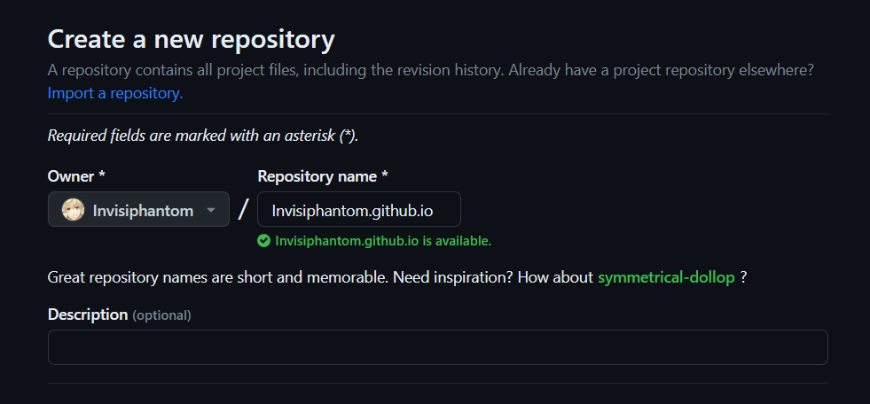
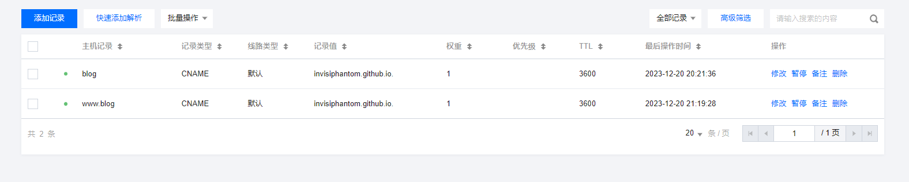
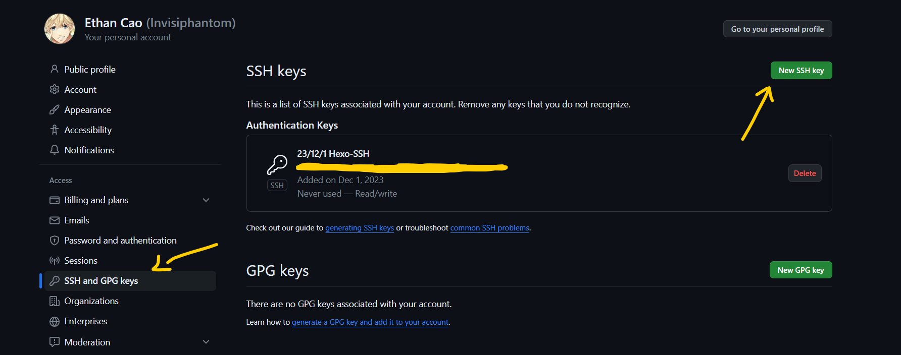
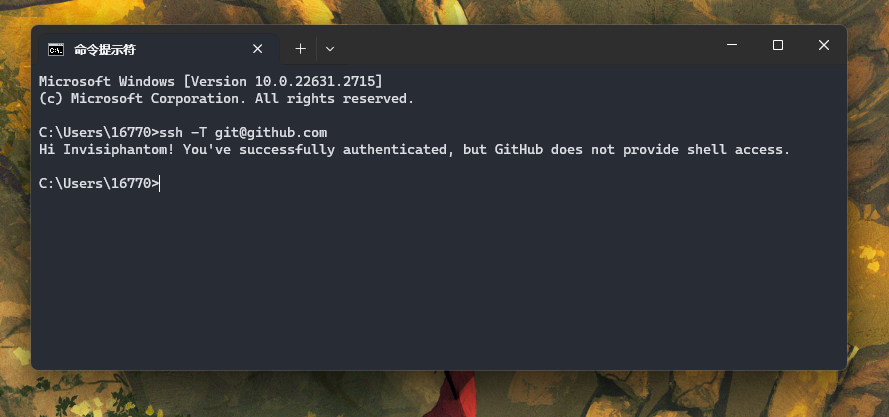
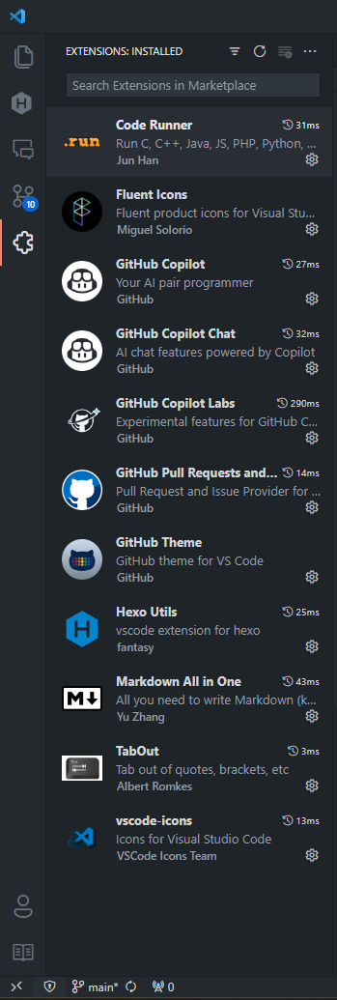
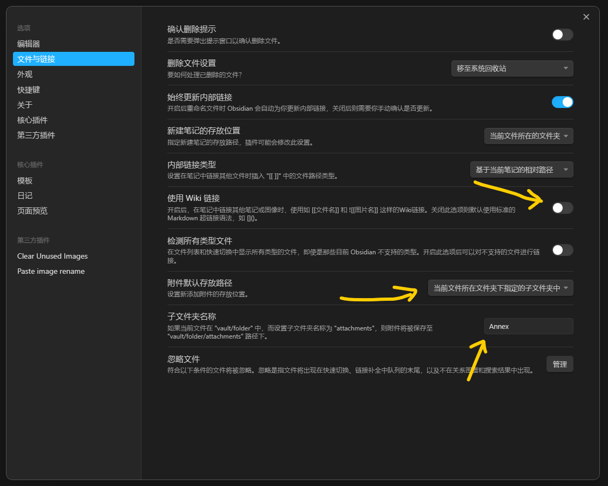
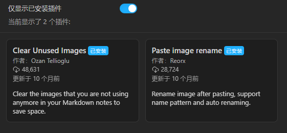

Hexo是一个基于Node.js的静态博客框架，支持Markdown语法，可以将Markdown文件转换为静态网页。  
Github是一个代码托管平台，可以将Hexo生成的静态网页部署到Github上，实现博客的在线访问。  
Obsidian是一个Markdown笔记软件，可以通过Python脚本将笔记文件夹转换为Hexo博客文件夹，实现博客的批量导入。  

------

### 新建Github仓库
仓库名需要为 `[username].github.io`


### 域名解析
从云服务商处购买自定义域名并配置解析

[腾讯云解析 DNS - 控制台](https://console.cloud.tencent.com/cns)



### 配置Hexo文件夹
- 下载安装Node.js
[Node.js (nodejs.org)](https://nodejs.org/en)

- 全局安装Hexo工具
`$ npm install -g hexo-cli`

- 新建文件夹Ethan-Blog并初始化Hexo
`$ hexo init`
安装 Node.js 所需的所有依赖包
`$ npm install`


### Hexo基础指令
`$ hexo g(generate)`生成静态页面
`$ hexo s (server)`启动本地服务
`$ hexo d (deploy)`部署到远程仓库


### 使用Git部署到Github
- 安装Git
[Git - Downloads](https://git-scm.com/downloads)

- 绑定Github账号与邮箱
`$ git config --global user.name "your name"`
`$ git config --global user.email "your email"`

- 生成SSH密钥
`$ ssh-keygen -t rsa -C "your email"`

- 将`C:\Users\16770\.ssh\id_rsa.pub`公钥添加到Github账号


- 更改私钥文件权限为只读
Linux: `$ chmod 600 ~/.ssh/id_rsa`
Windows: 
禁止继承父目录的权限，确保文件拥有独立的权限设置
`icacls "C:\Users\16770\.ssh\id_rsa" /inheritance:r`
授予当前用户只读权限
`icacls "C:\Users\16770\.ssh\id_rsa" /grant:r "%USERNAME%":"(R)"`

- 测试SSH连接
`$ ssh -T git@github.com`


- 安装Hexo-git插件
`$ npm install hexo-deployer-git`

- 在`_config.yml`文件中添加部署信息
```yml
deploy:
  type: git
  repo: https://github.com/Invisiphantom/Invisiphantom.github.io
  branch: main
```

- 在`source`文件夹中添加`CNAME`文件并输入自定义域名
例如`blog.ethancao.cn`

- 愉快地部署
`$ hexo d`


### 使用VSCode编辑
- 基础插件配置

- 用户配置`settings.json`
```json
{
    "window.commandCenter": true,
    "workbench.colorTheme": "GitHub Dark",
    "workbench.iconTheme": "vscode-icons",
    "workbench.layoutControl.enabled": false,
    "workbench.productIconTheme": "fluent-icons",


    "terminal.integrated.fontSize": 15,
    "terminal.integrated.fontFamily": "'Cascadia Code', '雅黑'",
    "terminal.integrated.defaultProfile.windows": "Command Prompt",

    "explorer.confirmDelete": false,
    "explorer.confirmDragAndDrop": false,
    "scm.diffDecorations": "none",


    "editor.tabSize": 4,
    "editor.fontSize": 16,
    "editor.lineHeight": 1.6,
    "editor.fontLigatures": true,
    "editor.lineNumbers": "relative",
    "editor.detectIndentation": true,
    "editor.inlineSuggest.enabled": true,
    "editor.fontFamily": "'Cascadia Code', '雅黑'",

    "extensions.ignoreRecommendations": true,
    "vsicons.dontShowNewVersionMessage": true,

    "files.autoSaveDelay": 1000,
    "files.autoSave": "afterDelay",
    "files.exclude": {
        "**/.*": true,
        "source": true,
        "public": true,
        "node_modules": true,
        "db.json": true,
        "package.json": true,
        "package-lock.json": true,
        
        "themes/next/docs" : true,
        "themes/next/layout" : true,
        "themes/next/source" : true,
        "themes/next/scripts" : true,
        "themes/next/languages" : true,
        "themes/next/crowdin.yml" : true,
        "themes/next/gulpfile.js" : true,
        "themes/next/package.json" : true,
        "themes/next/README.md" : true,
    },
    
    "git.autofetch": true,
    "git.confirmSync": false,
    "git.enableSmartCommit": true,
    "git.decorations.enabled": false,

    "code-runner.runInTerminal": true,
    "code-runner.executorMap": {
        "python": "python -u Setup.py && hexo clean && hexo g && hexo s",
        "markdown": "python -u Setup.py && hexo clean && hexo g && hexo s",
        "plaintext": "python -u Setup.py && hexo clean && hexo g && hexo s",
        "javascript": "python -u Setup.py && hexo clean && hexo g && hexo s",
        "yaml": "Python -u Setup.py && hexo clean && hexo g && hexo s",
        "swig": "python -u Setup.py && hexo clean && hexo g && hexo s",
    },

    "github.copilot.enable": {
        "*": true,
        "plaintext": true,
        "markdown": true,
        "scminput": false
    }
}
```


### 本地图片显示出错
安装 hexo-asset-image 插件
`$ npm install https://github.com/CodeFalling/hexo-asset-image`


### 使用Python脚本转换Obsidian笔记
将Obsidian笔记文件夹 Mind-City 放在Hexo目录下
并将本地图片的链接方式修改为 Markdown的链接语法
并将附件存放在子文件夹的Annex文件夹中



推荐两款Obsidian插件：

- Clear Unuserd images 可以自动清除没被链接的多余图片
- Paste images rename 可以自动将粘贴的图片重命名为`[filename].png`格式


Python 脚本功能：
- 清空`_posts`文件夹中的所有内容
- 读取`Setup.txt`文件中的目标文件名`target_files`
- 将`target_file`文件从Obsidian文件夹复制到`_posts`文件夹
- 在`target_file`文件中添加必要的头部信息(标题、创建时间、分类)
- 将`target_file`文件中的所有图片链接修改为直接路径
- 将所有图片复制到`_posts/target_file/`文件夹中

```python
# 文件名 Setup.py
import os
import shutil
import time


mind_city_folder = "./Mind-City"  # 替换为实际的Mind-City文件夹路径
posts_folder = "./source/_posts"  # 替换为实际的_posts文件夹路径


def add_profile(root, file_name):
    create_time = os.path.getctime(os.path.join(root, file_name))
    create_time = time.strftime("%Y-%m-%d %H:%M:%S", time.localtime(create_time))

    modified_time = os.path.getmtime(os.path.join(root, file_name))
    modified_time = time.strftime("%Y-%m-%d %H:%M:%S", time.localtime(modified_time))

    categories = root.split("\\")[-1]
    file_path = os.path.join(posts_folder, file_name)

    with open(file_path, "r", encoding="utf-8") as file:
        content = file.read()
    content = content.replace("Annex/", "")
    content = (
        "---\n"
        + "title: "
        + file_name[:-3]
        + "\ndate: "
        + create_time
        + "\nupdated: "
        + modified_time
        + "\ncategories: "
        + categories
        + "\n---\n\n"
        + content
    )
    with open(file_path, "w", encoding="utf-8") as file:
        file.write(content)


if __name__ == "__main__":
    for file in os.listdir(posts_folder):
        file_path = os.path.join(posts_folder, file)
        if os.path.isfile(file_path):
            os.remove(file_path)
        else:
            shutil.rmtree(file_path)

    with open("Setup.txt", "r", encoding="utf-8") as file:
        target_files = file.readlines()

    for target_file in target_files:
        if target_file.startswith("-") or target_file == "\n":
            continue
        target_file = target_file.strip()
        for root, dirs, files in os.walk(mind_city_folder):
            for file_name in files:
                if file_name.startswith(target_file) and file_name.endswith(".md"):
                    file_path = os.path.join(root, file_name)
                    shutil.copy(file_path, posts_folder)
                    print(f"Copy:\t{file_name}\t-->\t{posts_folder}")
                    add_profile(root, file_name)

                    os.mkdir(os.path.join(posts_folder, file_name[:-3]))
                    if os.path.exists(os.path.join(root, "Annex")):
                        for file in os.listdir(os.path.join(root, "Annex")):
                            if file.startswith(file_name[:-3]):
                                shutil.copy(
                                    os.path.join(root, "Annex", file),
                                    os.path.join(posts_folder, file_name[:-3]),
                                )

```


### 安装主题NexT-Gemini
`$ git clone https://github.com/theme-next/hexo-theme-next themes/next`


### 修改行内代码样式
在`theme/next/source/css/main.styl`末尾添加
```css
code {
  padding: 2px 4px;
  word-wrap: break-word;
  color: #cccccc;
  background: #474747;
  border-radius: 3px;
  font-size: 18px;
}
```

### 启用Gitalk评论区
[[Gitalk]评论系统 - Hexo-NexT](https://hexo-next.readthedocs.io/zh-cn/latest/next/advanced/gitalk-%E8%AF%84%E8%AE%BA%E7%B3%BB%E7%BB%9F/)

### 启用Disqus评论区
[Hexo NexT 添加 Disqus 评论区 | Bambrow's Blog](https://bambrow.com/20211130-hexo-comment-disqus/)


### 启用pjax和fancybox
```yaml
# Easily enable fast Ajax navigation on your website.
# Dependencies: https://github.com/theme-next/theme-next-pjax
pjax: true

# FancyBox is a tool that offers a nice and elegant way to add zooming functionality for images.
# For more information: https://fancyapps.com/fancybox
fancybox: true


# Internal version: 0.2.8
pjax: //cdn.jsdelivr.net/gh/theme-next/theme-next-pjax@0/pjax.min.js

# FancyBox
jquery: //cdn.jsdelivr.net/npm/jquery@3/dist/jquery.min.js
fancybox: //cdn.jsdelivr.net/gh/fancyapps/fancybox@3/dist/jquery.fancybox.min.js
fancybox_css: //cdn.jsdelivr.net/gh/fancyapps/fancybox@3/dist/jquery.fancybox.min.css
```

在`themes/next/source/js/utils.js`中配置fancybox
```javascript
    $.fancybox.defaults.hash = false;
    $('.fancybox').fancybox({
      loop: false,
      wheel: false,
      arrows: false,
      infobar: false,
      toolbar: false,
      animationDuration: 300,
      helpers: {
        overlay: {
          locked: false
        }
      }
    });
```
详细配置见[fancyBox3 中文文档](https://kangkai124.github.io/fancybox/)

### 创建分类引导页
`$ hexo new page categories`
在`source/categories/index.md`中添加
```
---
title: 所有分类
type: categories
---
```
在`themes/next/_config.yml`中启用该页面
```yaml
menu:
  home: / || fa fa-home
  #about: /about/ || fa fa-user
  #tags: /tags/ || fa fa-tags
  categories: /categories/ || fa fa-th
  archives: /archives/ || fa fa-archive
  #schedule: /schedule/ || fa fa-calendar
  #sitemap: /sitemap.xml || fa fa-sitemap
  #commonweal: /404/ || fa fa-heartbeat
```
在`themes\next\source\css\_common\components\pages\categories.styl`中修改界面样式
```css
  .category-list {
    list-style: none;
    margin: 0;
    padding: 0;
    display: flex;
    justify-content: center;
    flex-wrap: wrap;
    align-items: center;
    font-family: 'Cascadia Code';
  }

  .category-list-item {
    margin: 5px 10px;
    border-radius: 6px;
    padding: 2px 14px;
    background-color: #555555;
  }

  .category-list-count {
    color: $grey;

    &::before {
      content: '-';
      display: inline;
    }

    &::after {
      content: '';
      display: inline;
    }
  }

  .category-list-child {
    padding-left: 10px;
  }
```


### 参考链接
[Hexo-NexT 功能文档](https://hexo-next.readthedocs.io/zh-cn/latest/)
[超详细Hexo+Github博客搭建小白教程 | 韦阳的博客](https://godweiyang.com/2018/04/13/hexo-blog/#toc-heading-1)
[hexo-theme-next: Elegant and powerful theme for Hexo.](https://github.com/theme-next/hexo-theme-next)
