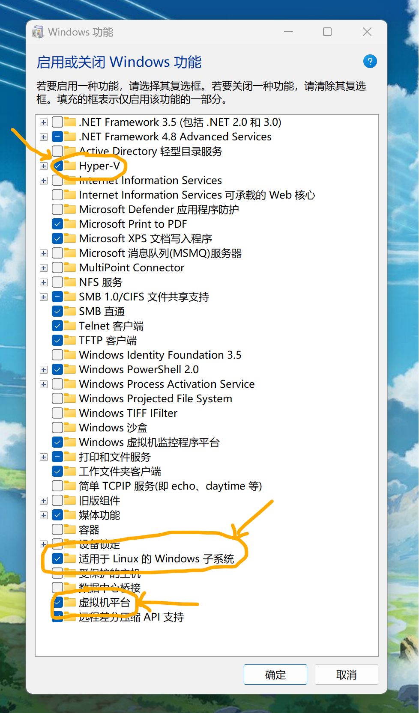
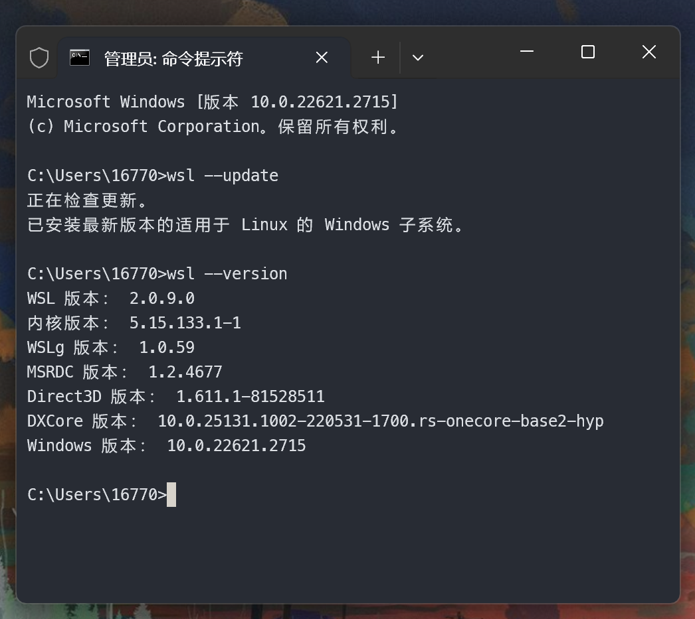
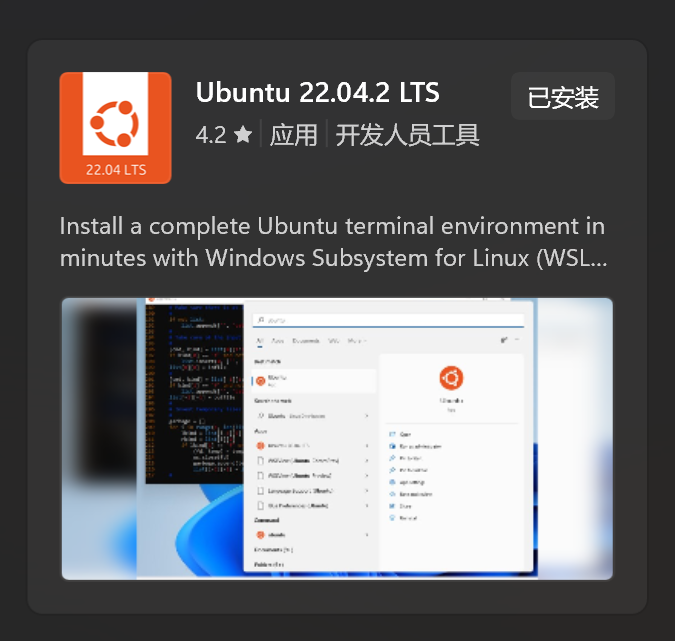
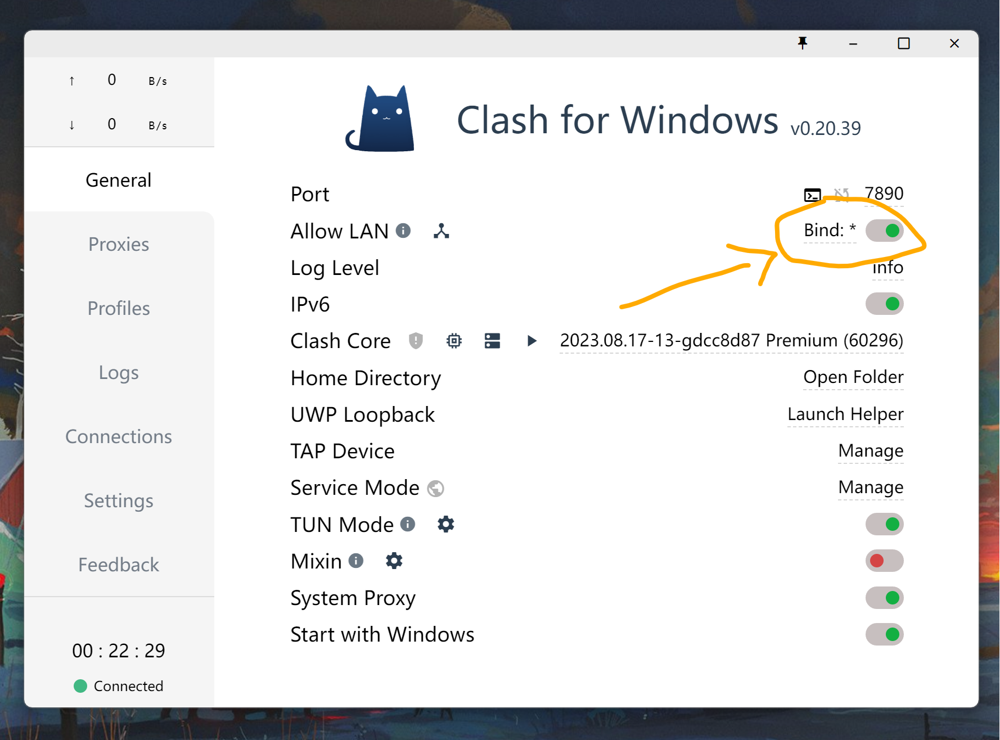
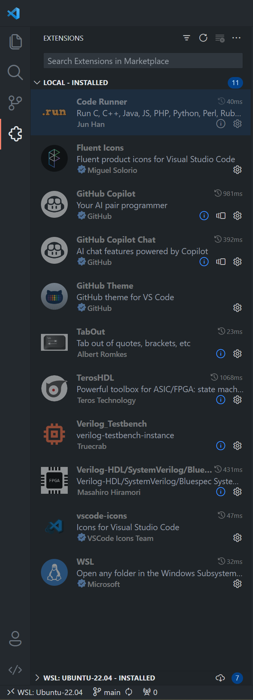
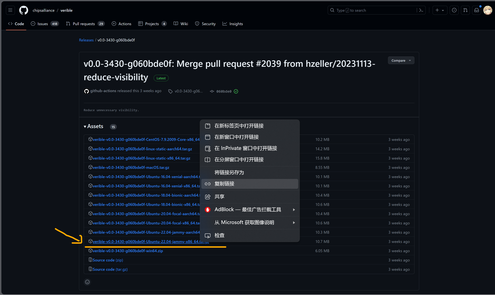
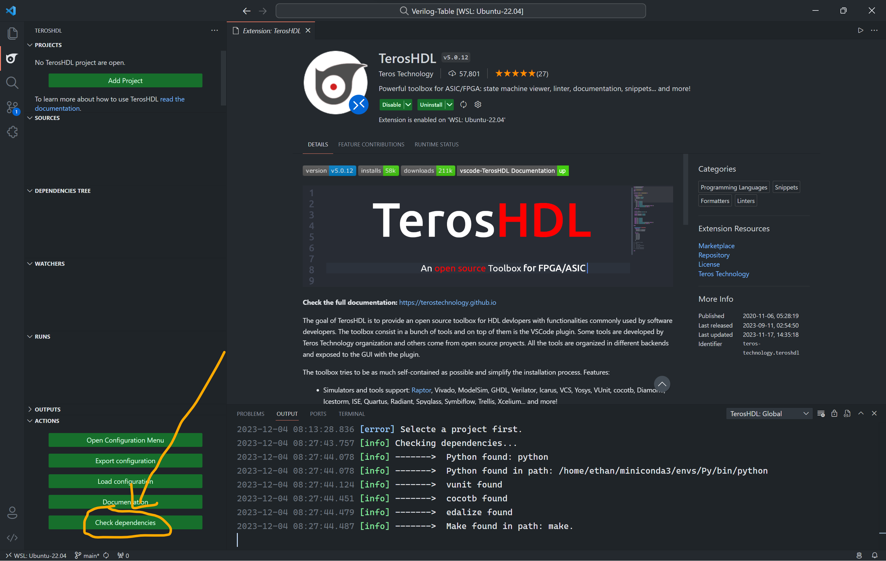
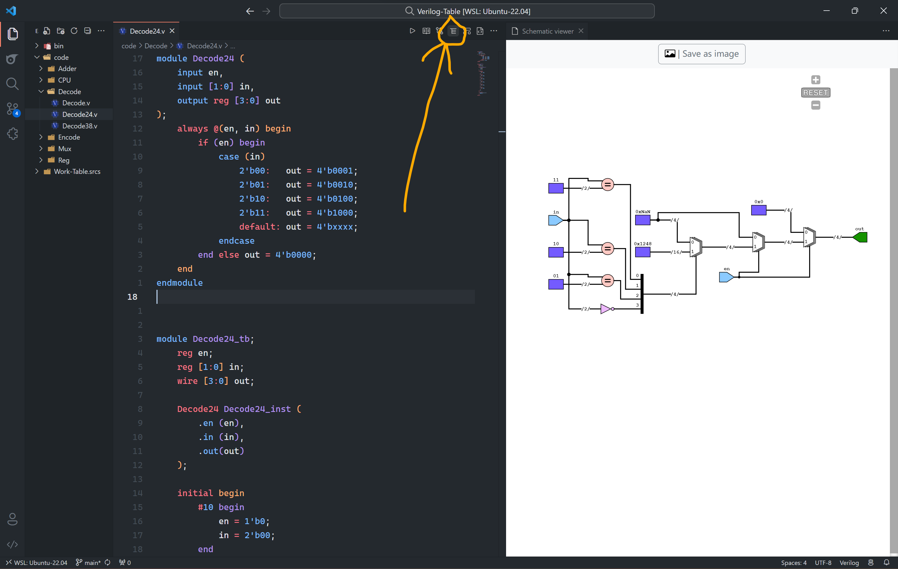
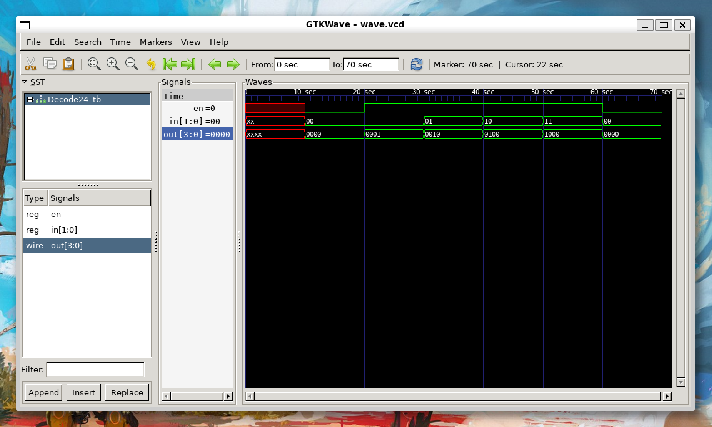

### 安装WSL-Ubuntu22.04
启用Hyper-V、适用于Linux的Windows子系统、虚拟机平台

更新WSL版本
`$ wsl --update`
`$ wsl --version`

在Microsoft Store搜索并安装Ubuntu22.04

配置clash for windows代理
在clash中启用局域网连接

在WSL中的`~/.bashrc`中添加代理配置
```bash
host_ip=$(cat /etc/resolv.conf |grep "nameserver" |cut -f 2 -d " ")
export https_proxy="http://$host_ip:7890"
export http_proxy="http://$host_ip:7890"
export all_proxy="sock5://$host_ip:7890"
export ALL_PROXY="sock5://$host_ip:7890"
```
更新WSL应用
`$ sudo apt update`
`$ sudo apt upgrade`

### 安装IVerilog和GTKWave
`$ sudo apt install iverilog gtkwave`
创建代码文件夹以及用于存放波形`wave`文件的bin文件夹
`$ mkdir ~/Verilog-Table && cd Verilog-Table && mkdir bin`
在VSCode中打开文件夹
`$ code .`
配置VSCode插件

用户配置文件`settings.json`
```json
{
    "window.zoomLevel": -1,
    "window.commandCenter": true,
    "explorer.confirmDragAndDrop": false,
    
    "workbench.colorTheme": "GitHub Dark",
    "workbench.iconTheme": "vscode-icons",
    "workbench.layoutControl.enabled": false,
    "workbench.productIconTheme": "fluent-icons",

    "git.autofetch": true,
    "git.enableSmartCommit": true,
    "git.confirmSync": false,
    "git.decorations.enabled": false,
    "scm.diffDecorations": "none",

    "editor.tabSize": 4,
    "editor.fontSize": 17,
    "editor.lineHeight": 1.6,
    "editor.fontLigatures": false,
    "editor.lineNumbers": "relative",
    "editor.detectIndentation": true,
    "editor.guides.indentation": false,
    "editor.fontFamily": "'Cascadia Code', '宋体'",
    
    
    "terminal.integrated.fontSize": 15,
    "terminal.integrated.fontFamily": "'Cascadia Code', '宋体'",
    "debug.console.fontFamily": "'Cascadia Code', '宋体'",
    
    "files.autoSave": "afterDelay",
    "files.autoSaveDelay": 1000,
    "extensions.ignoreRecommendations": true,

    "code-runner.saveAllFilesBeforeRun": true,
    "code-runner.runInTerminal": true,
    "code-runner.executorMapByFileExtension": {
        ".v": "cd $dir && iverilog -y $dir $fileName -o ~/Verilog-Table/bin/$fileNameWithoutExt && cd ~/Verilog-Table/bin && vvp $fileNameWithoutExt && rm $fileNameWithoutExt && gtkwave wave.vcd",
        ".sv": "cd $dir && iverilog $fileName -i /home/ethan/Verilog-Table/src/Adder/AdderSerial1.sv -o ~/Verilog-Table/bin/$fileNameWithoutExt && cd ~/Verilog-Table/bin && vvp $fileNameWithoutExt && gtkwave wave.vcd",
    },
    "vsicons.dontShowNewVersionMessage": true,

    "verilog.ctags.path": "/usr/bin/ctags",
    "verilog.linting.linter": "iverilog",
    "verilog.linting.iverilog.arguments": "-i",
    "verilog.formatting.verilogHDL.formatter": "verible-verilog-format",
    "verilog.formatting.systemVerilog.formatter": "verible-verilog-format",
    "verilog.formatting.veribleVerilogFormatter.arguments": "--indentation_spaces=4",
    "verilog.formatting.veribleVerilogFormatter.path": "/usr/local/verible/bin/verible-verilog-format",
    "[verilog]": {
        "editor.defaultFormatter": "mshr-h.veriloghdl"
    },
    "[systemverilog]": {
        "editor.defaultFormatter": "mshr-h.veriloghdl"
    },

    "github.copilot.enable": {
        "*": true,
        "plaintext": true,
        "markdown": false,
        "scminput": false
    },
}
```
在VSCode中选择`Snippets: Configure User Snippets`配置`verilog.json`
```json
{
	"input": {
		"prefix": "input",
		"body": "input"
	},
	"output": {
		"prefix": "output",
		"body": "output"
	},
	"dumpWave": {
		"prefix": "$dumpfile",
		"body": [
			"\\$dumpfile(\"wave.vcd\");",
			"\\$dumpvars;"
		]
	},
	"finish":{
		"prefix": "$finish",
		"body": "\\$finish;"
	},
	"display":{
		"prefix": "$display",
		"body": "\\$display(\"$1\");"
	},
	"monitor":{
		"prefix": "$monitor",
		"body": "\\$monitor(\"$1\", $2);"
	},
	"posedge":{
		"prefix": "posedge",
		"body": "posedge"
	},
	"negedge":{
		"prefix": "negedge",
		"body": "negedge"
	},

	"and": {
		"prefix": "and",
		"body": "and($1);"
	},
	"or": {
		"prefix": "or",
		"body": "or($1);"
	},
	"xor": {
		"prefix": "xor",
		"body": "xor($1);"
	},
	"nand": {
		"prefix": "nand",
		"body": "nand($1);"
	},
	"nor": {
		"prefix": "nor",
		"body": "nor($1);"
	},
	"xnor": {
		"prefix": "xnor",
		"body": "xnor($1);"
	},
	"buf": {
		"prefix": "buf",
		"body": "buf($1);"
	},
	"not": {
		"prefix": "not",
		"body": "not($1);"
	},

	"assign": {
		"prefix": "assign",
		"body": "assign"
	},
	"always": {
		"prefix": ["always"],
		"body": [
			"always @($1) begin",
			"\t$2",
			"end"
		]
	},
	"module": {
		"prefix": ["module"],
		"body": [
			"module $1($2);",
			"\t$3",
			"endmodule"
		]
	},
	"begin/end": {
		"prefix": "begin",
		"body": [
			"begin",
			"\t$1",
			"end"
		]
	},
	"end": {
		"prefix": "end",
		"body": "end"
	},
	"initial": {
		"prefix": "initial",
		"body": [
			"initial begin",
			"\t$0",
			"end"
		]
	},
	"case": {
		"prefix": "case",
		"body": [
			"case (${1:param})",
			"\t$2: $3",
			"\tdefault: $4",
			"endcase"
		]
	},
	"reg": {
		"prefix": "reg",
		"body": "reg"
	},
	"wire": {
		"prefix": "wire",
		"body": "wire"
	},
	"parameter": {
		"prefix": "parameter",
		"body": "parameter"
	},
	"localparam": {
		"prefix": "localparam",
		"body": "localparam"
	},
	"integer": {
		"prefix": "integer",
		"body": "integer"
	},
	"signed": {
		"prefix": "signed",
		"body": "signed"
	},
	"include": {
		"prefix": ["include", "`include"],
		"body": [
			"`include \"$1\""
		]
	},
	"define": {
		"prefix": ["define", "`define"],
		"body": [
			"`define ${1:macro}"
		]
	},
	"timescale": {
		"prefix": ["timescale", "`timescale"],
		"body": [
			"`timescale ${1:1ps}/${2:1ps}$0"
		]
	},
	"if": {
		"prefix": "if",
		"body": [
			"if (${1:conditions}) begin",
			"\t$0",
			"end"
		]
	},
	"elsif": {
		"prefix": ["elsif", "`elsif"],
		"body": "`elsif ${1:macro}"
	},
	"else": {
		"prefix": "else",
		"body": "else"
	},
	"forever": {
		"prefix": "forever",
		"body": [
			"forever begin",
			"\t$0",
			"end"
		]
	}
}
```
### 安装Verible-verilog和ctags
[Verible is a suite of SystemVerilog developer tools](https://github.com/chipsalliance/verible)
打开Release界面复制下载链接

在WSL使用wget下载
`$ wget https://github.com/chipsalliance/verible/releases/download/v0.0-3430-g060bde0f/verible-v0.0-3430-g060bde0f-Ubuntu-22.04-jammy-x86_64.tar.gz`
使用tar解压
`$ tar -xvf verible-v0.0-3430-g060bde0f-Ubuntu-22.04-jammy-x86_64.tar.gz`
将verible文件夹复制到`/usr/local/`目录下
`$ sudo mv verible-v0.0-3430-g060bde0f /usr/local/verible`
安装ctags
`$ sudo apt install universal-ctags`

### 配置VSCode插件TerosHDL
点击`Check dependencies`查看依赖
`$ pip install vnit cocotb edalize`安装


### 测试配置
解码器代码
```verilog
module Decode24 (
    input en,
    input [1:0] in,
    output reg [3:0] out
);
    always @(en, in) begin
        if (en) begin
            case (in)
                2'b00:   out = 4'b0001;
                2'b01:   out = 4'b0010;
                2'b10:   out = 4'b0100;
                2'b11:   out = 4'b1000;
                default: out = 4'bxxxx;
            endcase
        end else out = 4'b0000;
    end
endmodule


module Decode24_tb;
    reg en;
    reg [1:0] in;
    wire [3:0] out;

    Decode24 Decode24_inst (
        .en (en),
        .in (in),
        .out(out)
    );

    initial begin
        #10 begin
            en = 1'b0;
            in = 2'b00;
        end

        #10 begin
            en = 1'b1;
            in = 2'b00;
        end

        #10 begin
            en = 1'b1;
            in = 2'b01;
        end

        #10 begin
            en = 1'b1;
            in = 2'b10;
        end

        #10 begin
            en = 1'b1;
            in = 2'b11;
        end

        #10 begin
            en = 1'b0;
            in = 2'b00;
        end

        #10;
    end

    initial begin
        $dumpfile("wave.vcd");
        $dumpvars;
    end

endmodule
```
使用`Alt+Shift+F`通过`verible-verilog-format`实现代码快速格式化
使用`F12`通过`ctags`实现变量定义跳转
使用`TerosHDL`查看电路图

使用`Ctrl+Alt+N`通过`Code-Runner`插件执行iVerilog仿真并使用GTKWave查看波形图
