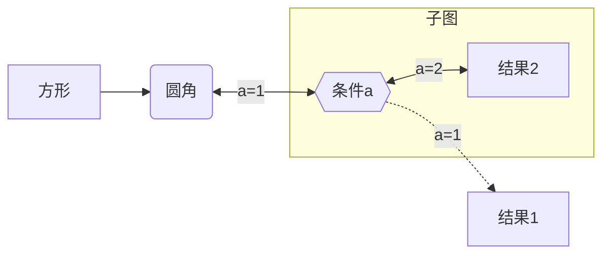

LaTeX Math Cheat Sheet

------

### 希腊字母
|  大写字母  |  小写字母  |  大写字母  |  小写字母  |
| :--------: | :--------: | :--------: | :--------: |
|  $\Alpha$  |  $\alpha$  |   $\Nu$    |   $\nu$    |
|  $\Beta$   |  $\beta$   |   $\Xi$    |   $\xi$    |
|  $\Gamma$  |  $\gamma$  | $\Omicron$ | $\omicron$ |
|  $\Delta$  |  $\delta$  |   $\Pi$    |   $\pi$    |
| $\Epsilon$ | $\epsilon$ |   $\Rho$   |   $\rho$   |
|  $\Zeta$   |  $\zeta$   |  $\Sigma$  |  $\sigma$  |
|   $\Eta$   |   $\eta$   |   $\Tau$   |   $\tau$   |
|  $\Theta$  |  $\theta$  | $\Upsilon$ | $\upsilon$ |
|  $\Iota$   |  $\iota$   |   $\Phi$   |   $\phi$   |
|  $\Kappa$  |  $\kappa$  |   $\Chi$   |   $\chi$   |
| $\Lambda$  | $\lambda$  |   $\Psi$   |   $\psi$   |
|   $\Mu$    |   $\mu$    |  $\Omega$  |  $\omega$  |

### 数学字体
|     字体      |       字体       |     字体      |      字体      |
| :-----------: | :--------------: | :-----------: | :------------: |
| $\mathbb{P}$  |   $\mathbf{P}$   | $\mathcal{P}$ | $\mathfrak{P}$ |
| $\mathscr{P}$ |   $\mathsf{P}$   | $\mathit{P}$  |  $\mathtt{P}$  |
| $\mathrm{P}$  | $\mathnormal{P}$ |

### 常用符号
|      符号      |     符号     |           符号            |            符号            |       符号       |
| :------------: | :----------: | :-----------------------: | :------------------------: | :--------------: |
|     $\neq$     |    $\leq$    |          $\geq$           |           $\in$            |     $\notin$     |
|  $\subseteq$   | $\supseteq$  |           $\to$           |         $\implies$         |      $\iff$      |
|     $\cap$     |    $\cup$    |         $\bigcap$         |         $\bigcup$          |   $\emptyset$    |
|    $\land$     |    $\lor$    |         $\forall$         |         $\exists$          |    $\nexists$    |
|     $\sum$     |   $\prod$    |         $\infty$          |       $\frac{1}{2}$        |  $\sqrt[3]{2}$   |
|     $\lim$     |    $\int$    |        $\partial$         |      $\overline{BD}$       | $\underline{AC}$ |
|   $\because$   | $\therefore$ | $\overbrace{k\cdots k}^r$ | $\underbrace{k\cdots k}_r$ |    $\bar{x}$     |
| $\binom{n}{k}$ |

### 公式块
$$
\begin{align*}
y &= \frac{1}{2}x^2+2x+1 \\
  &= \frac{1}{2}(x^2+4x+4-3) \\
  &= \frac{1}{2}(x+2)^2-\frac{3}{2}
\end{align*}
$$

$$\left\{\begin{array}{l}
    a + b &= c \\
    d - e &= f \\
    g \cdot h &= i
\end{array}\right.$$

### 化学公式

$$\ce{Hg^2+ ->[I-] HgI2 ->[I-] [Hg^{II}I4]^2-}$$

### 快捷键配置

1. 加粗: `Ctrl + Alt + B`
2. 斜体: `Ctrl + Alt + I`
3. 数学公式: `Ctrl + M`
4. 笔记预览: `Ctrl + Alt + M`

### Mermaid语法

| 语法         | 功能         |
| ------------ | ------------ |
| `graph TD`   | 上下流程图   |
| `graph LR`   | 左右流程图   |
| `subgraph`   | 子图         |
| `%%`         | 注释         |
| `A[]`        | 矩形         |
| `A[[]]`      | 双线矩形     |
| `A[/ \]`     | 正梯形       |
| `A[\ /]`     | 倒梯形       |
| `A[/ /]`     | 正平行四边形 |
| `A[\ \]`     | 倒平行四边形 |
| `A()`        | 圆角矩形     |
| `A[()]`      | 圆柱形       |
| `A([])`      | 椭圆形       |
| `A(())`      | 圆形         |
| `A((()))`    | 双线圆形     |
| `A{}`        | 菱形         |
| `A{{}}`      | 六边形       |
| `---`        | 细线         |
| `-.-`        | 虚线         |
| `===`        | 粗线         |
| `-->`        | 单向箭头     |
| `<-->`       | 双向箭头     |
| `o--o`       | 圆形箭头     |
| `x--x`       | 叉形箭头     |
| `--a=1-->`   | 条件a        |
| `-->\|a=1\|` | 条件a        |

