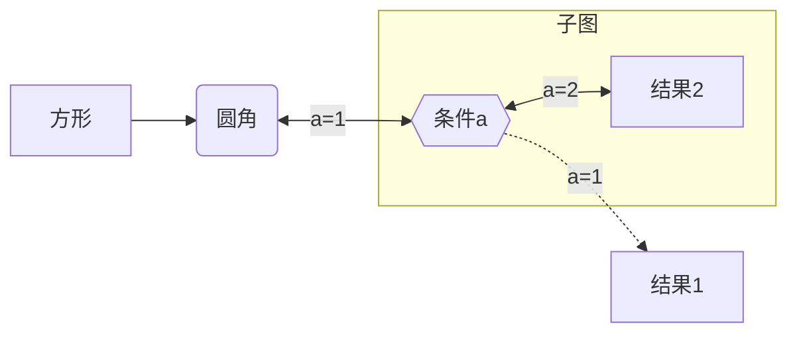

| 语法         | 功能         |
| ------------ | ------------ |
| `graph TD`   | 上下流程图   |
| `graph LR`   | 左右流程图   |
| `subgraph`   | 子图         |
| `%%`         | 注释         |
| `A[]`        | 矩形         |
| `A[[]]`      | 双线矩形     |
| `A[/ \]`     | 正梯形       |
| `A[\ /]`     | 倒梯形       |
| `A[/ /]`     | 正平行四边形 |
| `A[\ \]`     | 倒平行四边形 |
| `A()`        | 圆角矩形     |
| `A[()]`      | 圆柱形       |
| `A([])`      | 椭圆形       |
| `A(())`      | 圆形         |
| `A((()))`    | 双线圆形     |
| `A{}`        | 菱形         |
| `A{{}}`      | 六边形       |
| `---`        | 细线         |
| `-.-`        | 虚线         |
| `===`        | 粗线         |
| `-->`        | 单向箭头     |
| `<-->`       | 双向箭头     |
| `o--o`       | 圆形箭头     |
| `x--x`       | 叉形箭头     |
| `--a=1-->`   | 条件a        |
| `-->\|a=1\|` | 条件a        |

