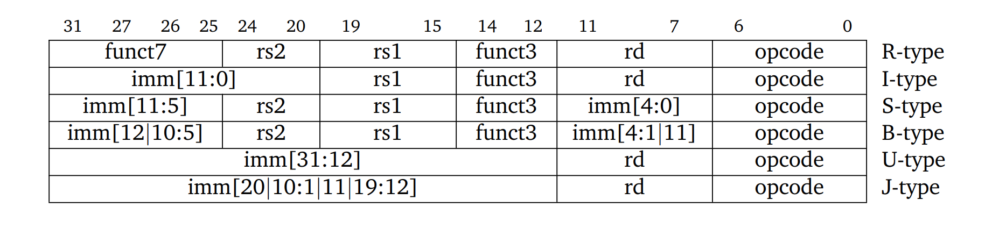

RISC-V中文手册

https://github.com/Tan-YiFan/rvcpu

ISA设计的七种衡量标准
1. 成本(美元硬币)
2. 简洁性(轮子)
3. 性能(速度计)
4. 架构与实现分离(分开半圆)
5. 提升空间(手风琴)
6. 程序大小(箭头)
7. 易于编程/编译/链接(abc)

R型指令: 用于寄存器-寄存器操作
I型指令: 用于短立即数, 读存操作
S型指令: 用于写存操作
B型指令: 用于分支操作
U型指令: 用于长立即数
J型指令: 用于跳转操作

| xReg | 别称  | 功能                           |
| ---- | ----- | ------------------------------ |
| x0   | zero  | Hardwired zero                 |
| x1   | ra    | Return address                 |
| x2   | sp    | Stack pointer                  |
| x3   | gp    | Global pointer                 |
| x4   | tp    | Thread pointer                 |
| x5   | t0    | Temporary                      |
| x6   | t1    | Temporary                      |
| x7   | t2    | Temporary                      |
| x8   | s0/fp | Saved register/Frame pointer   |
| x9   | s1    | Saved register                 |
| x10  | a0    | Function argument/Return value |
| x11  | a1    | Function argument/Return value |
| x12  | a2    | Function argument              |
| x13  | a3    | Function argument              |
| x14  | a4    | Function argument              |
| x15  | a5    | Function argument              |
| x16  | a6    | Function argument              |
| x17  | a7    | Function argument              |
| x18  | s2    | Saved register                 |
| x19  | s3    | Saved register                 |
| x20  | s4    | Saved register                 |
| x21  | s5    | Saved register                 |
| x22  | s6    | Saved register                 |
| x23  | s7    | Saved register                 |
| x24  | s8    | Saved register                 |
| x25  | s9    | Saved register                 |
| x26  | s10   | Saved register                 |
| x27  | s11   | Saved register                 |
| x28  | t3    | Temporary                      |
| x29  | t4    | Temporary                      |
| x30  | t5    | Temporary                      |
| x31  | t6    | Temporary                      |

| fReg | 别称 | 功能                              |
| ---- | ---- | --------------------------------- |
| f0   | ft0  | FP Temporary                      |
| f1   | ft1  | FP Temporary                      |
| f2   | ft2  | FP Temporary                      |
| f3   | ft3  | FP Temporary                      |
| f4   | ft4  | FP Temporary                      |
| f5   | ft5  | FP Temporary                      |
| f6   | ft6  | FP Temporary                      |
| f7   | ft7  | FP Temporary                      |
| f8   | fs0  | FP Saved register                 |
| f9   | fs1  | FP Saved register                 |
| f10  | fa0  | FP Function argument/Return value |
| f11  | fa1  | FP Function argument/Return value |
| f12  | fa2  | FP Function argument              |
| f13  | fa3  | FP Function argument              |
| f14  | fa4  | FP Function argument              |
| f15  | fa5  | FP Function argument              |
| f16  | fa6  | FP Function argument              |
| f17  | fa7  | FP Function argument              |
| f18  | fs2  | FP Saved register                 |
| f19  | fs3  | FP Saved register                 |
| f20  | fs4  | FP Saved register                 |
| f21  | fs5  | FP Saved register                 |
| f22  | fs6  | FP Saved register                 |
| f23  | fs7  | FP Saved register                 |
| f24  | fs8  | FP Saved register                 |
| f25  | fs9  | FP Saved register                 |
| f26  | fs10 | FP Saved register                 |
| f27  | fs11 | FP Saved register                 |
| f28  | ft8  | FP Temporary                      |
| f29  | ft9  | FP Temporary                      |
| f30  | ft10 | FP Temporary                      |
| f31  | ft11 | FP Temporary                      |

| CSR      | 全称                      | 功能         |
| -------- | ------------------------- | ------------ |
| mtvec    | Machine Trap Vector       | 异常处理入口 |
| mepc     | Machine Exception PC      | 异常指令地址 |
| mcause   | Machine Cause             | 异常原因     |
| mie      | Machine Interrupt Enable  | 中断使能     |
| mip      | Machine Interrupt Pending | 中断挂起     |
| mtval    | Machine Trap Value        | 异常值       |
| mscratch | Machine Scratch           | 机器暂存     |
| mstatus  | Machine Status            | 机器状态     |

| RV64I   | Name                        | FMT | Opcode[6:0] | Funct3[14:12] | Funct7[31:25] | Description                               |
| ------- | --------------------------- | --- | ----------- | ------------- | ------------- | ----------------------------------------- |
| add     | ADD                         | R   | 0110011     | 000           | 0000000       | x[rd] = x[rs1] + x[rs2]                   |
| addw+   | ADD (+)                     | R   | 0111011     | 000           | 0000000       | x[rd] = sext((x[rs1] + x[rs2])[31:0])     |
| sub     | SUB                         | R   | 0110011     | 000           | 0100000       | x[rd] = x[rs1] - x[rs2]                   |
| subw+   | SUB (+)                     | R   | 0111011     | 000           | 0100000       | x[rd] = sext((x[rs1] - x[rs2])[31:0])     |
| xor     | XOR                         | R   | 0110011     | 100           | 0000000       | x[rd] = x[rs1] ^ x[rs2]                   |
| or      | OR                          | R   | 0110011     | 110           | 0000000       | x[rd] = x[rs1] \| x[rs2]                  |
| and     | AND                         | R   | 0110011     | 111           | 0000000       | x[rd] = x[rs1] & x[rs2]                   |
| sll     | Shift Left Logical          | R   | 0110011     | 001           | 0000000       | x[rd] = x[rs1] << x[rs2][4:0] [5:0]+      |
| srl     | Shift Right Logical         | R   | 0110011     | 101           | 0000000       | x[rd] = x[rs1] >> x[rs2][4:0] [5:0]+      |
| sra     | Shift Right Arith           | R   | 0110011     | 101           | 0100000       | x[rd] = x[rs1] >>> x[rs2][4:0] [5:0]+     |
| sllw+   | Shift Left Logical (+)      | R   | 0111011     | 001           | 0000000       | x[rd] = sext((x[rs1] << x[rs2])[31:0])    |
| srlw+   | Shift Left Logical (+)      | R   | 0111011     | 101           | 0000000       | x[rd] = sext((x[rs1] >> x[rs2])[31:0])    |
| sraw+   | Shift Left Logical (+)      | R   | 0111011     | 101           | 0100000       | x[rd] = sext((x[rs1] >>> x[rs2])[31:0])   |
| slt     | Set Less Than               | R   | 0110011     | 010           | 0000000       | x[rd] = (x[rs1] < x[rs2])?1:0             |
| sltu    | Set Less Than (U)           | R   | 0110011     | 011           | 0000000       | x[rd] = (x[rs1] < x[rs2])?1:0             |
| ------- | ------                      | --- | -------     | ------        | -------       | ---------                                 |
| addi    | ADD Imm                     | I   | 0010011     | 000           |               | x[rd] = x[rs1] + imm                      |
| addiw+  | ADD Imm (+)                 | I   | 0011011     | 000           |               | x[rd] = sext((x[rs1] + imm)[31:0])        |
| xori    | XOR Imm                     | I   | 0010011     | 100           |               | x[rd] = x[rs1] ^ imm                      |
| ori     | OR Imm                      | I   | 0010011     | 110           |               | x[rd] = x[rs1] \| imm                     |
| andi    | AND Imm                     | I   | 0010011     | 111           |               | x[rd] = x[rs1] & imm                      |
| slli    | Shift Left Logical Imm      | I   | 0010011     | 001           | 000000(0-)    | x[rd] = x[rs1] << imm[4:0] [5:0]+         |
| srli    | Shift Right Logical Imm     | I   | 0010011     | 101           | 000000(0-)    | x[rd] = x[rs1] >> imm[4:0] [5:0]+         |
| srai    | Shift Right Arith Imm       | I   | 0010011     | 101           | 010000(0-)    | x[rd] = x[rs1] >>> imm[4:0] [5:0]+        |
| slliw+  | Shift Left Logical Imm (+)  | I   | 0011011     | 001           | 0000000       | x[rd] = sext((x[rs1] << imm[4:0])[31:0])  |
| srliw+  | Shift Right Logical Imm (+) | I   | 0011011     | 101           | 0000000       | x[rd] = sext((x[rs1] >> imm[4:0])[31:0])  |
| sraiw+  | Shift Right Arith Imm (+)   | I   | 0011011     | 101           | 0100000       | x[rd] = sext((x[rs1] >>> imm[4:0])[31:0]) |
| slti    | Set Less Than Imm           | I   | 0010011     | 010           |               | x[rd] = (x[rs1] < imm)?1:0                |
| sltiu   | Set Less Than Imm (U)       | I   | 0010011     | 011           |               | x[rd] = (x[rs1] < imm)?1:0                |
| ------- | ------                      | --- | -------     | ------        | -------       | ---------                                 |
| lb      | Load Byte                   | I   | 0000011     | 000           |               | x[rd] = M[x[rs1] + imm][7:0]              |
| lh      | Load Half                   | I   | 0000011     | 001           |               | x[rd] = M[x[rs1] + imm][15:0]             |
| lw      | Load Word                   | I   | 0000011     | 010           |               | x[rd] = M[x[rs1] + imm][31:0]             |
| ld+     | Load Doubleword             | I   | 0000011     | 011           |               | x[rd] = M[x[rs1] + imm][63:0]             |
| lbu     | Load Byte (U)               | I   | 0000011     | 100           |               | x[rd] = M[x[rs1] + imm][7:0]              |
| lhu     | Load Half (U)               | I   | 0000011     | 101           |               | x[rd] = M[x[rs1] + imm][15:0]             |
| lwu+    | Load Word (U)               | I   | 0000011     | 110           |               | x[rd] = M[x[rs1] + imm][31:0]             |
| ------- | ------                      | --- | -------     | ------        | -------       | ---------                                 |
| sb      | Store Byte                  | S   | 0100011     | 000           |               | M[x[rs1] + imm][7:0] = x[rs2][7:0]        |
| sh      | Store Half                  | S   | 0100011     | 001           |               | M[x[rs1] + imm][15:0] = x[rs2][15:0]      |
| sw      | Store Word                  | S   | 0100011     | 010           |               | M[x[rs1] + imm][31:0] = x[rs2][31:0]      |
| sd+     | Store Doubleword            | S   | 0100011     | 011           |               | M[x[rs1] + imm][63:0] = x[rs2][63:0]      |
| ------- | ------                      | --- | -------     | ------        | -------       | ---------                                 |
| beq     | Branch ==                   | B   | 1100011     | 000           |               | if (x[rs1] == x[rs2]) PC += imm           |
| bne     | Branch !=                   | B   | 1100011     | 001           |               | if (x[rs1] != x[rs2]) PC += imm           |
| blt     | Branch <                    | B   | 1100011     | 100           |               | if (x[rs1] <  x[rs2]) PC += imm           |
| bge     | Branch >=                   | B   | 1100011     | 101           |               | if (x[rs1] >= x[rs2]) PC += imm           |
| bltu    | Branch <  (U)               | B   | 1100011     | 110           |               | if (x[rs1] <  x[rs2]) PC += imm           |
| bgeu    | Branch >= (U)               | B   | 1100011     | 111           |               | if (x[rs1] >= x[rs2]) PC += imm           |
| ------- | ------                      | --- | -------     | ------        | -------       | ---------                                 |
| jal     | Jump And Link               | J   | 1101111     |               |               | x[rd] = PC + 4; PC += imm                 |
| jalr    | Jump And Link Register      | I   | 1100111     | 000           |               | x[rd] = PC + 4; PC = x[rs1] + imm         |
| ------- | ------                      | --- | -------     | ------        | -------       | ---------                                 |
| lui     | Load Upper Imm              | U   | 0110111     |               |               | x[rd] = imm << 12                         |
| auipc   | Add Upper Imm to PC         | U   | 0010111     |               |               | x[rd] = PC + (imm << 12)                  |
| ------- | ------                      | --- | -------     | ------        | -------       | ---------                                 |
| fence   | Fence Memory                | I   | 0001111     | 000           |               | Fence(pred, succ)                         |
| fence.i | Fence Instruction           | I   | 0001111     | 001           |               | Fence(Store, Fetch)                       |
| ------- | ------                      | --- | -------     | ------        | -------       | ---------                                 |
| ecall   | Environment Call            | I   | 1110011     | 000           |               | RaiseExcep(EnvCall)                       |
| ebreak  | Environment Breakpoint      | I   | 1110011     | 000           |               | RaiseExcep(Breakpoint)                    |
| ------- | ------                      | --- | -------     | ------        | -------       | ---------                                 |
| csrrw   | CSR Read & Write            | I   | 1110011     | 001           |               | x[rd]=CSRs[csr]; CSRs[csr]=x[rs1]         |
| csrrs   | CSR Read & Set              | I   | 1110011     | 010           |               | x[rd]=CSRs[csr]; CSRs[csr]\|=x[rs1]       |
| csrrc   | CSR Read & Clear            | I   | 1110011     | 011           |               | x[rd]=CSRs[csr]; CSRs[csr]&=~x[rs1]       |
| csrrwi  | CSR Read & Write Imm        | I   | 1110011     | 101           |               | x[rd]=CSRs[csr]; CSRs[csr]=zimm           |
| csrrsi  | CSR Read & Set Imm          | I   | 1110011     | 110           |               | x[rd]=CSRs[csr]; CSRs[csr]\|=zimm         |
| csrrci  | CSR Read & Clear Imm        | I   | 1110011     | 111           |               | x[rd]=CSRs[csr]; CSRs[csr]&=~zimm         |
| ------- | ------                      | --- | -------     | ------        | -------       | ---------                                 |

| RVPI       | Name               | [31:25] | [24:20] | [19:15] | [14:12] | [11:7] | [6:0]   |
| ---------- | ------------------ | ------- | ------- | ------- | ------- | ------ | ------- |
| sret       | Supervisor Return  | 0001000 | 00010   | 00000   | 000     | 00000  | 1110011 |
| mret       | Machine Return     | 0011000 | 00010   | 00000   | 000     | 00000  | 1110011 |
| wfi        | Wait For Interrupt | 0001000 | 00101   | 00000   | 000     | 00000  | 1110011 |
| sfence.vma | SFENCE VMA         | 0001001 | rs2     | rs1     | 000     | 00000  | 1110011 |

| RV64M   | Name               | FMT | Opcode[6:0] | Funct3[14:12] | Funct7[31:25] | Description                           |
| ------- | ------------------ | --- | ----------- | ------------- | ------------- | ------------------------------------- |
| mul     | Multiply           | R   | 0110011     | 000           | 0000001       | x[rd] = x[rs1] * x[rs2]               |
| mulw+   | Multiply (+)       | R   | 0111011     | 000           | 0000001       | x[rd] = sext((x[rs1] * x[rs2])[31:0]) |
| mulh    | Multiply High      | R   | 0110011     | 001           | 0000001       | x[rd] = (x[rs1] * x[rs2])>>XLEN       |
| mulhsu  | Multiply High (SU) | R   | 0110011     | 010           | 0000001       | x[rd] = (x[rs1] * x[rs2])>>XLEN       |
| mulhu   | Multiply High (U)  | R   | 0110011     | 011           | 0000001       | x[rd] = (x[rs1] * x[rs2])>>XLEN       |
| div     | Divide             | R   | 0110011     | 100           | 0000001       | x[rd] = x[rs1] / x[rs2]               |
| divw+   | Divide (+)         | R   | 0111011     | 100           | 0000001       | x[rd] = sext((x[rs1] / x[rs2])[31:0]) |
| divu    | Divide (U)         | R   | 0110011     | 101           | 0000001       | x[rd] = x[rs1] / x[rs2]               |
| rem     | Remainder          | R   | 0110011     | 110           | 0000001       | x[rd] = x[rs1] % x[rs2]               |
| remw+   | Remainder (+)      | R   | 0111011     | 110           | 0000001       | x[rd] = sext((x[rs1] % x[rs2])[31:0]) |
| remu    | Remainder (U)      | R   | 0110011     | 111           | 0000001       | x[rd] = x[rs1] % x[rs2]               |
| remuw+  | Remainder (U) (+)  | R   | 0111011     | 111           | 0000001       | x[rd] = sext((x[rs1] % x[rs2])[31:0]) |
| ------- | ------             | --- | -------     | ------        | -------       | ---------                             |

| RV64F      | Name                        | FMT | Opcode[6:0] | Funct3[14:12] | Funct7[31:25] | rs2[24:20] | Description                                   |
| ---------- | --------------------------- | --- | ----------- | ------------- | ------------- | ---------- | --------------------------------------------- |
| fadd.s     | S Floating Add              | R   | 1010011     |               | 0000000       |            | f[rd] = f[rs1] + f[rs2]                       |
| fsub.s     | S Floating Sub              | R   | 1010011     |               | 0000100       |            | f[rd] = f[rs1] - f[rs2]                       |
| fmul.s     | S Floating Mul              | R   | 1010011     |               | 0001000       |            | f[rd] = f[rs1] * f[rs2]                       |
| fdiv.s     | S Floating Div              | R   | 1010011     |               | 0001100       |            | f[rd] = f[rs1] / f[rs2]                       |
| fsqrt.s    | S Floating Sqrt             | R   | 1010011     |               | 0001100       | 00000      | f[rd] = sqrt(f[rs1])                          |
| fmadd.s    | S Floating Multiply-Add     | R4  | 1000011     |               | [rs3]00       |            | f[rd] = f[rs1] * f[rs2] + f[rs3]              |
| fmsub.s    | S Floating Multiply-Sub     | R4  | 1000111     |               | [rs3]00       |            | f[rd] = f[rs1] * f[rs2] - f[rs3]              |
| fnmsub.s   | S Floating Neg-Multiply-Sub | R4  | 1001011     |               | [rs3]01       |            | f[rd] = -f[rs1] * f[rs2] + f[rs3]             |
| fnmadd.s   | S Floating Neg-Multiply-Add | R4  | 1001111     |               | [rs3]01       |            | f[rd] = -f[rs1] * f[rs2] - f[rs3]             |
| -------    | ------                      | --- | -------     | ------        | -------       | --------   | ---------                                     |
| fsgnj.s    | S Floating Sign Inject      | R   | 1010011     | 000           | 0010000       |            | f[rd] = {f[rs2][31], f[rs1][30:0]}            |
| fsgnjn.s   | S Floating Sign Inject Neg  | R   | 1010011     | 001           | 0010000       |            | f[rd] = {~f[rs2][31], f[rs1][30:0]}           |
| fsgnjx.s   | S Floating Sign Inject XOR  | R   | 1010011     | 010           | 0010000       |            | f[rd] = {f[rs2][31]^f[rs1][31], f[rs1][30:0]} |
| fmin.s     | S Floating Min              | R   | 1010011     | 000           | 0010100       |            | f[rd] = min(f[rs1], f[rs2])                   |
| fmax.s     | S Floating Max              | R   | 1010011     | 001           | 0010100       |            | f[rd] = max(f[rs1], f[rs2])                   |
| -------    | ------                      | --- | -------     | ------        | -------       | --------   | ---------                                     |
| fcvt.s.w   | S Floating <- W Int         | R   | 1010011     |               | 1101000       | 00000      | f[rd] = (float)x[rs1][31:0]                   |
| fcvt.s.wu  | S Floating <- W Int (U)     | R   | 1010011     |               | 1101000       | 00001      | f[rd] = (float)x[rs1][31:0]                   |
| fcvt.s.l+  | S Floating <- L Int         | R   | 1010011     |               | 1101000       | 00010      | f[rd] = (float)x[rs1][63:0]                   |
| fcvt.s.lu+ | S Floating <- L Int (U)     | R   | 1010011     |               | 1101000       | 00011      | f[rd] = (float)x[rs1][63:0]                   |
| fcvt.w.s   | W Int <- S Floating         | R   | 1010011     |               | 1100000       | 00000      | x[rd] = (int32_t)f[rs1]                       |
| fcvt.wu.s  | W Int <- S Floating (U)     | R   | 1010011     |               | 1100000       | 00001      | x[rd] = (uint32_t)f[rs1]                      |
| fcvt.l.s+  | L Int <- S Floating         | R   | 1010011     |               | 1100000       | 00010      | x[rd] = (int64_t)f[rs1]                       |
| fcvt.lu.s+ | L Int <- S Floating (U)     | R   | 1010011     |               | 1100000       | 00011      | x[rd] = (uint64_t)f[rs1]                      |
| -------    | ------                      | --- | -------     | ------        | -------       | --------   | ---------                                     |
| fle.s      | S Floating <=               | R   | 1010011     | 000           | 1010000       |            | f[rd] = (f[rs1] <= f[rs2])?1:0                |
| flt.s      | S Floating <                | R   | 1010011     | 001           | 1010000       |            | f[rd] = (f[rs1] <  f[rs2])?1:0                |
| feq.s      | S Floating ==               | R   | 1010011     | 010           | 1010000       |            | f[rd] = (f[rs1] == f[rs2])?1:0                |
| -------    | ------                      | --- | -------     | ------        | -------       | --------   | ---------                                     |
| fclass.s   | S Floating Classify         | R   | 1010011     | 001           | 1110000       | 00000      | f[rd] = classify(f[rs1])                      |
| -------    | ------                      | --- | -------     | ------        | -------       | --------   | ---------                                     |
| flw        | S Floating Load             | I   | 0000111     | 010           |               |            | f[rd] = M[x[rs1] + imm][31:0]                 |
| fsw        | S Floating Store            | S   | 0100111     | 010           |               |            | M[x[rs1] + imm][31:0] = f[rs2][31:0]          |
| -------    | ------                      | --- | -------     | ------        | -------       | --------   | ---------                                     |

| RV64D      | Name                        | FMT | Opcode[6:0] | Funct3[14:12] | Funct7[31:25] | rs2[24:20] | Description                                   |
| ---------- | --------------------------- | --- | ----------- | ------------- | ------------- | ---------- | --------------------------------------------- |
| fadd.d     | D Floating Add              | R   | 1010011     |               | 0000001       |            | f[rd] = f[rs1] + f[rs2]                       |
| fsub.d     | D Floating Sub              | R   | 1010011     |               | 0000101       |            | f[rd] = f[rs1] - f[rs2]                       |
| fmul.d     | D Floating Mul              | R   | 1010011     |               | 0001001       |            | f[rd] = f[rs1] * f[rs2]                       |
| fdiv.d     | D Floating Div              | R   | 1010011     |               | 0001101       |            | f[rd] = f[rs1] / f[rs2]                       |
| fsqrt.d    | D Floating Sqrt             | R   | 1010011     |               | 0001101       | 00000      | f[rd] = sqrt(f[rs1])                          |
| fmadd.d    | D Floating Multiply-Add     | R4  | 1000011     |               | [rs3]01       |            | f[rd] = f[rs1] * f[rs2] + f[rs3]              |
| fmsub.d    | D Floating Multiply-Sub     | R4  | 1000111     |               | [rs3]01       |            | f[rd] = f[rs1] * f[rs2] - f[rs3]              |
| fnmsub.d   | D Floating Neg-Multiply-Sub | R4  | 1001011     |               | [rs3]01       |            | f[rd] = -f[rs1] * f[rs2] + f[rs3]             |
| fnmadd.d   | D Floating Neg-Multiply-Add | R4  | 1001111     |               | [rs3]01       |            | f[rd] = -f[rs1] * f[rs2] - f[rs3]             |
| -------    | ------                      | --- | -------     | ------        | -------       | --------   | ---------                                     |
| fsgnj.d    | D Floating Sign Inject      | R   | 1010011     | 000           | 0010001       |            | f[rd] = {f[rs2][63], f[rs1][62:0]}            |
| fsgnjn.d   | D Floating Sign Inject Neg  | R   | 1010011     | 001           | 0010001       |            | f[rd] = {~f[rs2][63], f[rs1][62:0]}           |
| fsgnjx.d   | D Floating Sign Inject XOR  | R   | 1010011     | 010           | 0010001       |            | f[rd] = {f[rs2][63]^f[rs1][63], f[rs1][62:0]} |
| fmin.d     | D Floating Min              | R   | 1010011     | 000           | 0010101       |            | f[rd] = min(f[rs1], f[rs2])                   |
| fmax.d     | D Floating Max              | R   | 1010011     | 001           | 0010101       |            | f[rd] = max(f[rs1], f[rs2])                   |
| -------    | ------                      | --- | -------     | ------        | -------       | --------   | ---------                                     |
| fcvt.d.s   | D Floating <- S Floating    | R   | 1010011     |               | 0101000       | 00000      | f[rd] = (double)f[rs1]                        |
| fcvt.s.d   | S Floating <- D Floating    | R   | 1010011     |               | 0100000       | 00000      | f[rd] = (float)f[rs1]                         |
| -------    | ------                      | --- | -------     | ------        | -------       | --------   | ---------                                     |
| fcvt.d.w   | D Floating <- W Int         | R   | 1010011     |               | 1101000       | 00000      | f[rd] = (double)x[rs1][31:0]                  |
| fcvt.d.wu  | D Floating <- W Int (U)     | R   | 1010011     |               | 1101000       | 00001      | f[rd] = (double)x[rs1][31:0]                  |
| fcvt.d.l+  | D Floating <- L Int         | R   | 1010011     |               | 1101000       | 00010      | f[rd] = (double)x[rs1][63:0]                  |
| fcvt.d.lu+ | D Floating <- L Int (U)     | R   | 1010011     |               | 1101000       | 00011      | f[rd] = (double)x[rs1][63:0]                  |
| fcvt.w.d   | W Int <- D Floating         | R   | 1010011     |               | 1100000       | 00000      | x[rd] = (int32_t)f[rs1]                       |
| fcvt.wu.d  | W Int <- D Floating (U)     | R   | 1010011     |               | 1100000       | 00001      | x[rd] = (uint32_t)f[rs1]                      |
| fcvt.l.d+  | L Int <- D Floating         | R   | 1010011     |               | 1100000       | 00010      | x[rd] = (int64_t)f[rs1]                       |
| fcvt.lu.d+ | L Int <- D Floating (U)     | R   | 1010011     |               | 1100000       | 00011      | x[rd] = (uint64_t)f[rs1]                      |
| -------    | ------                      | --- | -------     | ------        | -------       | --------   | ---------                                     |
| fle.d      | D Floating <=               | R   | 1010011     | 000           | 1010001       |            | f[rd] = (f[rs1] <= f[rs2])?1:0                |
| flt.d      | D Floating <                | R   | 1010011     | 001           | 1010001       |            | f[rd] = (f[rs1] <  f[rs2])?1:0                |
| feq.d      | D Floating ==               | R   | 1010011     | 010           | 1010001       |            | f[rd] = (f[rs1] == f[rs2])?1:0                |
| -------    | ------                      | --- | -------     | ------        | -------       | --------   | ---------                                     |
| fclass.d   | D Floating Classify         | R   | 1010011     | 001           | 1110001       | 00000      | f[rd] = classify(f[rs1])                      |
| -------    | ------                      | --- | -------     | ------        | -------       | --------   | ---------                                     |
| fld        | D Floating Load             | I   | 0000111     | 011           |               |            | f[rd] = M[x[rs1] + imm][63:0]                 |
| fsd        | D Floating Store            | S   | 0100111     | 011           |               |            | M[x[rs1] + imm][63:0] = f[rs2][63:0]          |
| -------    | ------                      | --- | -------     | ------        | -------       | --------   | ---------                                     |

